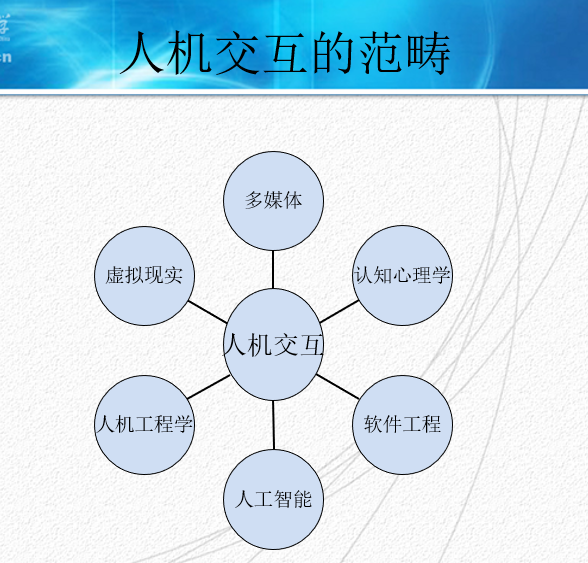
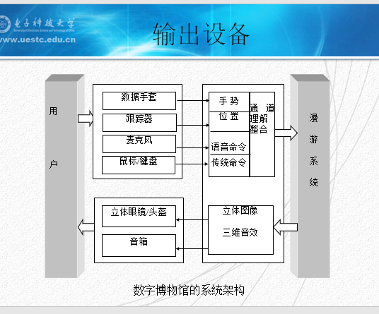

# 人机交互

## 绪论
- 人机交互的概念
- 人机交互的重要性
- 人机交互的发展历史
- 人机交互的发展趋势
- 人机交互的范畴
- 人机交互设备
- 人机交互应用

## 人机交互（Human-Computer Interaction）

- 是一门多学科交叉交互的学科

定义：是一门研究人类所使用的交互式计算系统的设计、实施、评估以及相关主要现象的学科0

### 人机系统（Human-machine system）

定义：指“人”与他所对应的“物”共处于同一时间以及空间时所构成的系统

“人”指的实在所研究的系统中参与系统过程的人

“机”则泛指一切与人处于同一系统中并与人交换着信息、物质和能量的，供人适用的物；

“环境”指的是“人”、“机”共处的、对“人”和“机”有直接或间接影响的周围外部条件

### 人机界面（Human-Machine interface）

人机系统中，“人”与“机”之间能够相互施加影响，实现相互作用的区域。

人机界面定义：计算机与人之间通信和对话的接口，它作为计算机系统的重要组成部分，主要是指人类与计算机系统之间的通信方式，它是人机双向信息交换的支持软件和硬件

### 人机关系（Human-Machine Relationship）

1. 机宜人
2. 人适机
   - 机宜人是有条件的，人适机也是有限度的
   - 人机系统中

### 人机交互与人机界面

人机交互是指：用户与计算机系统之间的通信，它是人与计算机之间各种符号和动作的双向信息交换。（这里的“交互”定义为一种**通信**方式，即信息交互，而且是一种双向的信息交换，可以由人向计算机输入信息，也可以由计算机向使用者反馈信息）

人机界面是指：人类用户与计算机系统之间的**通信媒体**或者手段，它是人机双向信息交换的支持软件和硬件。（这里的“界面”定义为**通信的媒体或软件**，它的物化体现是有关的**支持软件和硬件**，如带有鼠标的图形显示终端，人机界面也称为用户界面）

人机交互是通过一定的人机界面来实现，在界面开发过程中，有时把它们

---
### 人机交互的发展历史
1. 人机交互早期（史前期）
   1. ENIAC在1943-1946由美国宾州大学摩尔学院开发，1946年用于计算弹道方程的积分
   2. 当时计算机的程序采用联线的方法在小接线板上相互连接，后来用穿孔卡片和穿孔只带，由专门的阅读器输入程序和数据。（交互界面差）

2. 作业控制语言以及交互命令语言阶段（第一阶段）
   1. 1963年由MIT开发的第一个分时系统CTSS。
   2. 这一阶段的人机界面特点是程序员可采用正文和命令的方式和计算机打交道，虽然仍需要记忆许多命令。但已经可用较多的手段来调试程序，并且了解计算机执行的情况。（交互界面已经有了改善）
   3. 代表作：IBM-DOS、MS-DOS、CC-DOS、UC-DOS

3. 图形用户界面GUI阶段（第二阶段） -> 开始进入研究
   1. 1963年MIT开创了交互计算机图形学的新阶段
   2. 70年代Xerox公司在Alto计算机上首先开发了Smalltalk-80的多窗口程序设计环境，它采用高分辨率的图形显示器和新型的鼠标输入设备，应用了重叠型窗口、弹出型菜单、图符和剪贴等功能。
   3. 代表作：80年代至90年代，苹果公司的MacIntosh计算机、微软公司的MS-Windows系统和MIT的X-Window系统

4. 网络用户界面的出现（GUI的一种特性）
   1. 网页的功能越来越强大
   2. 无形界面的一种新的形式

5. 多通道智能用户界面阶段---MMI（第三阶段）-->现阶段的交互技术
   1. 以虚拟现实作为代表的计算机系统的拟人化和以掌上电脑为代表的计算机的微型化和随身化，是当前计算机的两个重要的应用趋势
   2. 利用人的多种感觉通道和动作通道（如语音、手写、表情、姿势、视线等输入），以并行、非精确的方式与计算机系统进行交互，可以提高人机交互的自然性和高效性。
   3. 以三维、沉浸感的逼真输出作为标志的虚拟现实技术是多媒体、多通道界面的重要应用目标。（进一步的还出现了现实增强技术AR）
   4. 多通道人机界面对我们既是一个挑战，也是一极好的机遇。

综上所示，在人机交互的发展阶段中，通常强调一下三个方面
1. 命令行界面（CLI）
2. 图形用户界面（GUI）,也称为WIMP界面
3. 多通道智能人机界面（MMI）

#### 发展趋势

1. 在未来的计算机系统中，将更加强调“以人为本”、“自然、和谐”的交互方式，以实现人机高效合作
2. 具体来说，新一代的人机交互技术的发展将主要围绕**集成化、网络化、智能化、标准化**展开

主要从6个方面体现：
1. 集成化
   - **多样化、多通道**交互的集成
2. 多样化：
   - 桌面和非桌面界面，可见和不可见界面，二维与三维输入，直接与间接曹总
3. 多通道
   - 语言、手势、表情、眼动、唇动、头动、肢体姿势、触觉、嗅觉、味觉以及键盘、鼠标等交互手段将集成在一起
4. 网络化：
   - 无线网络的发展，需要人机交互界面的加强
   - 人机交互设备需要考虑在跨平台环境下的应用情况 
5. 智能化：
   - 使计算机更好地自动捕捉人的姿态、手势、语音和上下文等信息，了解人的意图，并作出合适的反馈与动作，提高交互活动的自然性和高效性，**使人际之间的交互像人与人交互一样自然、方便**，是下一代交互技术的一个重要内容
7. 标准化：
   -  目前，在人机交互领域，ISO已经正式发布了许多的国际标准，以指导产品设计、测试和可用性评估。

---
### 人机交互的范畴

人机交互的范畴如下图 1-1 所示

### 人机交互设备
人机交互需要借助许多设备实现，具体可能需要的设备如下图所示
1. 输入设备
2. 输出设备
3. 虚拟现实交互设备
4. 交互设备的整合应用

---
#### 输入设备 
1. 文本输入设备
2. 图像输入设备
3. 三维信息输入设备
   1. 雷达
   2. 三维扫描仪
   3. 运动捕捉设备
   4. 动作捕捉设备
      - 机械式动作捕捉设备
      - 电磁式设备
      - 光学式运动捕捉设备 

---
#### 输出设备
1. 显示器
2. 打印机
3. 语言交互设备：如耳机、麦克风等
4. 虚拟交互设备
   - 空间跟踪定位仪
   -  数据手套
   -  三维鼠标
   -  触觉和力反馈器
   -  三维显示设备
      -  立体视觉
         -  主动式模式：对应用户的左右眼影像将按照顺序交替显示，用户使用LCD立体眼镜保持与立体影像的同步，这种模式可以产生高质量的立体效果。
         -  被动式模式：需要使用两套显示设备以及投影仪设备，分别在生成左右眼影像并进行投影，不同的投影分别使用不同角度的偏振光来区别左右眼影像，用户使用偏振光眼镜保持立体影像的同步。
      -  头盔式显示器
         -  头盔式显示器
      -  CAVE(洞穴式显示环境)
         -  这是一种四面或六面的沉浸式虚拟现实环境。对于处在系统内的用户来说，投影屏幕将分别覆盖用户的正面、左右以及底面视野。
      -  真三维显示
         -  即显示的最终目标，是一种能够实现360度视角观察的三维显示技术，是现实景物的最真实的再现

输出设备的应用的多方多面：
1. 制造业
2. 教育科学
3. 军事
4. 生活
5. 文化娱乐
6. 体育
7. 整合实例
   1. 数字博物馆系统
   
整合实例的结构如下图 1-2 所示（数字博物馆系统）

