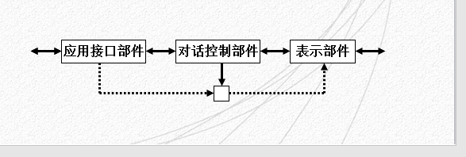
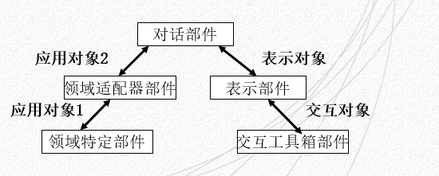
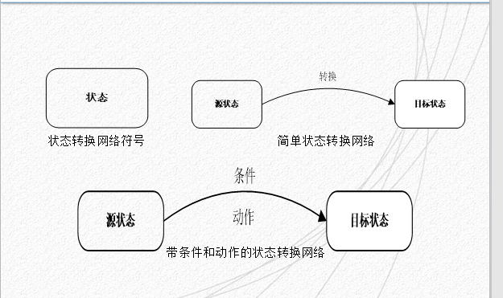
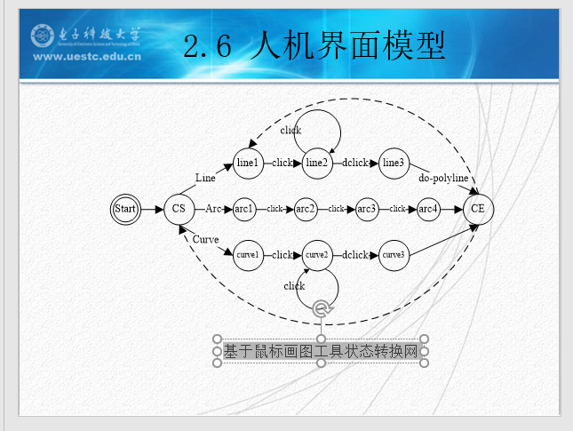

# 感知、认识和模型

---
## 内容概述
1. 人的感知
2. 认知过程与交互设计原则
3. 概念模型以及对概念模型的认知
4. 分布式认知
5. 人机交互模型
6. 人机界面模型

### 人的感知
人的感知由多方面因素来组成，包括以下几个方面
1. 视觉
	- 视觉是人与周围世界发生联系的最重要的感觉通道。外界80%的信息都是通过视觉获得的，因此视觉显示是人机交互系统中用的最多的人机界面
	- 视觉感知可以分两个阶段：受到外部刺激接收信息阶段和解释信息阶段
	- 视觉感知的特点：
		- 一方面：眼睛和视觉系统的物理特性决定了人类无法看到某些事物
		- 另一方面：视觉系统进行解释处理信息时，可对不完全信息发挥一定的想象力。进行人机交互设计需要看清这两个阶段及其影响，了解人类真正能够看到的信息

2. 听觉
	- 听觉感知传递的信息量仅次于视觉，可人们一般都低估了这些信息。人的听觉可以感知大量的信息，但被视觉关注掩盖了许多
	- 听觉所涉及的问题和视觉类似，即接受刺激，把刺激的特性转化为神经兴奋，并对信息进行加工，然后传递到大脑
	- 人类听觉系统对声音的解释可以帮助设计人机交互界面中的语音界面
3. 触觉
	- Touch 或者 Haptic perception
	- 触觉在交互中的作用也是不可低估的，尤其是对有能力缺陷的人，例如盲人，是至关重要的
	- 触觉的感知机理与视觉和听觉的最大不同在于它的非局部性
		- 温度感受器- 冷热
		- 伤害感受器- 疼痛
		- 机械刺激感受器- 压力
	- 实验表明，人的手指的触觉敏感度是前臂的触觉敏感度的十倍。对人身体各部位触觉敏感程度的了解有助于基于触觉的交互设备的设计。

---
### 认知过程与交互设计的原则

概念介绍：
	- 认知：认知是指人们在进行日常活动时发生于头脑中的事情，它涉及认知处理，如思维、记忆、学习、幻想、决策、看、读、写以及交谈等。

认知通常会被划分为两个模式
- 经验认知：有效、轻松地观察、操作和响应周围的时间，他要求具备某些专门知识并且达到一定的熟练程度、
- 思维认知：涉及思考、比较和决策，是发明创造的来源，如设计创作等

常见认知过程
- 感知和识别：人们可以使用感官从环境中获取信息，并把它转变为对物品、事件、声音和味觉的体验
- 注意：注意通常是指选择性注意，即注意是有选择的，加工某些刺激而忽视其他刺激的倾向
- 记忆：记忆就是回忆各种知识以便采取适当的行动
- 问题解决：问题解决是由一定的情景引起的，按照一定的目标，应用各种认知活动、技能等。经过一系列的思维操作，是的问题得以解决的过程。
- 语言处理：阅读、说话和聆听这三种形式的语言处理具有一些相同和不同的属性。相似性之一是，无论用那种新式去表示，橘子或短语的意思是相同的。但是，人们对阅读、说话和聆听的难易有不同的体会。

影响认知的原因
- 情感：情感因素会影响人的感知和认知能力。
- 人的个性差异：个性差异可能是长期的、如性别、体力以及智力水平；也可能是短期的，如压力和情感因素对人的影响；还可能是随时间变化的，如人的年龄等。

---
### 概念模型以及对概念模型的认知

概念介绍：
	概念模型：指的是一种用户能够理解的系统描述，它使用一组集成的构思和概念，描述系统做什么、如何运作、外观如何等....

设计概念模型的关键过程包括如下两个阶段：
	- 了解用户在执行日常任务时做什么
	- 选择交互方式。是主动式的提问方式，还是被动式的填表进行检索方式；并决定采用何种交互形式。

概念模型设计的两种方法
	- 根据用户的需要和其他需求去规划产品，了解用户在执行日常任务时需要做些什么.例如
	- 决定哪一种交互方式能最好地支持用户的实际需要，提出一些实际可行的方案
	- 另一个方法是，选择一个**界面比拟**，**比拟**是指用熟悉的或者容易理解的只是去解释不熟悉的、难以理解的问题，例如“桌面”与“搜索引擎”，就是常见的界面比拟

概念模型可以分为两大类：
1. 基于**活动**的概念模型
2. 基于**对象**的概念模型

---
#### 基于活动的概念模型

活动类型的概念模型
1. 最常见的活动类型有：指示、对话、操作与导航以及探索与浏览
2. **指示类**模型描述的是用户通过指示系统应该做什么来完成自己的任务
	1. 在Windows以及其他带 GUI 的系统中，用户则通过使用控制键，或者鼠标选择菜单项来发出命令。
	2. 好处是支持快速、有效的交互。因此，**特别适合与重复性的活动**,用于操作多个对象。例如，重复性的存储、删除、组织文件和邮件
3. **对话类**的概念模型是基于“人与系统对话这一模式设计的”
	1. 它与“指示”类型的模型不同。“对话”是一个“双向”的通信过程，其系统更像是一个交互伙伴，而不仅仅是执行命令的及其。
	2. 最适用于那些用户需要**查找特定类型**的信息，或者**希望讨论问题**的应用
	3. 实际的“对话”方式可采用各种形式，例如电话银行，手机订票，搜索引擎以及援助系统等
	4. 主要好处是允许人们（尤其针对新手）以一种自己熟悉的方式与系统交互。但“对话”式的概念模型，有时可能会发生“答非所问”的误会
4. **操作与导航**概念模型利用用户在现实世界中积累的知识来操作对象或穿越某个虚拟空间
	1. 例如，我们可以通过移动、选择、打开、关闭、缩放等方式来操作虚拟对象
	2. 也可以使用这些活动的拓展方式，即现实世界中不可能的方式来操作对象或穿越虚拟空间
	3. 例如。有些学你世界允许用户控制自身的移动，或允许一个物体变成另一个物体
5. **探索与浏览**概念模型的思想是使用媒体去发掘和浏览信息.网页和电子商务网站都是基于这个概念模型的应用
	1. **以上各个类型的活动并不是相互排斥的**,他们可以并存，例如，在**对话**的同时也可以发出**指示**，在**浏览**的同时也可以**定位环境**
	2. 但是，这些活动都是具有不同的**属性**，而且其**界面开发**的方法也有不同
	3. 如**指示类型**可以选择采取多种交互形式，例如使用输入命令、从视窗或触摸屏选择菜单项、发出声音命令、按按钮等
	4. **对话类型**可采用语音或者键入命令，**操作与导航类型**用于用户具备操作和导航的能力，能够穿越某个环境或者某些虚拟对象的场合、
	5. **探索与浏览**类型用于系统为用户提供结构化的信息，并允许用户**自己探索和学习新的东西，而不必向系统发问的场合**

---
#### 基于对象的概念模型
对象类型的概念模型：
1. 是基于**对象**或人造物（如工具、书本或车辆）的模型
2. 这一类模型要更为具体，侧重于特定对象在特定环境中的使用方式，通常是对**物理世界的模拟**
3. 基于对象的概念模型有“界面比拟”和“交互泛型”

界面比拟
- 界面比拟是指采用“比拟”的方法将**交互界面的概念模型**与某个（或某些）**物理实体**之间存在着的某些方面的相似性体现在交互界面设计之中
- “界面比拟”将人们的习惯或**熟知的事物**同交互界面中的**新概念**结合起来
- 搜索引擎就是一个界面比拟的例子

交互范型
- 交互范型（Interaction Paradigm）指的是我们在构思交互设计时的某种主导思想或者思考方式
- 交互设计领域的主要交互范型就是开发桌面应用---面向监视器、键盘和鼠标的单用户使用等。
- 随着无线、移动技术和手提设备的出现，已开发出各种新的交互泛型。这些交互泛型已经“超越桌面”，具体型号如下
	- 无处不在计算技术（Ubiquitous Comuting）
	- 渗透性计算技术
	- 可穿戴的计算技术
	- 物理 / 虚拟环境集成的技术

三个相互联系的概念模型
- 设计模型：设计师设想的模型，说明系统如何运作
- 系统映像：系统实际上如何运作
- 用户模型：用户如何理解系统的运作

几种认知概念的框架
- 从人们不同的认知特点触发，可以讨论用户如何理解系统概念模型，它们是
  - 思维模型
  - 信息处理模型
  - 外部认知模型

### GOMS预测模型
- 这是一个一般性的术语，泛指整个GOMS模型体系
- 目前一共有四种版本的GOMS模型
- GOMS模型适用于研究和预测用户执行情况的不同方面，如**执行任务的时间、执行任务的策略**等
- 这些模型主要用于**预测用户的执行属性**，从而可以选择或设计不同的应用软件和设备
- GOMS代表目标（Goals）、操作（Operators）、方法（Methods）和选择规则（Selection Rules）
  - “目标”：指的是用户要达到什么目的，如查找某个网站
  - “操作”：指的是为了达到目标而使用的“认知过程与物理行为”(如先选择搜索引擎，再思考关键字，然后再搜索引擎中输入关键字)
  - “方法”：指的是为了达到目标而采用的“具体步骤”(如适用鼠标点击输入域，输入关键字，然后再点击“查找”按钮)
  - “选择规则”：指的是用于**选择具体方法**，适用于任务的某个极端存在**多种方法选择**的情形。例如，在搜索引擎的输入域中键入了关键字之后，用户可以选择点击“返回”按钮，或者点击“查找”按钮，这就是要用到的选择规则 

## 人机界面模型

结构模型
1. Seeheim模型

规范了接口过程，如下图2-4所示

Seehim模型界面结构清晰，适合界面与应用分别执行，得到较为广泛的应用。该模型的三个逻辑部分都有不同的功能与不同的描述方法。
- 表示部件是人机接口的物理层
- 对话控制部件是人机接口的主要部分
- 应用接口部件是应用程序功能的一种表示

在界面设计时，这三个部分可对应于词法、语法以及语义的三个语言层次

Seeheim模型已经广泛用于用户界面软件的设计中，适合界面与应用程序分别执行的场合，不支持直接操作的语法与语义的要求，因此对于直接操作的图形界面不适用

  2. Arch模型

一种基于Seeheim模型改进的模型,如下图2-5所示

各部件说明：
1. 交互工具箱部件：实现与终端用户的物理交互。
2. 表示部件：协调对话部件和交互工具箱部件之间的通信
3. 对话部件：负责任务排队
4. 领域适配器部件：协调对话部件和领域特定部件之间的通讯
5. 领域特定部件：控制、操作以及检索与领域有关的数据
6. 上图(2-5)显示了部件之间传输的对象类型
   1. 应用对象1，采用的数据以及操作所提供的功能与用户界面并无直接的联系
   2. 应用对象2，采用的数据以及操作所提供的功能与用户界面有关
   3. 表示对象，是控制用户交互的虚拟交互对象，包含有为用户显示的数据以及用户所产生的时间
   4. 交互对象，是用来实现与用户交互有关物理介质的方法

**结构化用户界面模型**都基于对话独立原则，交互系统的设计大体分为两个部分：**对话部件**与**计算部件**

提供较强的语义反馈，是结构化的界面模型支持直接操作图形用户界面的一个关键所在

状态

状态转化网络（STN）的基本思想是定义一个具有一定数量的状态的转换机，称之为有限状态机（FSM），FSM从外部世界中接收到的时间，并能使FSM从一个状态转换到另一个状态
- 两种最基本的状态转换网络
  - 状态拓展网络(State Diagrams)
  - 拓展状态转换网络（Stat Chars）

简单的三种网络如下图 2-6、2-7、2-8所示

