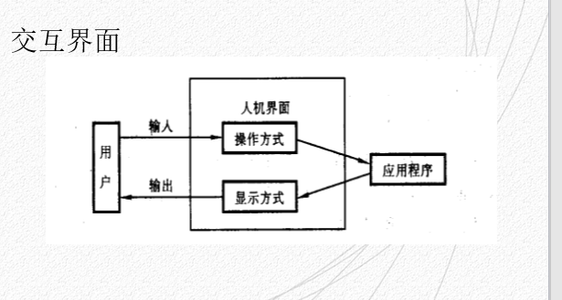
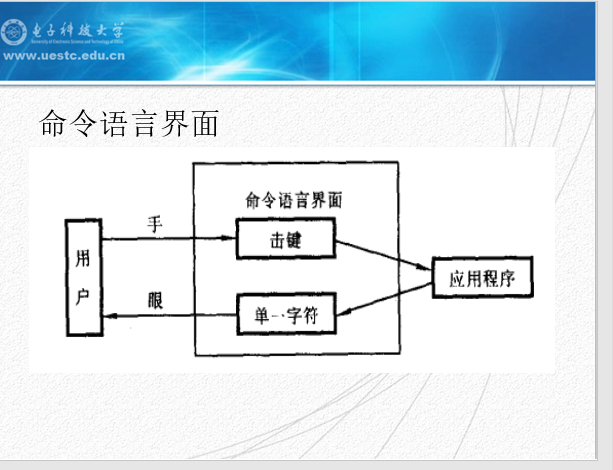
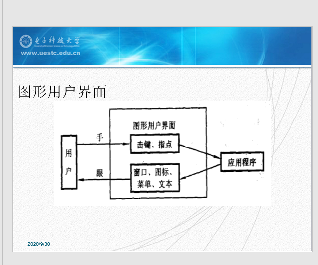
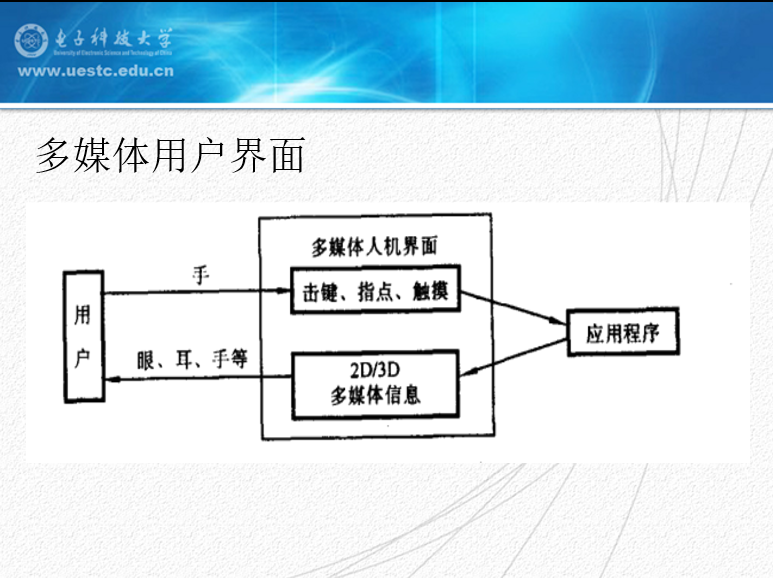
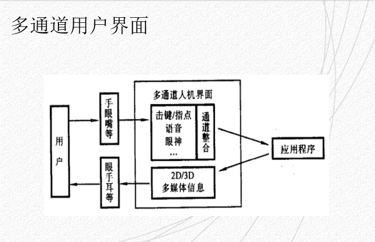
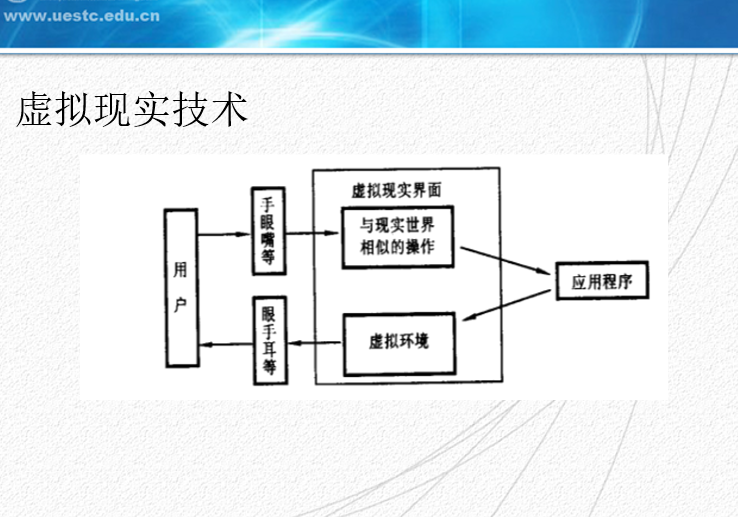
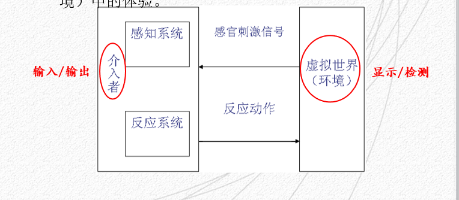
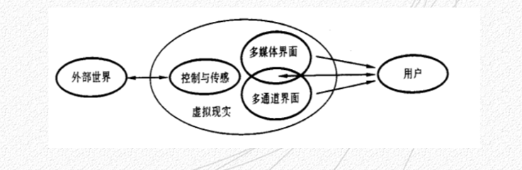

# 人机系统交互界面的架构

## 交互界面

交互界面的简要模型如下图3-1所示

---
命令语言界面的简要模型如下图3-2所示

命令语言界面
- 根据语言的特点命令语言界面可以分为：
  1. 形式语言：这是一种人工语言，特点是简洁、 严密、高效，不仅是操纵计算机的语言，而且是处理语言的语言
  2. 自然语言：特点是具有多义性、微妙、丰富；
  3. 类自然语言：这是计算机语言的一种特例
-  命令语言要求惊人的记忆与大量的训练，并且容易出错，使入门者望而生畏，但比较灵活和高效，适合于专业人员的使用

---
图形用户界面的简要模型如下图3-3所示

图形用户界面（GUI-Graphics User Interface）
- 是当前用户界面的主流
- 当前各类图形用户界面的共同特点是以窗口管理系统为核心，使用键盘和鼠标器作为输入设备
- 串口管理系统除了基于可重叠多窗口管理技术外，广泛采用的另一核心技术是事件驱动技术
- 图形用户界面和人机交互过程极大地依赖视觉和手动控制的参与，因此具有强烈的直接操作特点
- 图形用户界面中的彩蛋的表现形式比字符用户界面更为丰富，在菜单项中可以显示不同的字体、图标甚至产生三维效果。
- 使用菜单界面，用户只需要确认而不需要回忆系统复杂的命令，从而大大降低记忆符合。但是菜单的缺点是灵活性和效率较差，可能不太适合于专家用户（程序员）
- 基于图形用户界面的优点是具有一定的文化和语言独立性，并可提高视觉目标搜索的效率。其主要缺点是需要占用较多的屏幕空间，并且难以表达和支持非空间性的抽象信息的交互。

---
三个重要思想
- 桌面隐喻
- WIMP
- 所见即所得

WIMP-界面中的重要组成部分
- Window/Icon/Menu/Pointing Device
- 即 窗口，图标，菜单，指点设备

---
多媒体用户界面的简要模型如下图3-4所示

多媒体用户界面
- 多媒体用户界面被认为是在智能用户界面和自然交互技术取得突破之前的一种过渡技术
- 多媒体技术引入了动画、音频、视频等动态媒体，特别是引入了音频媒体，从而大大丰富了计算机表现信息的形式，拓宽了计算机输出的带宽，提高了用户接受信息的效率
- 多媒体用户界面丰富了信息的表现形式，但基本上限于信息的存储和传输方面，并没有理解媒体信息的含义，从而也限制了它的应用场合

---
多通道用户界面的简要模型如下图3-5所示

多通道用户界面主要关注人机界面中用户向计算机输入信息以及计算机对用户意图的理解，所要达到的目标：
1. 交互的自然性
   - 使用户尽可能多地利用已有的日常技能与计算机交互降低认识负荷
2. 交互的高效性
   - 使人机通讯信息交换吞吐量更大、形式更丰富，发挥人机彼此不同的认知潜力 
3. 与传统的用户界面特别是广泛流行的WIM/GUI兼容 

多通道用户界面模型的基本特点：
1. 使用多个感觉和效应通道
2. 允许非精确的交互
3. 三维和直接操纵
  - 人生活在三维空间，习惯于看、听和操纵三维的客观对线，并希望及时看到这种控制的结果。多通道人机交互的自然性反映了这种本质特点
4. 交互的双向性
5. 交互的隐含性
   - 多通道用户界面并不需要用户显示地说明每个交互成分，反之实在自然的交互过程中隐含地说明

---
虚拟现实技术的简要模型如下图3-6所示

虚拟现实（Virtual Reality）又称为虚拟环境
- 在其中，人是主动参与者，复杂系统中可能有许多参与者共同在以计算机网络系统为基础的虚拟环境中协同工作
- 虚拟现实系统具有三个重要特点：
  1. 沉浸感（immersion）
  2. 交互性（interaction）
  3. 构想性（imagination）
- 虚拟现实中的两个基本要素：
  1. 计算机生成的虚拟世界（环境）必须是一个能给人提供视觉、听觉、触觉、嗅觉以及味觉等多种感官刺激的世界
  2. 虚拟现实系统实质上是一种对多通道信息进行交互操作的高级人机交互系统

一般来说虚拟世界是由两个部分组成：一部分是创建的虚拟世界（环境），另一部分是为介入者（人）
  - 人机交互是虚拟现实的核心，反应出人在虚拟世界（环境）中的体验

虚拟世界与介入者关系模型如下图3-7所示

虚拟现实技术是一种**集成**为主的技术，其人机界面可以分解为多媒体、多通道界面等交互界面组合
- 多媒体用户界面技术侧重解决计算机信息表现以及**输出**的自然性和多样性问题
- 多通道用户界面技术侧重解决计算机信息**输入**以及理解的自然性与多样性问题

虚拟现实技术的集成模型如下图3-8所示

虚拟现实交互的特点
1. 立体感的视觉显示
2. 置身于环境中的显示
3. 动态显示
4. 以多媒体和多种形式与计算机进行交互
5. 闭环的交互方式

---
Extrate：增强现实技术

增强现实（Augmented Reality，简称为AR），是一种实时地把计算摄影机影像的位置以及角度并加上相应图像的技术，这种技术的目标是在屏幕上把虚拟世界套在现实世界并进行互动。这种技术在1990年提出。并随着随身电子产品运算能力的提升，增强现实的用途将会越来越广

定义：把原本在现实世界的一定时间空间范围内很难体验到的实体信息（视觉信息，声音，味道，触觉等），通过科学技术模拟仿真后再叠加到现实世界被人类感官所感知，从而达到超越现实的感官体验，这种技术就叫做**增强现实技术**，简称为**AR**

增强现实技术往往具有以下三个特点：
1. 虚实结合
2. 实时互动
3. 三维定向