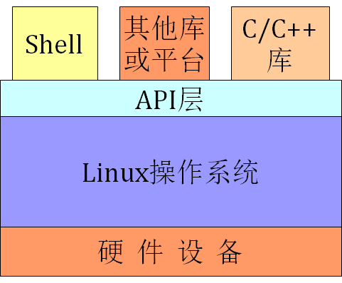

#Introduction

基于操作系统的编程技术所研究的方向：  
- 操作系统
- 非易失性内存应用 （即掉电之后数据不会消失，从而能够保证数据完整性，代表为non-volatile memory，缩写为NVM）
- 分布式计算 （其中RDMA方式绕过了操作系统，因此具有绝对的最低时延，最高的吞吐量，最小的CPU占用等特点）

所需的技术背景

- 熟悉Linux内核程序设计
- Windows 端 DOS/Shell 开发 API/MFC/ATL/WTL应用开发
- Linux API,网络应用程序（Soket编程），内核模块开发

可以收获的知识

- WIN/Linux API开发
- Socket 网络编程开发
- Linux 内核开发

#Abstract

## Purpose

- 计算机网络普及， 巨大的分部系统
- 本地端程序属性弱化， 云端应用已成为大的趋势
- 出现了新的一批服务器后台系统，集群计算的出现，分布式计算的出现
- Linux是一般服务器系统的主要选择对线

### 介绍互联网络程序设计涉及到的技术

- Web 前端技术：html，css，JavaScript
- Web 后端技术：JSP,PHP,Vue
- 数据库技术： MySQL,Oracle，NoSQL，MongoDB
- 分布式处理函数式语言：erlang，scalar，Hadoop
-  底层的：基于操作系统（Linux）的Socket编程技术

### 在程序员眼中的计算机系统



图中所对应的工程师介绍

```angular2
    上层：应用开发工程师，调用各种库进行开发
    API: 应用开发工程师，基于系统的各类基础库进行API开发
    Linux：内核工程师，进行包括驱动，各类内核模块的开发
    硬件：硬件工程师，进行包括固件程序、微码的编写、电路集成开发
```
**学习系统先从API开始学起，不要先学封装库的调用~~不当调包侠~~**

### 各类API及系统知识

网络编程： 非阻塞态下的Socket编程

Linux API/系统调用过程

需要掌握：

- Linux所停工的场景编程接口
- 加深对操作系统结构的理解
    - main函数有3个参数，2参数附加1个函数指针 （ argc，argv，encv环境变量指针 ）
- 操作系统编程方法

操作系统编程中，不讨论内核

按照现代程序设计思想，运用API

## 课程内容以及安排

参考教程
- UNIX 环境高级编程
- Linux 程序设计实践（针对封装库）

成绩构成
- 平时分60%
  - 作业40%，实验60%
- 期末40%

主要内容

- 文件系统
    - 文件、目录的操作方法，常用的文件I/O
    - Linux:Open
    - Windows:fopen 等......  
    
- 标准I/O
   - 标准I/O以及数据流的概念、标准IO与文件IO的区别，以及了解常用的IO函数
- 进程
   - 进程概念、状态转换图、进程环境、控制方法等
- 信号
   - 信号处理方式，以及引用程序对信号的捕捉
- 线程
   - 线程本质、线程的创建方式，同步方式等
   
## 学习方法

### 学习路线建议

- 重视C/C++语言学习
  - C/C++作为较为低级的语言，所编写的程序贴近机器、贴近操作系统，有利于学习与研究高性能算法、应用程序
    - CAS X86通过总线加锁实现
    - C/C++可以手动实现垃圾回收
  - C++是多范式编程语言，有利于学习多种程序设计思想

### 一些推荐书籍
- 深入理解计算机系统（站在程序员角度）

- C语言
  - C陷阱与缺陷
  - C和指针（指针对于C是至关重要的特性）
  - Effective C
  - 啊哈C
- C++学习
  - Effective C++
  - More Effecctive C++
  - C++ Prime Plus
  - 深入理解面向对象的设计模式
  - 深度搜索C++对象模型
- C++模板学习
  - C++ Template：Complete Guide
  = Modern C++ Design

    **编程第一要义，不重复造轮子，因此尽量使用第三方库或标准库**  
- 模板库学习
  - C++标准程序库
  - Effective STL
  - STL源码剖析
  - SDL Game Development

- 算法学习
  - 啊哈！算法
  - 算法导论
  - 算法图解
  
**语言的学习只是掌握一门工具，更重要的是背后的原理与知识**  

>因此学习语言到一定程度后，可以开始进行背后的原理性知识学习，如操作系统，计算机组成原理等

如果学习操作系统，建议先由Windows操作系统开始

- Windows与Linux相比，更加稳地且优化程度良好，Microsoft 提供了大量的技术手册与资料
- 学习Windows能尽快熟悉先进的软件架构 如MFC等....

#### Windows 学习书籍推荐

- Windows API学习
    - Programming windows
    - Windows 核心编程
- MFC学习
    - 深入浅出MFC
- COM学习（二进制兼容）
    - COM原理与应用
    - ATL Internals
- Windows 二进制安全
    - 加密与解密（第四版）
    
**当Windwos学习有了一定了解后，建议开始理解 Linux 系统，这对将来程序员生涯有很大帮助**

#### Linux 学习

- Linux操作系统
    - 鸟哥Linux私房菜：基础学习篇
    - 鸟哥Linux私房菜： 服务器架设篇
- Linux系统API
    - Unix环境高级编程
    - Unix网络编程卷一、卷二
    - C++网络编程卷一、卷二
- Linux内核学习
    - 需要优先掌握Linux设备驱动编程
    - 学习内核源代码
        - Linux内核完全剖析-基于0.12内核

- 在Linux内核学习到一定程度后，可以深入学习操作系统
    - 80X86汇编语言程序设计教程
    - 自己动手编写操作系统（第二版 Orange`s一个操作系统实现）


# Unix/Linux 标准化以及其实现

## Unix发展史

Unix诞生于*1969年*  
基于ARPA计划  
拥有兼容分时系统CTSS  
通过MULTICS计划进一步开发  
Fortran语言编写游戏，可以在GECOS 上运行，但是占用十分大  
B语言添加Fortran编译器，同时开始采纳C  
V5版：基于Unix开发了许多C语言程序
V6版： 高级语言编写，少量程序修改一直平台  
Berkely 发布 1 BSD的Unix OS  
V7: 提供工具，Mark，Shell，Berkely发布 2 BSD，包含VI等工具

## Linux 诞生

1991年，芬兰计算机大二学生 Linus 开发出了第一代 Linux系统  
Linux 诞生的原因
- Unix系统昂贵
- AST教授写了一个开源操作系统MINIX
- MINIX主要用于教学，实际应用的工作场景中功能不强
- GNU计划开发了许多免费开源工具软件，如GNU C编译器等

### Linux五大支柱

- UNIX 操作系统  
- MINIX 操作系统
- GNU计划
    - (GNU`S Not Unix)计划 -> 递归缩写
    - 自由软件的完整系统
- POSIX标准
    - Portable Operating System Interface for Computing System  
    - 保证程序在不同操作系统之间的可移植性  
    - 为Linux的设计提供指导  
    - Linux与许多Unix系统兼容  
- Internet 网络（开源性）
    - 通过网络，全世界计算机爱好者参与编写（代码托管与开源平台如github上）
    
## Linux编程环境介绍

配置安装环境  
`$apt-get install build-essential`

g++的基本使用命令

```
    $g++ test.cpp #默认生成a.out
    $g++ -o test test.cpp #生产可执行文件test
    $g++ -c test.cpp #生成目标文件test.o
    $g++ -o test test.cpp -g #调试成功，默认为-g2 ，`-g`后接的参数为gdb调试等级，2为此时调试信息包括拓展的符号表、行号、局部或外部变量信息
    $g++ -O -o -test test.cpp #优化等级，默认为-o2- -os，开发调试不适用优化，会降低编译速度
    # release版时，会采用编译优化来提升最终版本的质量
    $g++ -S test.cpp #产生汇编代码test.s
    $g++ -E test.cpp > my.txt #只激活预处理，将结果保留在my.txt中
    # 先写测试代码，再写功能代码
    $g++ -I../gtest/include test.cpp # 手动指定头文件的路径
    $g++ -L../gtest -lgtest test.cpp # 指定库的路径
    $g++ test.cpp -ldir #用于查找指定头文件的目录
```

同一个程序为什么再次编译时回更快？
```
    $ls /root -la
        .cache
    #原因就是在程序第一次编译时，在当前用户的.cache库里面建立了缓存，因此再次编译同一个程序时会更快
```

连接器 （作用）：合并同名段，重定位  
```bash
    $gdb # gdb调试
    (gdb) break 14 # 第14行建立断点
    (gdb) r # 运行程序
    (gdb) next #下一步
    (gdb) disass # 查看对应的汇编程序步骤
    (gdb) step # 单步调试
    (gdb) quit # 退出调试
```

### 系统调用

Windows 使用 `0x2e` 中断作为系统调用入口，Linux使用 `0x80`作为系统调用入口点  
.data 段保存静态的全局，静态局部(非零初始值)

示例1.1

```assembly
.data
    msg : .string "Hello World\n"
    len = .-msg    #.表示本地
    
.text

.global main

main:

mov $4, %eax # Write Asyscall number
mov $1, %ebx # fd
mov $msg, %ecx #buffer   
mov %len, %edx #length
int $0x80

mov $1, %eax #exit syscall number
mov $5, %ebx #exit code 
int $0x80
```
EAX 是"累加器"(accumulator), 它是很多加法乘法指令的缺省寄存器。  
EBX 是"基地址"(base)寄存器, 在内存寻址时存放基地址。  

程序实践
```bash
    $as -o hello.o hello.s
    $ld -o hello hello.o
    $./hello
    Hello World!
    $echo $? # 此步为获取退出码
    5
```

汇编调试

```bash
 (gdb)disass_start # 显示_start段
 0x0000....
 0x0000....
```
```bash
 （gdbb *0x000...
  (gdb)r
  (gdb)si #step
  (gdb)ni #next
  (gdb)info reg eax
  (gdb) x /20xb 0x6000d2 #/20xb 看20个字节按十六进制显示 即看地址
```

x86小端 高高低低 即 高地址放高位，低地址放低位  
程序的默认入口不是main，C库千面有初始化函数，完成初始化操作才进入main

- 现在仍然可以使用`0x80`系统中断
- 编译方法：使用nasm

```bash
$as -o heelo.o hello.s
$ld -o hello hello.o
```

 - 调试：gdb  
    ndisass main //段名   
    n找到地址后，b *addr  
    nr;si;disaplay /i $pc; x /nxb addr
 - Intel 提供了 `sysenter/sysexit` 指令， 可以在long mode下运行，但是在AMD上这组指令无效（~~当然~~）
 - Intel 不支持32位中使用 `syscall/sysret`，但是和AMD相同，在64位下都支持
 - 所以，从兼容性出发，在64位环境下应该使用 `syscall/sysret`
 
 
 示例程序1.2
 
 ```assembly
 .data
    msg : .string "Hello World!\"
    len = . - msg
 .text
 
 .global _start
 
 _start
 
 mov $1, %eax #write syscall numiber eax非64位寄存器
 mov $1, %rdi #fd
 mov $msg, %rsi #buffer
 mov $len, %rdx #length
 syscall
 
 mov $60m %eax #exit syscall number
 mov $5, %rdi #exit code 5 是用户定义的
 syscall
 ```
 
 main  函数 return 0 的原因
 - 是将字符“0” 或 `EXIT_SUCCESS` 向外部环境报告程序运行圆满完成
 - `EXIT_FAILURE` 向外部报告
 - 其他值，由实现定义
 
  #### 内联汇编
  
  示例程序 1.3

```C++
    int main(){
        long ret =0;
        int fd = 0;
        const char *buffer = "Hello World!\r\n";
        unsigned int size = 14;
        
        asm volatile("movl $4, %%eax \n\t"
        				 "movl %1, %%ebx \n\t"
        				 "movl %2, %%ecx \n\t"
        				 "movl %3, %%edx \n\t"
        				 "int $0x80	 \n\t"
        				 "movl %%eax, %0 \n\t"
        				 : "=m"(ret)
        				 : "m"(fd), "m"(buffer), "m"(size)
        				 : "%eax", "%ebx", "%ecx", "%edx", "memory");
        /*
            冒号：语句体
            第一冒号 输出
            第二冒号 %1，%2... 指代这里的对应的参数(fd)(buffer)...
            第三冒号 告诉编译器注意，动用了这些寄存器
        */
        return 0;
```

```bash
$g++ test1_3.cpp
$./a.out
# 此时正常情况即为没有输出
$g++ test1_3,cpp -m32 # 按照32位进行编译 -m64可以编译成64位 ，该程序基于32位，若编译成64位则不能正常运行
$./a.out
Hello World!
```

## 练习编译一个debug版C库，并运行库  
### 预处理阶段 （初始化库）
直接和间接引用的头文件，全部递归引用  
### 编译阶段  
生成汇编代码  
### 汇编阶段  
生产.o文件 object，重定位的目标程序
### 链接阶段  
同名文件合并，重定位  

示例1.4  
没有调用C库，没有运行时C的支持，用内联汇编的方法让程序能够正常退出

```c
#define MAX 1

void _start(){
    int i = MAX + 2;
    asm volatile("mov1 $60,%eax \n\t"
                 "movq %0, %rdi \n\t"
                 "syscall\n\t"
                 :
                 : "m"(i)
                 : );
    /*
        64位前7位参数由寄存器之间传输，因此不需要压栈
        退出码 3 （1+2）
    */
```
接下来为bash部分
```bash
$cpp test.c > aaa #重定向文件到aaa
#打开aaa文件可以查看预处理内容，如：替换了MAX宏
$ls /usr/lib/gcc/x86_64-linux-gnu/ -l
$   /usr/lib/gcc/x86_64-linux-gnu/7/ccl aaa
#cclplus 是c++编译器
#直接使用ccl 编译器，处理预处理程序
#此时会生成aaa.s 上面这段代码会出现在#APP下面
#32位系统时 + 和 - 在优化之前代表 局部变量
$as -o aa.o aaa.s #用汇编编译器将汇编代码转换为object文件
$ld -o a.out aaa.o #用连接器a是生成的可执行文件
$./a.out #运行成功，但是没有返回值
$echo $?
3  #退出返回值
```