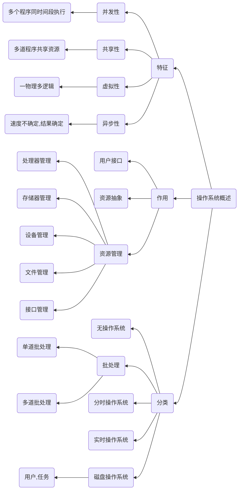

# Chapter1 操作系统概述

---

考点介绍
- 本章重点内容包括操作系统的作用、分类、功能、特征等。在考试时这一部分常出选择题

---

## 知识结构

本章的知识结构图如下mermaid图所示

```mermaid
graph RL
a(操作系统概述) --> b1(特征)
b1 --> c1(并发性)
c1 --> d1(多个程序同时间段执行)
b1 --> c2(共享性)
c2 --> d2(多道程序共享资源)
b1 --> c3(虚拟性)
c3 --> d3(一物理多逻辑)
b1 --> c4(异步性)
c4 --> d4(速度不确定,结果确定)
a --> b2(作用)
b2 --> c5(用户接口)
b2 --> c6(资源抽象)
b2 --> c7(资源管理)
c7 --> d5(处理器管理)
c7 --> d6(存储器管理)
c7 --> d7(设备管理)
c7 --> d8(文件管理)
c7 --> d9(接口管理)
a --> b3(分类)
b3 --> c8(无操作系统)
b3 --> c9(批处理)
c9 --> d10(单道批处理)
c9 --> d11(多道批处理)
b3 --> c10(分时操作系统)
b3 --> c11(实时操作系统)
b3 --> c12(磁盘操作系统)
c12 --> d12(用户,任务)

```

---

一些TIPS
1. 操作系统具有并发、共享、虚拟、异步四个特性
2. 并发和共享是多用户操作系统最基本的两个特征