# 进程与线程 Processes and Threads

## 自己动手引导计算机启动

所需软件

- virtual BOX,VMware 等虚拟机软件
- Ubuntu，RedHat，Fedora等Linux发行版
- Windows
- Linux下的汇编 nasm
- 程序员文件编译器
- Internet

```assembly
	org	07c00h			; 告诉编译器程序加载到7c00处
	mov	ax, cs
	mov	ds, ax
	mov	es, ax
	call	DispStr			; 调用显示字符串例程
	jmp	$			; 无限循环
DispStr:
 mov	ax, BootMessage
	mov	bp, ax			; ES:BP = 串地址
	mov	cx, 16			; CX = 串长度
	mov	ax, 01301h		; AH = 13,  AL = 01h
	mov	bx, 000ch		; 页号为0(BH = 0) 黑底红字(BL = 0Ch,高亮)
	mov	dl, 0
	int	10h			; 10h 号中断
	ret
BootMessage:		
	db	"Hello, OS world!"
	times 	510-($-$$)	db	0; 填充剩下的空间，使生成的二进制代码恰好为512字节
	dw 	0xaa55				; 结束标志

```

1. 编写汇编程序
2. [click-here](https://blog.csdn.net/judyge/article/details/52278384)
3. 用nasm 编译上述汇编程序
   `nasm boot.as, - o boot.bin`
4. 将bi文件转换成可以启动的映像文件
```bash
$dd if=boot.bin of=boot.img bs=512 count=1
1+0 records in
1+0 records out
512 bytes copied,0.000222849 s,2.3 MB/s
$dd if=/dev/zero of=boot.img skip=1 seek=1 bs=512
count 2879
2879+0 records in
2879+0 records out
   1474048 bytes (1.5 MB, 1.4 MiB) copied, 0.0214993 s, 68.6 MB/s
```
5. 将生成的img文件拷贝出来用于启动虚拟机
   ```
   sudo mkdir /mnt/share
   sudo mount - t vboxsf Kanbox /mnt/share

   前提：需要虚拟机提前安装VirtuaBox插件
   ```
6. 新建虚拟机。用img文件启动


## 进程 Process

进程是操作系统最核心的观念

现代操作系统的一切都是以进程而展开的

进程是**正在运行的程序的一个抽象（正解）**

- 进程执行模型
  - 顺序执行（Sequential Mode）
  - 并发执行（Parallel Mode）

- 伪并行
  - 并行与并发

### 进程的执行模型

对应到操作系统中，进程的执行模型同样有**顺序执行**和**并行执行**

顺序执行：一个进程执行完毕，再紧跟着执行另一个进程.

如下图2-1模型所示


缺点：执行效率太低

并行执行：四个进程同时执行，相互独立，互不干扰

如下图2-2模型所示


缺点：对硬件要求高，并且对算法实现有一定的要求

#### 进程的并发执行模型

**并发（concurrence）执行是微观上的顺序执行，宏观上的并行执行**(并不是真并行，依赖于调度算法)

并发模型示意图2-3如下图所示

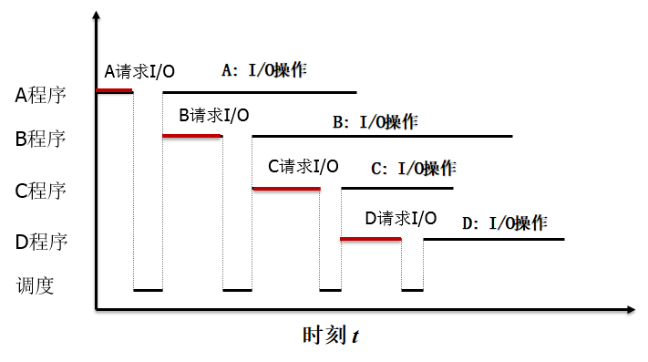

不同的执行顺序会产生不一样的结果

### 进程的状态

下图2-4为一般的宏观进程状态表示（两状态）

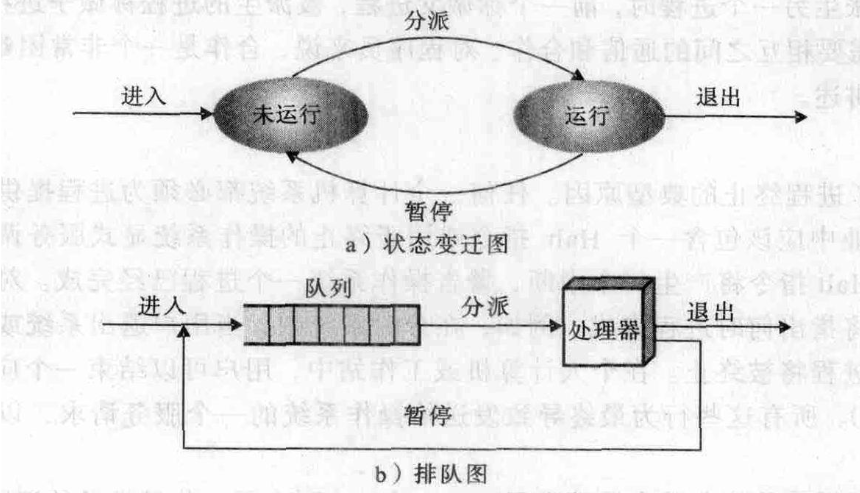

实际上进程可划分为三种基本状态  
- **就绪状态（Ready）**:当进程分配到除CPU以外的所有必要资源后，只要再获得CPU，便可以立即执行
- **执行状态（Running）**：进程已经获得足够资源，并获得CPU，程序此时正在执行、
- **阻塞状态(Blocked)**:正在执行的进程由于发生某时间而暂时无法继续执行时，便放弃处理机而处于暂停状态，这时候把这种暂停状态称为阻塞状态，有时候也称为等待状态。

#### 三态进程模式图,图2-5如下图所示

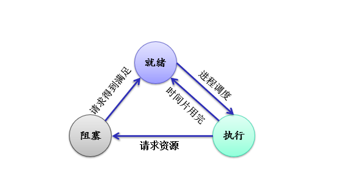

mermaid代码如下所示(需要打上一个mermaid插件),后续多态图以mermaid形式展示  

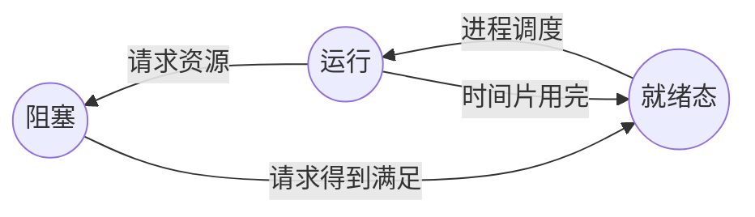

**单阻塞队列**

如下图2-6所示  

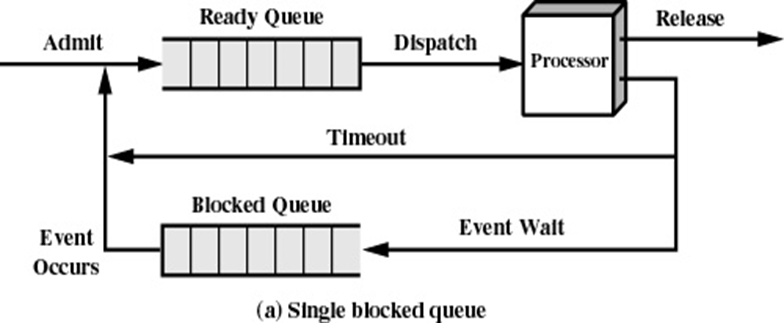

**多阻塞队列**

如下图2-7所示  

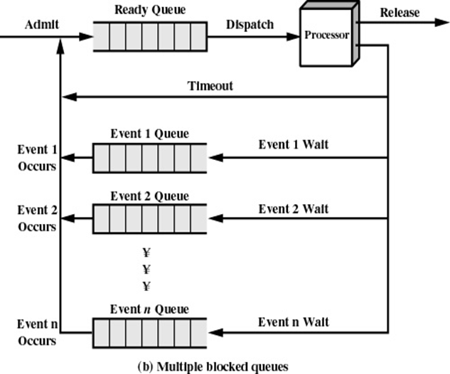

多阻塞队列可以分类请求，分别处理，只需要检测CPU请求的队列  

---
#### 五态进程模式图，在三态的情况下引进了新的两态

五状态图如下mermaid图所示

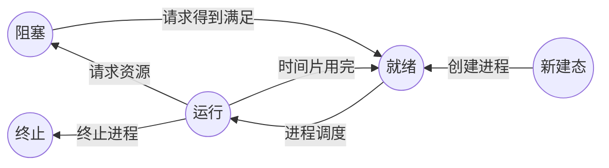
新增
- **新建态**（New）：进程已经创建，但是未被OS接纳为可执行程序，并且程序还在辅存中，PCB在内存
- **退出态**（Exit）：因停止或取消，被OS从执行态释放

---
#### 七状态进程模式图，在五态的情况下引进了新的两态

七状态图如下mermaid图所示（觉得太乱可以下跳，有PNG截图版）

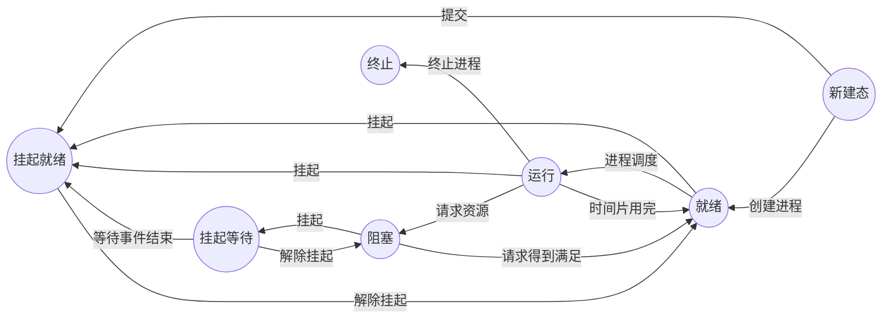

挂起状态：使执行的进程暂停执行，静止下来，我们把这种静止状态称为挂起状态

以下表格将说明什么时候会出现挂起状态  表2-1  

| 事件 | 说明 |
| :----: | :---- |
| 交换 | 操作系统需要释放足够的内存空间，以调入并执行处于就绪状态的进程 |
| 交互式用户请求 | 用户可能希望挂起一个程序的执行，目的是为了调试或者与一个资源的使用和链接 |
| 定时 | 一个进程可能会周期性地执行（例如记账或者系统监视进程），而且可能等待下个时间间隔时会挂起 |
| 父进程请求 | 父进程可能会希望挂起后代进程的执行，以检验或修改挂起的进程，活着的协调不同后代进程之间的行为 |
| 其他OS原因 | 操作系统可能挂起后台进程或工具程序进程，或者被怀疑导致问题的进程|

因此引入了挂起状态，如下图 2-8 所示(由于七态图mermaid太乱也可观察下图)

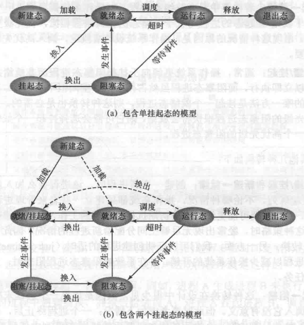

进程之间的各状态转换说明

- 空白->新建：系统调用、用户登录、用户请求等.......
- 新建->就绪：系统尚有空余资源，接纳进程并放入就绪队列
- 就绪->运行：获得了除了CPU之外的所有资源
- 运行->完毕：进程正常执行完毕或者被 kill
- 运行->阻塞：等待请求完成
- 阻塞->就绪：请求已经完成
- 就绪(就绪挂起)->退出：无偿的被KILL
- 阻塞->阻塞挂起：没有阻塞进程，挂起就绪进程以释放空间
- 就绪挂起->就绪：没有就绪进程或者就绪进程优先级较低
- 阻塞挂起->阻塞：解除挂起
- 阻塞挂起->就绪挂起：等待事件结束


### 进程的控制

- 进程状态（若干状态之间的转换以及转换依据）

- 进程映像
  - 进程的程序、数据、堆、栈的集合

- 进程控制块 PCB（Process Control Block）
  - 用于控制进程属性的集合

- 进程图

PCB表的一般结构如下图 2-9 所示

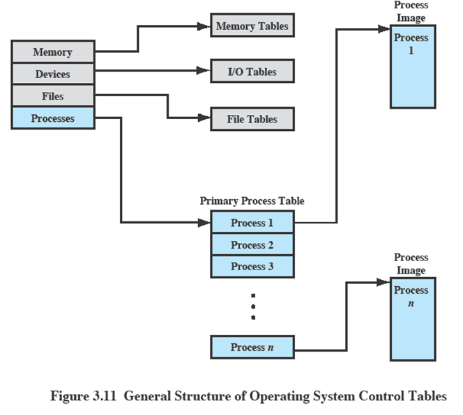

Primary Process Table 中就是进程映像，Process Image中的进程也会和其他tables有交互

#### 进程控制块

PCB 存储不同信息的内容与功能介绍如下表2-2所示

| PCB 存储信息| 内容和功能 (P87) |
| :---:| :---:|
| 标识符 | PID 和 进程名称(名称会重复) win端使用 `tasklist`可以查看 |
| 状态 | |
| 优先级 | |
| 程序计数器|下一条执行指令的地址 |
| 内存指针 | 程序代码和进程相关数据指针、共享内存块指针等 |
| 上下文 | 处理器的寄存器数据信息 |
| IO状态 | 处理器的使用时间总和、时间限制等，设备状态 |
| 审计信息 | 执行时间，使用资源。提供操作系统参考和使用|

进程标识

- 标识符

处理器状态信息

- 用户可见寄存器、控制和状态寄存器，栈指针

进程控制信息

- 调度和状态信息，进程间通信，特权、存储管理、资源使用情况

进程的组成由下图 2-10 所示

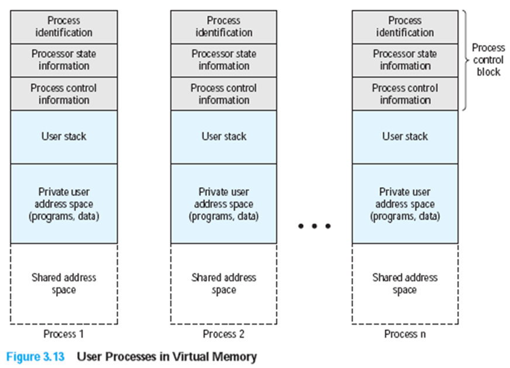


- 操作系统维持着一个由PCB组成的链表，根据链表中的PCB来控制系统中的进程
- 进程控制块面临的难题-安全保护
  - 病毒回不回出现在PCB中，或修改其他进程

----
#### 进程图 Process Graph
- 进程图是用于描述一个进程的家族关系的有向树
- **子进程**可以继承**父进程**所拥有的资源
- 当子进程被撤销时，应该将其从父进程那里获得的资源归还给父进程
- 特别的：若是父进程先子进程死掉，子进程可能会进入孤儿进程状态（若是子进程退出了，父进程不清楚，则进入僵尸进程状态）

#### 进程的创建 Process Creation

会导致进程创建的事件:
- 系统初始化 
- 正在运行的进程调用了一个进程创建系统
- 用户请求
- 批处理作业的初始化


创建进程的步骤：
- 首先分配一个唯一进程标识符，分配相应的空间（包括进程映像所有元素）
- 然后调用进程**创建原语**按照下述步骤创建一个新进程：
    1. 申请空白PCB
	2. 为新进程分配资源，为新进程的程序和数据以及用户栈分配必要的内存空间
	3. 初始化进程控制快
		- 初始化标识信息
		- 初始化处理机状态信息。使得程序计数器指向程序的入口地址，使栈指针指向栈顶
		- 初始化处理机控制信息：进程的状态、优先级
	4. 将新进程插入就绪队列


#### 进程终止

进程终止的几种情况
- 普通终止（自愿退出）
- 错误终止（自愿退出）
- 致命性错误 （非自愿退出）
- 被其他进程杀死 （非自愿退出）

利用**终止原语**（原子操作，不可再分） 终止进程
- 检索被终止的进程PCB
- 终止该进程的执行 （若有子进程，一并终止）
- 回收资源
- 将该进程PCB从当前队列中移出

#### 进程的阻塞

调用**阻塞原语**自我阻塞

因为是自我阻塞，所以阻塞是发生在运行过程中的。因此会插入到不同的阻塞队列中，此时会
- 暂停进程的执行，修改PCB运行状态
- 将PCB插入阻塞队列
- 调度新进程

#### 进程的唤醒

调用**唤醒原语**唤醒进程
- 检索阻塞队列，寻找想要换新进程的PCB
- 修改PCB的运行状态
- 插入PCB到就绪队列中

#### 进程的挂起与激活

利用**挂起原语**挂起进程  
利用**激活原语**激活进程

---
### 进程的切换

进程切换的主要步骤
1. 保存处理器状态信息
2. 更新当前进程的状态
3. 将当前进程PCB移动到相应的队列
4. 选择另一个进程PCB
5. 更新该进程的PCB
6. 更新内存管理的数据结构
7. 恢复当前进程被切换前的上下文信息


#### 模式切换

模式切换可以不改变正处于运行态的进程的状态
- 进程切换会导致模式切换，反之不一定有改变
- 保存上下文环境与恢复上下文环境只需要很小的开销

---
## 线程 Threads

在讨论线程前，回顾进程的概念 
- 每个进程有自己独立的地址空间
- 每个进程拥有自己资源的控制权
  - I/O、主存、文件......
- 进程是操作系统的最小调度单位
  - 进程切换

因此，为了减少操作系统的开销，现代操作系统引入线程的概念，因此有：
1. 线程是调度的最小单位  
2. 进程是资源拥有的最小单位  
3. 一个进程可以拥有多个线程
4. 组合方式有：
   1. 单进程单线程
   2. 单进程多线程
   3. 多进程单线程
   4. 多进程多线程

线程的特点：
1. 创建块（比进程大约快10倍，因为实在进程的资源基础上创建）
2. 终止快（线程终止不需要被回收）
3. 切换快（一般在进程内部切换，保存信息较少）
4. 通信快（进程间通信无需经过内核）

线程进程模型由下面的图2-11所示

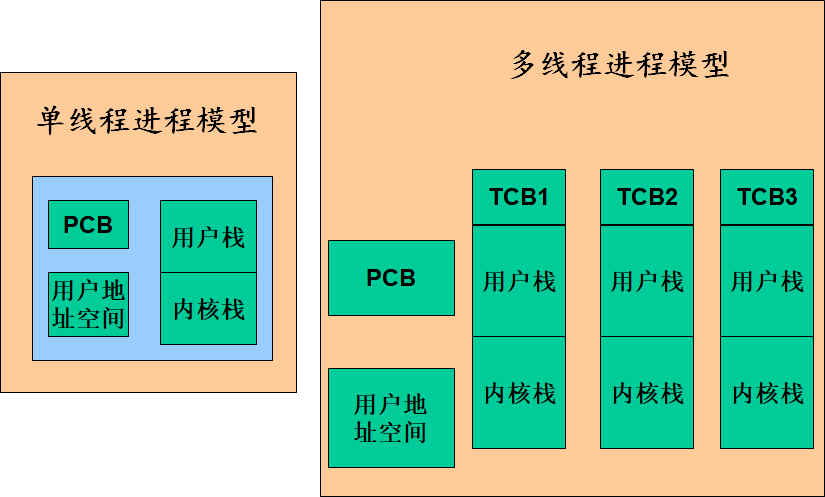

因此综上所述，**在支持线程的操作系统中**，**线程**是**调度分派**的最小单位，**进程**是**资源拥有**的最小单位

线程与进程类似，同样具有几种基本状态
- 就绪、执行、阻塞

因为线程是基于进程的资源所建立，因此对进程的操作（如调度等），都会影响到进程中的所有线程

---
### 线程的基本操作

- 派生（Spwawn）：当产生一个新进程时，同时操作系统也为该进程派生了一个线程，随后，进程中的线程可以在同一个进程中派生另一个线程，新线程被放置在就绪队列中
- 阻塞（Block）：当线程需要等待一个时间时，它将阻塞，此时处理器转而执行另一个就绪线程
- 解除阻塞（Unblock）：当阻塞一个线程的事件发生时，该线程被转移到就绪队列中
- 结束（Finish）：当一个线程完成时，其寄存器的信息和栈都将被释放

线程的实现
 - 用户及线程
   - 现场的管理应该由应用程序完成
 - 内核级线程
   - 线程的管理应该由内核完成，应用程序通过API访问线程

用户及线程与内核级线程情况由下面的图2-12所示

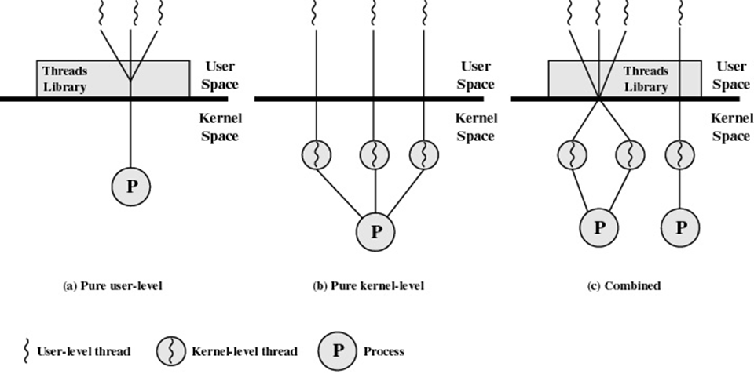

用户级线程：操作系统感知不到线程存在，只知道进程存在。信息交换只在用户的空间内完成

内核级线程：调用API完成，操作系统可以感知到。用户空间不能完成信息交换，需要调用API在内核完成信息交换，需要模式切换有较大开销

**用户级线程**与*内核级线程*的比较
1. 用户级线程
     - 用户级线程不需要模式切换（由应用程序代为完成）
     - 用户级线程由应用程序实现调度管理
     - 用户级线程可以再任意操作系统中运行（C语言提供用户级线程库）

	**缺点**
		- 用户级线程等执行系统调用时，同一进程所有线程都会被阻塞
		- 不能利用多处理机技术
  
2. 内核级线程
    - 内核实现内核级线程的调度管理
    - 可以充分利用多处理技术

	**缺点**
	- 有模式切换的开销


---
### 进程的并发

并发是所有问题的基础，也是操作系统设计的基础

由并发带来的两个问题
- 对资源的相互制约：同步
- 对资源的相互共享：互斥

#### 相关的关键概念

**临界资源**：一次仅运行一个进程访问的资源为临界资源

**临界区**：
- 把在每个进程中访问临界资源的那段**代码**称为临界区
- 代码作为一个共享资源，一次只能允许一个进程访问

**死锁**：两个或两个以上的进程之间相互等待临界资源导致都不能执行的情况

**互斥**：当一个进程在临界区访问临界资源时，其他进程不能进入该临界区访问共享资源

**竞争**：多个进程读写一个共享数据时以来它们执行的相对时间
- 竞争条件发生在多个进程或县城读写数据时，其最终结果取决于多个进程的指令执行顺序

**饥饿**:一个进程始终得不到执行机会

**饿死**：饥饿的极端情况，进程因为不能按时完成任务而结束

---

进程的并发会导致程序执行结果不封闭（不封闭体现在执行顺序的偏差上）

- 全局资源  
  对全局资源的访问秩序非常重要

- 资源分配  
  不好的分配算法可能导致死锁

因此为了实现对临界资源的访问，每个进程都**互斥**地进入自己的临界区：**一次只有一个程序在临界区**

进程访问临界区的步骤：

1. 进入临界区之前，对预先访问的临界资源进行检查
2. 若该资源尚未被访问，则可以进入临界区；反之则不能
3. 设置正在访问标志
4. 进程使用资源完毕后，需要将资源恢复为未访问标志

---
#### 互斥可能带来的问题
- 死锁：进程P1占有资源R1，等待资源R2；进程P2占有资源R2，等待资源R1
- 饥饿：无限期地被推迟访问

##### 同步机制应该遵循的准则 :star:

1. **空闲让进**(无进程进入临界区，则允许一个请求进去临界区的进程进入)
2. **忙则等待**（有进程位于临界区。其他预进入的进程需要等待）
3. **有限等待**（预进入临界区的进程，应该在**有限时间**内有机会进入临界区）
4. **让权等待**（进程无法进入自己临界区时，应该立即释放处理机）

##### 实现互斥访问

- 严格轮换  
  每个进程每次都从头执行到尾

- 屏蔽中断
	刚刚进入临界区时就屏蔽中断，刚要出临界区就打开中断

- 专用机器指令
	`test_and_set`、`test_and_clear`

- 软件方法
	- 使用信号量（Semaphore）

##### 软件方法解决互斥与同步

1. 能否保持互斥
2. 会不会出现互斥礼让
3. 会不会发生资源死锁

算法分析（Dekker`s Algorithm）  
C语言伪代码形式

```C
int turn = 0;
    process 0{
        do{
            nothing;
        }while(turn != 0)
        <critical section> //临界区
        turn = 1;
    };
    process 1{
        do{
            nothing;
        }while()
        <critical section> //临界区
        turn = 0;
    };
```

解析：保持了互斥，但仍然存在问题：进程“忙等”进入临界区，若标志修改失败，则其他进程会**永久堵塞**

---

另一份代码,优化版
```C
bool flag[2]; //共享的全局变量
    Process 0
    {
        while(flag[1]){
            nothing; //直接结束
        }
        flag[0] = 0;
        <critical section>;
        flag[0] = false;
    };
    Process 1
    {
        while(flag[0]){
            nothing; //直接结束
        }
        flag[1]=true;
        <critical section>;
        flag[1] = false;
    };
```

解析：若进程需求临界区资源完毕，恢复自己标志位为"FALSE"失败，则其他进程永久阻塞

---
在检查其他进程之前，若是希望得到临界区资源，则设置自己的标志位，flag = True。

当设置标志位为真后，如果其他进程在临界区，则本进程将阻塞，知道其他进程释放临界区资源为止

```C
bool flag[2] = 0;
    Process 0 {
        flag[0] = true;
        while (flag[1]){
            nothing // 直接退出
        }
        <critical section>;
        flag[0] = flase;
    };
    Process 1 {
        flag[1] = true;
        while(flag[0]) {
            nothing; //直接退出
        }
        <critical section>
        flag[1] = false;
    };
```

**缺点**:如果两个进程在执行`while`之前豆浆标志位`flag`设置成True，那么每个进程都会认为对方进入了临界区，从而使得自己被阻塞，因为互相阻塞，会导致**死锁**产生。

---
另一个算法将优化上面算法的问题

主要思想：将标志位重置，不会发生死锁

实现过程：
- 如果一个进程希望进入临界区，则需要将自己的标志位：flag = true
- 如果其他进程已经在临界区，则将本进程标志位置为flag=false，设置一个延时，稍后又置位为true，这一过程将重复到最终进程能够进入到临界区为止

实现算法如下所示
```C
bool flag[2] = 0;
    Process 0 {
        flag[0] = true; //希望进入临界区
        while(flag[1]) {
            flag[0] = false;
            <delay for a shot-time>
            flag[0] = true;
        }
        <critical section>;
        flag[0] = true;
    };
    Process 1 {
        flag[1] = true;
        while(flag[0]) {
            flag[1] = false;
            <delay for a shot time>;
            flag[1] = true;
        }
        <critical section>
        flag[1] = false;
    };
```

实质上，上述算法的中心思想就死，检查其他进程，然后重置，再检查，再重置,重复循环上述过程.

重置序列因为可以无限延伸，使得任何一个进程都不能进入自己的临界区。这种现象又称之为 **互斥礼让**

**互斥礼让**的另一种算法

```C
bool flag[2] ;
    bool turn = 0;
    Process1{
        flag[0] = true; //希望进入临界区
        turn = 1;
        while(flag[1] && turn == 1){
            nothing;
        }
        <critical section>
        flag[0] = false;
    };
    Process2{
        flag[1] = true;
        while (flag[0] && turn == 0){
            nothing;
        }
        <critical section>;
        flag[1] = false;
    };
```

---
### 信号量

#### 整型信号量

最初是由 Dijkstra 把整型信号量定义为一个整型量，除初始化外，仅能通过两个标准的**原子操作**（Atomic Operation）即，wait（s） P操作，signal（s）V操作，这两个操作来访问。

其中wait，与signal操作的算法表达式如下
```C
    p(s): while(s<=0) s=s-1 ; 
    v(s): s = s+1;
```

特别需要注意的：不能对信号量直接做加减操作，因为加减操作并不满足**原子操作**。需要调用P(S)与V（S）实现。

面临的问题
- 只要信号量$S\leq0$,他就会不断地进行测试。因此，该机制并未遵循“让权等待”的准则，可能出现盲等的情况。

#### 记录型信号量

Value:代表可用资源数

L:链接所有等待进程

代码算法表示如下
```C
typedef struct semaphore{
        int Value;
        List_of_Process L;
    };
    P(S):
        S.value = S.value -1 ;
        if (s.value<0){
            block(S,L);//切换至阻塞队列
        }
    V(S)：
        S.Value = S.value + 1;
        if (s.balue<0){
            wakeup(S,L);
        }
```

算法解释：
- `S.value`的初值表示系统中某类资源的数目，因而又称为资源信号量，对它的每次wait操作，意味着进程请求一个单位的该类资源，因此描述为`S.value=S.value-1`；

- 当`S.value＜0`时，表示该类资源已分配完毕，因此进程应调用`block`原语，进行自我阻塞，放弃处理机，并插入到信号量链表`S.L`中。可见，该机制遵循了“**让权等待**”准则。 此时`S.value`的绝对值表示在该信号量链表中已阻塞进程的数目。

- 对信号量的每次`signal`操作，表示执行进程释放一个单位资源，故`S.value=S.value+1`操作表示资源数目加1。若加1后仍是S.value≤0，则表示在该信号量链表中，仍有等待该资源的进程被阻塞，故还应调用`wakeup`原语，将S.L链表中的第一个等待进程唤醒。

- 如果`S.value`的初值为1，表示只允许一个进程访问临界资源，此时的信号量转化为互斥信号量。

- 因此有，强信号量，按排队顺序唤醒。弱信号量，唤醒资源靠**竞争**

信号量的机制如下图2-13所示

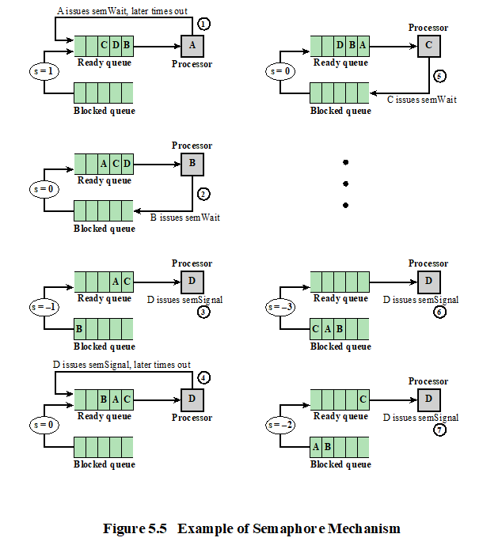

#### AND信号量

AND信号量同步机制的基本思想

**将进程在整个运行过程中需要的所有资源，一次性全部地分配给进程，待进程使用完后再一起释放。只要尚有一个资源未能分配给进程，其它所有可能为之分配的资源，也不分配给他.** 即，对若干个临界资源的分配，采取原子操作方式：要么全部分配到进程，要么一个也不分配。

#### 信号量集

思考：记录型信号量有何不便之处？
- 当一次需要多个资源时，需要进行多次`P`操作
- 同理，释放占用资源时，也要进行多次释放`v`操作

如何改进，可以尝试将 t作为下限值，d作为需求值

```c
Swait(S1, t1, d1, …, Sn, tn, dn)
    if ( S1≥t1 and … and Sn≥tn )
       for  ( i=1;i<=n; i++)
             Si =Si-di;
    else
        Place the executing process in the waiting queue of the first Si with Si＜ti and set its program counter to the beginning of the Swait Operation. ;
signal(S1, d1, …, Sn, dn)
   for  ( i=1;i<=n; i++){
       Si =Si+di;
       Remove all the process waiting in the queue associated with Si into the ready queue;
   } 
```

一般“信号量集”的几种特殊情况：

1. `Swait(S, d, d)`。 此时在信号量集中只有一个信号量`S`， 但允许它每次申请`d`个资源，当现有资源数少于`d`时，不予分配。
2. `Swait(S, 1, 1)`。 此时的信号量集已蜕化为一般的记录型信号量(`S＞1`时)或互斥信号量(`S=1`时)。
3. `Swait(S, 1, 0)`。这是一种很特殊且很有用的信号量操作。当`s>=1 `时，允许多个进程进入某特定区；当`S = 0`后，将阻止任何进程进入特定区。换言之，它相当于一个可控开关。

### 信号量的应用

#### 利用信号量实现进程互斥

利用信号量实现互斥代码算法实现情况如下图所示

```C
Process1:
        Semaphore mutex = 1;
        while (1){
            p(multex);
            <critical section>;
            v(multex);
        }
Process2:
        Semaphore mutex =1;
        while (1){
            p(mutex);
            <critical section>
            v(mutex);
        }
```
---

#### 利用信号量实现前趋关系

前驱关系的mermaid示意图例如下所示

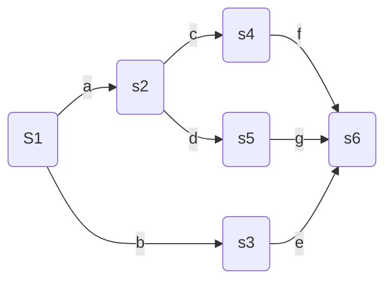

根据上图关系可知，需要保证在前趋结束后，才能开始执行后面的进程

```C
    Semaphore a=0,b=0,c=0,e=0,f=0;
    Semaphore g = 0;
    //使用信号量必须先进行初始化
    P(a);S2;V(c);V(d);
	P(b);S3;V(e);
	P(c);S4;V(f);
	P(d);S5;V(g);
	P(e);P(f);P(g);S6;
```

同一层级的执行顺序依靠算法进行调度

#### 生产者消费者问题 :star:

模型组成原理:
1. 生产者生产产品，提供给消费者去消费。  
2. 为使得生产者进程和消费者进程能**并发执行**（执行中可能会被打断），在两者之间设置了具有`*n*`个缓冲区的缓冲池。  
3. 生产者进程将他生产的产品放入缓冲池（**一次一个**），消费者进程从缓冲池中拿走产品（**一次一个**）。  
4. 缓冲池**已满时**，生产者不能**再放**，缓冲池**已空时**，此时消费者**不能再拿**。

生产者与消费者之间的联系(模型特点)
- 互斥
  - **共享缓冲区**（缓冲区作为一种临界资源）
- 同步
  - **相互等待**（有产品才能消费、有消费才能不断生产）


使用循环缓存，只需要单一方向生成/消费即可

假定在生产者和消费者之间的公用缓冲池中，具有n个缓冲区，这时可利用**互斥信号量Mutex**实现诸进程对缓冲池的互斥使用

利用**信号量Empty和Full**分别表示缓冲池中空缓冲区和满缓冲区的数量。

生产者-消费者模型算法实现 (C伪代码)

```C
Semaphore Mutex=1; //定义互斥信号量，初始值必须为1
    Semaphore Full=0,Empty = n; //定义同步信号量
    //这样初始化是为了阻塞消费者，此时消费者可用资源为0，n是缓冲区大小，为生产者可生产空位
    product_Item Buffer[n]; //定义产品缓冲区
    int in = 0; //定义生产者初始化指针
    int out = 0; //定义消费者初始化指针
    
    Producer:// 生产者进程
    while (1){
        Create goods; // 生产者生产产品 Pro_Item
        p(Empty);
        p(Mutex); //上互斥锁
        Buffer[in] = Pro_Item;
        in = (in++)%n;
        v(Mutex);//解锁
        v(full);
    }
    
    Consumer:
    while (1){
        p(Full);
        P(Mutex);
        Item = Buffer[out];
        out = (out++) % n;
        v(Mutex);
        v(Empty);
        ...; //消费者消费过程
    }
```

互斥信号量：PV同一进程中成对

同步信号量：PV不同进程中成对

如果 empty和Mutex 交换 会导致死锁，产生原因 生产者连续生产n次后，再次进行P([pro]mutex) P1([pro]empty) P2([con]mutex) 死锁

因此

1. P操作一定要对同步信号量操作，再对互斥信号量操作
2. PV成对出现

P不当会导致死锁，V操作不会导致阻塞

（P操作为请求资源，V操作为释放资源）

---
##### 利用AND 信号量解决 生产者-消费者问题

此时引入新的操作`Swait`,`Ssignal`，因为同步信号量机制要求规定，必须当一个进程所需的全部资源都满足时才进行分配，故此引入`Swait`，来实现同时分配进程所需的全部资源，`Ssiganl`来释放进程的所有资源。

算法实现，如下所示

```C
	Semaphore Mutex = 1;//定义互斥信号量，互斥信号量恒为1
    Semaphore Full = 0, Empty = n;//定义同步信号量
    //这样初始化是为了阻塞消费者，此时消费者可用资源为0，n是缓冲区大小为生产者可生产空位
    Product_Item Buffer[n]; //定义产品缓冲区
    int in = 0;
    int out = 0;

    Producer:
    while (1){
        ...; //生产者生产产品Product_Item
        Swait(Empty,Mutex); //and型信号量，需要同步操作
        buffer[in] = Product_Item; //填入产品
        in = (in ++ )%n;
        Ssignal(Mutex,Full); //and型信号量，需要同步操作
    }

    Consumer:
    while(1){
        Swait(Full,Mutex);
        Item = Buffer[out];
        out = (out++)%n;
        Ssignal(Mutex,Empty);
        ...;//消费者消费过程
```

---
##### 无限缓存问题

缓冲区无限大，导致生产者**不停的放**

满足：
- 互斥
- 消费者有限制

代码实现如下所示
```C
    binary_Semaphore s = 1,delay = 0; //创建二元信号量
    
    void producer(){
        while(1){
            produce();
            p(s);
            append(); //尾插入资源
            n++; //资源数增加
            if (n == 1) v(delay); //通知消费者有数据可取
            v(s);
        }
    }
    
    void consumer() {
        p(delay) //锁定资源
        take();
        n-- //资源数减少
        v(s);
        consume();
        if (n == 0) p(delay);//资源耗尽，发出提示
    }
void main(){
	int n = 0;
    perbegin(producer,consumer);
}
```

上述程序会发生错误，理由如下表 2-3 所示

|      | Producer                   | Consumer                                            | s    | n    | Delay |
| :----: | :--------------------------: | :--------------------------------------------------- | :----: | :----: | :-----: |
| 1    |                            |                                                     | 1    | 0    | 0     |
| 2    | semWaitB(s)                |                                                     | 0    | 0    | 0     |
| 3    | n++ //生产                 |                                                     | 0    | 1    | 0     |
| 4    | if(n==1) semSignalB(delay) |                                                     | 0    | 1    | 1     |
| 5    | semSignalB(s)              |                                                     | 1    | 1    | 1     |
| 6    |                            | semWaitB(delay)                                     | 1    | 1    | 0     |
| 7    |                            | semWaitB(s)                                         | 0    | 1    | 0     |
| 8    |                            | n-- //消费                                          | 0    | 0    | 0     |
| 9    |                            | semSignalB(s)                                       | 1    | 0    | 0     |
| 10   | semWaitB(s)                |                                                     | 0    | 0    | 0     |
| 11   | n++// 生产                 |                                                     | 0    | 1    | 0     |
| 12   | if(n==1) semSignalB(delay) |                                                     | 0    | 1    | 1     |
| 13   | semSignalB(s)              |                                                     | 1    | 1    | 1     |
| 14   |                            | if(n==0) :warning:semWaitB(delay) //这里delay不匹配 | 1    | 1    | 1     |
| 15   |                            | semWaitB(s)                                         | 0    | 1    | 1     |
| 16   |                            | n-- //这里消费空数据                                | 0    | 0    | 1     |
| 17   |                            | semSignalB(s)                                       | 1    | 0    | 1     |
| 18   |                            | if(n==0) :warning:semWaitB(delay)                   | 1    | 0    | 0     |
| 19   |                            | semWaitB(s)                                         | 0    | 0    | 0     |
| 20   |                            | n--:stop_sign:                                      | 0    | -1   |       |


主要问题发生在，生产者与消费者同时对n进行操作，让消费者在第一轮生产消费循环后，在第二轮中，消费者消费了一个并不存在的数据内容，导致出现死锁

改进版代码如下所示：

```C
    int n;
    binary_Semaphore s = 1,delay = 0; //创建二元信号量

    void producer(){
        while(1){
            produce();
            p(s);
            append(); //尾插入资源
            n++; //资源数增加
            if (n == 1) v(delay); //通知消费者有数据可取
            v(s);
        }
    }

    void consumer() {
        int m; // 引入额外本地变量，防止对n重复操作
        p(delay) //锁定资源
        while(1){
            p(s);
            take();
            n -- ;
            m = n;
            v(s);
            consume();
            if (m == 0) p(delay); //引入的m充当资源的作用
        }
    }
    n = 0;
    perbegin(producer,consumer);
```

---
#### 哲学家就餐问题

哲学家就餐问题的问题描述
- 哲学家需要就餐，需要同时使用左边与右边的筷子
- 一只筷子同时只能被一个人使用
- 使用完后放归原处

由上不难看出，哲学家就餐问题是**竞争关系**的很好体现

示例情况代码如下所示
```C
    Semaphore Chopstic[n]{1, 1, 1, 1, 1}; //定义n个共享资源
    while (1){
        p(Chopstic[i]);
        p(Chopstic[(i+1)%n]);
        Eating food ......;
        V(Chopstick[(i+1)%n]);
        v(Chopstick[i]);
        .....LOOP
    }
```

#### 盘子问题 （类似竞争问题）

问题描述：有一只空盘，只能每次往上放一个水果，父亲往盘子里放一个苹果或者一个橘子，儿子只拿橘子，女儿只拿苹果。

需要参考生产者-消费者模型，

互斥信号量：盘子（临界资源，每次只能放一个）

同步信号量：资源信号量（针对消费者，针对生产者）

算法实现如下所示

```C
    Semaphore Mutex = 1;
    Semaphore Empty = 1;
    Semaphore s_apple = 0,s_orange = 0;

    father:
        while(1){
            p(Empty);
            p(Mutex);
            put fruit;
            if(Orange) s(s_orange)
            else v(s_apple)
            v(Mutex)
        }

    son:
        while(1){
            p(s_orange);
            p(Mutex)
            Fetch orange;
            v(Empty);
            v(Mutex);
            Eating Orange;
        }
    
    daughter:
        while(1){
            p(s_apple);
            p(Mutex);
            Fetch Apple;
            v(Empty);
            V(Mutex);
            Eating Apple;
        }
```

通过以上例子可以说明：
1. 一定要先 P(资源信号量),再P（互斥信号量）
2. 一定不能忘记对生产者也有资源信号量

---
#### 读者-写者问题

核心问题**共享关系**的描述

问题描述：一个作家写，多个读者读，作家一次只能写一本小说，但是一本小说可以同时提供给多个读者读。

需求描述
- 不能同时写文件
- 不能同时读和写文件
- 可以同时读文件

为了满足问题需要 即在 `Reader` 与 `Write` 进程间在读或者写时的互斥而设置了一个**互斥信号量`Wmutex`**.

设置一个**整型变量`Readcount`表示正在读的进程数目**。由于只要有一个`Reader`进程在读，便不允许`Writer`进程去写。因此，仅当`Readcount=0`, 表示尚无`Reader`进程在读时，`Reader`进程才需要执行`Wait(Wmutex)`操作。若wait`(Wmutex)`操作成功，`Reader`进程便可去读，相应地，做`Readcount+1`操作。同理，仅当`Reader`进程在执行了`Readcount-1 = 0 `操作后，才须执行`signal(Wmutex)`操作，以便让`Writer`进程写。

`Readcount`是一个可被多个`Reader`进程访问的临界资源，因此，应该为它设置一个**互斥信号量rmutex**。 

算法代码表示如下
```C
    Semaphore Rmutex=1,Wmutex=1;
    int ReaderCount = 0;
    Reader:
    while(1){
        P(Rmutex); //对共享资源Rmutex加锁，Rmutex为读写互斥锁，Rmutex为读者数量互斥锁（只能被一次被一个Reader修改的Readcount）
        if(ReaderCount == 0) {
            p(Wmutex); //读之前对临界资源文件加互斥锁,Wmtex只有在Readercount计数为0时，才可锁上，允许写入
        }
        ReaderCounter++;
        V(Rmutex);
        //Reader 开始阅读
        p(Rmutex);
        ReaderCount = ReaderCOunt - 1;
        if(ReaderCount == 0){
            V(Wmutex); //若无读进程，对临界资源进行写操作
        }
        V(Rmutex); //对Rmutex解锁
    }

    Writer:
    while(1){
        P(Wmutex);
        //作家开始写入文件
        V(Wmutex)
    }
```

如果利用mermaid图进行展示，可如下图

```mermaid
stateDiagram
state 请求顺序{
R0 --> W0
W0 --> R1
R1 --> R2
}
请求顺序  --> 实际顺序:运行乱序

state 实际顺序{
R0 --> R1
R1 --> R2
R2 --> W0
}
```

从这里可以观察到，显然，只要有多位**读者**，就无法修改内容。所以需要进行优化，让写者优先，不然会处于一直无法更新内容状态，使得**写者**进程饥饿


优化后的代码如下所示｝

```C
    int readcount,writecount; //调用时，均初始化为0
    Semaphore x=1,y=1,z=1,wsem=1,rsem=1;
    // rsem:至少有一个进程准备访问数据区时，用于禁止所有的读进程
    // writecount：用于控制rsem
    // y:控制writecount 更新
    
    void reader(){
        while(1){
            semWait(z);
                semWait(rsem);
                semWait(x);
                readcount++;
                if(readcount == 1) semWait(wsem);
                semsignal(x);
            semSignal(rsem);
        semSignal(z);
        
        READUNIT();
        
        semWait(x);
            readcount--;
            if(readcount == 0) semSignal(wsem);
        semSignal(x);
        }
    }
    
    void  writer(){
        while(1){
            semWait(y);
                writeCount ++;
                if(writeCount == 1) semWait(rsem);
            semSignal(y);
            
            semWait(wsem);
            WRITEUNIT();
            semSignal(wsem);
            
            semWait(y);
                writecount -- ;
                if(writecount == 0) semSignal(rsem);
            semSignal(y);
        }
    }
```

---
#### 将三个经典例子牢记于心

- 生产者消费者问题：需要相互通知
- 哲学家就餐问题：需要
- 读写问题：间接知道（甚至不知道），团体问题

参考其他示例

- 理发师问题

解决P、V操作问题的关键 :star:

- 理解临界资源与临界区的概念！
- 准确理解问题的同步互斥过程与要求！
  - 同步：多个进程在执行次序上的协调，相互等待消息
  - 互斥：对临界资源的使用
- 建立信号量，准确定义信号量的意义和初始值！
- 信号量的定义根据同步和互斥要求来定


## 管程 Monitor

定义：管理进程同步与互斥的一种工具（管程将信号量与原子操作相结合，减少了操作量与程序复杂度）

Dr.Hansan 为管程所下的定义是：“一个管程定义了一个数据结构和能为并发进程所执行（在该数据结构上）的一族操作，这组操作能同步进程和改变管程中的数据”


### 利用管程来解决生产者与消费者问题

实现代码如下所示

```C
    Monitor proCon{  //管程
        int in = 0,out =0,count = 0;
        message buffer[n],inM,outM;
        condition notFull,notEmpty;
        Semaphore mutex = 1,empty = n,full = 0
    public:
        void put(message x){
            if(count >= 0) Cwait(notFull);
            buffer[in] = x;
            in = (in+1) % n;
            count ++ ;
            Csignal(notEmpty)
        };
        void get(message x){
            if(count<0) Cwait(notEmpty)
            x = buffer[out];
            out = (out+1) % n;
            count --;
            Csignal(notFull);
        }
    }PC;

    void procedure(){ //生产者
        message x;
        do{
            ....
            produce a message inM;
            Swait(empty,mutex)l
            PC.put(inM);
        }while(1)
    }
    
    void consumer(){  //消费者
        message outM;
        do{
            PC.get(outM);
            do{
                pc.get(outM);
                consume the message in outM;
                ....
            }while(1)
        }
        void main(){
            parbegin(procedure(),consumer());
        }
    }
```

函数分析与名词解释
- put(x)
  - 生产者利用该管程过程将生产的产品放入缓冲池
  - 整型变量count表示缓冲池中的产品数量,count>=n表示缓冲池已满
  - count++

- get(x)
  - 消费者利用该管程过程从缓冲池中取走一个产品。
  - 整型变量count表示缓冲池中的产品数量，count>=n表示缓冲池已满，count<=0则表示缓冲池已空
  - count --

condition 型变量
- notFull: 缓冲池不满
- notEmpty：缓冲池不空

Cwait(condition管程条件变量):管程被某进程占用时，其他进程调用Cwait(condition)进行阻塞，并插入condition的阻塞队列。

Csignal(condition)：唤醒被Cwait(condition)阻塞的进程
- condition 的阻塞队列为空：不用操作
- condition 的阻塞队列不为空：唤醒该队列的一个进程


**管程的主要特点**

- 局部数据变量只能被管程的过程访问，任何外部过程都不能访问。
- 一个进程通过调用管程的一个过程进入管程。
- 在任何时候，只能有一个进程在管程中执行，调用管程的任何其他进程都被挂起，以等待管程变成可用的。
- 为进行并发处理，管程必须包含同步工具
- 管程通过使用条件变量提供对同步的支持，这些条件变量包含在管程中，并且只有在管程中才能被访问。有两个函数可以操作条件变量：
  - Cwait(c)：调用进程的执行在条件c上挂起，管程现在可被另一个进程使用
  - Csignal(c)：恢复在cwait之后为某些条件而挂起的进程的执行。如果有多个这样的进程，选择其中一个；如果没有这样的进程，什么也不做

## 进程间通信 IPC

进程通信即进程之间的信息交换，分为低级通信和高级通信两类
- 低级通信：进程之间通信的数据量极少，如进程的互斥与同步
  - 效率低
  - 通信过程对用户不透明
- 高级通信
  - 用户直接利用操作系统提供的一组通信命令高效的传送大量数据的通信方式，有以下几种方式
    - 共享存储器系统
		1. 基于**共享存储区**的方式属于高级通信方式
		2. 基于**共享数据结构**的方式属于低级通信方式
    - 消息传递系统
        1. 直接消息传递系统：两个或多个进程利用系统提供的发送命令/原语，直接将消息发送给目标进程。
        2. 间接消息传递系统：又称信箱通信，即通过信箱通信原语实现通信
    - 管道通信
        - 管道通信中的“管道”指用于连接一个读进程和一个写进程以实现二者之间通信的共享文件，又称`pipe`文件。
          1. 向管道/共享文件提供输入的发送进程/写进程以字符流的形式将大量数据送入管道
          2. 接收管道输出的接收进程/读进程从管道中接收/读取数据
          3. 高效传送大量数据
          4. 首创于UNIX系统，广泛应用于其他操作系统
        - 管道机制必须提供以下协调能力
          - 互斥：当某进程正在对`pipe`执行读/写操作时，其他进程必须等待
          - 同步：当写/输入进程把一定数量的数据写入`pipe`后，就进入睡眠等待，知道读/输出进程取走数据后再将写/输入进程唤醒;`pipe`为空时，读进程睡眠等待，直至写进程将数据写入管道后才将其唤醒。
           - 确认对方是否存在，只有确定对方已经存在后才开始通信

  - 高级通信机制又具有以下特点：
    1. 使用方便/透明
    2. 高效传输大量数据
---

# 进程调度

## 进程调度的基本概念

调度的最小单位是线程，拥有资源的最小单位是进程

- 分配处理机的任务是由进程调度程序完成的
- 由于处理机是最重要的计算机资源，提高处理机的利用率及改善系统性能（吞吐量、响应时间），在很大程度上取决于进程调度性能的好坏

#### 三级调度系统

-长程调度
  - 用于决定把外存上处于后备队列中的哪些作业调入内存，并为它们创建进程、分配必要的资源，然后，再将新创建的进程排在就绪队列上，准备执行 
  - 通常也被称为作业调度（作业调度又被称为高级调度，也是主要研究的目标）

-中程调度 
  - 称为中级调度
  - 主要应用于内存调度或交换调度
  - 引入中程调度的主要目的，是为了提高内存利用率和系统吞吐量。 

-短程调度
  - 称为进程调度（低级调度）
  - 主要应用于进程或内核级线程
  - 用来决定就绪队列中的哪个进程应获得处理机，然 后再由分派程序把处理机分配给该进程的具体操作

#### 三级调度比较
1. 执行效率：高级调度（作业调度）< 中级调度 < 低级调度
2. 低级调度是各类操作系统必备的功能
3. 多道批处理系统：既有高级调度（作业调度），又有低级调度（进程调度），也可以采用中级调用
4. 分时系统或具有虚拟存储器的操作系统中，为提高内存利用率和作业吞吐量，一般没有高级调度，只有低级调度，并引入中级调度

调度在状态中的位置如下图 2-15


调度在队列中的位置如下图 2-16


---

## 调度算法的目标

调度的目标：
1. 尽可能的使CPU利用率高。

$CPU利用率 = CPU有效工作时间\div(CPU有效工作时间+CPU空闲工作时间)$

2. 公平性：使得所有进程根据其特征获得合理的CPU时间
3. 平衡性：根据内存各进程的特点，合理调度，使得系统**所有**资源处于尽可能的忙的状态。
4. 策略执行性强：哪怕影响效率，所有策略也要在需要时立即执行


共有以下两大调度算法的准则

### 面向用户的准则
- 周转时间

  - 从作业被提交给系统开始，到作业完成为止的这段时间间隔（称为作业周转时间）

  - 包括
    - 作业在外存后备队列上等待调度的时间

    -  进程在就绪队列上等待进程调度的时间

    -  进程在CPU上执行的时间

    - 进程等待I／O操作完成的时间

- 响应时间

  - 从用户通过键盘提交一个请求开始，直至系统首次产生响应为止的时间

  - 响应时间包括三部分时间：

    1. 从键盘输入的请求信息传送到处理机的时间

    2. 处理机对请求信息进行处理的时间

    3. 将所形成的响应信息回送到终端显示器的时间

- 截止时间：某任务必须开始执行的最迟时间，或必须完成的最迟时间

- 公平性：各进程在系统中都能平等的得到运行

- 优先权：让某些紧急的作业能得到及时处理

### 面向系统的准则

- 系统吞吐量高
- 处理机利用率好
- 各类资源的平衡利用

进程调度可采用下述两种调度方式

- 非剥夺（抢占）方式（Non-preemptive）

   在采用这种调度方式时，一旦把处理机分配给某进程后，便让该进程一直执行，直至该**进程完成**或发生某事件而被**阻塞**时，才再把处理机分配给其他进程，决不允许某进程抢占已经分配出去的处理机

- 剥夺（抢占）方式（Preemptive）

   允许调度程序根据某种原则，去暂停某个正在执行的进程，将已分配给该进程的处理机重新分配给另一进程

剥夺的原则：

- 优先权原则
- 短作业（进程）优先原则
- 时间片原则


### 根据以上准则，不同系统处理的目标
1. 批处理系统的目标
   1. 平均周转时间短
      1. 作业希望自己的周转时间最短
      2. 操作系统希望所有作业的平均周转时间最短
      3. 平均周转时间指所有作业需要的周转时间的平均值
   2. 系统吞吐量高
      - 吞吐量：单位时间内系统所完成的作业数
      - 吞吐量和批处理作业的平均长度以及调度算法有关
   3. 处理机利用率高
      - 处理机利用率是衡量系统性能的重要指标
      - 调度方式和算法对处理机利用率具有重要影响 
2. 分时系统的目标
   1. 响应时间快
      1. 请求时间: 从键盘输入请求信息到处理机接收到请求信息的时间
      2. 出来时间：处理机处理请求信息的时间
      3. 回送时间：响应信息传送至显示器的时间
   2. 均衡性
      - 系统响应时间的快慢与用户所请求服务的复杂性相关，即用户允许对复杂任务的响应事件较长，对简单任务的响应事件较短

 响应时间快是分时操作系统中调度算法的主要准则


 3. 实时系统的目标
    1. 截止时间的保证
       1. 硬实时周期任务（HRT）：调度方式和调度算法必须确保其对截止时间的要求
       2. 软实时非周期任务（SRT）：调度方法和调度算法应基本保证其对截止时间的要求。
       3. 截止时间：即某任务必须开始执行的最迟时间，或必须完成的最迟时间
    2. 可预测性
       - 可预测性目标是指连续性的保障。例如视频流中的第i帧数 与 第i+1 帧数之间具有连续性

---
### 作业调度
作业：用户提交给操作系统的一个独立任务

作业步：每个作业必须经过若干相对独立、相互关联的加工步骤才能得到结果，其中每个加工步骤称为作业步。（例如一个作业可以分为，编译，链接，装入和运行4个作业步，上一个作业步的输出往往作为下一个作业步的输入）

作业控制块（JCB）：指为管理和调度作业的控制块  
包含以下信息
- 作业标识
- 用户名称
- 用户账户
- 作业类型：CPU繁忙型，I\O繁忙型，批量型，终端型等
- 作业状态
- 调度信息：优先级，作业运行时间
- 资源需求：预计运行时间、要求内存大小
- 资源使用情况

JCB的作用，三个阶段
- 作业进入系统时，有作业注册为其建立JCB，插入作业队列后，并等待作业调度程序调度其进入内存
- 作业运行期间，系统按照JCB的信息和作业说明书对作业进行控制和管理
- 作业运行结束，系统回收资源，撤销JCB

批处理系统中，作业与进程的关系
- 作业是进程的任务实体，进程是作业的执行实体
- 没有作业进程将无事可做，没有进程则作业将无法完成
- 作业多用于批处理操作系统，进程则多用于多道程序设计。
### 调度算法介绍（作业调度算法）

4类调度算法（:star:）

- FCFS (First-Come-First-Served) 先来先服务（也有FIFO的缩写）

- SJF (Shortest job First, SJF) 短作业优先 

- PSA (Priority Scheduling Algorithm) 优先权调度算法

- HRRN (Highest Response Ratio Priority Scheduling Algorithm) 高响应比优先调度算法
  - 计算公式
$优先权R_q = （等待时间+要求服务时间)\div要求服务时间$
$优先权R_q =  1+ 等待时间\div要求服务时间$
$优先权R_q =  响应时间\div要求服务时间$

#### 调度算法介绍（进程调度算法）

- FCFS (First-Come-First-Served) 先来先服务（也有FIFO的缩写）

- SPN (Shortest Process Next, STN) 短进程优先 非抢占式

- SRT (Shortest Remaining Time) 最短剩余时间优先(抢占式短作业优先)

- HRRN (Highest Response Ratio Priority Scheduling Algorithm) 高响应比优先调度算法

- RR （Round-Robin）时间片轮转 抢占式

- 多级反馈队列调度算法（优先级队列调度，属于优先级调度算法）

---

各个进程调度算法图解介绍

FCFS ，先来先服务算法示例如下表2-4所示


|             | A    | B    | C    | D    | E    |      |
| ----------- | ---- | ---- | ---- | ---- | ---- | ---- |
| 到达时间    | 0    | 2    | 4    | 6    | 8    |      |
| 服务时间    | 3    | 6    | 4    | 5    | 2    |      |
| FCFS        |      |      |      |      |      | 平均 |
| 完成时间    | 3    | 9    | 13   | 18   | 20   |      |
| 周转时间T_r | 3    | 7    | 9    | 12   | 12   | 8.6  |
| T_r/T_s     | 1.00 | 1.17 | 2.25 | 2.40 | 6    | 2.56 |

短进程优先的两种算法模式（抢占式与非抢占式）如下图 2 - 17所示

其中短进程优先为非抢占式，最短剩余时间优先为抢占式


高响应比优先的算法模式如下图 2-18 所示

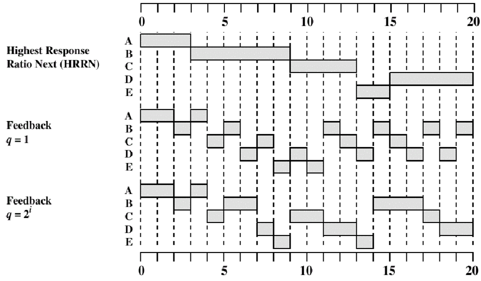

特别注意的是：
- 高响应比优先，非抢占式算法分配后直到运行完都不会有其他进程
$$
高响应比=\frac{等待时间+要求服务时间}{要求服务时间}=1+\frac{W}{S}
$$


时间片轮转调度算法算法如下图 2-19 所示

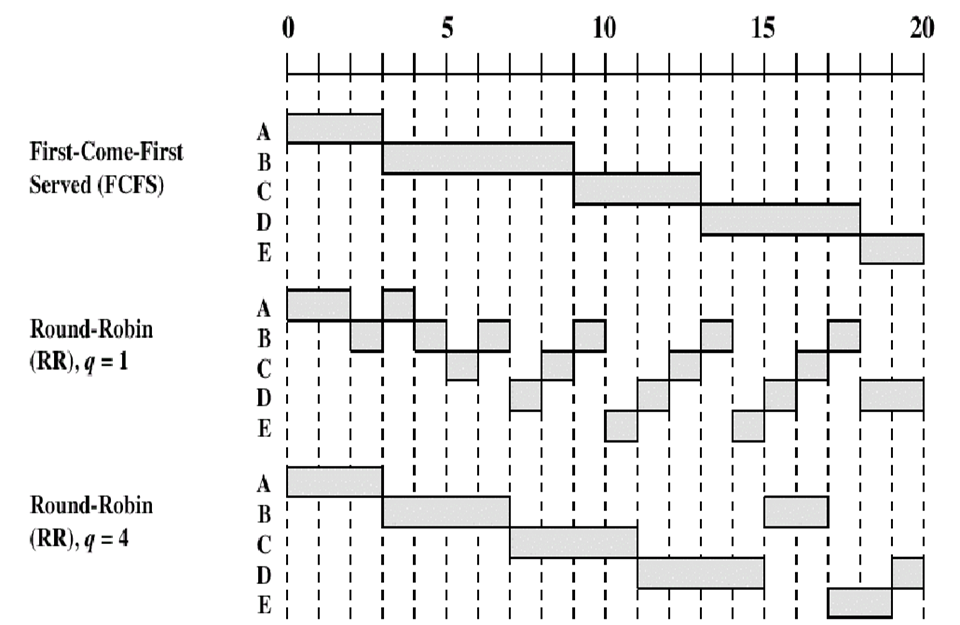


多级反馈队列调度算法如下图 2-20 所示

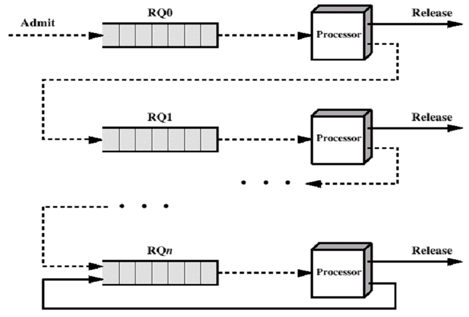

中心思想：对其他调度算法的折中权衡

算法规则：
1. 设置多级就绪队列，各级队列优先级从高到低，时间片从小到大
2. 新进程到达时先进入第1级队列，按FCFS原则排队等待被分配时间片，若用完时间片进程还未结束，则进程进入下一级队列队尾。如果此时已经是在最下级的队列，则重新放回该队列队尾
3. 只有第k级队列为空时，才会为k+1级队头的进程分配时间片

算法流程：
1. feedback q=1 每个进程分配一个时间片，每次运行下降一级，从最上层往下调度
2. A RQ0,RQ1到RQ2 
3. B到达RQ0，就行到RQ1 此时队组里面只有A，调度A A结束
4. C达到RQ0，下到RQ1 队中只有B，调度B
5. D达到RQ0....
6. feedback q=2^i 各级队列的时间片按指数式增长

用于进程调度

抢占式的算法。在k级队列的进程运行过程中，若更上级的队
`(1~k-1级)`中进入了一个新进程，则由于新进程处于优先级更高的队列中，因此新进程会抢占处理机，原来运行的进程放回k级队列队尾。

优点：
- 对各类型进程相对公平(FCFS的优点) ;
- 每个新到达的进程都可以很快就得到响应(RR的优点) ;
- 短进程只用较少的时间就可完成(SPF的优点) :
- 不必实现估计进程的运行时间(避免用户作假) ;
- 可灵活地调整对各类进程的偏好程度，比如CPU密集型进程、I/O密集型进程(拓展:可以将因I/O而阻塞的进程重新放回原队列，这样I/O型进程就可以保持较高优先级)

缺点：会导致饥饿  


### 实时调度系统  

实时调度系统中主要包含着两类任务
- 硬实时任务：必须使任务在确定的时间内完成，即必须确保任务对截止时间的要求
- 软实时任务：保证绝大多数任务在确定时间内完成，即基本能保证任务对截止时间的要求

针对这两类任务，实时系统采用了基于优先级的调度方法进行调度

分为两大类

1. 非抢占式优先权算法

   - 一旦将处理机分配给某个进程，则让它一直运行直到结束。下次启动调度程序时选择优先权最高的进程

2. 抢占式优先权调度算法

   - 可以很快地抢占CPU资源


常用的实时调度算法思想

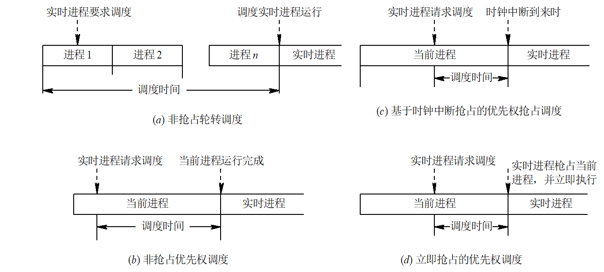

但是一般不会采用 算法 `a`而去采用`d`;

因为 `a`算法实时性差，实时系统一般不采用   
算法`d`不等待时钟到达，立即抢占，实时性较好

#### 一些常用的实时调度算法
1.最早截止时间优先（Earliest Deadline First，EDF） 算法
    - 特点-由任务的截止时间确定优先级，截止时间越早（急迫，优先级越高）
    - 在系统中保持着一个实时任务就绪队列，该队列按照各个任务截止时间的早晚排序
    - 调度程序在选择任务时，总是选择队列的**第一个**任务
    - EDF算法既可以用于**抢占式调度**也可以用于**非抢占式调度**

一般而言，非周期性任务使用非抢占性调度，周期性任务适用抢占式调度。

2. 低松弛度优先（Least Laxity First,LLF）算法
    - 该算法根据任务的紧急/松弛程度来确定优先级，任务越紧急优先级程度越高，主要是应用在**抢占式**调度中


一种特殊情况的说明，抢占式调度算法中，可能会出现的一种情况就是。**优先级反转**问题。

**优先级反转**:即高优先级的进程会被低优先的进程延迟或阻塞的情况

1. 形成原因
   1. 不同优先级的进程/线程通过共享临界资源进行交互（临界资源的抢占导致出现了礼让等现象）
   2. 高优先级的进程因为低优先占用了临界资源被阻塞，而没有优先执行

2， 解决办法（两个协议）
 1. 优先级继承协议（进程拿到临界资源后，权限提高至抢占资源的进程中最高级的进程一级）
 2. 优先级天花板协议（进程拿到临界资源后，权限提高至临界资源所能接收的最高优先级同级）

## 调度算法比较
各个调度算法特点比较如下表2-5

|项目|先来先服务|短作业优先|高响应比优先|时间片轮转|多级反馈队列|
|:---: | :---: |:---: |:---: | :---: |:---:|
|可抢占|       |  ✔  |   ✔  | ✔ | ✔|
|不可抢占|  ✔   |  ✔  |   ✔  | ✔ |  |
|优点|公平，实现简单，利于CPU繁忙型|平均等待时间最少|兼顾长短作业|兼顾长短作业|兼顾长短作业；有较好的响应时间；利于终端型作业和短批处理作业|
|缺点|不利于短作业；不利于I/O繁忙型|长作业可能会饥饿；估计时间不易确定；未考虑进程紧迫程度|计算响应比的开销比较大|平均等待时间较长；上下文切换时间开销大|   |
|适用于|    | 作业调度|    |分时系统|通用|
|能否用于作业调度|  ✔   |  ✔  |   ✔  |  |  |
|能否用于进程调度| ✔   |  ✔  |   ✔  | ✔   |  ✔  |


## 死锁

产生死锁的原因

竞争资源

- 可剥夺和非剥夺性资源 
- 竞争非剥夺性资源 
- 竞争临时性资源 

进程间推进顺序不当

进程间执行顺序不当的示例图如下图2-22所示

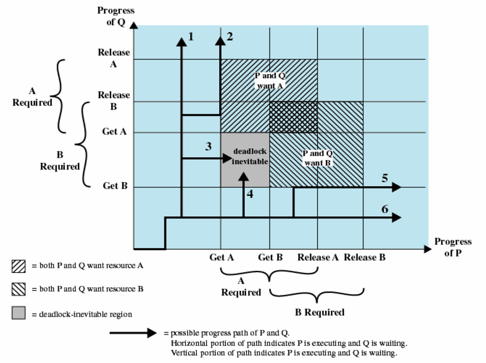

P和Q两个进程推进，当3和4线路时（P有资源A，Q有资源B）继续执行就会产生死锁。如果拿到临界就释放资源，不会导致死锁

前提P-->结论Q P是Q的充分条件，Q是P的必要条件

### 产生死锁的必要条件

1. 互斥条件
2. 请求和保持条件
3. 不剥夺（抢占）条件
4. 环路（循环）等待条件

1,2,3是必要非充分条件（死锁可以推出1,2,3条件），123可能导致不可解循环等待，**四个一起是死锁的充要条件**

### 处理死锁的基本方法

1. 预防死锁(破坏可能发生死锁的条件)
   - 摒弃“请求和保持”条件 
   - 摒弃“不剥夺”条件
   - 摒弃“环路等待”条件
2. 避免死锁
3. 检测死锁
4. 解除死锁

and信号量破坏了请求和保持条件，定义选项线性顺序是破坏了环路等待条件

**死锁预防，约束资源强求，防止任意条件发生**

**死锁避免，不破坏必要条件，允许存在，通过策略让系统不会到达死锁点**

---
#### 预防死锁

详细介绍预防死锁的三个方面的方法
- 破坏“请求与保持条件”
  1. 请求资源的进程不可持有不可抢占资源
  2. 通过以下两个协议实现
     1. 协议1：所有进程在开始运行之前，必须一次性地申请其在整个运行过程中所需要的全部资源。特征如下：
     2. 协议2：进程获得运行初期所需要的资源后，便可以立即开始运行
- 破坏“不可抢占”条件
  - 已经保持了某些不可被抢占资源的进程，提出新的资源请求而不能得到满足时，必须释放已经保持的所有资源，以后需要时再重新申请。特点是实现复杂，而且代价较大

- 破坏“循环等待条件”
1. 对系统所有资源类型进行线性排序，并赋予不同的符号
2. 进程必须按照序号递增顺序申请资源
3. 特点
   1. 资源序号的安排十分重要
   2. 比起其他策略，系统资源利用率和吞吐量有明显改善
   3. 存在的问题有以下两个
      1. 资源序号的相对稳定性导致新设备的增添受到资源序号的限制
      2. 由于作业使用资源的顺序和系统资源序号未必相同，可能会导致资源浪费

---
####  死锁避免

定义介绍：死锁避免是在资源的动态分配过程中，防止系统进入不安全状态，避免死锁发生的方法，它比预防死锁施加的限制条件更弱。

主要通过一种死锁避免算法来实现 --- **银行家算法**

在介绍银行家算法前要知道一个很重要的概念 **安全状态**


##### 安全状态

在避免死锁的方法中，允许进程动态地申请资源，但系统在进行资源分配之前，应先计算此次资源分配的安全性。若此次分配不会导致系统进入不安全状态，则将资源分配给进程； 否则，令进程等待。

所谓安全状态，是指系统能按某种进程顺序(P1, P2, …，Pn)(称〈P1, P2, …, Pn〉序列为安全序列)，来为每个进程Pi分配其所需资源，直至满足每个进程对资源的最大需求，使每个进程都可顺利地完成。如果系统无法找到这样一个安全序列，则称系统处于不安全状态。

按照资源的某种顺序，使得所有进程都能执行完毕，那么就是安全的

资源总量 - 所有分配出的资源 = 可以资源 （类似投资的概念，用可用资源换取更多可用资源）


特别的，再找安全状态的时候有以下几点需要注意
1. 如果系统无法找到一个安全序列，则称系统处于不安全状态
2. 只要处于安全状态，就不会发生死锁
3. 并不是所有的不安全状态都会导致系统进入死锁状态，但当系统进入不安全状态后，则有可能进入死锁状态。
4. 避免死锁的实质，是系统在进行资源分配时，设法使得系统不进入不安全状态。
5. 允许进程动态地申请资源，但是系统在进行资源分配之前，应该先计算此次资源分配的安全性。
6. 如果不按照安全序列分配资源，则系统可能会由安全状态进入不安全状态。

#### 银行家算法实例介绍

假定系统中有五个进程｛P0, P1, P2, P3, P4｝和三类资源｛A, B, C｝，各种资源的数量分别为10、5、7，在*T*0时刻的资源分配情况如表 2-6 所示。 

| 进程\资源情况(A B C) | Max   | Alloction | Need  | Available（这行从上到下时间顺序） |
| -------------------- | ----- | --------- | ----- | --------------------------------- |
| P0                   | 7 5 3 | 0 1 0     | 7 4 3 | 3 3 2                             |
|                      |       |           |       | 2 3 0                             |
| P1                   | 3 2 2 | 2 0 0     | 1 2 2 | 5 3 2(分配后获得分配和已分配)     |
|                      |       | 3 0 2     | 0 2 0 | 7 4 3(如果投给P0)                 |
| P2                   | 9 0 2 | 3 0 2     | 6 0 0 | 7 5 3                             |
| P3                   | 2 2 2 | 2 1 1     | 0 1 1 | 10 5 5                            |
| P4                   | 4 3 3 | 0 0 2     | 4 3 1 | 10 5 7                            |

全部序列安全

P1请求资源：P1发出请求向量Request1(1，0，2) <--(尝试满足，并检查安全状态，如果不满足安全必定死锁就不用分配)，系统按银行家算法进行检查：

1. Request1(1, 0, 2)≤Need1(1, 2, 2)
2. Request1(1, 0, 2)≤Available1(3, 3, 2)
3. 系统先假定可为P1分配资源，并修改Available, Allocation1和Need1向量，由此形成的资源变化情况如图 3-15 中的圆括号所示
4. 再利用安全性算法检查此时系统是否安全


### 死锁检测与解除

死锁检测算法如下图 2-23 所示

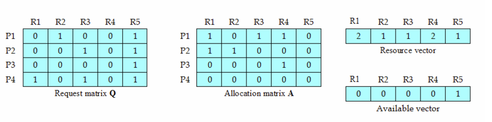


#### 资源分配图resource allocation graph

资源分配的mermaid图如下所示  

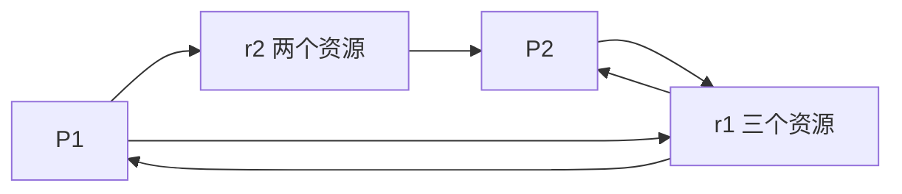

死锁定理
1. 利用简化资源分配图可以检测当前系统是否处于死锁状态
2. 简化资源分配图步骤如下
   1. 在资源分配图中找出一个既不阻塞也非独立的进程节点P
   2. 顺利情况下，$P_i$可获得所有所需的资源而继续运行，直至完全运行完毕
   3. 释放$p_i$占有的全部资源，相当于消去$p_i$的请求边与分配边，使之成为孤立的节点
   4. 循环上述操作，直至所有点成为孤立的点，如若所有点都可以成为孤立的点，那么则称该图完全简化，反之则成为不可完全简化。
   5. 特别的，不可完全简化的图，**系统可能会发生死锁**
---
#### 死锁解除

死锁解除的三种主要算法
1. 抢占资源
   1. 通过强行剥夺部分处于死锁状态的进程所占用的资源，并将资源分配给其他处于死锁状态的进程，使其资源需求得到满足，能够继续运行，从而解除死锁
2. 撤销/挂起/终止进程
   1. 终止所有死锁的进程（简单粗暴代价大）
   2. 逐个终止进程
      1. 每终止一个进程，都需要用死锁检查算法确定系统死锁是否被解除，没有则继续
      2. 难以度量需要付出的代价
3. 付出代价最小的死锁解除算法（实现代价很大，不具备可实现性）
    - 逐个估算解除死锁的代价，一一比较后，选最小的解除，如果依旧死锁，循环步骤
    - 比较与实现代价很大，几乎没有可实现性


#### 死锁处理的开销

不同阶段处理死锁的开销不同

按照系统开销对比：

死锁预防 < 死锁避免 < 死锁检测与解除

按照资源利用率比：

死锁预防 < 死锁避免 < 死锁检测与解除

结果显然表明，系统开销与资源利用率成正比


## 总结

进程执行控制模型：顺序，并行，并发

进程控制：PCB，状态-->状态转换图

进程同步互斥:star: 严格轮换，屏蔽中断，机器指令，软件，信号量，管程

- 信号量：整形信号量，记录型，AND，信号量集
- 利用信号实现同步与互斥
  - 生产者-消费者
    - 同步信号量/资源信号量=可用资源数目
    - 互斥信号量=1
  - 读写问题：读优先
  - 哲学家就餐问题：死锁

进程的通信：

- 高级通信（大量数据交换）
  - 共享存储器
    - 共享存储区
    - 共享数据结构
  - 消息传递
    - 直接消息传递
    - 间接消息传递
  - pipe
- 低级通信（同步，互斥）

进程的调度

1. FCFS
2. 优先级
3. SPN短作业优先（非抢）
4. SRN最短剩余时间优先，抢占式短进程(平均周转时间)[^3]
5. 时间片轮转
6. 高响应比优先HRRF（非抢）
7. 多级反馈队列

进程的死锁：必要条件，充要条件

- 预防：摒弃“请求和保持”条件，摒弃“不剥夺”条件 ，摒弃“环路等待”条件 
- 避免
  - 银行家，死锁避免算法
