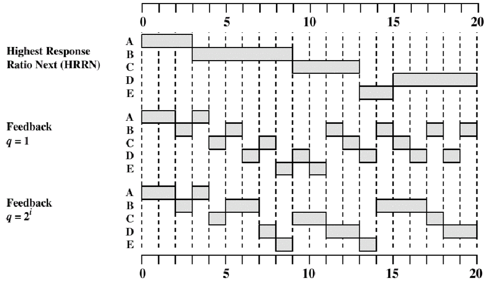
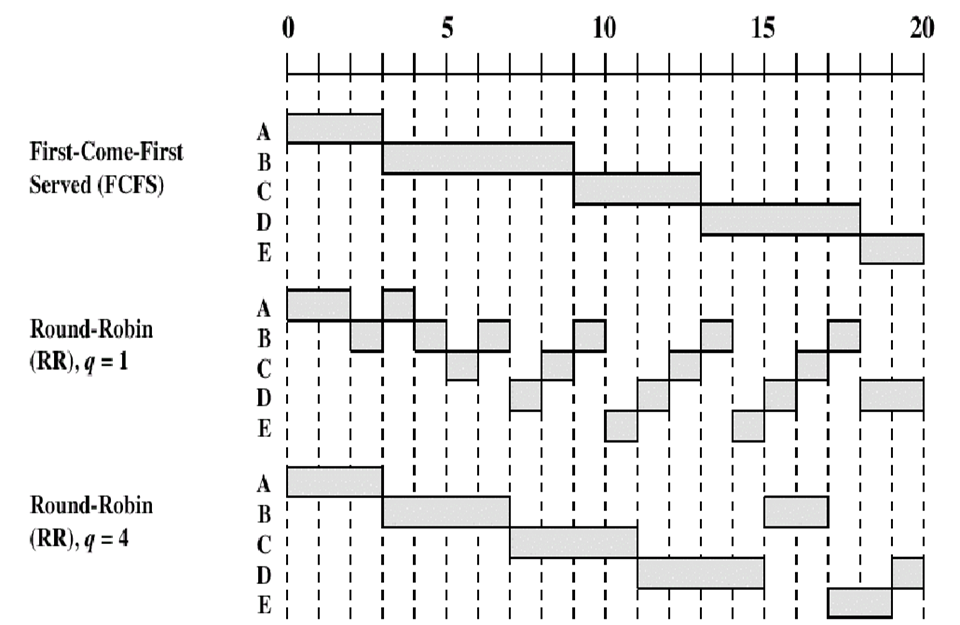
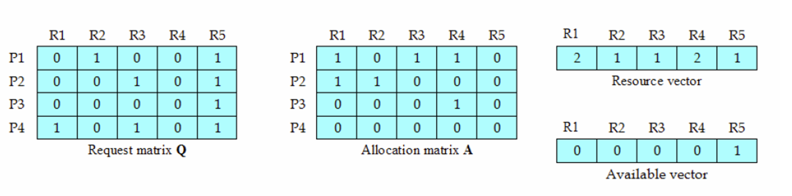

# Chapter3 进程调度

---

考点介绍
- 本章常考核的内容有调度算法、系统安全状态判断、利用银行家算法避免死锁、利用死锁定理检测死锁
- 本章内容考核的命题方式多样，从单选到综合应用均会出现

---

## 知识结构

本章的知识结构图如下mermaid图所示

---

## 进程调度的基本概念

调度的最小单位是线程，拥有资源的最小单位是进程

- 分配处理机的任务是由进程调度程序完成的
- 由于处理机是最重要的计算机资源，提高处理机的利用率及改善系统性能（吞吐量、响应时间），在很大程度上取决于进程调度性能的好坏

#### 三级调度系统

-长程调度
  - 用于决定把外存上处于后备队列中的哪些作业调入内存，并为它们创建进程、分配必要的资源，然后，再将新创建的进程排在就绪队列上，准备执行 
  - 通常也被称为作业调度（作业调度又被称为高级调度，也是主要研究的目标）

-中程调度 
  - 称为中级调度
  - 主要应用于内存调度或交换调度
  - 引入中程调度的主要目的，是为了提高内存利用率和系统吞吐量。 

-短程调度
  - 称为进程调度（低级调度）
  - 主要应用于进程或内核级线程
  - 用来决定就绪队列中的哪个进程应获得处理机，然 后再由分派程序把处理机分配给该进程的具体操作

#### 三级调度比较
1. 执行效率：高级调度（作业调度）< 中级调度 < 低级调度
2. 低级调度是各类操作系统必备的功能
3. 多道批处理系统：既有高级调度（作业调度），又有低级调度（进程调度），也可以采用中级调用
4. 分时系统或具有虚拟存储器的操作系统中，为提高内存利用率和作业吞吐量，一般没有高级调度，只有低级调度，并引入中级调度

调度在状态中的位置如下图 2-15

调度在队列中的位置如下图 2-16

---

## 调度算法的目标

调度的目标：
1. 尽可能的使CPU利用率高。

$CPU利用率 = CPU有效工作时间\div(CPU有效工作时间+CPU空闲工作时间)$

2. 公平性：使得所有进程根据其特征获得合理的CPU时间
3. 平衡性：根据内存各进程的特点，合理调度，使得系统**所有**资源处于尽可能的忙的状态。
4. 策略执行性强：哪怕影响效率，所有策略也要在需要时立即执行

共有以下两大调度算法的准则

### 面向用户的准则
- 周转时间

  - 从作业被提交给系统开始，到作业完成为止的这段时间间隔（称为作业周转时间）

  - 包括
    - 作业在外存后备队列上等待调度的时间

    -  进程在就绪队列上等待进程调度的时间

    -  进程在CPU上执行的时间

    - 进程等待I／O操作完成的时间

- 响应时间

  - 从用户通过键盘提交一个请求开始，直至系统首次产生响应为止的时间

  - 响应时间包括三部分时间：

    1. 从键盘输入的请求信息传送到处理机的时间

    2. 处理机对请求信息进行处理的时间

    3. 将所形成的响应信息回送到终端显示器的时间

- 截止时间：某任务必须开始执行的最迟时间，或必须完成的最迟时间

- 公平性：各进程在系统中都能平等的得到运行

- 优先权：让某些紧急的作业能得到及时处理

### 面向系统的准则

- 系统吞吐量高
- 处理机利用率好
- 各类资源的平衡利用

进程调度可采用下述两种调度方式

- 非剥夺（抢占）方式（Non-preemptive）

   在采用这种调度方式时，一旦把处理机分配给某进程后，便让该进程一直执行，直至该**进程完成**或发生某事件而被**阻塞**时，才再把处理机分配给其他进程，决不允许某进程抢占已经分配出去的处理机

- 剥夺（抢占）方式（Preemptive）

   允许调度程序根据某种原则，去暂停某个正在执行的进程，将已分配给该进程的处理机重新分配给另一进程

剥夺的原则：

- 优先权原则
- 短作业（进程）优先原则
- 时间片原则

### 根据以上准则，不同系统处理的目标
1. 批处理系统的目标
   1. 平均周转时间短
      1. 作业希望自己的周转时间最短
      2. 操作系统希望所有作业的平均周转时间最短
      3. 平均周转时间指所有作业需要的周转时间的平均值
   2. 系统吞吐量高
      - 吞吐量：单位时间内系统所完成的作业数
      - 吞吐量和批处理作业的平均长度以及调度算法有关
   3. 处理机利用率高
      - 处理机利用率是衡量系统性能的重要指标
      - 调度方式和算法对处理机利用率具有重要影响 
2. 分时系统的目标
   1. 响应时间快
      1. 请求时间: 从键盘输入请求信息到处理机接收到请求信息的时间
      2. 出来时间：处理机处理请求信息的时间
      3. 回送时间：响应信息传送至显示器的时间
   2. 均衡性
      - 系统响应时间的快慢与用户所请求服务的复杂性相关，即用户允许对复杂任务的响应事件较长，对简单任务的响应事件较短

 响应时间快是分时操作系统中调度算法的主要准则

 3. 实时系统的目标
    1. 截止时间的保证
       1. 硬实时周期任务（HRT）：调度方式和调度算法必须确保其对截止时间的要求
       2. 软实时非周期任务（SRT）：调度方法和调度算法应基本保证其对截止时间的要求。
       3. 截止时间：即某任务必须开始执行的最迟时间，或必须完成的最迟时间
    2. 可预测性
       - 可预测性目标是指连续性的保障。例如视频流中的第i帧数 与 第i+1 帧数之间具有连续性

---
### 作业调度
作业：用户提交给操作系统的一个独立任务

作业步：每个作业必须经过若干相对独立、相互关联的加工步骤才能得到结果，其中每个加工步骤称为作业步。（例如一个作业可以分为，编译，链接，装入和运行4个作业步，上一个作业步的输出往往作为下一个作业步的输入）

作业控制块（JCB）：指为管理和调度作业的控制块  
包含以下信息
- 作业标识
- 用户名称
- 用户账户
- 作业类型：CPU繁忙型，I\O繁忙型，批量型，终端型等
- 作业状态
- 调度信息：优先级，作业运行时间
- 资源需求：预计运行时间、要求内存大小
- 资源使用情况

JCB的作用，三个阶段
- 作业进入系统时，有作业注册为其建立JCB，插入作业队列后，并等待作业调度程序调度其进入内存
- 作业运行期间，系统按照JCB的信息和作业说明书对作业进行控制和管理
- 作业运行结束，系统回收资源，撤销JCB

批处理系统中，作业与进程的关系
- 作业是进程的任务实体，进程是作业的执行实体
- 没有作业进程将无事可做，没有进程则作业将无法完成
- 作业多用于批处理操作系统，进程则多用于多道程序设计。
### 调度算法介绍（作业调度算法）

4类调度算法（:star:）

- FCFS (First-Come-First-Served) 先来先服务（也有FIFO的缩写）

- SJF (Shortest job First, SJF) 短作业优先 

- PSA (Priority Scheduling Algorithm) 优先权调度算法

- HRRN (Highest Response Ratio Priority Scheduling Algorithm) 高响应比优先调度算法
  - 计算公式
$优先权R_q = （等待时间+要求服务时间)\div要求服务时间$
$优先权R_q =  1+ 等待时间\div要求服务时间$
$优先权R_q =  响应时间\div要求服务时间$

#### 调度算法介绍（进程调度算法）

- FCFS (First-Come-First-Served) 先来先服务（也有FIFO的缩写）

- SPN (Shortest Process Next, STN) 短进程优先 非抢占式

- SRT (Shortest Remaining Time) 最短剩余时间优先(抢占式短作业优先)

- HRRN (Highest Response Ratio Priority Scheduling Algorithm) 高响应比优先调度算法

- RR （Round-Robin）时间片轮转 抢占式

- 多级反馈队列调度算法（优先级队列调度，属于优先级调度算法）

---

各个进程调度算法图解介绍

FCFS ，先来先服务算法示例如下表2-4所示

|             | A    | B    | C    | D    | E    |      |
| ----------- | ---- | ---- | ---- | ---- | ---- | ---- |
| 到达时间    | 0    | 2    | 4    | 6    | 8    |      |
| 服务时间    | 3    | 6    | 4    | 5    | 2    |      |
| FCFS        |      |      |      |      |      | 平均 |
| 完成时间    | 3    | 9    | 13   | 18   | 20   |      |
| 周转时间T_r | 3    | 7    | 9    | 12   | 12   | 8.6  |
| T_r/T_s     | 1.00 | 1.17 | 2.25 | 2.40 | 6    | 2.56 |

短进程优先的两种算法模式（抢占式与非抢占式）如下图 2 - 17所示

其中短进程优先为非抢占式，最短剩余时间优先为抢占式

高响应比优先的算法模式如下图 2-18 所示

特别注意的是：
- 高响应比优先，非抢占式算法分配后直到运行完都不会有其他进程
$$
高响应比=\frac{等待时间+要求服务时间}{要求服务时间}=1+\frac{W}{S}
$$

时间片轮转调度算法算法如下图 2-19 所示

多级反馈队列调度算法如下图 2-20 所示

中心思想：对其他调度算法的折中权衡

算法规则：
1. 设置多级就绪队列，各级队列优先级从高到低，时间片从小到大
2. 新进程到达时先进入第1级队列，按FCFS原则排队等待被分配时间片，若用完时间片进程还未结束，则进程进入下一级队列队尾。如果此时已经是在最下级的队列，则重新放回该队列队尾
3. 只有第k级队列为空时，才会为k+1级队头的进程分配时间片

算法流程：
1. feedback q=1 每个进程分配一个时间片，每次运行下降一级，从最上层往下调度
2. A RQ0,RQ1到RQ2 
3. B到达RQ0，就行到RQ1 此时队组里面只有A，调度A A结束
4. C达到RQ0，下到RQ1 队中只有B，调度B
5. D达到RQ0....
6. feedback q=2^i 各级队列的时间片按指数式增长

用于进程调度

抢占式的算法。在k级队列的进程运行过程中，若更上级的队
`(1~k-1级)`中进入了一个新进程，则由于新进程处于优先级更高的队列中，因此新进程会抢占处理机，原来运行的进程放回k级队列队尾。

优点：
- 对各类型进程相对公平(FCFS的优点) ;
- 每个新到达的进程都可以很快就得到响应(RR的优点) ;
- 短进程只用较少的时间就可完成(SPF的优点) :
- 不必实现估计进程的运行时间(避免用户作假) ;
- 可灵活地调整对各类进程的偏好程度，比如CPU密集型进程、I/O密集型进程(拓展:可以将因I/O而阻塞的进程重新放回原队列，这样I/O型进程就可以保持较高优先级)

缺点：会导致饥饿  

### 实时调度系统  

实时调度系统中主要包含着两类任务
- 硬实时任务：必须使任务在确定的时间内完成，即必须确保任务对截止时间的要求
- 软实时任务：保证绝大多数任务在确定时间内完成，即基本能保证任务对截止时间的要求

针对这两类任务，实时系统采用了基于优先级的调度方法进行调度

分为两大类

1. 非抢占式优先权算法

   - 一旦将处理机分配给某个进程，则让它一直运行直到结束。下次启动调度程序时选择优先权最高的进程

2. 抢占式优先权调度算法

   - 可以很快地抢占CPU资源

常用的实时调度算法思想

但是一般不会采用 算法 `a`而去采用`d`;

因为 `a`算法实时性差，实时系统一般不采用   
算法`d`不等待时钟到达，立即抢占，实时性较好

#### 一些常用的实时调度算法
1.最早截止时间优先（Earliest Deadline First，EDF） 算法
    - 特点-由任务的截止时间确定优先级，截止时间越早（急迫，优先级越高）
    - 在系统中保持着一个实时任务就绪队列，该队列按照各个任务截止时间的早晚排序
    - 调度程序在选择任务时，总是选择队列的**第一个**任务
    - EDF算法既可以用于**抢占式调度**也可以用于**非抢占式调度**

一般而言，非周期性任务使用非抢占性调度，周期性任务适用抢占式调度。

2. 低松弛度优先（Least Laxity First,LLF）算法
    - 该算法根据任务的紧急/松弛程度来确定优先级，任务越紧急优先级程度越高，主要是应用在**抢占式**调度中

一种特殊情况的说明，抢占式调度算法中，可能会出现的一种情况就是。**优先级反转**问题。

**优先级反转**:即高优先级的进程会被低优先的进程延迟或阻塞的情况

1. 形成原因
   1. 不同优先级的进程/线程通过共享临界资源进行交互（临界资源的抢占导致出现了礼让等现象）
   2. 高优先级的进程因为低优先占用了临界资源被阻塞，而没有优先执行

2， 解决办法（两个协议）
 1. 优先级继承协议（进程拿到临界资源后，权限提高至抢占资源的进程中最高级的进程一级）
 2. 优先级天花板协议（进程拿到临界资源后，权限提高至临界资源所能接收的最高优先级同级）

## 调度算法比较
各个调度算法特点比较如下表2-5

|项目|先来先服务|短作业优先|高响应比优先|时间片轮转|多级反馈队列|
|:---: | :---: |:---: |:---: | :---: |:---:|
|可抢占|       |  ✔  |   ✔  | ✔ | ✔|
|不可抢占|  ✔   |  ✔  |   ✔  | ✔ |  |
|优点|公平，实现简单，利于CPU繁忙型|平均等待时间最少|兼顾长短作业|兼顾长短作业|兼顾长短作业；有较好的响应时间；利于终端型作业和短批处理作业|
|缺点|不利于短作业；不利于I/O繁忙型|长作业可能会饥饿；估计时间不易确定；未考虑进程紧迫程度|计算响应比的开销比较大|平均等待时间较长；上下文切换时间开销大|   |
|适用于|    | 作业调度|    |分时系统|通用|
|能否用于作业调度|  ✔   |  ✔  |   ✔  |  |  |
|能否用于进程调度| ✔   |  ✔  |   ✔  | ✔   |  ✔  |

## 死锁

产生死锁的原因

竞争资源

- 可剥夺和非剥夺性资源 
- 竞争非剥夺性资源 
- 竞争临时性资源 

进程间推进顺序不当

进程间执行顺序不当的示例图如下图2-22所示

P和Q两个进程推进，当3和4线路时（P有资源A，Q有资源B）继续执行就会产生死锁。如果拿到临界就释放资源，不会导致死锁

前提P-->结论Q P是Q的充分条件，Q是P的必要条件

### 产生死锁的必要条件

1. 互斥条件
2. 请求和保持条件
3. 不剥夺（抢占）条件
4. 环路（循环）等待条件

1,2,3是必要非充分条件（死锁可以推出1,2,3条件），123可能导致不可解循环等待，**四个一起是死锁的充要条件**

### 处理死锁的基本方法

1. 预防死锁(破坏可能发生死锁的条件)
   - 摒弃“请求和保持”条件 
   - 摒弃“不剥夺”条件
   - 摒弃“环路等待”条件
2. 避免死锁
3. 检测死锁
4. 解除死锁

and信号量破坏了请求和保持条件，定义选项线性顺序是破坏了环路等待条件

**死锁预防，约束资源强求，防止任意条件发生**

**死锁避免，不破坏必要条件，允许存在，通过策略让系统不会到达死锁点**

---
#### 预防死锁

详细介绍预防死锁的三个方面的方法
- 破坏“请求与保持条件”
  1. 请求资源的进程不可持有不可抢占资源
  2. 通过以下两个协议实现
     1. 协议1：所有进程在开始运行之前，必须一次性地申请其在整个运行过程中所需要的全部资源。特征如下：
     2. 协议2：进程获得运行初期所需要的资源后，便可以立即开始运行
- 破坏“不可抢占”条件
  - 已经保持了某些不可被抢占资源的进程，提出新的资源请求而不能得到满足时，必须释放已经保持的所有资源，以后需要时再重新申请。特点是实现复杂，而且代价较大

- 破坏“循环等待条件”
1. 对系统所有资源类型进行线性排序，并赋予不同的符号
2. 进程必须按照序号递增顺序申请资源
3. 特点
   1. 资源序号的安排十分重要
   2. 比起其他策略，系统资源利用率和吞吐量有明显改善
   3. 存在的问题有以下两个
      1. 资源序号的相对稳定性导致新设备的增添受到资源序号的限制
      2. 由于作业使用资源的顺序和系统资源序号未必相同，可能会导致资源浪费

---
####  死锁避免

定义介绍：死锁避免是在资源的动态分配过程中，防止系统进入不安全状态，避免死锁发生的方法，它比预防死锁施加的限制条件更弱。

主要通过一种死锁避免算法来实现 --- **银行家算法**

在介绍银行家算法前要知道一个很重要的概念 **安全状态**

##### 安全状态

在避免死锁的方法中，允许进程动态地申请资源，但系统在进行资源分配之前，应先计算此次资源分配的安全性。若此次分配不会导致系统进入不安全状态，则将资源分配给进程； 否则，令进程等待。

所谓安全状态，是指系统能按某种进程顺序(P1, P2, …，Pn)(称〈P1, P2, …, Pn〉序列为安全序列)，来为每个进程Pi分配其所需资源，直至满足每个进程对资源的最大需求，使每个进程都可顺利地完成。如果系统无法找到这样一个安全序列，则称系统处于不安全状态。

按照资源的某种顺序，使得所有进程都能执行完毕，那么就是安全的

资源总量 - 所有分配出的资源 = 可以资源 （类似投资的概念，用可用资源换取更多可用资源）

特别的，再找安全状态的时候有以下几点需要注意
1. 如果系统无法找到一个安全序列，则称系统处于不安全状态
2. 只要处于安全状态，就不会发生死锁
3. 并不是所有的不安全状态都会导致系统进入死锁状态，但当系统进入不安全状态后，则有可能进入死锁状态。
4. 避免死锁的实质，是系统在进行资源分配时，设法使得系统不进入不安全状态。
5. 允许进程动态地申请资源，但是系统在进行资源分配之前，应该先计算此次资源分配的安全性。
6. 如果不按照安全序列分配资源，则系统可能会由安全状态进入不安全状态。

#### 银行家算法实例介绍

假定系统中有五个进程｛P0, P1, P2, P3, P4｝和三类资源｛A, B, C｝，各种资源的数量分别为10、5、7，在*T*0时刻的资源分配情况如表 2-6 所示。 

| 进程\资源情况(A B C) | Max   | Alloction | Need  | Available（这行从上到下时间顺序） |
| -------------------- | ----- | --------- | ----- | --------------------------------- |
| P0                   | 7 5 3 | 0 1 0     | 7 4 3 | 3 3 2                             |
|                      |       |           |       | 2 3 0                             |
| P1                   | 3 2 2 | 2 0 0     | 1 2 2 | 5 3 2(分配后获得分配和已分配)     |
|                      |       | 3 0 2     | 0 2 0 | 7 4 3(如果投给P0)                 |
| P2                   | 9 0 2 | 3 0 2     | 6 0 0 | 7 5 3                             |
| P3                   | 2 2 2 | 2 1 1     | 0 1 1 | 10 5 5                            |
| P4                   | 4 3 3 | 0 0 2     | 4 3 1 | 10 5 7                            |

全部序列安全

P1请求资源：P1发出请求向量Request1(1，0，2) <--(尝试满足，并检查安全状态，如果不满足安全必定死锁就不用分配)，系统按银行家算法进行检查：

1. Request1(1, 0, 2)≤Need1(1, 2, 2)
2. Request1(1, 0, 2)≤Available1(3, 3, 2)
3. 系统先假定可为P1分配资源，并修改Available, Allocation1和Need1向量，由此形成的资源变化情况如图 3-15 中的圆括号所示
4. 再利用安全性算法检查此时系统是否安全

### 死锁检测与解除

死锁检测算法如下图 2-23 所示

#### 资源分配图resource allocation graph

资源分配的mermaid图如下所示  

死锁定理
1. 利用简化资源分配图可以检测当前系统是否处于死锁状态
2. 简化资源分配图步骤如下
   1. 在资源分配图中找出一个既不阻塞也非独立的进程节点P
   2. 顺利情况下，$P_i$可获得所有所需的资源而继续运行，直至完全运行完毕
   3. 释放$p_i$占有的全部资源，相当于消去$p_i$的请求边与分配边，使之成为孤立的节点
   4. 循环上述操作，直至所有点成为孤立的点，如若所有点都可以成为孤立的点，那么则称该图完全简化，反之则成为不可完全简化。
   5. 特别的，不可完全简化的图，**系统可能会发生死锁**
---
#### 死锁解除

死锁解除的三种主要算法
1. 抢占资源
   1. 通过强行剥夺部分处于死锁状态的进程所占用的资源，并将资源分配给其他处于死锁状态的进程，使其资源需求得到满足，能够继续运行，从而解除死锁
2. 撤销/挂起/终止进程
   1. 终止所有死锁的进程（简单粗暴代价大）
   2. 逐个终止进程
      1. 每终止一个进程，都需要用死锁检查算法确定系统死锁是否被解除，没有则继续
      2. 难以度量需要付出的代价
3. 付出代价最小的死锁解除算法（实现代价很大，不具备可实现性）
    - 逐个估算解除死锁的代价，一一比较后，选最小的解除，如果依旧死锁，循环步骤
    - 比较与实现代价很大，几乎没有可实现性

#### 死锁处理的开销

不同阶段处理死锁的开销不同

按照系统开销对比：

死锁预防 < 死锁避免 < 死锁检测与解除

按照资源利用率比：

死锁预防 < 死锁避免 < 死锁检测与解除

结果显然表明，系统开销与资源利用率成正比

## 总结

进程执行控制模型：顺序，并行，并发

进程控制：PCB，状态-->状态转换图

进程同步互斥:star: 严格轮换，屏蔽中断，机器指令，软件，信号量，管程

- 信号量：整形信号量，记录型，AND，信号量集
- 利用信号实现同步与互斥
  - 生产者-消费者
    - 同步信号量/资源信号量=可用资源数目
    - 互斥信号量=1
  - 读写问题：读优先
  - 哲学家就餐问题：死锁

进程的通信：

- 高级通信（大量数据交换）
  - 共享存储器
    - 共享存储区
    - 共享数据结构
  - 消息传递
    - 直接消息传递
    - 间接消息传递
  - pipe
- 低级通信（同步，互斥）

进程的调度

1. FCFS
2. 优先级
3. SPN短作业优先（非抢）
4. SRN最短剩余时间优先，抢占式短进程(平均周转时间)[^3]
5. 时间片轮转
6. 高响应比优先HRRF（非抢）
7. 多级反馈队列

进程的死锁：必要条件，充要条件

- 预防：摒弃“请求和保持”条件，摒弃“不剥夺”条件 ，摒弃“环路等待”条件 
- 避免
  - 银行家，死锁避免算法