# 存储管理

**注意考点**
1. 请求页式虚拟存储器管理的考核
2. 虚拟存储-内存管理-Cache-地址映射的综合考核
3. 本章内容会与“计算机组成原理”的相关章节联合命题

## 存储器层次结构

冯诺依曼结构约定，程序和数据在**内存执行。** 但是由于内存容量有限且有易失性，无法长久保存信息。因此，还有许多是存储在外存中的，在计算机执行程序期间，几乎**每一条**指令都涉及了对内存或外存的访问情况。

存储器结构
1. 可执行存储器
   1. 寄存器位于CPU内部，与处理机速度相同，能与CPU协调工作
      1. 按名称访问
      2. 编程可使用的寄存器个数有限
   2. 内存又称主存，是计算机系统的主要部件。主机的构成部分。是离CPU最近的一部分，主要用于保存进程运行时的程序和数据。内存的主要特征为：
      1. 按地址访问
      2. 容量相对较大，但是仍然满足不了用户以及应用的需求
      3. 访问速度和CPU不匹配
2. Cache(高速缓冲存储器)
   1. 介于内存与寄存器/CPU之间，主要用于备份主存中较常使用的程序和数据。Cache的主要特征如下
      1. 速度较快，用于缓解CPU与内存之间的速度矛盾
      2. 存储单元数远大于寄存器个数，但比内存单元数少
      3. Cache与内存之间以**字作为单位数据交换**，与内存之间以**块为单位**交换数据
      4. 通过硬件电路完成地质转换
3. 磁盘缓存
   1. 磁盘缓存是主存中的部分存储空间，将暂时存放在磁盘中读出（或写入）的信息，以减少访问磁盘的次数。它可以缓解磁盘与内存之间的速度矛盾
4. 外存（辅存）
   1. 外存是大容量辅助存储器，用于长久保存数据。它的缺点是速度慢....

---
## 程序的装入与连接

用户源程序编程一个可在内存中的程序，通常要经过3步

1. 编译：由编译程序(Compiler)将用户源代码编译成若干个目标模块
   1. 词法分析(检查关键字等)
   2. 语法分析
   3. 语义分析
   4. 中间代码
   5. 目标代码
2. 链接：有链接程序(linker)将编译后形成的一组目标模块，以及所需要的库函数链接在一起，形成一个完整的装入模块
3. 装入：由装入程序(loader)将装入模块装入**内存**，共有三种装入模式
   1. 绝对装入模式
   2. 重定位装入模式
   3. 运行时装入模式

链接与装入的过程图如下图 3-1 所示

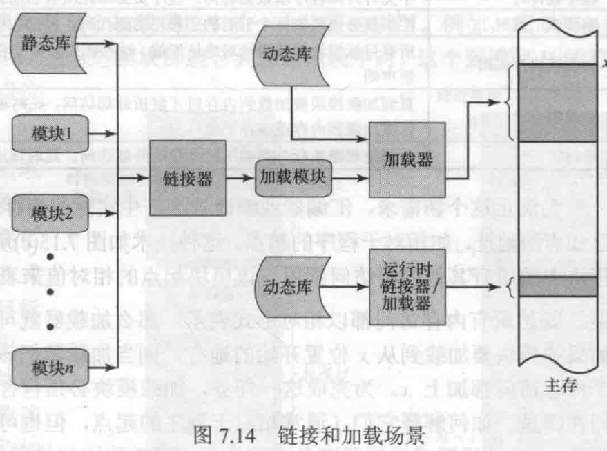

### 装入

装入方式：绝对装入方式、可重定位装入方式、运行时装入方式。

#### 绝对装入方式

- 如果**编译时**知道程序将驻留在**内存**的什么位置，那么，**编译程序**将产生绝对地址的目标代码，如BIOS和底层驱动等
- **绝对装入程序**按照装入模块中的地址，将程序和数据装入内存。装入模块被装入内存后，由于程序中的**逻辑地址与实际内存地址完全相同，故不需对程序和数据的地址进行修改**
- 为了便于程序的修改,对编译的程序采用符号地址，然后在编译或汇编时，再将这些符号地址转换为绝对地址
- 绝对装入方式**仅**适用于系统很小、单道程序环境。

#### 可重定位装入
  
- 在多道程序环境下，编译程序无法预知所编译的目标模块放在内存中的具体位置。所以目标模块的起始地址通常是从0开始的，程序中的其它地址也都是相对于起始地址计算的
- 装入时，根据内存的当前情况，将待装入模块装入到内存的适当位置。地址变换在装入时一次完成，以后不再改变，故又称为静态重定位。

特别注意：**运行时，程序在内存中的位置无法移动**

假设：有程序A 0~1FFH，大小 200H。memory中装入起始地址300H。程序中有一条请求2FFH的请求，就会变成5FFH。

 采用静态重定位方法将程序装入内存,称为可重定位装入方式

 静态重定位装入过程示意图如下图 3-2 所示

 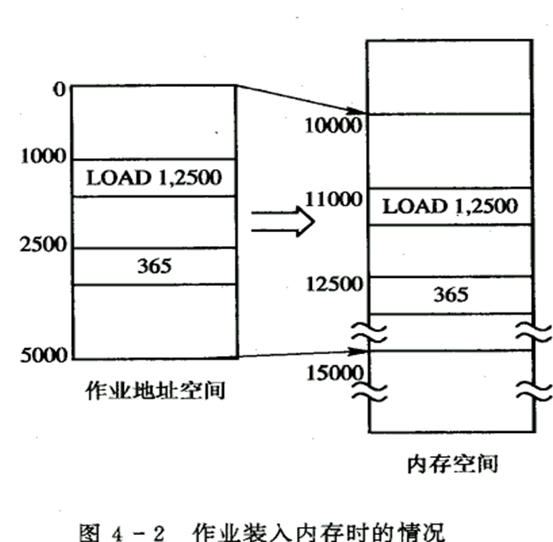

 #### 运行时装入

装入程序将目标模块装入内存后，并不立即把装入模块中的相对地址转换为绝对地址，而是把这种**地址转换推迟到程序执行时进行**，在硬件地址变换机构的支持下（由一个重定位寄存器辅助地址实现），随着对**每条指令或数据的访问自动进行地址变换，故称为动态重定位**

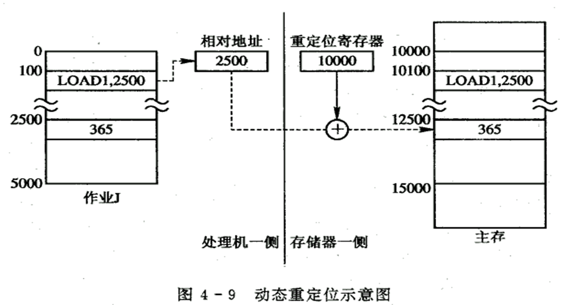

---
### 链接

源程序经过编译后，可得到一组目标模块，再利用链接程序将这组目标模块链接形成装入模块。链接器的功能是把一组目标模块作为输入，产生一个包含完整程序和数据模块的加载模块

根据链接时间的不同，有三种分类
1. 静态链接
2. 装入时动态链接
3. 运行时动态链接

链接的过程如下图 3-4 所示

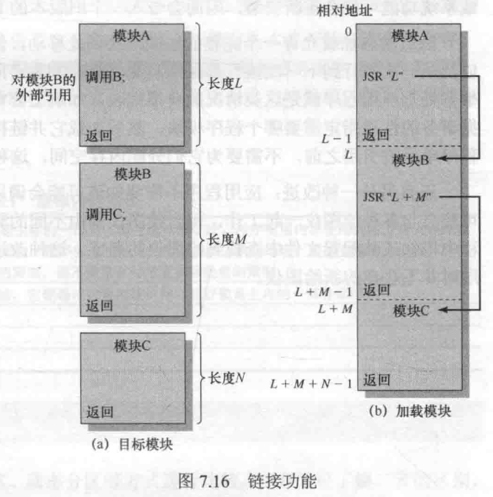

---
#### 静态链接

静态链接是指：在程序运行之前，将从0地址开始的若干目标模块以及所需的库函数，链接为完整的，从唯一0地址开始的装配模块。

使用静态链接需要解决以下问题：
    - 相对地址的修改和外部调用符号的变换

#### 装入时动态链接

装入时动态链接指：将用户源程序编译后得到的一组目标模块，采用边装入内存边链接的方式

优点：
- 便于修改和更新
- 便于实现对目标模块的共享
  - 如果采取静态链接，每个模块必须含有目标模块的拷贝
  
#### 运行时动态链接

运行时动态链接指程序执行过程中需要目标模块时，才对其进行链接。

优点：
- 未被用到的目标模块，都不会被调入内存和被链接到装入模块上，这样不仅可加快程序的装入过程，而且可节省大量的内存空间

---

## 连续分配

连续分配：即为用户程序分配连续的内存空间，即用户程序中逻辑连续的位置，在物理存储空间中也相邻。

---
### 连续分配方式

连续分配方式一共有3种
1. 单一连续分配
2. 固定分区分配
3. 动态分区分配

#### 单一连续分配

单一连续分区是早期单用户单任务操作系统的存储管理模式，特征如下
1. 把内存分为系统区和用户区两部分
2. 系统区仅提供给OS使用，通常是放在内存的低址部分
3. 用户区是指除系统区以外的全部内存空间，提供给用户使用
4. 只能用于单用户、单任务的操作系统
5. 基本没有采取存储保护措施，原因如下
   1. 节省硬件
   2. 单用户环境，不会出现不同用户之间的干扰问题
   3. 操作系统被破坏后，仅影响当前用户，且操作系统可以通过重启重新进入内存运行
6. 可以采用覆盖技术

单一连续分配还配置了存储器保护机构，用于防止用户程序对操作系统的破坏

#### 固定分区分配

固定分区是多道程序系统初期的存储管理模式，是最早、最简单的可运行多道程序的分区式存储管理方式。

固定分区分配的特征如下
1. 将用户空间划分为若干个固定大小的区域，在每个分区中只装入一道作业。
2. 多个分区的多道作业并发执行
3. 有空闲分区时，可以从外存后备作业队列中选择一个适当大小的作业装入该分区中

划分分区的方法及其特点：
- 分区大小相等划分：
  - 当程序太小时，会造成内存空间的浪费。当程序太大时，**一个分区有不足以装入程序，使该程序无法运行**
  - 缺乏灵活性
  - 所有内存分区存储空间大小相等
  - 适用于一台计算机控制多个相同对象的场合
- 分区大小不等划分：
  - 把内存划含有多个较小的分区、适量的中等分区及少量的大分区
  - 根据程序大小灵活选择合适的分区，提高存储利用率
  - 存储分配灵活  
实现：通常将分区按大小进行排队，并为之建立一张**分区使用表**

分区使用表样例用图 3-5 如下所示

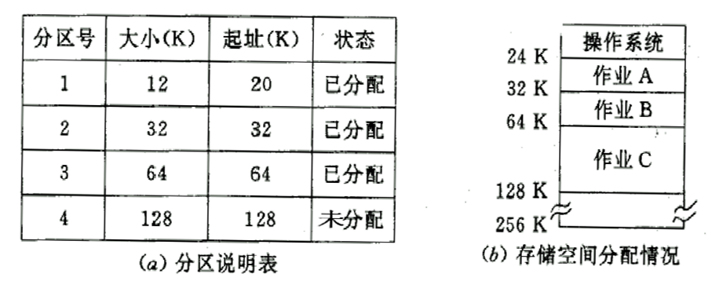

根据上图，固定分区的分配方法为：
    1. 有用户程序想要装入时，检索分区使用表，若有能够满足用户程序大小且尚未分配的分区，则用户程序装入满足条件的分区
    2. 分区使用表中该分区状态改为已分配
    3. 若找不到满足条件的分区，则拒绝为用户分配内存

因为一个分区只装一个进程，在某些情况会产生内零头。
- 内零头：分区内无法利用的空的空间

同时也因为不是每个分区都能有与之匹配的进程，与之相对的，还有外零头碎片的产生
- 外零头：指若干不可利用的小分区 

空闲分区链表样例用图 如 图 3-6 如下所示

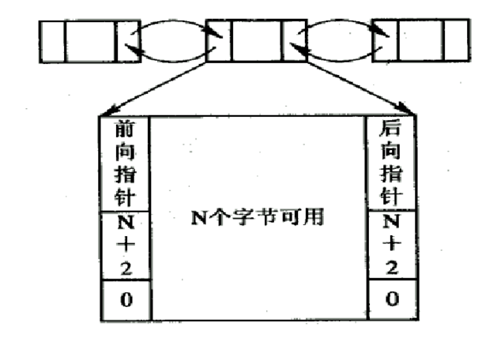

综上，固定分区的最大问题就是，由于每个分区的大小固定，必然要造成要么分区内的存储空间浪费产生内零头，要么程序无法装入，产生外零头。

##### 适配方法（固定分区划分）

- 最佳适配：空闲空间与要求的最接近的分区块
  - 优缺点
    - 为大作业分配大的内存空间创造了条件
    - 每次分配后所切割下来的剩余部分总是最小的，在存储器中会留下许多难以利用的小空闲区。会剩下很多的外零头
- 最差适配：空闲空间与请求空间最不接近的分区块
- 首次适配（首次适应算法FF）：从头到尾找一个适合的（只要能装下）
  - 为大作业分配大的内存空间创造了条件
  - 低址部分不断被划分，会留下许多难以利用的、很小的空闲分区
- 下次适配（循环匹配，循环首次适配算法）：接着上次的位置往后找

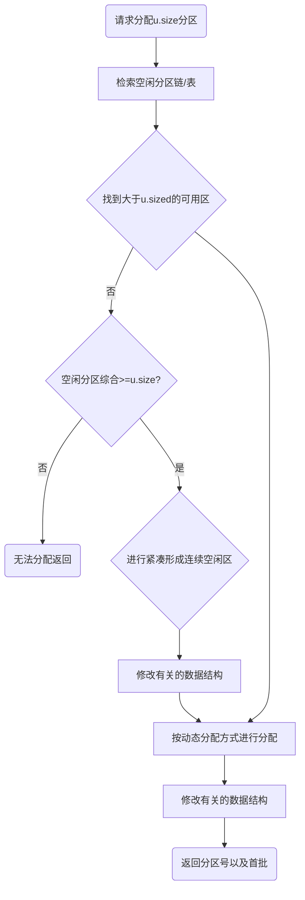

##### 分区回收

当进程运行完毕释放内存时，需**合并**相邻的空闲分区，形成大的分区，称为合并技术

系统根据回收区的首址，从空闲区链中找到相应的插入点

---

#### 动态分区分配

动态分区又称为可变分区存储管理，是根据进程实际需要，动态分配内存空间的分区式存储管理方式。

特征
1. 当作业需要装入内存时，把用户可用空闲内存区域划分出一个作业大小的连续分区分配给作业，并将该区域设置为已分配
2. 分区大小和个数由装入作业时的系统情况而确定

特别的，与固定分区类似，动态分区分配仍然采用空闲分区表/链，作为检索工具。数据结构如图 3-5/ 3-6 所示

##### 动态分区分配算法

动态分区分配一共有8种算法，如下所示
1. 首次适应算法
2. 循环首次适应算法
3. **最佳适应算法**
4. 最差适应算法
5. 快速适应算法
6. 伙伴算法
7. 哈希算法
8. **动态可重定位分区算法**

算法描述接下来分点介绍

----
##### 首次适应算法
1. 算法描述
   1. 空闲分区表按地址递增顺序排列
   2. 分配内存时，从表首开始顺序查找，知道找出一个大小能够满足要求的空闲分区
   3. 按照作业的大小，从满足条件的分区中划出一块内存空间分配给请求作业，余下部分仍留在空闲分区表中（修改相应表项内容）
   4. 若不存在满足要求的分区，则分配失败

2. 优点
   1. 优先利用内存低端地址部分的存储空间，保留高端地址部分的大片连续空闲区域
   2. 方便为大作业分诶存储空间

3. 缺点
   1. 低端地址会被不断划分，产生的小碎片（内存碎片、零头）可能无法利用
   2. 每次查找均从低地址部分开始，增加了查找开销

---
##### 循环首次适应算法
1. 算法描述
   1. 分配内存空间时，从上次找到的空闲分区的下一个空闲分区开始查找。
   2. 找到一个能满足要求的空闲分区，则从中划出一块与请求大小相等的内存空间分配给作业。否则，分配失败。
特别说明：为实现算法，需要设置起始查询指针，并采用循环查找的方式解决

2. 优点
   1. 内存空间均匀分布
   2. 每次查找会从上次找到的空闲分区开始查找，减少查找的开销
   3. 避免低端地址部分留下许多很小的空闲分区

3. 缺点
   1. 缺乏大的空闲分区可供分配
   
---
##### 最佳适应算法
1. 算法描述
   1. 所有的空闲分区按照其容量从小到大的顺序形成一个空闲分区链
   2. 为作业分配内存空间时，把既满足容量要求又最小的空闲分区分配给作业，避免“大材小用，造成浪费”
2. 优点：对于一次分配来讲为最佳选择
3. 缺点：产生许多难以利用的小空闲区，宏观来看不一定好

---
##### 最差适应算法
1. 算法描述
   1. 所有的空闲分区按照其容量从大到小的顺序形成一个空闲分区链
   2. 为作业分配内存空间时，把能满足存储需求的最大空闲分区的一部分分配给作业，降低剩余空闲区间成为“碎片”的可能性
2. 优点：分配后留下的空闲区间较大，便于下次使用
3. 缺点：费时，而且最大空闲区容量会越来越小，不利于后期大作业的装入需求

---
##### 快速适应算法（分类搜索算法）->针对查找过程进行优化的算法
1. 算法描述
   1. 将空闲分区按照容量大小进行分类，具有相同容量的所有空闲分区归为一类
   2. 每类空闲区设立一个空闲分区链表
   3. 内存设立一个管理索引表，每个索引表项对应一类空闲分区，记录该类空闲分区链表的表头指针
   4. 分配内存时，根据进程长度，从索引表中查找能够容纳该进程的最小空闲区链表，将找到的第一块空闲区分配给该进程
2. 特点
   1. 空闲区大小由进程常用空间大小决定
   2. 不常使用的特定大小的空闲区归至大小临近的空闲区，或者置于特殊空闲链表
3. 优点
   1. 分配存储空间时，不会分割空闲区
   2. 能够保留大分区，满足大进程的需求
   3. 不会产生碎片
   4. 查找效率高
4. 缺点
   1. 回收时的合并分区算法复杂
   2. 一个分区一个进程，存在区内空间浪费的情况

---
##### 伙伴系统

伙伴的定义：假设一块大小为$2^k$、起始地址为 X 的内存块，其伙伴块的地址可以用 $budddy_k(x)$ 来进行表示

$$
buddy_k(x) =
\begin{cases}
    x+2^k & \text{$x  MOD  2^{K+1} = 0$} \\
    x-2^k & \text{$X  MOD  2^{K+1} = 2^K$}
\end{cases}
$$

1. 算法描述
   1. 整个可分配内存空间的初值是$2^m$
   2. 无论已经分配分区或者空闲分区，其大小均为$2^k$（k为整数，且$1\leq k \leq m$）
   3. 为大小为n ($2^{i+1} \leq n \leq 2^ i$)的进程分诶内存时，需要将容量为 $2^m$ 的可利用空间氛围两部分
      1. 不小于 $2^i$的最小空间$2^j$,使得$2^m-2^j$为若干$2^d$大小的存储区域，将空间大小为$2^j$的存储区分配给请求者
      2. 大小为 $2^d$ 的存储区域插入对应类的空闲分区链中
   4. 以此类推，在系统运行过程中，不断地申请内存、不断地划分，最终形成的是一个若干个不连续的内存空闲分区

   将所有空闲分区按大小进行分类
       - 相同大小的所有空闲分区建立一个空闲分区双向链表
       - 不同大小的空闲分区形成多个空闲分区链表

2. 特点
   1. 分配和回收分区的性能取决于查找空闲分区的位置和分割、合并空闲分区所花费的时间
   2. 时间性能：由于采用索引搜索算法，时间上**快于**顺序搜索，**慢于**快速适应算法
   3. 空间性能：回收时会对空闲翻去进行合并，减少了小空闲分区个数，提高了空闲分区的使用率。空间性能优于快速适应算法，比顺序搜索算法稍差
   4. 适用于多处理机系统，目前仍被广泛使用

伙伴系统的实现如下图 3-7 所示

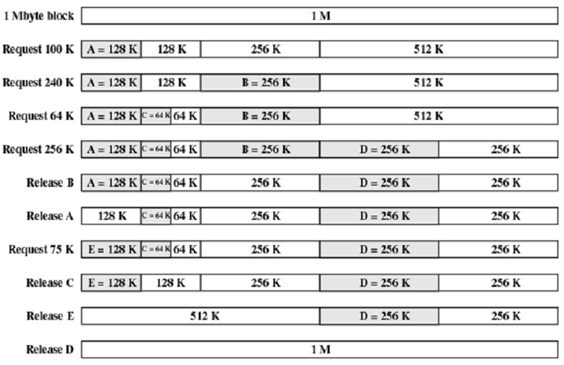

---
##### 散列算法

散列算法利用空闲分区链表和分区大小的关系，构造以空闲区大小为关键字的 HASH MAP ，从而实现快速查找合适链表的方法

---
##### 动态可重定位分区分配
1. 算法背景：连续分配方式的重要特点为用户程序必须装入连续的内存空间。计算机运行一段时间后，其内存空间会被分割为若干小分区，缺乏大的空闲空间，导致空闲总容量较大，但由于不连续无法装入大程序

紧凑\拼凑与重定位

- 采用动态重定位 技术的分区分配 称为可重定位分区分配
- 紧凑技术——将内存中的所有作业进行移动，使它们全都相邻接，这样，可把原来分散的多个小分区合成一个大分区的方法，称为紧凑

动态重定位：系统增加重定位寄存器，存放程序（数据）在内存的起始地址。程序执行时所访问的内存地址由相对地址与重定位寄存器的值求和得到。

动态重定位分区分配算法和动态分区分配算法基本相同，只是增加了拼凑功能，即仅当所有空闲空间总容量无法满足用户需求时才会分配失败，否则则使用拼凑方法，为用户提供连续、满足大小要求的空闲区

优点：内存利用率很高

缺点：需要硬件支持；紧凑的开销较大；用户程序在内存中的地址发生变换时，必须使用重定位。

动态重定位分区分配算法的实现如下图 3-8所示

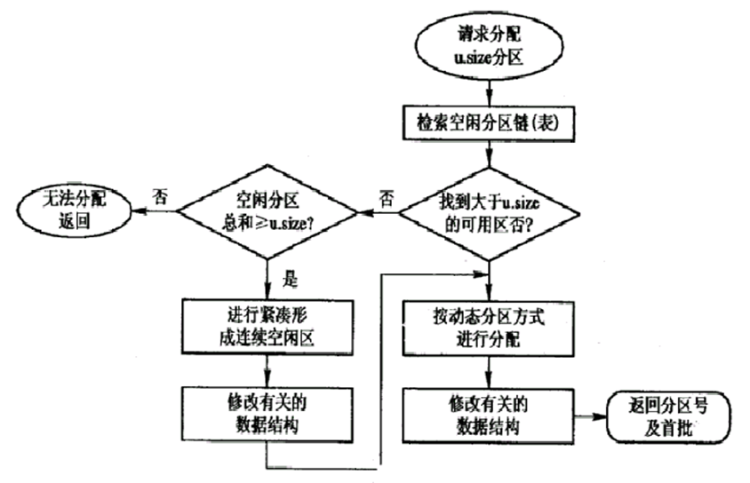

---
## 对换

### 对换机制的引入

- 是指把内存中暂时不能运行的进程或者暂时不用的程序和数据，调出到外存上，以便腾出足够的内存空间，再把已具备运行条件的进程或进程所需要的程序和数据，调入内存。对换是提高内存利用率的有效措施
- 为了实现进程对换，系统必须能实现三方面的功能：
  - 对换空间的管理
  - 进程的换出
  - 进程的换入

对换技术将使一定数量的程序或数据换入或换出内存。根据对换信息量，可将对换分为以下两类：
1. 整体对换：即处理机中级调度，以进程为单位，又称进程对换，广泛应用于多批道处理系统，目的是解决内存资源不足的问题。本节主要介绍这类对换。
2. 页面或分段对换：对换以进程的页面或段作为单位，又称为部分对换，为虚拟存储器基础。

对换的效果
1. 改善内存利用率
2. 提升处理机利用率
3. 提高系统吞吐量

### 实现对换技术的系统功能

#### 对换空间的管理

- 在具有对换功能的OS中，通常把外存分为文件区和对换区。
  - 对文件区管理的主要目标：提高磁盘空间利用率。提高文件访问速度
  - 文件区占据硬盘的绝大部分空间，一般采用**离散方式**分配空间
  - 对对换区管理的主要目标：提高进程换入、换出速度。提高磁盘空间利用率。
  - 对换空间占据硬盘的较少空间，一般采用**连续方式**分配磁盘空间。
- 对换空间采用连续分配方式，其分配算法可以是首次适应算法、循环首次适应算法或最佳适应算法
- 对换空间的回收与动态分区方式的回收方式类似。

#### 进程换出
进程换出即将内存中的某些进程调出至对换区，以释放其所占内存空间。换出的过程可以分为以下两步
1. 选择被换出的进程
   1. 首先选择处于阻塞或睡眠状态且优先级较低的进程换出
   2. 无阻塞或睡眠状态进程时，选择优先级较低的就绪进程换出
2. 进程换出过程
   1. 进程换出只能换出非共享的程序和数据
   2. 申请对换空间，成功后启动磁盘
   3. 将选中进程的程序和数据传送至对换区
   4. 传送成功，则回收进程占用的内存空间。修改进程PCB以及相应的内存分配表项中的内容
   5. 还有可对换进程时，按同样的处理方法处理，直至内存无阻塞进程

#### 进程换入

进程换入的操作步骤如下
1. 查看PCB集合中所有进程的状态，找出就绪状态并且已经换出的进程。
2. 找出多个满足条件的进程时，选择已换出到磁盘（外存）中时间最久（必须大于一个阈值时间）的进程作为换入进程
3. 为待换入的进程申请内存：申请成功，直接将进程从外存调入内存。申请失败，先将内存中的某些进程换出，回收足够内存空间后，再尝试调入进程
4. 用同样的方法，将“就绪且换出”的进程一一调入内存，直至无该类进程或内存空间不足。

特别注意：
1. 为提高CPU利用率，当进程正常运行时，不启动对换程序
2. 有较多进程运行时频繁发生却也，且内存空间紧张时，启动对换程序
3. 缺页率明显减少，但系统吞吐量下降时，暂停运行对换程序。

---
## 离散分配方式

离散式存储管理：是指用户进程的程序和数据可以存放在不连续的内存区域的存储管理方法。

采用离散分配方式的存储管理有 :star:

- 分页存储管理
- 段式存储管理
- 段页式存储管理

### 分页存储管理

基本思想

- 页面或页（Page）：将一个**进程的逻辑**地址空间分成若干个大小相等的片
- （**物理**）块（Block）或页框（Frame）：把**内存空间**分成与页面相同大小的若干个存储块
- 在为进程分配内存时，以块为单位将进程中的若干个页分别装入到多个可以不相邻接的物理块中
- 在分页存储管理方式中，把每个作业**全部装入**内存后方能运行，则称为基本的分页存储管理方式，或称为**纯分页存储管理方式**
- 纯分页存储管理方式不具有支持实现虚拟存储器的功能

#### 页面大小

过小：减少了页内碎片，提高了内存利用率。但是进程占用较多内存块，导致页表过长，占据额外内存空间。会降低页面换入换出效率

过大：页面碎片增加，降低了页表长度，页面换入换出速度变快

适中：适中的页面一般为$2^k$，$k\in[10,13]$,即1KB-8KB之间

---
#### 分配原则
1. 分配内存时，将进程的一页装入内存的一块（页映射页框）
2. 进程最后一页经常因装不满而形成“业内碎片”（内零头）
3. 为方便地址转换，页面大小一般都取2的整数次幂。

---
#### 地址结构

在分页式存储管理方式中，程序的逻辑结构包括两个部分：页号P与页内偏移量W，逻辑地址32位，其中高20位为页号，则地址空间最多有$2^{20}$个页，低12位为页内地址，则页大小为 4 kb ($2^{12}$)

若给定逻辑地址 A,页面大小为L，则有：
页号 P = A/L；
页内地址 d = A % L；

---
#### 页表

页表：页号与块号之间的映射关系，存储块号和标志位

<u>系统又为每个进程建立了一张页面映像表</u>，在分页系统中，允许将进程的每一页离散地存储在内存的任一物理块中，但系统应能保证进程的正确运行，即能在内存中找到每个页面所对应的物理块

在页表的表项中设置一存取控制字段，用于对该存储块中的内容加以保护，如读写权限等

页表的结构如下图 3-9 所示

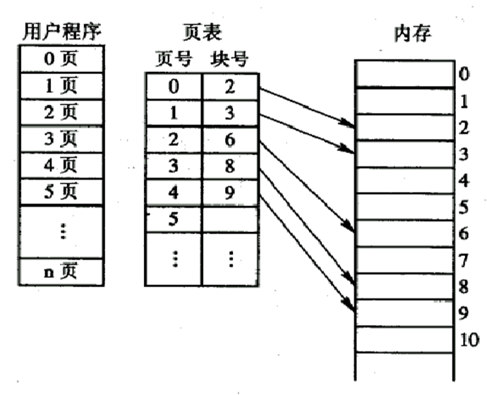

以下为两个关于页表的例题

例子：进程5M,页面大小=2K 页表项32bit=4B

$$\begin{array}{ccc}
页表长度=\frac{进程大小}{页大小}=\frac{5\times2^{20}}{2\times2^{10}}=5\times2^{9}  \\
页表大小=5\times2^{9}\times2^2B=5\times2^{11}B=10KB  
\end{array}
$$
例：进程28K，页面大小=8K，物理地址 [14520]_10，求页号和偏移量:star2:
$$\begin{array}{ccc}
{14520}\div{8\times2^{10}}=1\dots6328 &&\\每块8K，对应实际地址前面共3块\\偏移量:3\times8K+6328=30904  
\end{array}
$$

---
### 地址变换机构

为了能将用户地址空间中的逻辑地址，变换为内存空间中的物理地址，在系统中必须设置地址变换机构。该机构的基本任务是实现从逻辑地址到物理地址的转换。

基本的地址变换机构

页表大多驻留在内存中。在系统中只设置一个页表寄存器PTR，在其中存放页表在内存的始址和页表的长度

CPU存取数据流程如下：（没有快表等结构时）
1. 访问内存读页表
2. 访问内存读写数据

地址变换机构示意图如下图3-10 所示

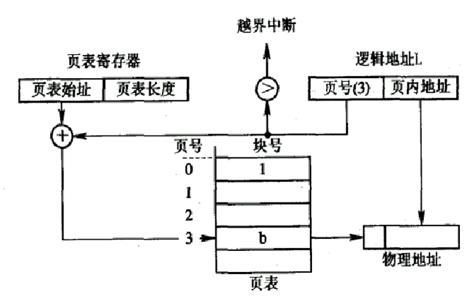

在基本的地址变换机构中，CPU存取一个数据需要访问两次内存，时间消耗较大，故此时可以考虑在地址变换机制中增设具有并行查找能力（根据内容需求）的特殊高速缓冲寄存器，称为“相连寄存器”或“块表”，用来存放被经常使用的页表项

快表不可能做得很大，通常只存放16～512个页表项，Cache中存储的是最近进场命中的页表项

具有快表的地址变换过程如下图 3-11 所示

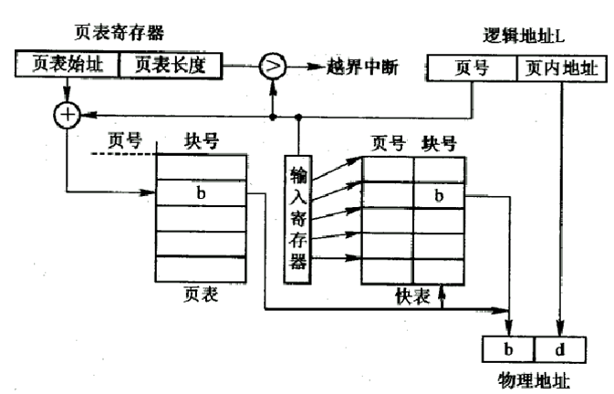

在拥有快表的情况下，CPU存取数据流程如下：
1. 访问快表TLB
2. 找到待查页号->命中
   1. 直接读出块号并与业内偏移地址拼接，形成物理地址
   2. 访问内存读写数据
3. 没找到待查页号->未命中
   1. 访问内存读页表：根据逻辑页号查找页表，找到给定页所存放的物理块号。将块号与页内偏移量拼接形成物理地址。并将待查页号与相关信息写入快表。若快表已满，则需要用一定策略将快表中的一些页表项调出填入
   2. 访问内存读写数据

下面来介绍一个简单的例子

考虑一个简单分页系统，物理存储器大小为4GB,页大小为1KB,逻辑地址空间分为2^16个页

- 逻辑地址空间包含多少位？16+10=26
- 一个帧中包含多少字节？帧就是物理块 1KB
- 物理地址中指定一个帧需要多少位？22-10位
- 页表中包含多少个页表项？2^16 一个页面对应一个页表项
- 每个页表项包含多少位？ 块号22bit+标志位
  - 页表项存的是 页号和块号的对应关系
  - 页表中页号是由页表项宽度计算得到，并不存储
  - 页表中存储**块号和标志位**

页大小1KB 偏移量10bit表示；物理存储4GB，所以有 $2^{22}$ 个物理块，需要22bit表示物理块；分成 $2^{16}$ 个页号，页号16位

16bit页号 | 10bit偏移量

#### 多级页表（分级页表）

现代大多数计算机系统

- 采用离散分配方式来解决难以找到一块连续的大内存空间的问题
- 只将当前需要的部分页表项调入内存，其余的页表项仍驻留在磁盘上，需要时再调入
---
##### 二级页表

将页表再进行分页，并离散地将各个页面分别存放在不同的物理块中 ，为**离散分配**的页面再建立一张页表，称为**外层页表** ，在每个页表项中记录了页表页面的物理块号。

离散分配节省了内存空间，将不需要的页表可以放在内存中

例子：若在32位的地址空间时，采用页面大小为4K占12位，一级页表结构，应具有20位的页号，即页表项应有1兆个。

二级页表结构图如下图 3-12 所示

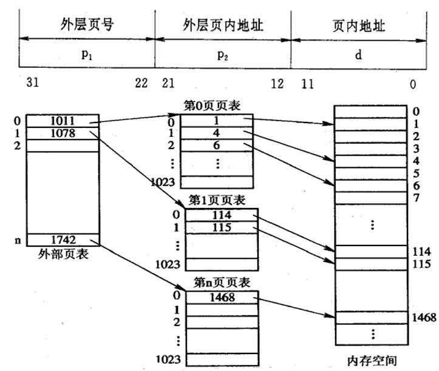

两级页表地址变换的实现：

为了地址变换实现上的方便起见，在地址变换机构中同样需要增设一个外层页表寄存器，用于存放外层页表的始址，并利用逻辑地址中的外层页号，作为外层页表的索引，从中找到指定页表分页的始址，再利用P2作为指定页表分页的索引，找到指定的页表项，其中即含有该页在内存的物理块号，用该块号和页内地址d即可构成访问的内存物理地址。

二级页表的地址变换情况如下图 3-13 所示

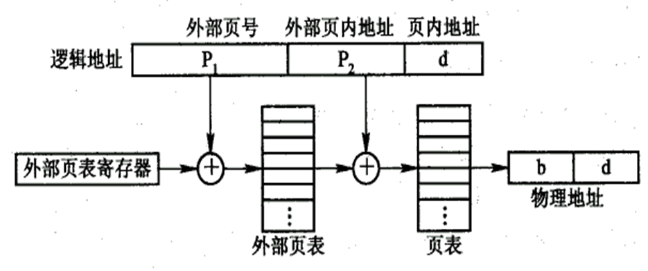

外部*页表的里面存的是块号和标志位*，这个块存储的是内层页表的起始地址，物理地址对应的是数据或程序
$$\begin{array}{ccc}
页表大小=页表项宽度\times页表长度(页表项数量)\\
& \\
页表长度=\frac{页面大小}{页表项大小}
\end{array}
$$

每一级页表长度不一定相等，但最大长度相等(不改变总体所需的内存空间)

多级页表结构说明：
总的来说，32位计算机采用两级页表结构比较合适，但64位的计算机两级页表仍然庞大，需要采用多级页表，对外层页表规划仍然采用二级页表思想。

##### 反置页表

反置页表引入的原因：为了解决逻辑页过多，导致页表庞大难以找到连续的足够大的内存空间的问题。

反置页表没有以逻辑页面为标准，而是以物理块数作为标准（页内地址），每个表项包含该物理块所存放逻辑页的页号与该逻辑页所属进程标识。

地址变换步骤如下所示
- 检索到与之匹配的页表项（命中）：该页表项的序号i即为该页所在物理块的块号。该块号与页内地址拼接构成物理地址
- 检索整个反置页表仍未找到匹配的页表项：表面此页并未被装入内存。对于具有请求调页功能的存储器管理系统来说，这说明了地址出错。对于具有请求调页功能的存储管理系统，将会产生缺页中断，系统将会把该页调入内存.

### 分段存储管理

分页式管理方式从根本上克服了页外碎片，提高了内存利用率，但是按页长进行硬性分割，没有考虑内容因素，有可能造成主程序未能全部进入内存，从而导致执行速率降低的问题，在此，引入了分段式存储管理方式。

#### 分段式存储管理方式
1. 作业地址空间被划分为若干个段
   1. 每个段定义了一组逻辑信息
   2. 所有段都有自己的名字，通常用段号代替段名
   3. 每个段从0开始编址，分配至一组连续的地址空间
   4. 段长由逻辑信息的长度决定
   5. 各段长度不等
   6. 作业各段之间不要求连续
   7. 基本分段式存储管理要求将整个作业的全部段装入内存

2. 便于编程
   1. 用户通常将作业按照逻辑关系划分为若干个段（函数或过程）
   2. 每个段具有自己独立的名字，且都从0地址开始编址
   3. 用户程序通过段名和段内地址访问存储单元

3. 分段共享
   1. 程序和数据的共享通常以信息的逻辑单位为基础
   2. 分页式系统中的每一页只存放信息的物理单位，其本身没有完整的意义，不便于信息共享
   3. 段是信息的逻辑单位，有利于信息共享

4. 分段保护
   1. 信息保护针对相对完整意义的逻辑单位（段）

5. 动态链接
   1. 当运行过程中需要调用某段时，再将该段（目标程序）调入内存并链接起来，所以，动态链接是以段作为基础的。

6. 动态增长
   1. 实际系统中，有些数据量会不断增长，而实现却无法知道数据的增长规模与特征，分段存储管理方式能够较好的解决这个问题。

#### 数据结构
1. 系统为每一个进程建立了一个段映射表
2. 实现从逻辑段到物理内存去的映射
3. 每个段在表中占一个表项
4. 段表可以存放在寄存器中，但更常见的方式为存放在内存

#### 分段的地址结构以及分段的原理

- 在分段存储管理方式中，作业的地址空间被划分为若干个段，每个段定义了一组逻辑信息
- 每个段都有自己的名字
- 每个段都从0开始编址，并采用一段连续的地址空间。段的长度由相应的逻辑信息组的长度决定，因而各段长度不等
- 整个作业的地址空间，由于是分成多个段，因而是二维的，亦即，其逻辑地址由段号（段名）和段内地址所组成
- 分段地址中的地址具有如下结构
  - 段号[31-16]段内地址[15-0]

作业空间分段的图 3-14 如下所示

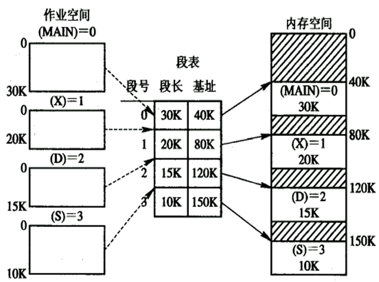

每一段必须在连续的空间

段表：

- 在系统中为每个进程建立一张段映射表，简称“段表”
- 每个段在表中占有一个表项，其中记录了该段在内存中的起始地址（又称为“基址”）和段的长度
- 段表是用于实现从逻辑段到物理内存区的映射 

分段机制的映射表结构示意图如下图 3-15 所示

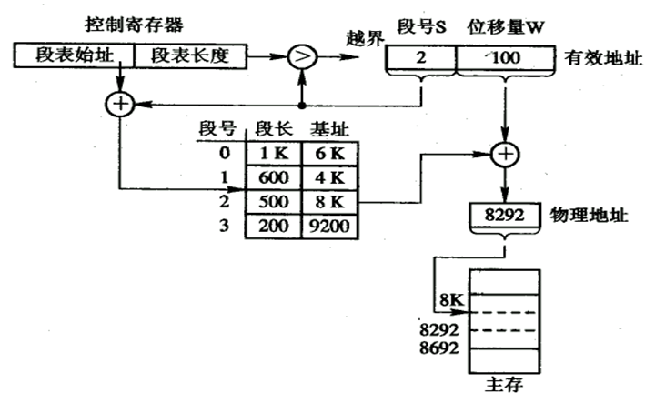

有效地址的位数分配按照硬件分配

#### 地址变换机构

分段式存储管理基本地址变化机构特点如下
1. 系统设置段表寄存器，存放段表起始地址和段表长度，以实现从进程的逻辑地址到物理地址的变化
2. 和基本分页式存储管理方式类似，每访问一个数据，需要访问两次内存
3. 降低系统效率
4. 类似快表，可增设**相连存储器**以提高速度 

---
#### 分页和分段的比较（主要区别 ）

- **页是信息的物理单位**，*分页是为实现离散分配方式*，以消减内存的**外零头**，提高内存的利用率。**段则是信息的逻辑单位**，它含有一组其意义相对完整的信息。分段*的目的是为了能更好地满足用户的需要*
- **页的大小固定且由系统决定**，由系统把逻辑地址划分为页**号和页内地址两部分**，是由**机器硬件实现**的，因而在系统中只能有一种大小的页面而段的长度却不固定，决定于用户所编写的程序，通常由编译程序在对源程序进行编译时，根据信息的性质来划分
- *分页的作业地址空间是一维的*，即**单一的线性地址空间，**程序员只需利用一个记忆符，即可表示一个地址；而分段的作业地址空间则是二维的，程序员在标识一个地址时，既需给出段名，又需给出段内地址，**同时还需要段的基址**

优点：

- 分段系统的一个突出优点，**是易于实现段的共享**，即允许若干个进程共享一个或多个分段，且对段的保护也十分简单易行
- 在分页系统中，实现代码共享应在每个进程的页表中都**建立相同个页表项和占用相同的页号**。 而数据页面**不受此限制**
- **可重入代码**（Reentrant Code）又称为“纯代码”（Pure Code）是一种允许多个进程同时访问的代码。为使各个进程所执行的代码完全相同，绝对不允许可重入代码在执行中有任何改变。因此，可重入代码是一种**不允许任何进程对它进行修改的代码**

### 段页式存储管理

1. 基本原理
   - 分页式存储管理以页面为内存分配单位，可以有效提高内存利用率。分段式存储管理以程序段为内存分配单位，能更好地满足用户需求。段页式则结合二者之长，先将用户程序分为若干段，每个段赋予一个段名，再将每个段分为若干页。

结构

|段号S|页号P|页内偏移量W|

段页地址变换过程如下图 3-16 所示

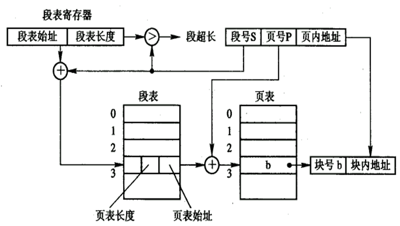

2. 地址变换
    - 变换类型
      - 基本段页式存储管理：将作业的所有段装入内存方可运行
      - 请求段页式存储管理：没必要将整个作业装入内存，把作业的几段或者几页装入内存即可运行

3. 变换流程
   1. 段页式存储管理系统获得一条指令或者数据，需要访问**三次**内存
      1. 读内存访问段表，获得页表起始地址
      2. 读内存访问页表，获得该页所在内存物理块号
      3. 由块号和页内偏移地址拼凑得出指令或数据所存放的内存物理地址，按照该地址访问内存单元，读取指令或者读写数据
   2. 为提高速度，可以增设高速缓冲存储器

## 虚拟存储的基本概念

虚存，相对于实际主存而存在

没有可用空间，但需要调入新的内容。需要换出一个不用的页表，将需要用的内容换入

常用存储器管理方式的特征
1. 一次性
   1. 作业必须一次性全部装入内存才能开始运行
   2. 大作业无法在小内存中运行
   3. 限制系统的多道程序
   4. 降低处理机利用率
   5. 降低系统吞吐量
   6. 很多作业的运行不需要全部程序和数据
2. 驻留性
   1. 整个作业装入后，一直驻留内存直至运行结束
   2. 运行期间可能会因为I/O或其他原因被阻塞
   3. 部分程序运行一次后不再需要
---
### 程序的局部性原理:star:
1. 时间局部性：刚访问的数据不久就可能被再次访问
2. 空间局部性：程序在一段时间内访问的地址空间可能集中在一定范围内

局部性原理产生的根源
- 程序执行时，除了少部分的转移和过程调用指令外，在大多数情况下仍是顺序执行的
- 过程调用将会使程序的执行轨迹由一部分区域转至另一部分区域，但经研究看出，过程调用的深度在大多数情况下都不超过5层。这就是说，程序将会在一段时间内都局限在这些过程的范围内运行
  - 顺序，循环，选择（一定程度上破坏了局部性）
- 程序中存在许多循环结构，这些虽然只由少数指令构成，但是它们将多次执行
- 程序中还包括许多对数据结构的处理，如对数组进行操作，它们往往都局限于很小的范围内

---
### 虚拟存储器定义

- 基于局部性原理，应用程序在运行之前，没有必要全部装入内存，仅须将那些当前要运行的部分页面或段先装入内存便可运行，其余部分暂留在盘上。 
- 所谓虚拟存储器：是指具有请求调入功能和置换功能，能从逻辑上对内存容量加以扩充的一种存储器系统，其逻辑容量由内存容量和外存容量之和所决定，其运行速度接近于内存速度，而每位的成本却又接近于外存。

---
### 虚拟存储器的特征以及内容

#### 虚拟存储器相关的重要内容：
1. 具有请求调入功能和置换功能、能从逻辑上对内存容量加以扩充的一种存储器系统
2. 逻辑容量由内存容量和外存容量之和，以及计算机系统的地址结构决定。
3. 运行速度接近于内存
4. 存储成本接近于外存（辅存磁盘）
5. 虚拟存储器的实现是建立在离散分配存储管理方式的基础之上

#### 虚拟存储器的特征
1. 多次性：一个作业分多次调入内存运行
2. 对换性：允许作业运行过程中进行换入、换出操作
3. 虚拟性：从逻辑上扩充内存容量，使用户所看到的内存容量远大于实际上的内存容量。

说明：
1. 虚拟性建立在多次性与对换性上
2. 多次性与对换性建立在离散分配的基础上

---
### 虚拟存储的实现

####  请求分页存储管理方式 

  - 这是在分页系统的基础上，增加了请求调页功能和页面置换功能所形成的页式虚拟存储系统。
  - 它允许只装入部分页面的程序（及数据），便启动运行。
  - 运行过程中，根据需要通过调页功能及页面置换功能，陆续将即将要运行的页面调入内存，同时把暂不运行的页面换出到外存上。
  - 置换时以页面为单位

##### 系统需要提供的支持
  - 为了能实现请求调页和置换功能，系统必须提供必要的硬件支持和相应的软件:

    - 硬件支持:要有一定容量的内存和外存、页表机制、缺页中断机构和地址变换机构.
      1. 请求分页的页表机制上增加若干项，作为请求分页的数据结构
      2. 缺页中断机构:当要访问的页面尚未调入内存时，便产生缺页中断，请求调页
      3. 地址变换机构:请求分页系统中的地址变换机构，是在分页系统地址变换机构的基础上，再为实现虚拟存储器二增加了某些功能而形成的

    - 软件支持
      1. 实现请求调页的软件
      2. 实现页面置换的软件

---
##### 内存分配策略
  - 在为进程分配内存时，涉及三个问题：确定最小物理块数、物理块分配策略和物理块分配算法
    1. 确定最小物理块数
       - 最小物理块数指能确保进程正常运行所需的最少物理块数,和计算机的硬件结构有关,取决于指令格式、功能、寻址模式
    2. 物理块分配策略
       - 固定分配局部置换:为每个进程分配一定数目的物理块,在整个运行期间不再改变
         - 如果进程运行过程中发生了缺页现象,只能从分配给该进程在内存页面中选出一页换出,再调入所缺页
       - 可变分配全局置换:先为系统中的每个进程分配一定数量的物理块,使得操作系统保持一个空闲物理块队列
         - 如果进程运行过程中发生了缺页现象,则由系统从空闲物理块队列取出一个物理块分配给该进程,并将欲调入页装入其中.
       - 可变分配局部置换:为每个进程分配一定数量的物理块
         - 如果某进程发生缺页,则只允许从该进程在内存的页面中选出一页换出,而不影响其他进程执行
         - 如果进程运行期间频繁发生缺页中断,则系统再次为进程分配若干物理块
         - 如果某进程运行期间缺页率较低,则适当减少分配给改进程的物理块
   3. 物理块分配算法
      1. 平均分配算法(将系统中所有可供分配的物理块**平均**分配给各个进程
      2. 按比例分配算法(根据进程的大小按照比例分配物理块)
      3. 考虑优先权的分配算法(照顾重要、紧迫作业尽快完成，为其分配较多的内存空间) 
---
##### 页面调入策略
1. 调入时机
   1. 预调页策略
      - 可采用一种以预测为基础的预调页策略，将那些预计在不久之后便会被访问的页面，预先调入内存。
      - 预调页的成功率仅约50％。
   2. 请求调页策略
      - 这种策略每次仅调入一页，故须花费较大的系统开销，增加了磁盘I／O的启动频率
      - 在请求分页系统中的外存分为两部分：用于存放文件的**文件区**和用于存放对换页面的**对换区**。
2. 调入来源
   1. 系统拥有足够的对**换区空间**，这时可以全部从对换区调入所需页面，以提高调页的速度
   2. 系统缺少足够的对**换区空间**，这时凡是不会被修改的文件，都直接从文件区调入；但对于那些可能被修改的部分，在将它们换出时，便需调到对换区以后需要时再从对换区调入
   3. UNIX方式。由于与进程有关的文件都放在文件区，应从文件区调入。而对于曾经运行过但又被换出的页面，由于是被放在对换区，因此在下次调入时，应从对换区调入

3. 调入过程
   1. 每当程序所要访问的页面未在内存时，便向CPU发出一**缺页中断**
   2. 中断处理程序首先<u>保留CPU环境</u>，分析中断原因后，转入缺页中断处理程序。 
   3. 如果内存已满，则须先按照某种置换算法从内存中选出一页准备换出；如果此页已被修改，则必须将它写回磁盘（没有修改就丢弃）
   4. 然后再把所缺的页调入内存，并修改页表中的相应表项，置其存在位为“1”，并将此页表项写入快表中 
   5. 形成所要访问数据的物理地址，再去访问内存数据

---
#####　缺页率

$
缺页中断率 f = F \div A
$

其中访问页面失败的次数为F,该进程的总的页面访问率为A

---
##### 页面置换算法

###### 最佳(优)置换算法POT

- 最佳(优)置换算法是所选择被淘汰的页面，将是以后永不使用的，或许是在最长时间内不再被访问的页面。
- 最佳置换算法是一种**理想化的算法**，它具有最好的性能，但实际上却难于实现

例：假定系统为某进程分配了三个物理块，并考虑有以下的页面号引用串：7，0，1，2，0，3，0，4，2，3，0，3，2，1，2，0，1，7，0，1

采用最佳置换算法发生了6次页面置换

最佳置换算法的例子如下图3-17所示

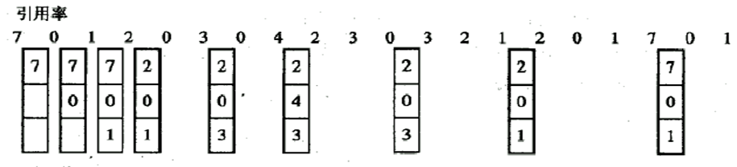

计算缺页次数，前3次缺页+页面置换次数(6次) = 9次 缺页率=9/20=45%

---
###### 先进先出FIFO页面置换算法

该算法总是淘汰最先进入内存的页面，即选择在内存中驻留时间最久的页面予以淘汰
---
###### 最近最久未使用（LRU）置换算法

LRU置换算法是选择最近最久未使用的页面予以淘汰。该算法赋予每个页面一个访问字段，用来记录一个页面自上次被访问以来所经历的时间t，当须淘汰一个页面时，选择现有页面中其t值最大的，即最近最久未使用的页面予以淘汰

LRU置换算法的例子如下图 3 - 18 所示

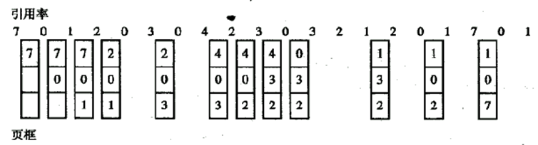

特别的，LRU置换算法需要来自寄存器或者栈的支持

---
##### 简单的Clock置换算法

​     当采用简单c1ock算法时，只需为每页设置一位访问位，再将内存中的所有页面都通过链接指针链接成一个循环队列

- 当某页被访问时，其访问位被置1
- 置换算法在选择一页淘汰时，只需检查页的访问位
- 如果是0，就选择该页换出
- 若为1，则重新将它置0，暂不换出，而给该页第二次驻留内存的机会，再按照FIFO算法检查下一个页面

由于该算法是循环地检查各页面的使用情况，故称为c1ock算法。置换时是将未使用过的页面换出去，故又把该算法称为最近未用算法NRU

clock置换算法如下图3-19所示

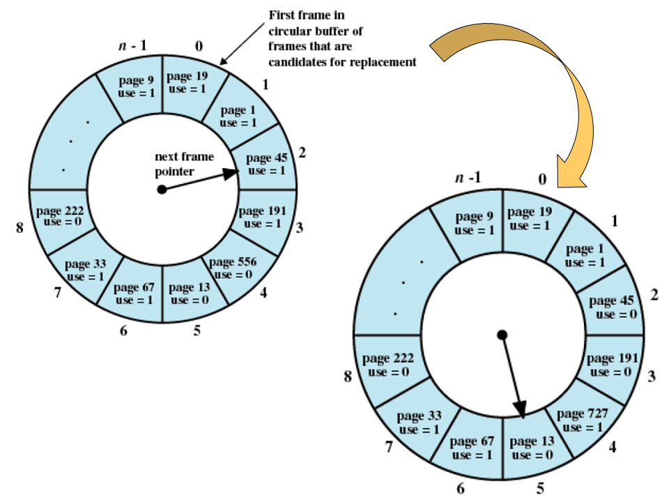

---
##### 最少使用置换算法（LFU）

该算法选择截止当前时间被访问次数最少的页面予以淘汰。

---
##### 页面缓冲算法（PBA）

页面换进换出开销对系统性能具有较大的影响，影响页面换进换出效率的因素有以下几项
1. 页面置换算法
2. 写回磁盘的频率
3. 读入内存的频率

页面缓冲算法是对FIFO算法的改进
-  页面缓冲算法描述以及特征
   - 通过已经修改换出页面链表，降低页面的换入换出频率
   - 可采用较简单的置换策略，如FIFO等
   - 不需要特殊的硬件支持，实现简单

---
#### 请求分段系统

  - 它允许只装入若干段的用户程序和数据，即可启动运行。以后再通过调段功能和段的置换功能，将暂不运行的段调出，同时调入即将运行的段
  - 为了实现请求分段，系统同样需要必要的硬件支持。一般需要下列支持
    1. 请求分段的段表机制，这是在纯分段的段表机制基础上增加若干项而形成的
    2. 缺段中断机构
    3. 地址变换机构
  - **实现请求调段和段的置换功能也须得到相应的软件支持**

在请求分段系统中，程序运行之前，只需先调入若干个分段（不必调入所有的分段），便可启动运行。当所访问的段不在内存中时，可请求OS将所缺的段调入内存。与请求分页思想类似

##### 系统需要提供的功能
1. 软件支持：要有实现请求调段和置换的软件
2. 硬件支持：要有请求分段的段表机制、缺段中断机构、地址变换机构

段表机制

在请求分段式管理中所需的主要数据结构是段表，段表项有新的扩展

| 段名 | 段长 | 段的基址 | 存取方式 | 访问字段A | 修改位M | 存在位P | 增补位 | 外存始址 |
| ---- | ---- | -------- | -------- | --------- | ------- | ------- | ------ | -------- |
|      |      |          |          | 置换      |         |         |        |          |

缺段中断机构如下图 3-20 所示

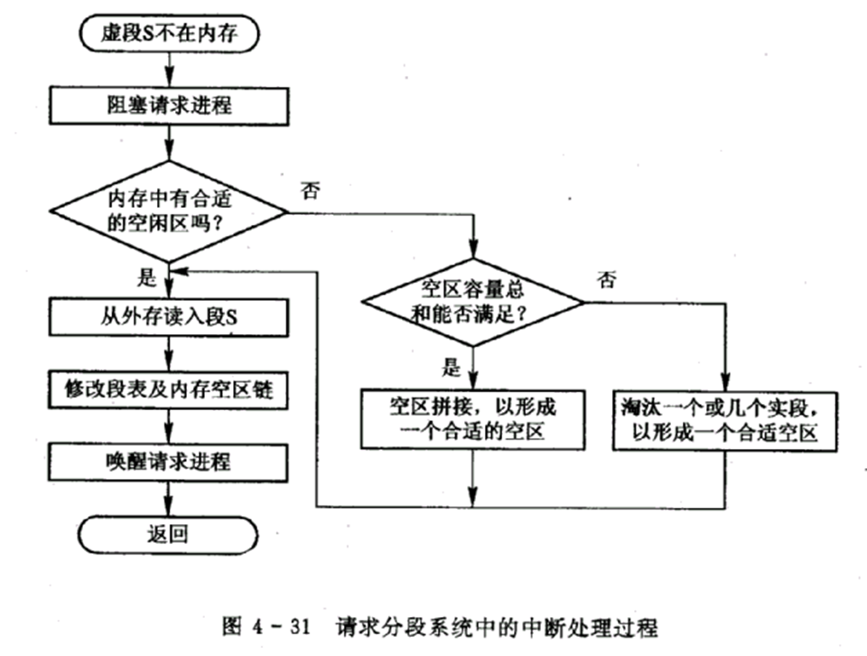

地址变换机构如下图 3-21 所示

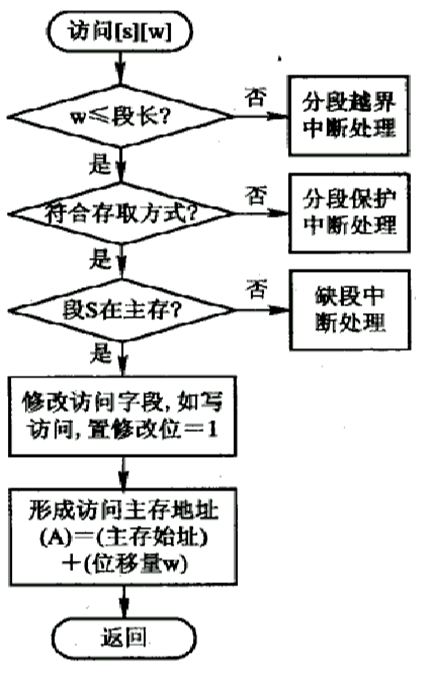

##### 段的机制与保护

**共享段表**

为了实现分段共享，可在系统中配置一张共享段表，所有各共享段都在共享段表中占有一表项

共享段的分配方式为：
1. 为第一个请求适用共享段的进程分配内存空间
2. 其他请求适用已进入内存的共享段

分段共享情况如下图 3-22 所示

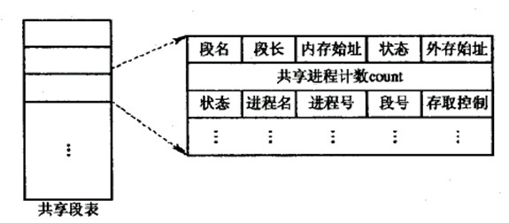

分配与回收参考文件计数。

**段的保护**
- 越界检查
- 存取控制检查
  - 只读
  - 读写
  - 只执行
- 环保护机构
  - 在该机制中规定：低编号的环具有高优先权。 OS核心处于0环内；某些重要的实用程序和操作系统服务，占居中间环；而一般的应用程序，则被安排在外环上，在环系统中，程序的访问和调用应遵循以下规则
  - 一个程序可以访问驻留在相同环或较低特权环中的数据
  - 一个程序可以调用驻留在相同环或较高特权环中的服务

## 章节知识小结

编译 静态链接

链接 

- 静态
- 装入时动态链接
- 运行时动态链接

装入

- 绝对装入
- 运行时装入
- 可重定位装入

分区分配

- 连续分区分配
  - 单一连续
  - 固定分区
  - 动态分区分配
      - 伙伴系统
      - 分区分配算法
      - 首次
      - 循环首次
      - 最佳
      - 最坏
    
  - 可重定位的动态分区分配
- 离散
  - 页式
  - 段式
  - 段页式
- 虚拟内存
  - 局部性原理
  - 请求页式
  - 请求段式
  - 请求段页式

离散和虚拟内存的地址映射变换是重要内容:star:

动态/静态重定位

请求分页存储和分区变址机构区别：缺页中断，页面置换算法，多了标志位

---

进程能够访问的内存地址的集合

如32bit地址线可以访问2^32的地址空间
