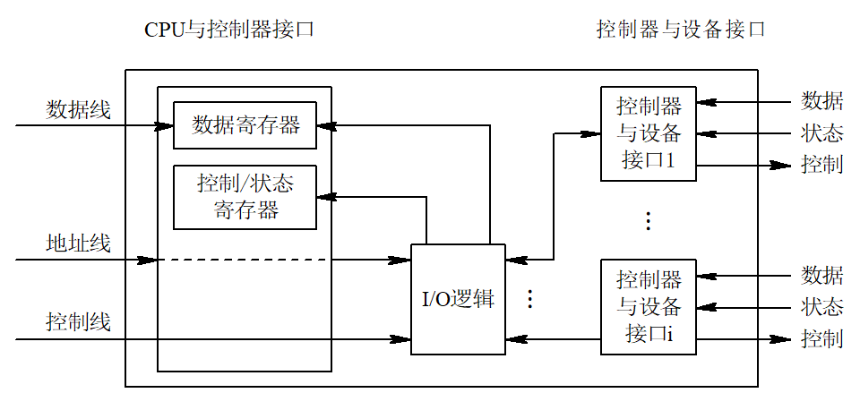
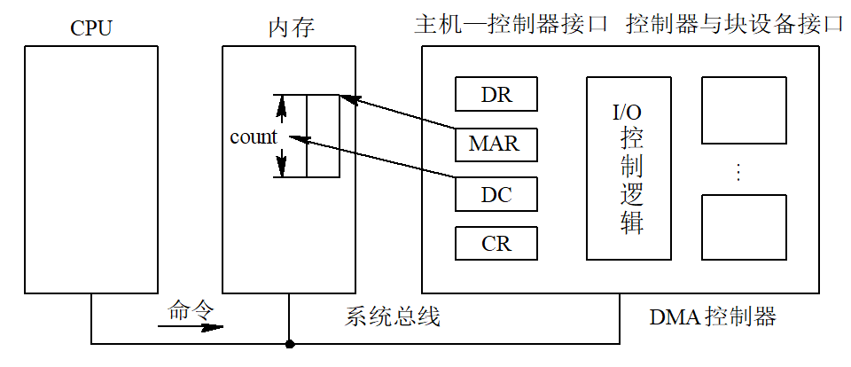
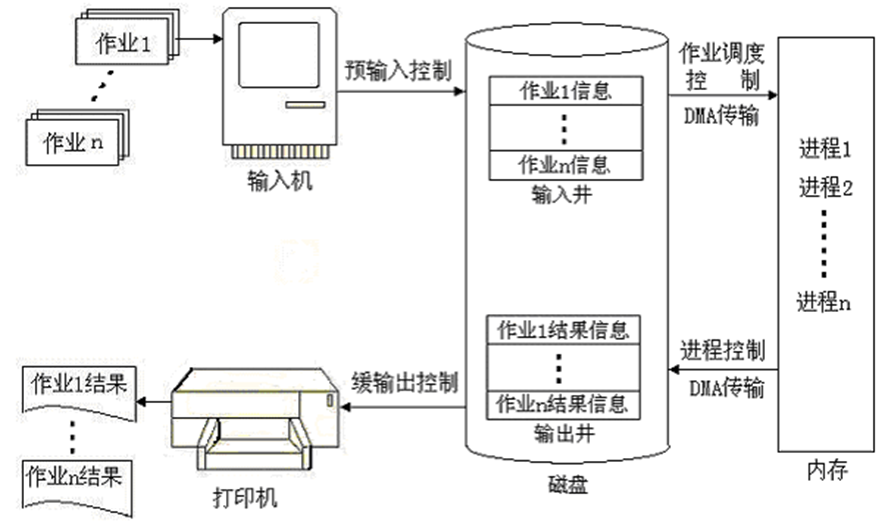
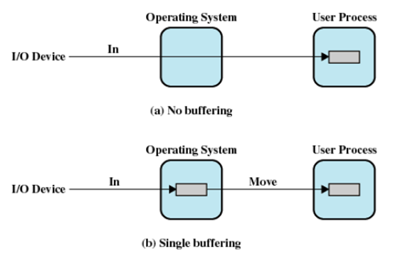
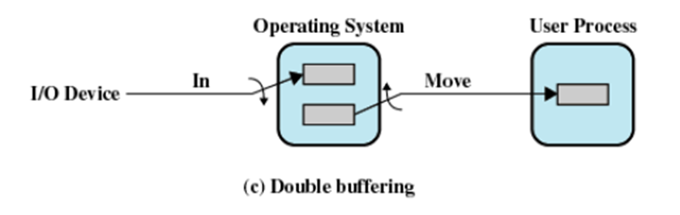
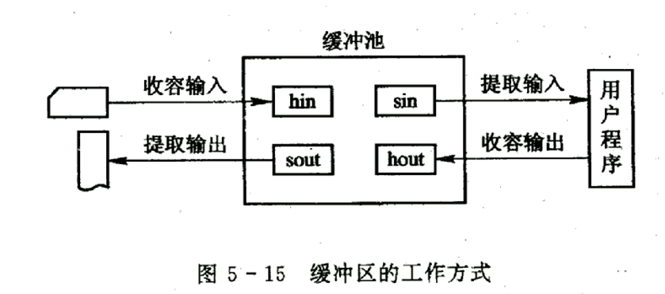
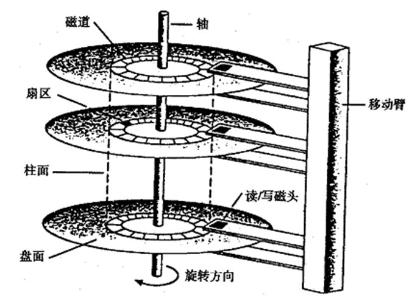
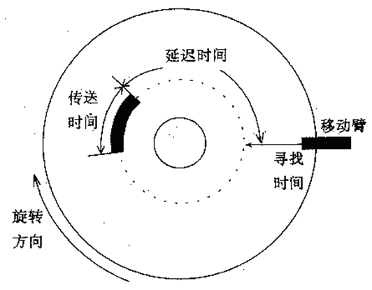
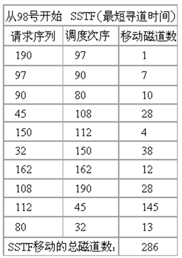
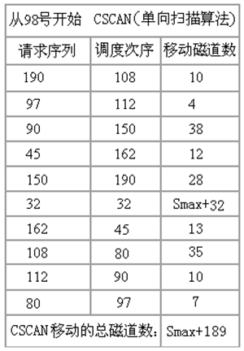

# 设备管理

## 命题特点
1. 磁盘存储器管理部分可以出综合应用题，具体考察磁盘调度算法以及磁盘访问时间的掌握情况。
2. 其余知识点出单选题
3. SPOOLing系统以及磁盘调度算法:star:

## 概述

设备管理又称为I/O系统管理，主要管理对象为I/O设备以及设备控制管理器。

## 设备管理的任务

设备管理的主要任务包括完成用户提出的I/O请求；提高I/O效率；提高I/O设备的利用率；方便设备的使用

## 设备管理的功能总纲

1. 隐藏物理设备的细节：I/O设备种类繁多，差异较大，因此设备控制器是管理设备的硬件基础，具有以下作用
   1. 对设备进行抽象，隐藏设备的实现细节
   2. 为高层进程提供使用设备的I/O命令
   3. 方便用户使用设备
2. 与设备的无关性
   1. 在隐藏物理设备基础上实现
   2. 可以通过逻辑设备名使用设备
   3. 通过设备驱动程序实现即插即用
   4. 有效提高操作系统的可移植性和易适应性
3. 提高处理机和I/O设备的利用率
   1. 尽可能让I/O设备和处理机并行操作，提高利用率
   2. 处理机能够快速响应用户的I/O请求
   3. 尽量减少设备运行时处理机的干预时间
4. 对I/O设备进行控制
   1. 对I/O设备进行控制是设备驱动程序的功能之一
   2. 控制方式包括：轮询可编程I/O方式中断可编程I/O方式；直接存储器访问方式；I/O通信方式
   3. 选择哪种控制方式有I/O设备特性、传输率、传输数据单位等来决定
   4. I/O软件拼比控制差异，向高层软件（上位机）提供统一的操作接口
5. 确保对设备的正确共享
   1. 独占设备：进程应该互斥访问的设备
   2. 共享设备：一段时间内允许多个进程同时访问的设备
6. 错误处理
   1. 临时性错误：可通过重试操作纠正
   2. 持久性错误：重试多次仍然无法纠正的错误，需要向上层报告
   3. 对错误的处理尽可能在接近硬件层的层面解决（低成本）
   4. 底层软件解决不了的错误，报告上层软件解决

---
## I/O软件的层次结构

层次结构的实质：将系统的设备管理模块拆分为若干层次，每层利用下层提供的服务完成输入/输出功能的某些子功能，同时屏蔽其实现细节，向高层提供服务。

层次结构的作用：可以使得I/O软件结构清晰、移植性与适应性好。

I/O软件向下与底层硬件密切相关，向上与文件系统、虚拟存储器以及用户直接交互

### I/O软件层介绍
I/O软件分为用户层I/O软件、设备独立性软件、设备驱动软件以及中断处理程序。

1. 用户层I/O软件
   - 与用户之间的接口，用户通过库函数对设备进行操作
2. 设备独立性软件
   1. 实现用户程序和设备驱动程序的统一接口，设备的命名、保护，以及分配和释放等，为设备管理和数据传送提供必要的存储空间
3. 设备驱动程序
   1. 与硬件直接相关，每一类设备配置一种驱动程序，实现转换系统对设备发出的操作命令，驱动I/O设备工作。它是I/O系统的高层与设备控制器之间的通信进程
   2. 设备驱动程序的主要任务有三类：
      1. 第一类是接收上层软件发来的抽象I/O要求（read/write等）
      2. 第二类是将抽象I/O要求转换为具体要求，发送给设备控制器，启动设备执行
      3. 第三类是将设备控制器发送的信号传递给上层软件。

#### 设备驱动程序的主要功能与特点
主要功能：

1. 接收由与设备驱动无关的软件发送的命令与参数，并将命令中的抽象要求转换为与设备相关的低层操作序列
2. 检查用户I/O请求的合法性
3. 发送I/O命令

特点：

1. 实现与设备无关的软件和设备控制器之间的通信和转换的程序
2. 驱动程序与设备控制器以及I/O设备的硬件特性紧密相关
   1. 不同类型的设备，配置不同的驱动程序
   2. 相同的多个终端，配置一个终端驱动程序
3. 驱动程序与I/O设备所采用的I/O控制方式紧密相关，常用的I/O控制有中断驱动方式以及DMA方式
4. 由于驱动程序与硬件紧密相关，因而其中的一部分必须使用汇编语言进行编写。目前很多驱动程序的基本部分已经固化在了ROM中。
5. 驱动程序允许可重入，一个正在运行的驱动程序通常会在一次调用完成前被再次调用

#### 设备驱动程序的处理方式与过程

处理方式：
- 不同的操作系统采用的设备处理方式并不完全相同
- 按照设备处理时是否设置进程，以及设置什么进程，可以分为如下三类
  1. 为每一类设备单独设置一个进程
  2. 为整个系统设置一个I/O进程，或设置一个输入进程与一个输出进程
  3. 不设置专门的设备处理进程,只为各类设备设置相应设备驱动程序,供用户或系统调用.**这是目前使用最多的方式**

处理过程
1. 将**抽象要求**转化为**具体要求**
2. 对服务请求进行校验:检查请求的合法性
3. 检查设备状态:检查设备是否处于就绪状态
4. 传送必要参数
5. 启动I/O设备

中断程序处理中断请求的步骤：
1. 保存被中断进程的CPU环境（保护现场）
2. 转入相应的中断处理程序
3. 处理完毕恢复被中断进程现场
4. 返回被中断进程的程序中

以上发生在非抢占式的中断程序处理中。

---
### I/O系统各模块间的层次关系

1. I/O系统的上下接口
   - I/O系统接口：I/O系统与上层之间的接口
   - 软件/硬件接口：中断程序处理和设备控制器之间的接口
2. I/O系统的分层
   1. 中断处理程序：位于I/O系统最底层
   2. 设备驱动程序:位于I/O系统次底层
   3. 设备独立性软件:I/O软件独立于具体使用的物理设备,提高了I/O系统的可适应性与拓展性,包括设备命名、设备分配、数据缓冲以及数据高速缓冲。

### I/O系统的接口类型

I/O接口包括以下三种接口类型
1. 块设备接口
   - 块设备接口的数据存取是以块为单位。其中磁盘就为典型的块设备。其传输速率高，并且可以寻址。
2. 字符设备接口
   - 字符设备接口又称为流设备接口，数据存取以字符为单位，传输模式为数据流，典型的设备为打印机等。其传输速率较低，且不可寻址，一般为独占设备，具有打开、关闭操作，常用中断方式工作。
3. 网络接口

---
### I/O设备构成与设备类型

I/O设备通常由以下部分组成
1. 执行I/O操作的机械部分
2. 执行控制I/O的电子部件-设备控制器或适配器
   1. 特点：可编址设备，可控制多个设备并为其编址
   2. 分类：主要分为块设备的控制器与字符设备的控制器（对应块接口与字符接口）
   3. 基本功能
      - 接收和识别命令 R/W
      - 数据交换
      - 标识和报告设备的状态
      - 地址识别
      - 数据缓冲
      - 差错控制
   4. 组成：包括设备控制器与字符设备控制器

设备类型

- 按照设备的使用特性分类
  - 存储设备与输出设备
- 按照传输速率分类
  - 低速：每秒几个字节至数百个字节
  - 中速：每秒数千个字节至数万个字节
  - 高速：每秒数百千个字节至数十兆字节
- 按照设备共享属性分类
  - 独占：即临界资源
  - 共享：在一段时间内允许多个进程同时访问的设备
  - 虚拟：通过虚拟技术将一台独占设备变换为若干台逻辑设备，供若干个用户（进程）同时使用
- 按照信息交换单位分类
  - Byte 字符设备：其基本单位是字符 keybord,mouse
  - Block 块设备：这类设备用于存储信息 Disk,USB
- 按照设备接口分类
  - PCI USB HDMI....

I/O设备与控制器间的接口如下图 4 - 1所示

由于在速度、特性等方面，存在较大的差异，因此通常的I/O设备并不直接与CPU进行通信，二十余设备控制器进行通信

由上图可知，主要由三种类型的信号进行传输
1. 数据信号线：I/O设备与设备控制器之间的数据通路
2. 控制信号线：设备控制器向I/O设备发送控制信号的通路，规定设备要执行的操作
3. 状态信号线：表示I/O设备当前状态的信号，如设备正在读、正在写、读完成、写完成等状态声明

---
### I/O通道

I/O通道引入的原因：当主机连接的外设很多时，CPU的负担仍然很重，为了降低CPU负担，建立独立I/O操作，这时候在CPU和设备控制器之间增设I/O通道。

特殊的处理机，具有执行I/O指令的能力，通过执行通信程序来控制I/O操作

I/O通道的特点
- 指令类型单一
- 没有自己的内存（或非常小），是通道与CPU共享内存

I/O通道的分类
1. 字节多路通道 Byte Multiplexor Channel
2. 数组选择通道
   1.  可以连接多台高速设备，但由于它只含有一个**分配型子通道**，在一段时间内只能执行一道通道程序， 控制一台设备进行数据传送
   2.  当某台设备占用了该通道后，便一直由它独占， 即使是它无数据传送，通道被闲置， 也不允许其它设备使用该通道， 直至该设备传送完毕释放该通道
3. 数组多路通道
   1.  既具有很高的数据传输速率
   2.  又能获得令人满意的通道利用率
   3.  广泛地用于连接多台高、中速的外围设备
   4.  其数据传送是按数组方式进行的

特别的一种问题类型，I/O通道的“瓶颈问题”

由于通道价格昂贵，数量较少，成了I/O系统的瓶颈，可能会导致系统吞吐量的下降。

解决瓶颈问题的有效办法，是增加设备到主机间的通路，而不增加通道
- 一个设备连接多个控制器
- 一个控制器连接多个通道
- 优点是解决了“瓶颈问题”，提高了系统可靠性

### 总线系统

1. ISA和EISA总线
     1. ISA(Industry Standard Architecture)总线
     2. EISA(Extended ISA)总线
2. 局部总线(Local Bus)
     1. VESA(Video Electronic Standard Association)总线
     2. PCI(Peripheral Component Interface)总线

---
## I/O控制方式:star:

### 程序I/O方式

需要CPU参与

#### 轮询可编程I/O方式

轮询可编程I/O方式，又称为程序控制方式，工作流程如下
1. 处理机向设备控制器发出一条I/O指令，启动外设工作，将设备控制器的 `busy`标置位 1 
2. 处理机查询设备控制器的 `busy`标记，为1时，继续查询，为0时，进行数据传输

工作特点：
1. 由于CPU高速而I/O设备低速导致CPU资源造成极大浪费
2. 查询过程中，CPU长期处于踏步等待状态，使系统效率大大降低
3. CPU在一段时间内只能和一台外设交换信息
4. 不能发现和处理无法预先估计的错误和异常

---
#### 中断可编程式I/O方式

一些概念介绍：
- 陷入：陷入指发生在CPU内部事件引起的中断。

其余处理方式与嵌入式中断处理类似，不赘述

特点：
1. I/O设备输入数据过程中，无需CPU干预
2. CPU 和 I/O 设备可以并行工作
3. I/O 设备之间可以并行工作
4. 提高了CPU的利用率
5. 提高了整个系统的资源利用率与吞吐量

缺点：
1. 每次只传输几个字节（由数据缓冲寄存器的大小决定）就要发送一个中断请求
2. CPU需要频繁地处理中断
3. 执行一次中断服务程序仅传输少量数据，适合中低速设备

### 直接存储器访问方式 DMA(Direct memory access)

为了实现在主机与控制器之间成块数据的直接交换，必须在DMA控制器中设置如下四类寄存器

DMA 控制器的组成如下图 4-2 所示

有图像可知，一共有四个部件组成
- 数据寄存器 DR
- 内存地址寄存器 MAR
- 数据计数器 DC
- 命令/状态寄存器 CR

DMA传输的特点：
1. 数据传输的基本单位是块
2. 设备和内存之间直接交换数据
3. 整块数据的传送在设备控制器的控制下完成，此时与CPU无关
4. 仅在传输一个或多个数据块的**开始与结束时**，需要CPU进行干预
5. 为了降低CPU参与度，只有在启动DMA传输命令和处理中断时，才会用到CPU。

---
### 通道方式

I/O通道控制方式是DMA方式的发展，可以进一步减少CPU的干预，即把以一个数据块为单位的读/写干预，减少为一族数据块读/写以及有关控制和管理为单位的干预。

特点
  1. 实现了CPU、通道和I/O设备三者的并行操作
  2. 更有效地提高了整个系统的资源利用率
  3. 通过执行通道程序，并与设备控制器共同实现对I/O设备的控制
  4. 通道程序由一系列通道指令构成。由以下结构构成
     1. 操作码
     2. 计数
     3. 内存地址
     4. 通道程序结束位P
     5. 记录结束标记R

---

## 与设备无关的I/O软件

### :star:设备独立性（又称为设备无关性）
1. 应用程序中所使用的设备，**不局限**于某个具体的**物理设备**
2. 设备驱动程序是与硬件紧密相关的软件
3. 优点是方便用户，提高操作系统的可适应性与可扩展性

程序使用逻辑设备，而系统使用物理设备

- 优点
  - 设备分配的灵活性（逻辑赋值）
  - 易于ID重定向
- 实现
  - 设备独立性软件
  - 设备驱动软件
  - 逻辑设备表 LUT

#### 设备无关性的实现

### 一些基本概念

为了实现与设备无关性，从而引入了**逻辑设备**和**物理设备**两个概念

逻辑设备是抽象的设备名，物理设备是实体的设备名。

逻辑设备名称到物理设备名称的转换
1. 系统只能识别物理设备名称
2. 系统必须具有将逻辑设备名称转换为某物理设备名称的功能（实体设备）
3. 需要设计数据结构：逻辑设备表

### 与设备无关的软件

与设备无关的软件又称为设备独立软件，指为实现设备独立性，设置于设备驱动程序智商的软件，为I/O系统的最高层软件。

1. 设备无关性软件和设备驱动程序功能划分要考虑的因素
   1. 操作系统的能力
   2. 设备独立性
   3. 设备驱动程序的运行效率
2. 与设备无关软件中执行所有设备公有操作的软件
   1. 设备驱动程序的统一接口
   2. 缓冲管理
   3. 差错控制
   4. 对独立设备的分配与回收
   5. 独立于设备的逻辑数据块

---
### 设备分配

#### 设备分配中的几个重要的数据结构

1. 设备控制表（DCT）
2. 控制器控制表(COCT)
3. 通道控制表（CHCT）
4. 系统设备表（SDT）

#### 设备分配时应该考虑的因素

1. 设备的固有属性
   不同属性采取不同的分配策略
   1. 独占设备的分配策略：设备分配给某个进程后，由该进程独占，直到进程完成或其他原因释放设备
   2. 共享设备的分配策略：可以分配给多个进程；合理调动各个进程访问该设备的先后顺序
   3. 虚拟设备的分配策略：属于可以共享的设备，可以将其同时分配给多个进程使用
2. 设备的分配算法
    - 先来先服务
    - 优先级高者优先

3. 设备分配中的安全性
   1. 安全分配方式：进程发出I/O请求后进入阻塞状态。I/O操作完成后进程即被唤醒。
      - 在采用这种分配策略时，一旦进程已经获得某种设备（资源）后便阻塞，使它不可能再请求任何资源，而在它运行时又不保持任何资源。
      - 优点：这种分配方式已经摒弃了造成死锁的四个必要条件之一的“请求和保持”条件，因而是安全的。 
      - 缺点：是进程进展缓慢，即CPU与I/O设备是串行工作。
   2. 不安全分配方式：进程发出I/O请求后仍继续运行，仅当进程请求设备失败时才进入阻塞状态。
      - 在这种分配方式中，进程发出I/O请求后仍继续运行，需要时又可发出第二个I/O请求、第三个I/O请求。仅当进程所请求的设备已被另一进程占用时，进程才进入阻塞状态。 
      - 优点：是一个进程可同时操作多个设备，从而使进程推进迅速。 
      - 缺点：是分配不安全，因为它可能具备”请求和保持”条件，从而可能造成死锁。 

---
#### 独占设备的分配程序

基本概念：
- 独占设备，即只允许一个进程访问的设备
- 临界资源分配策略，又称为静态分配策略

1. 分配设备
   - 在系统设备表（SDT）中找设备控制表 (DCT)，若忙则挂入等待队列，不忙则查询
2. 分配控制器
   - 在设备控制表（DCT）中找到控制器控制表（COCT），若忙则挂入等待队列，不忙则查询
3. 分配通道
   - 在控制器控制表中查找该控制器链接的通道的通道控制表（CHCT），若忙则挂入等待队列，若不忙则启动I/O设备进行数据传输

改进点，在查找时，可以不用在第一次在设备表（SDT）为找到空闲的该类设备的设备控制表（DCT）就直接退出进入等待队列，可以遍历整个设备表，如果无同类型的DCT再退出也可

---
#### 逻辑设备到物理设备名映射的实现

逻辑设备名称使用设备虽然方便了用户，但是系统只识别物理设备名称。为此，系统必须要具有将逻辑设备名称转换为某物理设备名称的功能。

逻辑设备包LUT：设备映射

是一个软件的数据结构

| 主设备号        | 逻辑设备号                 | 驱动程序入口地址 |
| --------------- | -------------------------- | ---------------- |
| 3               | /dev/tty1（键盘输入设备1） | 3000             |
| 3               | /dev/tty2（键盘输入设备2） | 3000             |
| 5（针式打印机） | /dev/lp（打印机)           | 5000             |

用激光打印机替换针式打印机后

7（激光打印机） /dev/lp 7000 修改对应的表项就可以使用不同设备

逻辑设备表（LUT）的设置
一般，系统可以采用两种方式设置逻辑设备表，具体如下
1. 整个系统设置一个LUT
   - 则该LUT中不允许有重名的逻辑设备，所有用户不能使用相同的逻辑设备名。此种设置适合单用户系统
2. 每个用户设置一个LUT
   - 用户登录后，首先系统会为该用户创建一个进程，然后系统为该用户创建一个LUT，系统将创建的LUT放入进程PCB中。一般这种设置在多用户系统中较为常见。

### 用户层I/O软件

大部分的I/O软件均运行在操作系统内部，仅有少部分停留在用户层。而这少部分的程序有例如库函数，完全运行于内核之外的假脱机系统（SPOOLING）等

系统调用是应用程序获取操作系统所有服务的唯一途径，汇编语言中通过中断提供，C语言中通过库函数提供。

为了使多进程能有条不紊的使用I/O设备，且能够保护设备的安全性，**不允许**运行在**用户态**的应用程序直接调用运行在**核心态（系统态）**的操作系统过程

系统调用的定义：系统调用是操作系统提供给用户获取其服务的程序

为了满足进程在运行时所需的操作系统提供的服务，否则应用程序几乎无法运行。操作系统在用户层引入了一个中间过程---系统调用，通过系统调用，应用程序可以间接调用操作系统的I/O过程，对I/O设备进行操作。

操作系统使用系统调用来完成I/O操作的过程

### 库函数

库函数是系统提供给用户编程使用的功能函数

**在C语言和UNIX系统中，系统调用与各系统调用使用的库函数几乎是一一对应的**

内核与库函数的关系：内核提供操作系统的基本功能，库函数拓展了操作系统内核，使得用户可以方便的获得操作系统的服务。

### SPOOLING 系统 （假脱机技术）

#### 概述
是一个特别的应用，在Windows有spoolsv.exe

SPOOLing技术的原理：
- 在主机的直接控制下，实现脱机输入、输出功能。此时的外围操作与CPU对数据的处理同时进行，我们把这种在联机情况下实现的同时外围操作称为SPOOLine（Simultaneaus Periphernal Operating On-Line），或称为假脱机操作

引入SPOOLING 技术的原因：
- 缓和CPU与I/O设备之间的速度矛盾。（I/O设备低速，CPU高速）

SPOOLing系统的目的：将一台物理I/O设备虚拟为多台逻辑I/O设备，同样允许多个用户共享一台物理I/O设备

SPOOLing技术利用专门的外围控制机完成以下的工作：
1. 先将低速I/O设备上的数据传送到高速磁盘上，或者相反
2. 当处理机需要输入数据时，可直接从磁盘中读取数据，极大地提高了输入速度。
3. 当处理机需要输出数据时，可以先快速把数据输出到磁盘上，然后处理机开始处理其他任务

系统引入多道程序技术的优点
1. 可利用其中一道程序模拟脱机输入时的外围控制机功能，将低速输入设备的数据传送至高速磁盘
2. 可利用另一道程序模拟脱机输出时的外围控制机功能，将高速磁盘的数据传送至低速输出设备

**SPOOLing技术就是建立在通道技术以及多道程序技术基础之上**，以高速随机外存（通常为磁盘）作为后援存储器。

#### SPOOLing系统的组成

SPOOLing的结构如下图 4-3 所示

由上图可以看出。SPOOLing 系统的组成包括

1. 输入井和输出井：磁盘上开辟的两个**存储空间**
   1. 输入井：模拟脱机输入的磁盘设备，用于收容外设输入的数据
   2. 输出井：模拟脱机输出时的磁盘设备，用于收容用户程序的输出数据
   3. 特点： 
      1. 输入/输出井的数据一般以文件形式来管理，称之为井文件
      2. 一个文件存放在一个进程的输入或输出数据
      3. 所有进程的输入文件连接成为**一个输入队列**
      4. 所有进程的输出文件链接成为**一个输出队列**

2. 输入缓冲区与输出缓冲区：内存中开辟的两个缓冲区
   1. 输入缓冲区：暂存由输入设备送来的数据，最终送入输入井
   2. 输出缓冲区: 暂存从输出井中送来的数据，最终送入输出设备

3. 输入进程和输出进程：利用两个进程模拟脱机I/O外围处理机
   1. 输入进程又称为预输入进程，其作用为：
      1. 模拟脱机输入时的外围控制机
      2. 将用户要求的数据从输入设备传送至输入缓冲区
      3. 将输入缓冲区的数据送入输入井
   2. 输出进程又称为预输出进程，其作用为
      1. 模拟脱机输出时的外围控制机
      2. 将用户要求输出的数据从内存传送至输出井
      3. 输出设备空闲时，将输出井的数据经输出缓冲区，输出至输出设备  

4. 井管理程序：控制作业和磁盘之间的信息交换
   1. 作业执行过程中向某台设备发出输入或输出请求。
   2. 操作系统调用井管理程序
   3. 井管理程序控制从输入井读取信息，或者将信息输出至输出井

特别的，连接过程如下分析
1. 外围设备通过**通道**与输入/输出井连接
2. 输入/输出井通过**通道**与输入/输出进程连接
3. 外围设备和输入/输出井之间存在输入输出**缓冲区**
4. 井管理程序通过另外的输入/输出**缓冲区**和输入/输出井交换信息
---
#### SPOOLing系统的特点

1. 提高了输入/输出速度：将CPU对低速外设的操作转化为**CPU和磁盘缓冲区之间的数据交换**，缓和了CPU和低速外设之间的速度矛盾
2. 独占设备改为共享设备：为请求I/O的进程在磁盘缓冲区分配一个空闲盘快，建立一个I/O请求表。**不为任何进程分配设备**
3. 实现虚拟设备功能：SPOOLing系统实现了**将独占设备变换为若干台对应的逻辑设备**的功能

---
#### SPOOLing 系统应用的实例，打印机系统

利用SPOOLing技术，可以将打印机改造为一台可供多个用户共享的打印设备，从而提高设备的利用率，同时方便用户。共享打印机已经被广泛应用于多用户系统与局域网场景。

1. 基于SPOOLing的打印系统组成部分
   1. 磁盘缓冲区
   2. 打印缓冲区
   3. 假脱机管理进程和假脱机打印进程

2. 假脱机打印流程
   1. 用户发出打印请求
   2. 假脱机管理进程进行如下工作：首先在磁盘缓冲区申请一个空闲盘块，并将预打印数据送入其中。然后为用户进程申请一个空白用户请求打印列表，将用户要求填入其中，并将该表挂入假脱机文件队列。
   3. 假脱机系统提供共享打印机
   
   特别的在第二步时，此时并没有任何实质性的打印输出操作，但是对于用户而言，可以认为此时打印输出任务已经完成了。但是真正的打印工作是由假脱机打印进程负责，当打印机空闲时，该进程会从假脱机文件队列列首请求当前需要的打印表。

另一种实现方式，**采用守护进程**

即创建守护进程来进行替代假脱机管理进程实现的功能的一部分，另一部分由文件自主完成，只有守护进程才能使用打印机。文件自主将需要打印的文件放入假脱机文件队列（目录），通过守护进程进行打印操作。

---
## 缓冲区技术

缓冲区的概念：缓冲区是一个存储区域，可以由寄存器、内存单元组成。  

缓冲区的特点：
1. 由专门的硬件寄存器组成，所以成本较高，容量较少。一般仅用于对速度要求非常高的场合，例如：存储器管理中的联想存储器；设备控制器的数据缓冲区
2. 一般利用内存某区域作为缓冲区
3. 使用条件：数据的**到达速率**和**离去速率****不同**的地方,均可设置缓冲区

在设备管理中，引入缓冲主要原因

- 缓和CPU与IO设备间速度不匹配的矛盾
- 减少对CPU中断频率
- 放宽对CPU中断响应时间的限制
- 解决数据粒度不匹配的问题
- 提高CPU和IO设备之间的并行性

---
### 缓冲区类型

缓冲区类型主要有以下三种
1. 单缓冲
2. 双缓冲
3. 循环缓冲

以下分别介绍这三种缓冲方式的不同特点

---
### 单一缓冲区组织方式

在单缓冲情况下，每当用户程序发出IO请求时，操作系统便在主存中为之分配一个缓冲区

无缓冲或如果IO给的memory数据不全，CPU只能等待IO给全数据才能处理

有缓冲时，IO在写缓冲时，CPU可以读另一个缓冲

单一缓冲区的组织方式如下图 4-4 所示

系统对数据的处理时间为 M+max(C,T)

其中，M为操作系统将缓冲区的数据传送至用户区的时间
C,为CPU对该数据的处理时间，T为I/O设备将数据输入缓冲区的时间

---
### 双缓冲区组织方式

引入双缓冲区的背景：
   1. 缓冲区一般为共享资源，数据的生产者与消费者必须互斥使用同一缓冲区
   2. 互斥将会导致数据生产者与消费者在同一时刻只能串行工作
   3. 为了加快输入和输出速度，提高利用率，引入双缓冲机制，也称为缓冲对换。

工作流程：
1. 设备输入第一缓冲区
2. 第一缓冲区装满后便转向第二缓冲区。此时操作系统可以从第一缓冲区中移出数据，送入用户进程
3. CPU对数据进行计算

双缓冲区的组织方式如下图 4-5 所示

此时，系统对数据的处理时间为 Max(C,T)

其中 C为CPU对数据的处理时间,T为I/O设备将数据输入缓冲区的时间。同时有以下关系说明

假如 C < T, 此时说明设备可以连续输入
假如 C > T，此时说明CPU可以不必等待设备输入

双缓冲的优点：
- 若字符设备采用行输入方式，双缓冲机制一般能消除用户的等待时间，即用户输入完一行后，在CPU处理第一行输入时，用户可以继续向第二缓冲区输入数据
- 单缓冲区只能实现单方面的单工通信，双缓冲区可以实现两台机器之间的收发双工通信。

### 循环缓冲区组织方式

引入循环缓冲区的背景：当输入与输出两者的速度相差甚远，引入了多缓冲机制。可将多个缓冲组织成循环缓冲形式

循环缓冲区方式

- 多个缓冲区，每个缓冲区的大小相同
- 缓冲区可分成三种类型
  - 空缓冲区Empty
  - 已装满数据的缓冲区Full
  - 现行工作缓冲区Current

使用输入循环缓冲，指针Nexti和指针Nextg将不断地沿着顺时针方向移动，这样就可能出现下述两种情况

- Nexti指针追赶上Nextg指针 
  - 输入速度大于计算速度，全部可用空缓冲区用完，无空缓冲区可用，这种情况称为计算限制
- Nextg指针追赶上Nexti指针 
  - 输入速度低于计算速度，所有装入数据的缓冲区均被抽空，无装满数据的缓冲区提供计算进程提取数据，称为IO限制

把缓冲认为是一个环，是一种生产者消费者问题

### 缓冲池

引入背景：
1. 上述的缓冲区机制，仅适用于小型与特定的情况，如果面临大型复杂系统的缓冲请求时，此时采用缓冲池解决。
2. 为了提高缓冲区利用率，目前广泛采用即可以输入又可以输出的公共缓冲池，池中设置多个提供若干进程共享的缓冲区

缓冲区与缓冲池的对比：
- 缓冲区为一组内存块链表，缓冲池包括一个用于管理的数据结构和一族基于操作系统的管理机制

缓冲区的具体组成：
1. 缓冲池管理多个缓冲区
2. 每个缓冲区由两个部分组成：缓冲区首部和缓冲体
   1. 缓冲区首部表示和管理缓冲区
   2. 缓冲体用来存放数据
3. 用于管理的数据结构
4. 基于操作函数的同步管理机制：多进程访问缓冲池队列，需要进行互斥和同步操作。

四种工作缓冲区
- 收容输入数据工作缓冲区
- 提取输入工作缓冲区
- 收容输出数据工作缓冲区
- 提取输出工作缓冲区

与之对应的四种缓冲区工作方式
- 收容输入
- 提取输入
- 收容输出
- 提取输出

缓冲区的工作方式如下图 4-6 所示

申请缓冲，分配缓冲，回收缓冲

根据缓冲块的个数决定控制行为

---
## 磁盘管理

磁盘的概念：磁盘是计算机系统的重要存储设备，容量大，存取速度较快，可随机粗怒，是当前实现虚拟存储器和存放文件的立项外存

磁盘的3D示意图结构如下图 4-7 所示

对于上图的一些名词的解释:
1. 物理盘片:一个磁盘设备可包含一个或多个物理盘片
2. 存储面:每个物理盘片上可具有一个或两个记录面
3. 磁道:盘面上的若干记录信息的同心圆,不同磁道间必须要有间隙,且每个磁道可存储的最大信息量相同.内层磁道位密度越高,外层磁道位密度就越低
4. 扇区:一个磁道从**逻辑上**划分出来的多个基本信息存储快,各扇区之间保留一定间隙.

---
### 磁盘分类
磁盘可以从不同角度进行分类，例如可以将磁盘分为软盘与硬盘、单片盘与多片盘、固定头磁盘和活动头磁盘等。

---
### 磁道上的信息结构

- 等扇区结构。每个磁道的扇区数相等，即内磁道的扇区存放的信息密度高，外磁道的扇区存放的信息密度低。
- 等密度结构。即每一个扇区记录信息的密度是相同的，也就是说，由于外圈的周长比内圈的周长更长，划分外圈的扇区数比划分内圈的扇区数多

在磁盘初始化时把每个盘面划分成相等数量的扇区，按磁盘旋转的反向从0开始给各扇区编号，称为“扇区号”。每个扇区上均可

### 寻址时间构成

- 寻道时间$T_s$——磁头在移动臂带动下移动到指定柱面所花的时间
- 旋转延迟时间$T_\tau$——指定扇区旋转到磁头下所需的时间
- 传送时间$T_t$——由磁头进行读写完成信息传送的时间

一些说明：
1. 访问时间中，寻道时间和旋转时间与读写数据量无关
2. 寻道时间和旋转时间在访问时间中占据较大比例
3. 数据传输率的提高对访问时间的提高有限
4. 适当集中数据传输，有利于提高数据传输速率

磁盘寻址时间的说明如下图 4-8 所示

 ### 磁盘调度算法 :star2:

 磁盘调度算法的意义：当多个进程请求磁盘访问时，应使各进程对磁盘的平均访问时间（主要是寻道时间）最短，因此，磁盘调度的目的就是使得磁盘的平均寻道时间最短。

 常见的调度算法有
 1. 先来先服务（FCFS）
 2. 最短寻道时间优先（SSTF）
 3. 扫描算法/电梯算法 （SCAN）
 4. 循环扫描算法 （CSCAN）
 5. N-Step-SCAN算法
 6. FSCAN算法

下面开始介绍算法

---
#### 先来先服务算法
要点：根据今晨请求访问磁道的先后次序进行调度，是最简单公平的算法，但是对寻道过程几乎没有优化，导致平均寻道时间过长

---
#### 最短寻道时间优先 SSFS
要点：调度算法总是从等待访问者中挑选寻找时间最短的那个请求先执行，而不管访问者到来的先后次序

算法流程如下图 4-9 所示

#### 电梯调度算法/扫描算法 SCAN
  - 算法总是从移动臂当前位置开始沿着臂的移动方向去选择离当前移动臂最近的那个柱面的访问者，如果沿臂的移动方向无请求访问时，就改变臂的移动方向再选择
  - 要求磁头臂仅沿一个方向，直到最后一个磁道。有时LOOK策略，在这个方向上没有其他请求为止
  - 然后反转服务方向
  - 移动臂的方向
    1. 移动臂是向外移的
    2. 移动臂是向里移的

算法流程如下图 4-10 所示

#### 循环扫描算法 CSCAN

- 循环扫描调度算法，该算法不考虑等待访问者的先后次序，总是从0号柱面开始向里扫描，按照各访问者所要访问的柱面位置的次序去选择访问者。移动臂到达最后一个柱面后，立即带动读写磁头快速返回到0号柱面

循环扫描算法的流程如下图 4-11 所示

### 旋转调度

 当移动臂定位后，应该优先选择延迟时间最短的访问者去执行，根据延迟时间来决定执行次序的调度称为“旋转调度”

进行旋转调度时应分析下列情况： 

1. 若干等待访问者请求访问同一磁道上的不同扇区
2. 若干等待访问者请求访问不同磁道上的不同编号的扇区
3. 若干等待访问者请求访问不同磁道上具有相同编号的扇区

例如，有4个访问5号柱面的请求访问者。

| 请求次序 | 柱面号 | 磁头号 | 扇区号 |
| -------- | ------ | ------ | ------ |
| 1        | 5      | 4      | 1      |
| 2        | 5      | 1      | 5      |
| 3        | 5      | 4      | 5      |
| 4        | 5      | 2      | 8      |

对它们进行旋转调度后，它们的执行次序有两种考虑： 

- 1，2，4，3
- 1，3，4，2  
---
### 文件存储空间的分配
文件存储空间的分配方式类似于内存的动态分区分配方法，主要有已下架几种分配方式

- 首次适应分配算法
- 最佳适应分配算法
- 最坏适应分配算法

### 提高磁盘I/O速度的途径

磁盘I/O速度通常远低于内存访问速度，这已经成系统的性能瓶颈，提高磁盘I/O速度的途径有以下几种
1. 磁盘高速缓存
2. 提前读
3. 延迟写
4. 优化物理块的分布
5. 虚拟盘
6. 廉价磁盘冗余阵列（RAID）:star:

#### RAID 技术
基本思想：使用一个组件对性能改进造成了较大限制，此时可以通过使用多个相同组件以获得性能的极大提升，即通过资源重复解决系统瓶颈问题。

- RAID0
  - 数据分块，即把数据分布在多个盘上
  - 非冗余阵列、无冗余信息
  - 严格地说，它不属于RAID系列
- RAID1
  - 亦称镜像盘，使用双备份磁盘
  - 每当数据写入一个磁盘时，将该数据也写到另一个冗余盘，形成信息的两份复制品
- RAID2
  - 位交叉式海明编码阵列
  - 各个数据盘上的相应位计算海明校验码，编码位被存放在多个校验（Ecc）磁盘的对应位上
- RAID3
  - 位交叉奇偶校验盘阵列
  - 单盘容错并行传输：数据以位或字节交叉存储，奇偶校验信息存储在一台专用盘上
- RAID4
  - 专用奇偶校验独立存取盘阵列
  - 数据以块（块大小可变）交叉的方式存于各盘，奇偶校验信息存在一台专用盘上
- RAID5
  - 块交叉分布式奇偶校验盘阵列
  - 数据以块交叉的方式存于各盘，无专用冗余盘，奇偶校验信息均匀分布在所有磁盘上
- RAID6
  - 双维奇偶校验独立存取盘阵列
  - 数据以块（块大小可变）交叉方式存于各盘，检、纠错信息均匀分布在所有磁盘上
