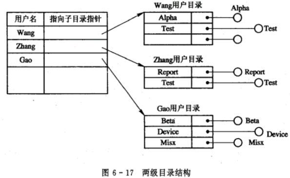
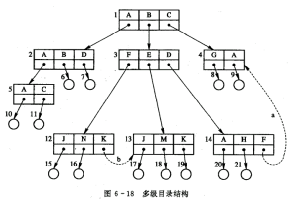

# Chapter6 文件

---

命题规律
  1. 文件存储空间的管理、混合索引下计算文件实际占用的磁盘空间、计算访问磁盘次数可以出综合应用题
  2. 其他知识点可以出单项选择题。
  3. 基础概念为理解题目的考核点的基础，必须理解到位
考核规律
 1. 本章客观题、应用题均易出
 2. 重点理解与掌握以下内容：文件系统原理；文件系统磁盘空间的分配与管理

---

## 知识结构

本章知识结构如下mermaid图所示
```mermaid
graph RL
a(文件管理) --> b1(文件结构)
a --> b2(管理策略)
b1 --> d1(基本概念)
b1 --> d2(逻辑结构)
b1 --> d3(物理结构)
b2 --> d4(目录管理)
b2 --> d5(文件存储空间管理)
b2 --> d6(文件共享与保护)
d1 --> e1(属性)
d1 --> e2(分类)
d2 --> e3(有结构)
d2 --> e4(无结构/流式文件)
d3 --> e5(顺序文件)
d3 --> e6(链接文件)
d3 --> e7(索引文件)
d4 --> e8(文件控制块PCB)
d4 --> e9(目录结构)
d4 --> e10(路径)
d5 --> e11(连续方式)
d5 --> e12(链接方式)
d5 --> e13(FAT)
d5 --> e14(NTFS)
d5 --> e15(索引方式)
e3 --> f1(记录长度)
e3 --> f2(记录组织)
e5 --> f9(隐式链接文件)
e5 --> f10(显式链接文件)
e6 --> f11(单级索引文件)
e6 --> f12(多级索引文件)
e6 --> f13(混合索引文件)
e11 --> f3(数据结构)
e11 --> f4(实现方法)
e12 --> f3
e12 --> f4
e13 --> f3
e13 --> f4
e14 --> f3
e14 --> f4
e15 --> f6(单级索引)
e15 --> f7(多级索引)
e15 --> f8(增量索引)
f1 --> g1(定长记录格式)
f1 --> g2(变长记录格式)
f2 --> g3(顺序文件)
f2 --> g4(索引文件)
f2 --> g5(索引顺序文件)
f2 --> g6(直接文件)
f2 --> g7(散列文件)  
```

---

## 文件与文件系统

### 文件结构

一些基本的概念名词说明：
1. 数据项：数据项是最低级的数据组织形式，分为基本数据项和组合数据项
    - 基本数据项，又称为字段，数据组织中可以命名的最小逻辑单位，用于描述一个对象某种属性的字符集，除了数据名外，还应该有类型，而且每个字段都具又 一个唯一值
        - 字段具有长度以及数据类型两个属性，长度分为固定长度与可变长度
        - 字段的值：实体在字段上的数据，例如学号，姓名等。
    - 组合数据项，又称为组项，由若干基本数据项组成。例如工资是由绩效工资加上基础工资等项目组成
2. 记录：是一组相关字段的集合，是应用程序的可处理数据单位，描述对象某方面的属性
    1. 记录长度：固定长度，可变长度
    2. **关键字**是唯一能够标识一个记录的数据段
3. 文件：文件时存访于外存中、具有文件名的一组相关信息的集合，是文件系统的**最大单位**，描述一个对象集。文件具有以下四项属性
    - 类型：源文件、目标文件、可执行文件等
    - 长度：用字节数描述的、文件包含字符数，也可以用字，块等去描述
    - 物理位置：文件所在设备以及在设备中的地址指针等
    - 建立时间：文件最后一次修改的时间
4. 命名
    1. 主文件名
    2. 文件拓展名
        - 文件拓展名又称后缀名，主要用来指示文件的类型

---
### 文件类型
1. 按照用途分类
    1. 系统文件：系统文件是由系统软件构成的文件，一般允许用户调用，但不允许读和修改，有些系统文件不对用户开放
    2. 用户文件：用户文件包含用户的源文件，目标文件以及可执行文件等，用户文件委托系统管理
    3. 库文件：  库文件是由标准子例程以及常用例程构成的文件。允许用户调用，但不允许修改 
2. 按照文件中的数据的形式分类
    1. 源文件：原文件是由终端或输入设备输入的源程序和数据所形成的文件（通常情况下为汉字或者ASCII码组成）
    2. 目标文件：目标文件是源程序经过编译程序编译后的文件（一般目标文件的后缀名为.obj）
    3. 可执行文件：可执行文件是编译后所产生的的目标代码经过链接程序连接后所形成的文件（一般可执行文件的后缀名为.exe/.com Etc..）
3. 按照存取控制属性分类
    1. 只读文件
    2. 只执行文件：只允许被核准的用户调用执行，不允许读和写
    3. 读写文件
4. 按照逻辑结构分类
    1. 有结构文件：一般是由一系列**记录**组成。
    2. 无结构文件：一般是由**字节流**组成
5. 按组织形式与处理方式分类
    1. 普通文件: 是由ASCII码或二进制码组成的文件，包含用户建立的源程序文件、数据文件、操作系统自身代码文件、实用程序
    2. 目录文件: 文件目录组成的文件。
    3. 特殊文件：系统的各类的I/O设备。

---
### 文件系统

文件系统的内容包括
- 操作系统中的各类文件、管理文件的软件，以及管理文件所涉及到的数据结构等信息的集合
- 少数文件系统从操作系统中分离出来，独立于操作系统存在，绝大多数操作系统都包含文件系统部分

文件系统设计目标

- 有效地组织管理文件
  - 需要设计相应的管理数据结构来组织管理这些文件集，数据结构包括文件控制块、文件目录
  - 为加快访问速度，需要相应有一套的缓存管理机制
- 提供方便的用户接口
  - 文件系统会提供若干访问文件系统的系统调用或系统命令 ，用户能够方便有效地使用文件系统提供的功能 

文件系统的层次结构，包含以下三个层次
1. 最底层
    1. 包含对象及属性
    2. 文件管理
    3. 磁盘（磁带）存储空间
2. 中间层
    1. 对对象**进行操作**的管理的**软件**的集合
    2. 文件管理的**核心**部分，实现了文件系统的**大部分功能**。
        - 包括文件存储空间管理
        - 文件目录管理
        - 文件地址转换机制
        - 文件读写管理
        - 文件共享与保护
    3. 软件层次
3. 最高层
    1. 文件系统接口
    2. 包括命令接口与程序接口
服务接口是用户程序和文件系统的接口，用户程序可以通过系统调用取得文件系统的服务。

---
#### 文件系统模型

用户（程序）-->文件系统接口 --> 对对象操作和管理的软件集合 -->对象及其属性

屏蔽底层数据的不同特点，HAL 硬件抽象层（Hardware Abstraction Layer）

| 文件系统实现模型 | 描述                                                         |
| ---------------- | ------------------------------------------------------------ |
| 文件系统接口     | 命令、系统调用和图像窗口                                     |
| 逻辑功能层       | 访问存储介质的物理参数，形成响应的驱动命令，启动实施IO操作   |
| 物理驱动层       | 将逻辑功能层发下的命令转化为相应的驱动程序，完成文件物理存储设备的处理 |

- 对象及其属性 文件、文件目录、外部存储设备
- 管理软件的集合 存储空间、目录、地址映射、共享保护
- 文件系统接口 命令、系统调用

---
#### 文件系统与数据库管理系统区别与联系

1. 数据库管理系统中定义的各种数据结构对文件系统透明，文件系统只处理**无结构、无格式**的字节流
   - 关系型数据库 非结构化数据库 NoSQL
     - SQL(结构化查询语言) 
     - BigData 大部分属于非关系型数据 非结构化
       - MongoDB HBase
   - 文件系统给数据库管理提供“记录——流转换”接口
   - 无论文件系统是在操作系统中还是操作系统上，数据库管理系统DBMS过于依赖文件系统都需要构建在文件系统之上。这种数据库性能不高
2. 为了提高数据库性能，数据库管理系统不依赖于操作系统提供的文件系统，独立的数据组织及存取机制，直接操纵文件存储设备，存储管理程序大多能提供一些低级接口

---
### 文件操作
基本操作
    - 创建
    - 删除
    - 读
    - 写
    - 截断
    - 设置文件的读/写位置
文件操作
    - 打开文件
    - 关闭文件
其他操作
    - 文件属性操作
    - 实现文件共享的系统调用
    - 对文件系统进行操作的系统调用

---
## 文件的结构
文件系统设计的关键就是记录构成文件的方法，以及如何将一个文件存储到外存上的方法，任何一个文件都存在着两种形式的结构，如下所示。

文件的逻辑结构：从用户的观点出发，所观察到的文件组织形式，是用户可以直接处理的数据及其结构，独立于文件的物理特性，又称为文件组织。

特别的：**文件的逻辑结构与物理结构均会影响文件的检索速度**

1. 逻辑结构
  - 用户的观点
    - 顺序
    - 索引
  - 独立于物理特性
2. 物理结构
  - 系统的观点 硬件
    - 空闲空间
    - 占用空间
  - 具体物理组织形式

### 文件的逻辑结构

- 有结构文件
  - 一系列记录组成
  - 记录可以是定长，也可以是变长
  - 记录的组织形式
    - 顺序
    - 索引
    - 顺序索引
    - 哈希
- 无结构文件
  - 流式文件
- 半结构
  - 异步加载的网页

  结构化文件与流文件的联系：硬件都是块设备，所以需要进行流到块的转换
  
  一般的，对于文件逻辑结构一般有以下三点要求
  1. 有助于提高文件的检索速度
  2. 方便对文件的修改
  3. 降低文件在外存的存储费用，包括减少文件占用的存储空间，不要求大片的连续空间

#### 结构文件
1. 结构文件
    1. 定长记录文件
        - 文件中所有记录的长度相同，是较为常用的记录格式，所有记录数据项在记录中的顺序相同，且数据项顺序相同，数据项长度相同，文件长度用记录数表示
        - 优点是能够有效提高记录检索的速度和效率，方便文件的处理与修改。 
    2. 不定长记录文件
        - 文件中各记录的长度不相等，原因是不同记录所包含的数据项数量不同
        - 不定长记录文件检索速度较慢，不便于文件的处理与修改。
2. 无结构文件
    - 无结构文件时有字符流组成的文件，所以又称之为流式文件，长度以字节作为单位。
    - 对流式文件的访问，采用**读写指针**指出下一个要访问的字符和方式。可以将流式文件作为记录文件的特例：一个记录包含一个字节

---
#### 顺序文件

顺序文件定义：顺序文件是由一系列记录按照**某种顺序**排列而成的文件。记录长度**可定长**，也可**变长**，但是通常为**定长记录** 

逻辑顺序可按不同顺序排列
1. 串结构：记录按照存入时间排列
2. 顺序结构：记录按照关键字排列

顺序结构的优点：顺序文件的最佳应用场合，是在对诸记录进行批量存取时， 即每次要读或写一大批记录

数据结构的缺点：在交互应用的场合，如果用户(程序)要求查找或修改单个记录，为此系统便要去逐个地查找诸记录。这时， 顺序文件所表现出来的性能就可能很差， 尤其是当文件较大时， 情况更为严重

可以对顺序结构进行优化：如果想增加或删除一个记录， 都比较困难。为了解决这一问题， 可以为顺序文件配置一个运行记录文件(Log File)或称为事务文件(Transaction File)， 把试图增加、 删除或修改的信息记录于其中， 规定每隔一定时间， 例如4小时，将运行记录文件与原来的主文件加以合并， 产生一个按关键字排序的新文件。

顺序结构的读写操作(针对定长记录与变长记录）如下图 5 -1 所示

---
#### 索引文件

索引文件适合用于**变长记录文件**的查找。

索引文件的建立方式
1. 按照关键字建立索引
2. 配置具有多个索引表的索引文件（每一种可能成为检索条件的域配置一张索引表）

对于定长记录文件，如果要查找第i个记录， 可直接根据下式计算来获得第i个记录相对于第一个记录首址的地址
$$
A_i=i\times L
$$
对于可变长度记录的文件，要查找其第i个记录时，须首先计算出该记录的首地址。为此，须顺序地查找每个记录，从中获得相应记录的长度Li，然后才能按下式计算出第i个记录的首址。假定在每个记录前用一个字节指明该记录的长度
$$
A_i=\sum^{i-1}_{i=0}{L_i+i}
$$

索引文件的直至情况如下图 5-2 所示

##### 索引顺序文件

索引顺序文件是对**顺序文件**的一种改进，基本克服了变长记录的顺序文件不能随机访问，不便于记录的插入于删除的缺点，保留了顺序文件的关键特征，即记录按照关键字的顺序组织。

索引顺序的特征
- 引入了文件索引表，通过该表可以实现对索引顺序文件的随机访问，增加了溢出文件，用来记录新增加、删除和修改的记录。

索引顺序文件的逻辑文件形式如下图 5-3 所示

索引顺序文件还可以建立多级索引表结构，节省空间

---
#### 直接文件或哈希文件

直接文件的定义：直接文件就是根据给定的关键字，直接获得指定记录的物理地址，称为直接文件。

哈希文件（散列文件），是目前应用最广泛的一种直接文件

散列文件的特点如下
1. 利用特定的**散列函数关键字**转换为相应记录的地址。
2. 为实现文件存储空间的动态分配，通常由散列函数所求得的并非是**相应记录的地址**，而是指向某一目录表**相应表目的指针**，该表目的内容**指向**相应记录所在的**物理块**。
3. 通常会将**散列函数**作为**标准函数存放于系统中**，以供存取文件函数调用。

哈希文件的逻辑结构图如下图 5-4 所示 

---
### 外存（磁盘存储器）组织方式

首先需要了解一个重要的概念-簇
- 簇是若干相邻扇区组合而成的磁盘分配单位，是操作系统管理磁盘的单位之一，每个簇可包含2、4、8、16、32或64个扇区，簇是操作系统使用的**逻辑概念**，扇区是磁盘的**最小物理存储单元**

外存的组织方式分为以下几种
1. 连续组织方式
2. 链接组织方式
3. FAT文件组织方式
   1. FAT12 ,4096 个表项
   2. FAT16 2B,最高磁盘2GB（64簇X32KB/簇）
   3. FAT32 4B，最高磁盘2TB（64M簇X32KB/簇）
4. NTFS文件组织方式
   1. 记录大小固定为1KB，每行称为该行所对应的元数据，也称为文件控制字
5. 索引组织方式

---
### 文件的物理结构

概念定义：文件的物理结构又称为文件的存储结构，指文件在外存上的组织形式，与存储介质的存储性能和采用的外存分配方式有关。

选择文件物理结构要考虑的主要问题有：
1. 有效利用外存空间
2. 提高对文件的访问速度

一般一个文件系统只采用**一种**物理结构

文件的物理结构与外存的分配算法有关，不同的分配方式形成不同的文件物理结构。

文件存储空间的分配方式大概有以下几种：

都存在一张分配表：文件名 索引块号

- 连续分配：物理结构

  - 修改空间分区表，compact紧凑
  - 不方便追加数据

- 链接分配

  - data和指针，指针指向下一块的位置
  - 必须从头开始查找

- 索引分配

  - 文件存一列索引，按顺序索引块就可以得到整一块文件
  - 可以进行多级索引，大文件存取

  - 需要一个索引表

- 基于可变分区的索引分配

  - 当文件较大时，索引块存储一张包含 起始块号 分区长度 的索引表

由上述分配方式，对应的文件物理结构由下面各点进行阐述。

#### 连续分配

连续分配以该方式管理的文件称为**连续文件**。为每个文件分配连续的存储空间 

- 优点
  - 简单、容易实现
  - 对于顺序文件，能很快检索文件中的数据块,连续读/写多个数据块内容时，性能较好
- 缺点
  - 它不利于文件尺寸的动态增长
  - 该分配方案可能会导致磁盘碎片，严重降低外存空间的利用率

#### 链接分配

为文件分配非连续的若干数据块，数据块之间用指针相连，这种分配方式称为链接分配，以该方式管理的文件称为**链接文件**

分配的优点:

- 链接分配技术不要求文件存储到彼此相邻的数据块中，消除连续分配引起的碎片，提高了外存空间的利用率
- 链接分配技术还能适应文件尺寸的动态增长

缺点

- 链接分配技术适合于文件的顺序存取，但对于随机存取却相当低效
- 打破了局部性原理

### 索引分配

1. 利用专门的索引块存储索引信息
2. 一个数据块容纳不了一个文件的所有分区时，需要若干个索引结点进行存储，建立二级索引或多级索引
3. 索引分配方式决定了文件的物理结构是索引文件结构，该文件称之为**索引文件**

基于数据块进行分区的索引分块如下图 5-5 所示

优点：

- 索引分配方法支持文件的直接存取
- 索引分配能满足文件的动态增长需要，只需要更新索引结点的内容，就可以把新增加的分区记录下来
- 利用多级索引，可以支持大型文件的存取

缺点：

- 建立一个索引表占存储空间

---
#### 基于可变分区的索引分配

基于可变分区的索引分配如下图 5-6 所示

所形成的文件仍叫**索引文件**

---
### 目录管理

概念定义：文件目录是一种数据结构，用于标识系统中的**文件**及其**物理地址**，是对文件进行有效管理的方法，供检索使用.

对目录管理的要求如下 ：

1. 实现“按名存取”
   - “按名存取”是目录管理的**基本功能**,是文件系统向用户提供的**最基础**的服务 
2. 提高对目录的检索速度
   - 提高对目录的检索速度，是设计大中型文件系统追求的主要目标，通过合理组织目录结构加快目录的检索速度，提高文件的存取速度 
3. 文件共享
    - 多用户系统允许多个用户共享一个文件，外存仅保留一分共享文件副本。其优点是节省大量存储空间，方便用户，提高文件利用率。
4. 允许文件重名
  - 系统应该允许不同用户对不同文件采用相同的名字，优点是便于用户按照自己的使用习惯修改文件名称

#### 文件控制块
当一个文件被进程打开以后，系统将在内存中为之建立一个称为“文件控制块FCB(File Control Block) ”的数据结构，用于记载文件在内存中的使用情况 
- FCB的地址将被记录到它的PCB中，以利于以后进程对它的使用
- 文件系统将把文件目录项和文件分配表中的全部或大多数信息，以及当前使用文件的有关信息，填入文件控制块FCB中

FCB中通常至少包含下列三种信息
1. 基本信息类
2. 存取控制信息类
3. 使用信息类

 **FCB包含目录项，FCB不等于目录项**

典型FCB

| 文件名                       | 文件标识符           |
| ---------------------------- | -------------------- |
| 文件结构                     | 文件类型             |
| 文件组织                     | 记录长度             |
| 当前文件大小                 | 最大文件尺寸         |
| 文件设备                     | 物理位置             |
| 存储控制                     | 口令                 |
| 文件建立时间                 | 最近存取时间         |
| 最近修改时间                 | 当前存取方式         |
| 当前的共享状态               | 共享访问是的等待状态 |
| 进程访问文件所用的逻辑单元号 | 当前的逻辑位置       |
| 访问元素的当前物理位置       | 下一个元素的物理位置 |
| 缓冲区大小                   | 缓冲区地址           |
| 指向下一个FCB的指针          | 文件创建只           |
| 临时/永久文件                | 文件拥有者           |

#### 目录结构

目录结构的组织，不仅关系到文件系统的**存取速度**，还关系到文件的**共享性**和**安全性**。

常见的目录结构有以下几种
1. 单级目录结构
2. 两级目录结构
3. 树形目录结构

下面开始逐一介绍

---
##### 单级目录结构
单级目录是**最简单的**文件目录

整个系统中，所有用户的全部文件目录保存在一张目录表中，**每个文件的目录项占用一个表项**

目录项中主要记载的信息有：文件名及扩展名，文件的物理地址，其它属性，如文件长度、建立日期、文件类型等

单级目录的优点：简单且能实现目录管理的基本功能——按名存取

单级目录缺点：

- 查找速度慢
- 不允许重名
- 不便于实现文件共享

---
#####  两级目录结构
为每一个用户建立一个单独的用户文件目录(UFD),UFD由该用户所有文件的文件控制块组成.再建立一个主文件目录(MFD),每个用户目录文件占有一个目录项，包括用户名和指向用户目录文件的指针。

两级目录结构的示意图如下图 5-7 所示

两级目录结构优点：

1. 提高了检索目录的速度
2. 在不同的用户目录中，可以使用相同的文件名
3. 不同用户还可使用不同的文件名来访问系统中的同一个共享文件

存在的问题：
1. 各用户之间被完全隔离，无法进行交流合作

---
##### 树形目录结构

概念介绍：树形目录是现代操作系统中**最通用且实用**的文件目录为树形结构目录。树形目录可以明显地提高对目录的检索速度和文件系统的性能。**主目录**在这里被称为**根目录**，把**数据文件**称为**树叶**，**其它的目录**均作为树的**结点**，或者称为子**目录**

树形目录的结构示意图如下图 5-8 所示

 路径名：从树的根（即主目录）开始，把全部目录文件名与数据文件名，依次地用“/”连接起来，即构成该数据文件的路径名（path name）
   - 系统中的每一个文件都有惟一的路径名
   - 绝对路径是指，从根目录开始，遍历与文件名相连的子目录，连同文件名一起构成的文件路径表示方式
   - 当前目录：为每个进程设置一个“当前目录”，又称为“工作目录”进程对各文件的访问都相对于“当前目录”而进行，通常称为相对路径

树形目录的优点：
- 树形目录结构查询速度快，层次结构清晰，能够有效的进行文件管理和保护

树形目录的缺点：
- 路径逐级访问会增加磁盘访问次数，影响查询速度

目录操作
1. 添加删除目录
2. 增加目录：在用户要创建一个新文件时，只需查看在自己的UFD及其子目录中，有无与新建文件相同的文件名。若无，便可在UFD或其某个子目录中增加一个新目录项
3. 目录删除采用下述两种方法处理：
   - 不删除非空目录
   - 可删除非空目录
4. 改变目录
5. 移动目录：调整目录组织结构
6. 链接（LINK）操作：通过链接操作，让指定文件具有多个父目录，便于文件共享。
7. 查找操作：从根目录或当前目录开始查找，可以精确匹配或局部匹配

#### 目录查询技术
1. 查询流程
    - 系统根据用户提供的文件名对目录进行查询，找到该文件的FCB或者对应索引节点。根据FCB或索引节点中记录的文件物理地址，即盘块号，计算文件在磁盘的物理位置。通过磁盘驱动程序将所需的文件读入内存
2. 目录查询方式
   - 线性检索法，又称顺序检索法
   - 散列方法：如果建立了一个散列索引文件目录，则可以使用此方法进行查询
     - 解决散列冲突的方法
       1. 目录表的相应**目录项为空**，表示系统**不存在指定的文件**
       2. 目录表的相应目录项的文件名和指定文件名**匹配**，表示**查找成功**，可以从中得到**文件存放的物理地址**
       3. 目录表的相应目录项的文件名和指定文件名**不匹配**，表示发生了**哈希冲突**，将当前散列值增加一个和**目录长度互质**的常数，重新开始查找

---
#### 提高文件访问速度的途径
1. 改进文件的目录结构以及检索目录的方法，以减少对目录的查找时间
2. 选取好的文件存储结构，以提高对文件的访问速度
3. 提高磁盘I/O速度，使得文件数据**快速**在磁盘和内存之间传送
   
---
### 文件的共享与保护

#### 文件的共享

概念介绍：现代操作系统**必须提供**文件共享手段，允许多个用户、进程共享同一个文件，这样系统只需要保留该共享文件的一个副本即可。

文件共享的有效控制需要考虑同时存取和存取权限问题

- 控制存取权限就是控制授权用户以合法的方式访问文件 
- 允许多个用户同时读文件内容，但不允许同时修改，或同时读且修改文件内容

当用户修改文件内容时，将整个文件作为临界资源，锁定整个文件，不允许其他共享用户同时读或写文件，解锁后才能读或写文件

- 也可以仅仅锁定指定的一条记录，允许其他共享用户读/写该文件的其它记录

两种文件共享的主要思路
1. 基于有向无循环图(DAG)的文件共享
   1. 有向无循环图（DAG）
      1. 树形结构和共享
      2. 允许一个文件可以有多个父目录，即有多个属于不同用户的目录同时指向同一个文件。（此方法为非树形方法，破坏了树的特性）
   2. 基于索引节点的文件共享
      1.在树形结构的目录中，当有两个或多个目录要共享一个子目录或者文件时，必须将共享文件或目录同时连接到两个或多个用户目录中，此时，该文件系统的目录结构已经不再是树形结构，而是有向非循环图结构

      利用索引节点实现文件共享的情况图如下图 5-9 所示

       

2. 基于符号链接的文件共享

---
#### 文件的保护

1. 影响文件安全性的主要因素
   1. 人为因素：人有意或无意的行为，可能导致系统中的数据遭受破坏或者丢失
   2. 系统因素：系统某部分出现异常导致的数据破坏或丢失；磁盘出现故障，影响难以估量
   3. 自然因素：随着时间的推移，存放于磁盘的数据会逐渐消失（HDD的磁道老化，SSD的数据掉电自然消失）

2. 确保文件系统安全的措施
   1. 容错机制
      1. 采取系统容错技术，防止系统故障造成的文件不安全性
   2. 后备系统（容灾备份）
      1. 通过建立后备系统，防止由于自然因素造成的文件不安全性
   3. 存取控制机制
      1. 通过存取控制机制，防止人为操作因素造成的文件不安全性
   
 ---  
##### 基于存取控制机制的文件保护方式
1. 保护域机制
   1. 访问权：进程能对某对象执行操作的权利，由系统控制
   2. 保护域：是对系统中的资源进行保护，是进程对一组对象访问权的集合。进程只能够在指定域内执行操作，域规定了进程所能够访问的对象以及能执行的操作。
   3. 进程和域间的静态联系
      1. 进程和域之间一一对应，即一个进程只联系一个域
      2. 在整个进程的生命周期中，其可用资源是固定的，称为“静态域”
   4. 进程和域间动态联系
      1. 进程和域之间为一对多关系，即一个进程可以联系多个域
      2. 将进程的运行分为若干阶段，每个阶段联系着一个域，资源因为各个阶段的不同而不同，故称为“动态域”
2. 访问矩阵机制
   1. 利用基本的访问矩阵（利用矩阵描述访问权限）