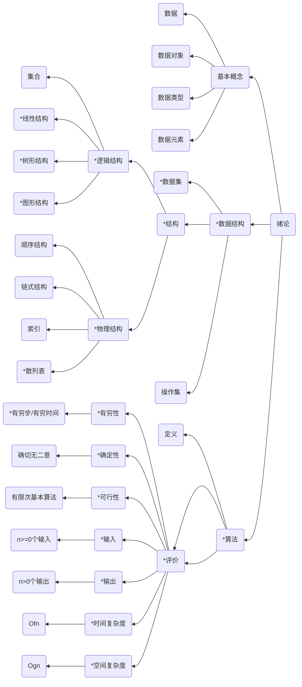

# Chapter1 绪论

---

本章特别注意顺序存储结构与查找、排序两章联合命题，以及链式存储结构的综合应用

---
## 知识结构

本章的知识结构mermaid图如下所示，其中带有`*`号的为重点内容

---

## 基本概念

1. 数据：客观事物的符号表示，指所有能输入到计算机中并被计算机程序处理的符号
2. 数据元素：又称结点，是数据的基本单位，在计算机中通常作为一个整体进行处理。
3. 数据项: 又称属性，指数据中具有独立意义的、不可分割的最小单位
4. 数据对象: 性质相同的数据元素的集合.
5. 数据类型：一组性质相同的值集合以及定义在该集合上的一组操作的总称
6. 抽象数据类型：Abstract Data Type，简称ADT,指一个数学模型以及定义在该模型上的一组操作
7. 逻辑结构：数据元素之间固有的逻辑关系。该关系与计算机无关，是人的思维层面对现实世界数据之间关系的理解
8. 存储结构：逻辑结构在计算机中的表示，也称为物理结构，不同存储结构对数据处理效率具有较大影响
9. 数据结构：相互之间具有特定关系的数据元素的集合，包括数据集、结构(逻辑结构、物理结构)以及施加其上的操作集
10. 算法：解决特定问题的有限指令的集合

---
## 两个复杂度
---

程序 = 算法 + 数据结构

### 时间复杂度 $O(f(n))$

计算大致数量级即可 $T(n) = O(f(n))$

$算法的执行时间=\sum算法中基本操作执行次数\div该操作执行时间$

常见的复杂度
1. 常量阶

$T(n)=O(1)$

        x=x+1

2. 线性阶

$T(n)=O(n)$

        for (i=1;i<=n;i++)
            x = x+1

3. 平方阶

$T(n)=O(n^2)$

        for(i=1;i<=n;i++)
            for(j=1;j<=n;j++)
                x = x+1
        
        //判断语句不算阶
        for(i=1;i<=n;i++)
            for(j=1;j<=n;j++)
                if(a[i]<b[i]) 
                    m = a[i]
                    a[i] = b[j]
                    a[j] = m 
4. 立方阶

$T(n)=O(n^3)$

        for(i=1;i<=n;i++)
            for(j=1;j<=n;j++)
                for(k=1;k<=n;k++)
                    x = x+1

**由上可知**时间复杂度以最大语句频度来进行估计，不考虑算法中其他语句频度

## 不同时间复杂度的比较
1. 多项式级：O（1）< O(n)
2. 对数级: O($log_2n$)< O($nlong_2n$)
3. 平方立方级 O($n^2$)<O($n^3$)
4. 指数级 O($2^n$)<O($n^n$)

时间复杂度的综合比
O(1)<O($log_2n$)<O(n)<O($nlog_2n$)<O($n^2$)<O($n^3$)<O($2^n$)<O($n^n$)

### 空间复杂度 $O(g(n))$

概念介绍：空间复杂度是算法对应程序在机器执行过程中所占用的临时存储空间，包含三个部分
1. 算法本身所占用的存储空间
2. 输入数据所占用的存储空间
3. 算法在运行过程中临时占用的存储空间  :star:

一般前两项与算法无关，所以算法的空间复杂度仅考虑第三部分，即临时占用的存储空间，以

$S(n)=O(g(n))$ 表示