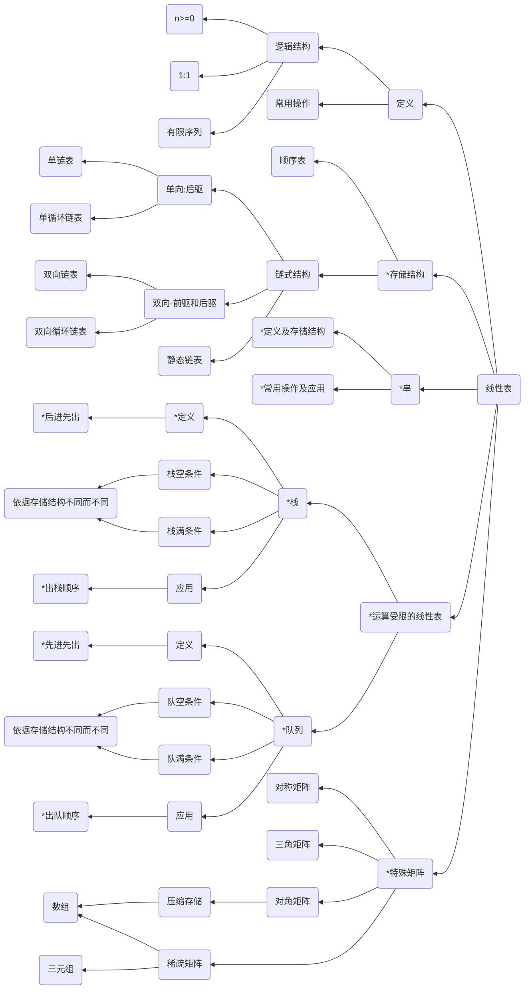

# 线性表
---

顺序存储结构、链式存储结构的操作细节出客观题，链表操作的综合应用出主观题

本章需要注意以下几点
1. 顺序存储结构与查找、排序两章联合命题
2. 链式存储结构的综合应用
3. 栈、队列的特点以及应用
4. 串的特点、存储以及应用
5. 特殊矩阵的存储以及应用

**2021**修改考纲，:x:线性表的定义与基本操作-->:star:增添线性表的基本概念

:warning:增加 --> 多维数组的存储，应用改为栈、队列、数组的应用

---

## 知识结构

本章的知识结构mermaid图如下所示，其中带有`*`号的为重点内容

一些小概念（tips）
- 对于一个循环链表来讲，定义尾结点既能表示最后一个结点，又能标识头结点（RLtail -> NEXT = head），即循环列表中，尾指针必指向链表头
- RLink 前驱结点 LLink 后继结点
- 删除双向链表中的某个元素的方法：
  1. 后继结点的前驱结点做原来的前驱结点
  2. 前驱结点的后继结点做原来的后继结点
- 由于不能随机访问，因此在链表中指定位置插入元素实现意义并不大，一般的链表也采用较为简便的**头插法**与**尾插法**解决元素插入问题
- 特别的，在进行插入操作与删除操作时，均需要先找到前驱结点才可以实现操作
- 链表可分为静态链表与动态链表，他们的区别在于使用时能不能临时调整范围
- 带头结点时，一般需要先跳过头结点后再进行正常的运算（*P = P-> NEXT）
- 一般再插入元素时，以P，Q进行标记，Q一般指向待插入节点的前驱结点。
- 栈只能在固定端进行插入和删除操作的线性表，固定端称之为栈顶，不能进行操作的一端称之为栈底
  - 栈满与栈空的条件依赖于不同的存储结构
  - 入栈与出栈是通过修改栈顶指针完成的
  - 栈顶指针将作为栈存储的计量单位
  - 确定入栈顺序并不能确定出栈顺序（出了还可以再入.....）:star:
  - 队头指针可能指向队首元素存放的位置，也可能指向队首元素位置的**前一个位置**
  - 队尾指针可能指向队尾元素存放的位置，也可能指向队尾元素位置的**下一个位置**
  - 由于出队与入队要采用同加同减操作，随着入队与出队的随机进行，可能会发生**假溢出**情况，即队尾已经达到最大值，无法入队，但是队列中仍存在空闲单元的情况
- 特殊矩阵，一般拥有两种排列方式
  - 行优先排列，公式为 $a[i][j].addr = a[0][0].addr + (i*n+j)*sizeof(eleType)i\in[0,m-1],j\in[0,n-1]$
  - 列优先排列，公式为 $a[i][j].addr = a[0][0].addr + (j*m+i)*sizeof(eleType)i\in[0,m-1],j\in[0,n-1]$

a[i]][j] 在一维存储空间的相对位置为第 j*m+i 个结点

稀疏矩阵的存储方式
1. 三元组（空间顺序存储）
2. 十字链表存储（节省空间->当系数矩阵中非0元素的个数和位置在操作过程中变化较大时使用）
  - 十字链表的数据结构共有五个组成部分
    1. 总行数mu
    2. 总列数nu
    3. 非0元素个数tu
    4. 列数组指针 cHead (down域)
    5. 行数组指针 rHead （right域）

串是**数据元素**为**字符类型**的特殊线性表，通常作为整体参与处理

1. 串：又称为字符串，由用双引号扩起的0个或多个字符组成的有限字符序列。
2. 子串：字符串（主串）中任意多个**连续**字符所组成的子序列，串中第1个字符在主串中的位置，又称为该子串在主串中的位置
3. 特别注意一点**串中必须留有串终止符的位置**
4. 串同样有两种存储方式
   1. 顺序存储（要求空间有序性）
      1. MAX_STR_LEN太小容易存储过程时发生溢出，丢失有效字符
      2. MAX_STR_LEN太大造成空间浪费
   2. 链式存储（不要求空间有序性）

模式匹配 2种算法
1. 一般匹配算法--->暴力求解
2. KMP算法 --> 对回溯进行优化的算法(没必要回退至初始位置)

TIPS:
1. KMP算法，永不回退主串位置I，而使用一组记录了已匹配信息的next来指示下一步要跳转到哪儿里