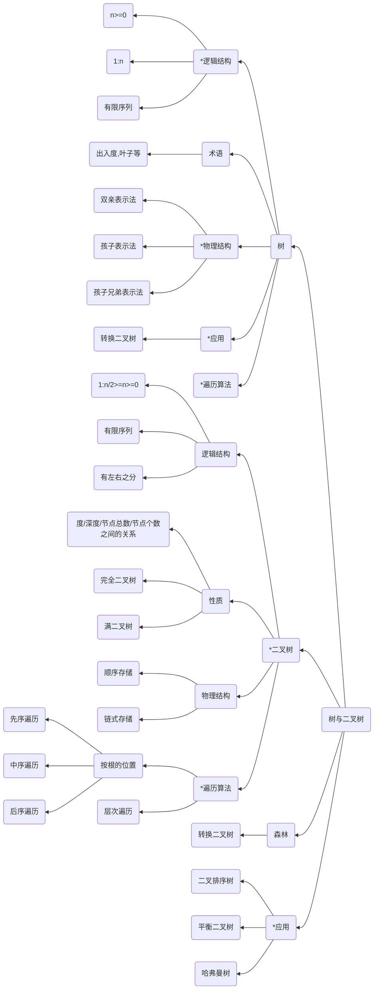

# Chapter3 树论

---

本章需要注意熟练以下几个考点
1. 树的相关概念、二叉树的性质、二叉树的遍历、线索二叉树、二叉排序树、平衡二叉树、树与森林的相关知识等易出客观题
2. 二叉树的顺序存储结构易和堆排序等结合出主观题
3. 二叉排序树。平衡二叉树易和查找联合出题
4. 需要深刻理解基本概念，性质、存储结构特征。遍历核心思想等，并在深入理解基本概念的基础上，熟练掌握其特征与应用

---

## 知识结构

本章的知识结构mermaid图如下图所示，其中标`*`号的为重点掌握内容

---

一些TIPS:
1. 树有且仅有一个特定的称为**根**的结点
2. 当n≥1时，其余结点可分为m(m>0)个互不相交的有限集合T1,T2......Tm,其中，每个集合本身又是一棵树，并且称其为根的子树
3. 如果各子树的位置不能交换，则称之为**有序树**，反之，则称之为**无序树**

3种树的表示方法
1. 双亲表示法
2. 孩子结点表示法
3. 孩子兄弟表示法（左指针指向孩子，右指针指向兄弟，先孩子再兄弟）

几个重要的树论命题
1. 任何二叉树的第i层，最多拥有$2^{i-1})$个结点，其中i>=1
2. 深度为K的二叉树，最多拥有$2^k-1$个结点，其中k>=1
3. 对于任何一颗二叉树，如果其终端结点（度为0）的个数为n0，度为2的结点个数为n2,则有$n0=n2+1$
4. 具有n个结点的完全二叉树的深度为$log_2n+1$
5. 如果对一颗具有n个结点的**完全二叉树**的结点按照层次编号(从第一层开始到最外层，每层编号顺序从左到右)，则对该**完全二叉树**的任一结点i有：
   1. 如果i=1，则结点i是二叉树的根节点，无双亲
   2. 如果i>1, 则其双亲parent(i)为结点[I/2]
   3. 如果2i>n, 则结点i无左孩子；否则其左孩子LChild(i)为第2i个结点
   4. 如果2i>n+1， 则结点i无右孩子；否则其右孩子RChild(i)为第2i+1个结点
6. 深度为k且包含 $2^{k-1}$个结点的二叉树又称为满二叉树（即除第一行外，结点已经满了的二叉树）
7. 深度为k，且含有n个结点的二叉树，当且仅当其每个结点的编号与相应满二叉树结点的编号从1到n相互对应时，才称此二叉树为完全二叉树

二叉树同样有两种存储方法
1. 顺序存储
2. 链式存储

顺序存储因为即便实际上树并没有那么多子树，但是根据顺序存储特点，仍需要为树预留可以储存子树的空间，因此顺序存储会浪费许多空间

深度为K的二叉树最少要有K个结点，如若采用顺序存储结构，深度为K的二叉树至少需要$2^{K-1}$个数组元素的存储空间(存储在第K层，且第K才能够只有最左边一个节点)，至多需要$2^k-1$个结点(即构成满二叉树)

综上所述，若采用顺序存储结构，深度为K的二叉树至少需要的数组元素和至少包含的结点个数之间的差为$2^{k-1}-1$，也就是可能会浪费$2^{k-1}-1$个数组元素的存储空间

所以顺序存储结构适用于满二叉树或者完全二叉树，并不适用与一般二叉树(因为在顺序结构中，只有满二叉树或者完全二叉树才可以有效的利用存储空间去存放树中的结点，其余普通二叉树可能会造成空间上的浪费，即存储NULL结点)

链式存储是解决在顺序存储中，普通二叉树占据空间太大以及动态变化的二叉树而创造的。链式二叉树的主要结构有，**二叉链表**与**三叉链表**

二叉链表
- 拥有左右孩子指针域，以及数据存储域
- 因此，结构特点有利于查找某结点的左右孩子结点，但是求某结点的双亲结点不太方便

三叉链表
- 除了拥有左右孩子指针域、数据存储域外，还拥有双亲指针域
- 弥补了二叉链表的缺点，求双亲结点也很方便

三种顺序遍历二叉树（递归遍历）
1. 先序遍历（根-左子树-右子树 - TLR）
2. 中序遍历（左子树-根-右子树 - LTR）
3. 后序遍历（左子树-右子树-根 - LRT）

除了访问跟结点时以外，每访问一个结点都需要递归调用一遍自身遍历，直至最后抵达不可继续遍历为止

线索二叉树

即优化了存储，使特定的叶子结点能够存储额外的结点信息，便于查找，实现步骤
1. 无左孩子，将其**左链域**的值修改为其**前驱结点**的地址
2. 无右孩子，将其**右链域**的值修改为其**后继结点**的地址
3. 对遍历序列的**首元素**的**左链域**和**最后一个元素**的右链域做链接处理(值得注意的是指向首元素，不一定是指向ROOT结点，因为ROOT结点不一定是遍历方法的首元素)

特别注意以下几点(前序，中序线索二叉树较为简单，以下指后序线索二叉树)
1. 结点x为二叉树的根，则其后继为空。->后序中，根为最后一个查找对象
2. 结点x为其双亲的右孩子，或为其双亲的左孩子且其双亲没有右子树，则其后继为其双亲结点
3. 结点x为其双亲的左孩子，或其左孩子有右子树，则其后继为双亲的右子树上按后序遍历列出的第一个结点

能够快速找到结点后继的存储结构为三叉链表，每个结点包含四个域：
1. 值域
2. 指向其左子树根节点的指针
3. 指向其右子树根节点的指针
4. 指向其双亲节点的指针

---
二叉排序树

依据中序遍历的有序特点创造的一种特殊二叉树（左->根->右）

若为递增序列，左子树放小，右子树放大

若为递减序列，右子树放小，左子树放大

**无论**序列是递增或者是递减，该树都可以称之为二叉排序树

---
平衡二叉树

平衡二叉树，又称为AVL树，为在同等条件下、高度或深度最小的**二叉排序树**

具有以下特点
- 其左右子树都是平衡二叉树
- 左、右子树的深度之差的**绝对值不超过1**

**平衡因子(Balance Factor,BF)**：是二叉树某个结点的**左子树**深度-**右子树**深度的差，平衡二叉树中任何结点的平衡因子只可能是 -1、0、1 这三种可能（因为平衡二叉树性质限制）

插入结点时，可能会发生失衡情况，此时需要重新调整树形结构，使之恢复平衡。恢复时只需要对最小不平衡子树进行处理即可，可以通过旋转完成平衡，旋转共有4种情况
1. LL平衡旋转（顺时针）-LL平衡旋转不会改变其他结点的BF
2. RR平衡旋转（逆时针）--RR平衡旋转不会改变其他结点的BF
3. LR平衡旋转 (先以插入结点为轴逆时针旋转一次，再顺时针旋转一次) --LR平衡并不会改变其他结点的BF
4. RL平衡旋转 （先以插入结点为轴顺时针旋转一次，再逆时针旋转一次） --RL平衡并不会改变其他结点的BF

---
哈夫曼树

构树
1. 将给定的n个值，按照从小到大顺序排列
2. 每次选出最小的两个值，组合形成一个新的值，新的值加入队列
3. 重复1-2 步骤，直至队列只含有唯一一个元素为止

编码
1. 从根节点出发，到叶子结点为止，左0，右1
2. 完成最后编码

WPL(树的带权路径长度计算)：所有叶子结点的带权路径长度之和

---
树与森林

1. 树与二叉树转换，即用右子树表示同一层次的兄弟结点
2. 森林与二叉树转换，即用右子树表示同一层次的树的根节点

树的遍历
1. 先根遍历：先访问树的根节点，在一次先根遍历每个根的子树
2. 后根遍历：先后根遍历根节点的每个子树，最后访问根节点
3. 层次遍历：从左到右，从上到下，队列顺序，依次遍历

森林的遍历
1. 先序遍历：先访问第一课树的根节点，再访问这棵树根节点的子树，然后先序遍历除了这棵树外的其他构成森林的树
2. 后序遍历：先访问第一棵树的根节点的子树森林，再访问这棵树的根节点，然后后序遍历除了这棵树外的其他构成森林的树

特别注意的是
1. 树的先根遍历对应该树转换为二叉树的先序遍历
2. 树的后根遍历对应该树转换为二叉树的中序遍历（右结点为兄弟结点）
3. 森林的先序遍历对应森林转换为二叉树的先序遍历
4. 森林的后序遍历对应森林转换为二叉树的中序遍历（右结点为隔壁树的根节点）

