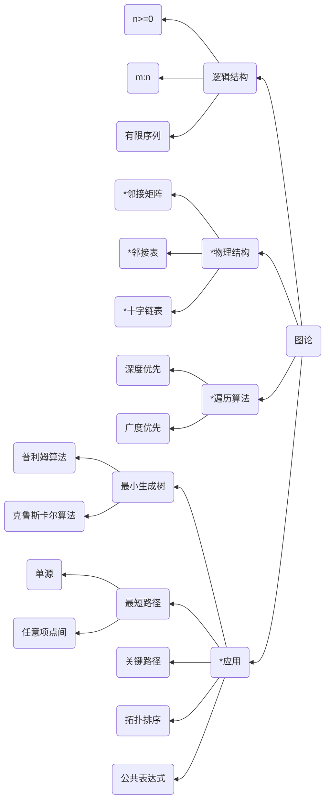

# Chapter4 图论

---

本章以下内容为需要熟练记忆的考点
1. 图的相关概念、存储结构、遍历、连通性等易出客观题。
2. 最小生成树、拓扑排序、关键路径、最短路径等客观题、主观题均可出

---

## 知识结构

本章的知识结构mermaid图如下图所示，其中标`*`号的为重点掌握内容

---

一些TIPS：
1. 图的存储结构有邻接矩阵，邻接表，十字链表一共三种
2. 使用邻接矩阵时，若采用数组表示法，则假设图有n个结点，则一共需要开$n^2$个数组空间
3. 邻接矩阵的数组表示时，并不适合使用稀疏图。适合稠密图使用，能有效减少浪费的数组空间
4. 网：即有权值的图，同样的，网也可以分为有向网与无向网

特别的
1. 对于无向图，第i行中非零元素个数为顶点V[I]的度
2. 对于有向图，第i行中非零元素个数为顶点V[I]的出度，第j列中非零元素个数为顶点V[J]的入度
3. 有向图（有/无向网），两个不连通的结点在邻接矩阵中均以$\infty$进行表示，在算法中常以16位最大数65535进行赋值表示
4. 若采用邻接矩阵的算法复杂度为O($n^2$),从这里可以看出来，与图的边数无关，与结点数量有关，所以，邻接矩阵算法适合在稠密图（即结点密度大）的图中作为存储结构（减少浪费空间存NULL）
---
邻接表
1. 邻接表中每个顶点的单链表中**结点个数**为该顶点的**出度**
2. 逆邻接表中每个顶点的单链表中**结点个数**为该顶点的**入度**
3. 与邻接矩阵相对的是，邻接表存储空间的大小主要由边数决定，适合存储稀疏图，插入与删除操作较为简单
4. 邻接表一个单链表由以下三个域组成
   1. 邻接点域(adjVex): 指示与顶点$V_i$邻接的点在图中的位置
   2. 链域(nextArc)：指示下一条边或弧的结点
   3. 数据域(info)：存储和边/弧相关的信息，如权值系数等，一般会省略（带有权值系数的一般为**网**）   
5. 采用邻接表的算法时间复杂度为 O(n+e),由表达式可以看出来，邻接表的算法时间与顶点数以及边的数目都相关，所以，邻接表根据这一个特性，较为适合用来作为储存边数较少的图的数据存储结构（其中最为典型的图的结构为稀疏图）

---
十字链表
1. 十字链表是一种较为优秀的用来储存**有向图**的链式存储结构，其特点如下
   1. 一般用一个一维数组表示图的顶点信息，每个元素包含3个域：顶点$v_i$，数据域data，指向第一条以顶点为头的边或弧指针firstin，第一条以该顶点为尾的边或弧指针firstout
   2. 边或弧信息包括该边对应两个顶点的位置信息 headVex 与 tailVex（分别代表头与尾）；下一个同头边或同头弧指针 hlink，下一个同尾边或同尾弧指针tlink，以及和该边或弧相关的其他信息指针info
   3. hlink链的结点个数为表头顶点的**入度**，tlink链的结点个数为表头顶点的**出度** （hlink->headLink ； tlink -> tailLink）
   4. 十字链表是有向图的邻接表和逆邻接表存储结构的结合（两个表也是分别统计同一个顶点的出度与入度）

其数据结构如下所示
单链表结构
|下标|data域|firstin|firstout|
|:---:|:---:|:---:|:---:|
|     |     |    |     |

后续链表的链接结构
|tailVex|headVex|headLink|tailLink|
|:---:|:---:|:---:|:---:|

---
图的遍历

连通图的遍历所产生的的边数最少的生成树，为最短路径

遍历图的两种思路
1. 深度优先搜索
2. 广度优先搜索

值得注意的是
1. 如果仅给出图的**逻辑结构**（没给出具体存储结构），则其深度优先遍历序列**不唯一**
2. 存储结构**一旦确定并给出**，**遍历序列唯一**

典型的存储结构有以下几种
1. 邻接矩阵存储结构
2. 邻接表存储结构
3. 十字链表是有向图的邻接表和逆邻接表存储结构的结合（两个表也是分别统计同一个顶点的出度与入度）

针对以上结构，确定的存储结构，遍历的顺序必定**唯一**

以深度优先搜索为例，针对以下数据结构的搜索顺序为
1. 针对邻接矩阵存储结构：从左到右，由上到下，顺序执行
2. 针对邻接表存储结构：由顶点出发，遍历每一个顶点所连接的结点，按下标顺序进行遍历
3. 针对十字链表存储结构：由结点出发，访问至每个结点最深位置，直至不能访问为止，则选择一个未被访问的结点，重复该过程直至最后即为所求DFS序列

深度优先搜索性能分析
- 针对十字链表，深度优先算法需要辅助**堆栈**完成遍历，空间复杂度为O(|V|)
- 邻接矩阵深度优先遍历时间复杂度为O(|$V^2$|)
- 邻接表(链式存储结构)深度优先遍历时间复杂度为O(|V|+|E|)

以广度优先搜索为例，数据结构的搜索流程类似，不予赘述

广度优先搜索的性能分析
- 广度优先算法需要辅助**队列**完成遍历，所有顶点均需要入队，因此与存储结构无关，空间复杂度为O(|V|)
- 邻接矩阵广度优先遍历时间复杂度为O(|$V^2$|)，适合稠密图
- 邻接表(链式存储结构)广度优先遍历时间复杂度为O(|V|+|E|)，适合稀疏图

---
最小生成树

生成树：指联通图/网（边带权图一般称之为网）的生成树指包含**网的所有结点**、n-1条满足树特征的边所形成的树

最小生成树（MST）：指所有生成树中权值之和最小的树

最小生成树的两个特点：
1. 最小生成树的权值和为所有生成树的**最小值**，故**权值和唯一**
2. 最小生成树不一定**唯一**

常见的求解最小生成树的方法有两种
1. 普利姆（Prim）算法
2. 克鲁斯卡尔（Kruskal）算法

普利姆（Prim）算法
1. 总体来说是一个依次增大最小生成树的过程
2. 任意选择一个顶点，并将其加入集合U，则该顶点自成连通图
3. 在集合U，与总的集合V中，即V-U，选择两个集合顶点之间相连的所有边的最小边，将这条边加入最小生成树，同时将V-U中和该边相关联的顶点去除，并将其加入到U中
4. 重复上一步骤，直至U中包含连通网的所有顶点

总结：普利姆算法为顶点之间的最短关系查找，时间复杂度为O（$|V|^2$）,故适合用在稠密图中求最小生成树

克鲁斯卡尔（Kruskal）算法
1. 克鲁斯卡尔（Kruskal）算法构建最小生成树的过程即依次挑选最小权值边的过程
2. 将原图中的顶点复制得到一个新的无边网，即包含|E|个连通分量的非连通图
3. 在原图中选择一条满足如下两个条件的边
   1. 权值最小
   2. 该边链接新网的两个连通分量，构成更大的连通无环图
4. 在原图中删除被选中的边
5. 重复上述的步骤，直至新网称为包含所有结点的一个连通分量，即新网应该包含|E|个顶点、|E|-1条边

特别的：选择边不能使得图产生回路

总结：克鲁斯卡尔算法为最小边的查找过程，构建最小生成树的时间复杂度为O(|E|*$log_2^|E|$),因此较为适合稀疏图求最小生成树

---
最短路径

带权图中任意两个顶点 A 和 B 之间可能存在多条路径，权值之和（路径长度）最小的一条路径称之为最短路径

最短路径的两个特点：
1. 最短路径上的权值之和为所有路径中权值之和的**最小值**，故权值和一定唯一（不然不满足最的条件）
2. 最短路径不一定唯一（满足1的要求即可称之为最短路径）

一般常见的最短路径问题有以下2两种
1. 单源顶点到图中其余各项点的最短路径
2. 图中任意两顶点之间的最短路径

单源顶点到其余各结点的最短路径求法一般采用 Dijkstra 算法

Dijkstra算法的本质：路径长度依次递增，逐步生成最短路径

要求所选择的路径均为当前阶段下可以选择的路径中最短的路径

Dijkstra算法分析
- 以邻接矩阵为存储结构，Dijkstra算法的时间复杂度是O($|V|^2$),对于稀疏图，应该选择邻接表作为存储结构，Dijkstra算法的时间复杂度为O(|E|)
- Dijkstra算法假设所有弧或边的**权值非负**，不考虑权值为负的情况

图中任意两定点之间的最短路径求法，一般采用Floyd算法，同时也可以采用Dijkstra算法解决，但是采用Dijkstra算法时，时间复杂度为O（$|V|^3$）,复杂度太高，一般不采用该方法

Floyd算法，本质是逐次增加结点，选择结点与结点间最短路径，依次增加直至两个目标结点相连的过程

Floyd算法分析
- Floyd算法以邻接矩阵作为存储结构，Floyd算法的时间复杂度为O($|V|^3$),但处理的数据结构比较简单，比重复|V|次Dijkstra算法，使所有顶点依次为源点的求解方法实际时间花费的少
- 特别的，Floyd算法可以处理**权值为负**时的情况

---
关键路径

在带权有向无环图中（无向网），若顶点表示事件，有向边表示工程的各项活动，有向边的权值表示活动的持续时间，则称该带权无环有向图为边表示活动的网络，这种网络称之为AOE网络（Activity On Edges）

一些名词介绍
1. 开始（源点），AOE网络有且只有一个源点，是入度为0的顶点
2. 结束（汇点），AOE网络有且只有一个汇点，是出度为0的顶点
3. 关键路径，即为从源点到汇点的**最长路径**的长度，即在这条路径上所有活动的持续时间之和，该路径也称之为关键路径
4. 关键活动，关键路径上的活动，称之为关键活动

特别注意
1. 关键路径未必唯一，满足要求即可
2. 并非加快任何一个关键活动都可以缩短整个工程的工期。只有加快包括在所有关键路径上的关键活动才能缩短工期
3. 关键活动的速度提高是受限的，提高过多可能会导致原关键路径转变为非关键路径（即不满足最大情况）
4. 关键路径重在熟练掌握求解过程

---
拓扑排序
AOV网络（Activity On Vertex）：即又向无环图表示某工程的各子工程以及其相互制约时，用顶点表示活动，弧表示活动之间的先后顺序关系，则称改图为顶点表示活动的网络。

拓扑排序的方法
1. 从AOV网中选择一个入度为0的顶点，并输出
2. 从AOV网中删除该顶点以及所有以该顶点为其尾的弧
3. 重复上述步骤，直至
   1. 输出全部结点，则按序输出的顶点序列即为拓扑排序结果
   2. 当前图中不存在无前驱的顶点，说明该AOV网为有环网，无法进行拓扑排序

拓扑排序值得注意的是
1. 拓扑排序结果未必唯一
2. 算法实现关键在于以下三点
   1. 每次需要查找入度为0的顶点
   2. 修正相关顶点的入度
   3. 每次输出任意入度为0的顶点
3. 熟练掌握拓扑排序过程

---
公共子表达式

即用有向无环图表示算术表达式的形式，节省存储空间