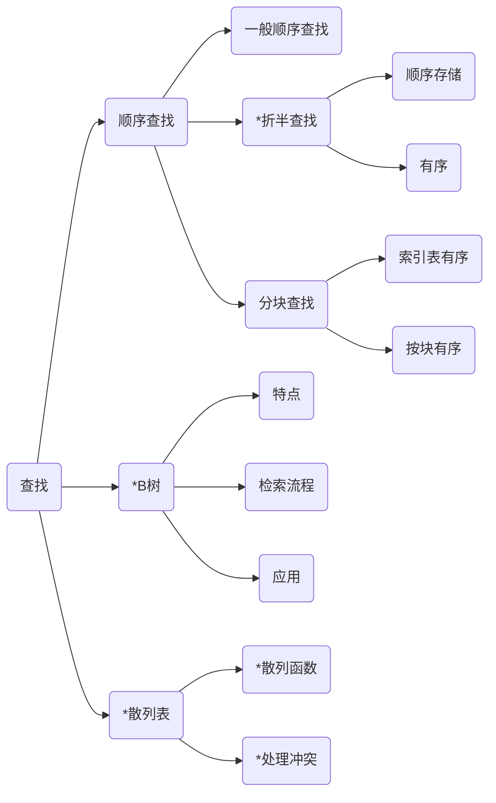

# Chapter5 查找

---

本章以下内容为需要熟练记忆的考点
1. 查找、查找表的相关概念，静态查找表，动态查找表、散列表的基本概念，顺序查找的过程以及“岗哨”等，易出客观题
2. 折半查找的过程、特征、算法实现比较重要，可以灵活出题
3. B树定义以及构造过程可以出客观题
4. 散列表的构造过程、散列函数和处理冲突方法，易出主观题
5. 查找效率易出客观题

---

## 知识结构

本章的知识结构mermaid图如下图所示，其中标`*`号的为重点掌握内容

---

一些概念补充
1. 查找表：**同类型**数据元素（或记录）构成的集合
2. 静态查找表： 只能够查询某“特定”数据元素是否在查找表中，或检索某“特定”数据元素的各种属性的查找表称之为静态查找表
3. 动态查找表：除了查询、检索操作以外，还可以进行插入、删除数据元素的查找表，或查找表在查找过程中动态生成，查找成功，返回位置或记录信息；查找不成功，则插入待查找关键字
4. 关键字：数据元素或记录中能够标识一个数据元素或记录的数据项的值。特别的，若关键字本身可以唯一标识一个记录，称为**主关键字**，否则称为**次关键字**
5. 查找：又称为检索，指在查找表中确定一个其关键值字等于给定待查找关键值的记录或数据元素的过程。
6. 平均查找长度（ASL）：评价查找算法的指标。

### 顺序表的静态查找

一般主要有三种针对静态查找的方式
1. 顺序查找
2. 折半查找（二分查找）
3. 分块查找

---
#### 顺序查找
1. 因为要存一个头/尾任选的匹配Key值，所以线性表顺序查找需要占用 n+1 个空间，其中key存放的位置，称之为“岗哨”
2. 顺序查找为暴力匹配，不适用于key值较大的情况，而且查找效率较差

1. 查找不成功：与a[n]~a[0]依次进行比较，比较次数为n+1，即ASL(不成功)=n+1
2. 查找成功：ASL(成功) = $\sum{(n-i+1)\div n}$ = ${n+1}/{n}$
3. 时间复杂度为O（n）————> 显然，直接遍历全部元素进行匹配

顺序查找的优点是：对存储结构无要求；对数据元素的顺序无要求。缺点是平均查找长度较大；查找效率偏低，且n大时，不易采用

---
#### 二分查找

即主要针对有序表时（无所谓升序、降序表），可以不必依次遍历元素，即可以快速确定待查找关键字值的区域，加快查找速度，提高查找效率

二分查找过程中会遇见的几种需要判断取值的情况（以升序表为例）：
1. 相等：查找成功，返回数组下标
2. 大于：在线性表的后半部分继续折半查找
3. 小于：在线性表的前半部分继续折半查找
4. 中间位置不存在时，查找失败，返回-1

算法分析（以二叉判定书为例）
1. 时间复杂度为O($log_2n$)
2. 查找不成功：比较次数为判定树的深度，即ASL（不成功）= [$log_2(n+1$]
3. 查找成功： ASL（成功）= $\sum{(i\times2^i)\div n }$ = $[log_2(n-1)]$

折半查找的优点是效率高，缺点是查找对象必须为顺序存储，而且线性表中的关键字必须为有序排列(无论升序降序)

---
#### 分块查找

分块查找是顺序查找与二分查找相结合的方法，又称为索引顺序查找，由索引表和查找表两个部分构成。

其中要求索引表**有序**，查找表**分块**。且块内**无序**，**块间**有序

查找表部分：部分有序。将查找表划分为若干块，且第i块的**最大关键字值**小于**第i+1块的**最小关键值**，块内则无要求

索引表部分：要求整体有序，为结构体数组，每个数组元素应该包括两个成员：每块的最大关键字与该块的第一个数据元素在查找表中的位置。

算法分析
1. 分块查找的平均查找长度 ASL 等于两个部分的 ASL 平均之和，即查找表ASL+索引表ASL
2. 查找表进行顺序查找，ASL(seqi) = $n_i$ + 1
3. 索引表进行折半查找，ASL(index) = [$log_2(n_{index}+1)$]
4. 分块查找结合顺序查找和折半查找的优点，效率介于二者之间。对分块查找来说，索引表最好顺序存储是按关键字有序

---

### 顺序表的动态查找

可以有两种查找法
1. 二叉排序树查找
2. 二叉平衡树查找（VAL）树

以二叉排序树为例，最好查找时间复杂度为 O($log_2n$)，最坏查找时间复杂度为 O(n)(即单边树情况，单边左子树或单边右子树，将严重影响查找时间)

其查找时间复杂度会受到树形结构的严重影响，导致时间复杂度会不定

以二叉平衡树为例，因为优化了树形结构，因此查找时间只与树的深度相关，即时间复杂度为 O($log_2n$)

---

#### B树

B树查找过程为，整体顺序，局部二分

B树为平衡多路查找树，查找过程通过二分法确定前往哪个平衡分支

特别的：B树的生长方向为自下向上（根）

B+树 与 B树的不同
1. 有n棵子树的结点中包含n个关键字
2. 每个结点的关键字个数和孩子指针个数相等
3. 所有叶子结点中包含了全部关键字信息，以及指向包含这些关键字的记录的指针
4. 叶子结点按关键字升序排列，构成单链表
5. 所有非终端结点，可以看做索引部分，结点中仅含其子树（根节点）中的**最大**或**最小**关键字
6. 通常在B+树上有两个头指针，一个指向根节点（ROOT），一个指向关键字值最小的叶子结点（sqt）
7. B+树进行两种查找运算，一种是从最小关键字开始，顺序查找；一种是从根节点开始，随机查找
8. B+树上进行随机插入、删除和查找的过程基本上与B树相应操作类似，不同的是在查找时，若非终端结点上的关键字等于待查找关键字值，查找仍继续进行到叶子结点，即查找路径从根节点到叶子结点

---

#### 散列表

上述的查找过程均基于比较，因此查找算法的时间复杂度一般取决于比较的次数。

如果记录在查找表中的位置和其关键字值有关，则可直接由关键字值求出存储位置，无需进行比较。

散列表，就为具有以上特性特性的一种表

一些概念介绍：
- 散列函数：又称之为哈希函数，以关键字值作为自变量、函数值为记录在表中的存储位置的函数。
- 散列地址：由散列函数得到的记录在查找表中的存储位置，有可能发生冲突（即哈希冲突）
- 冲突：key1≠key2，但H（key1） = H（key2） ，即Key1与Key2对应到同一存储位置，则称这种情况为发生了冲突。
- 同义词：key1≠key2，但H（key1） = H（key2），这种情况将，key1与key2称之为同义词
- 散列表：由散列函数和**冲突处理方法**将一族关键字映射到一个连续、有限的地址区间，该地址区间对应的查找表称之为**散列表**

常见的散列函数构造方法
1. 除留余数法,最为常见的散列函数

$H(key)=key%m;(其中m为正整数)$

特点：m的值的选取十分重要，若散列表长度为n，则要求m≤n，且应该尽量接近于n。m一般为素数。
2. 直接定址法

$H(key)=a*key+b;(其中a,b均为常数)$

特点:关键字基本连续时,该散列函数比较有效
3. 平方取中法
取关键字平方的中间若干位作为散列地址
4. 数值分析法
假设关键字有K位组成,每位肯能有r个不同的数码(r进制).根据数码在各位的分布情况,选取数码出现概率大致相同的某几位作为散列地址
特点:关键字改变时,需要重新分析
5. 折叠法
将关键字分割成位数相同的几个部分（最后一部分的位数可以不同），然后取这几部分的叠加和（含去进位）作为散列地址
特点：关键字位数较多，且每位数码分布大致均匀时，可采用该散列函数
6. 随机数法
去关键字的随机函数值作为其散列地址，该方法几乎不会使用

常见的处理哈希冲突的方法
1. 开放定址法
2. 再散列法
3. 链地址法
4. 公共溢出区

填充因子

填充因子$\alpha$表示散列表“装满”的程度，定义如下

$\alpha=散列表中的记录个数/散列表表长$

填充因子的作用如下：
1. $\alpha$和哈希冲突几率成正比
2. 散列查找的平均查找长度ASL(散列)与$\alpha$有关，与散列表中的记录个数n无关
3. 无论n为绘制，总能找到一个$\alpha$,使得ASL(散列)限定在约定的范围

