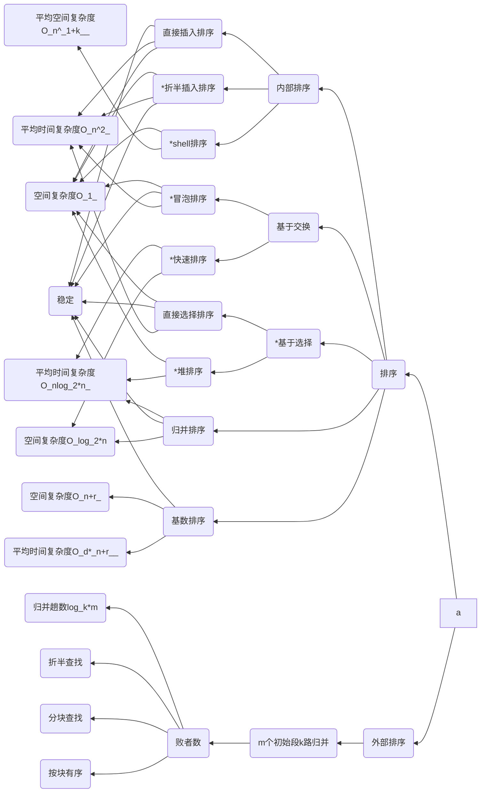

# 排序
---
本章以下知识点需要重点掌握与理解
1. 内部排序的算法思想以及实现(有可能限定时间复杂度与空间复杂度)、排序的稳定性分析、时间复杂度分析、空间复杂度分析、各排序过程等均为重点考察内容
2. 与排序相关的基本概念、各种排序的时间复杂度及其稳定性等易出客观题，各种有关排序过程的客观题、主观题均可能出现

## 知识结构

本章的知识结构如下mermaid图所示，其中标有`*`号的为重点掌握部分

---

---

一些概念定义介绍：

排序：排序又称为分类，是计算机程序设计中的一种重要操作，功能为将一组数据元素或记录按某数据项(关键字)的值排列有序的过程。

排序的稳定性：若任意两个关键字相同的记录$R_i$,$R_j$.排序之前$R_i$在$R_j$之前，排序之后$R_i$依然在$R_j$之前，则称这种排序方法是稳定的，否则，称这种排序方式是不稳定的

排序类型：
根据排序的数据存放位置可以分为两类
1. 内部排序：待排序记录存放在内存中所进行的排序过程
2. 外部排序：待排序记录数量特别大，内存仅存放部分记录，在排序过程中尚需对外存进行访问的读取其他记录的排序过程

以内部排序为例（根据排序过程的主要操作可分为四类）
1. 插入排序：将记录按照关键字插入一个**有序序列**的排序过程
2. 交换排序：按照记录关键字的大小、通过交换记录位置完成排序的过程
3. 选择排序：依次将当前记录蓄力的最小或最大关键字放置到其最终有序序列位置的排序过程
4. 归并排序：将i个记录看做一个有序子序列（$i=2^k$,$k\in[0,log_2n]$),将有序子序列两两合并为长度加倍的更长有序序列，最终使得i=n的排序过程。

排序选择
1. 当n不大的时候，适合采用三种简单排序方法（知己插入排序、简单选择排序、冒泡排序）。虽然时间复杂度达到O($n^2$)，但方法简单易掌握，而且直接插入排序和冒泡排序在记录关键字“基本有序时”，实际排序速度更快
2. n较大时，不强求稳定的情况，可以选择使用快速排序或者堆排序。但快速排序在原序列基本有序时，速度反而**减慢**，时间复杂度达到O($n^2$),堆排序时间复杂度稳定
3. n很大，并且要求排序稳定时 ，且存储容量不受限的情况，适合采用归并排序
4. n值很大，而且关键字位数较小的情况，采用静态链表技术排序比较好

各排序算法情况图如下所示

|排序方法|平均时间复杂度|最坏时间复杂度|空间复杂度|稳定情况|
|:---:  |:---:        |:---:        |:---:    |:---:|
|直接插入排序|O($n^2$)|O($n^2$)|O(1)|稳定|
|折半插入排序|O($n^2$)|O($n^2$)|O(1)|稳定|
|冒泡排序|O($n^2$)|O($n^2$)|O(1)|稳定|
|直接选择排序|O($n^2$)|O($n^2$)|O(1)|**不稳定**|
|快速排序|O($nlog_2n$)|O($n^2$)|O($log_2n$)|不稳定|
|堆排序|O($nlog_2n$)|O($nlog_2n)$|O(1)|不稳定|
|希尔排序|O($n^{1+k}(0<k<1)$)|O($n^2$)|O(1)|不稳定|
|归并排序|O($nlog_2n$)|O($nlog_2n$)|O(n)|稳定|
|基数排序|O(d*(n+r))|O(d*(n+r))|O(n+r)|稳定|