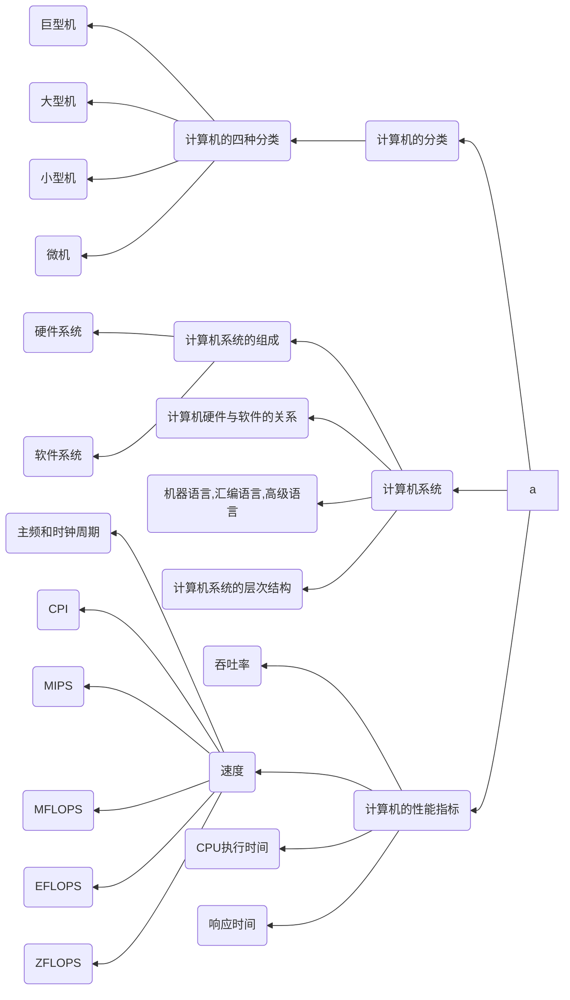

# 计算机系统概述

本章以下知识点需要重点掌握与理解
1. 哪些软件属于系统软件，哪些软件属于应用软件，常用系统软件（如操作系统）
2. 计算机硬件的五大组成模块和冯·诺依曼计算机的特点
3. 计算机系统分为哪几个层次，掌握划分层次的意义
4. 理解计算机的主要性能指标

# 知识结构

:warning: 计算机的发展历程部分由于考纲调整已经删除,新增EFLOPS/ZFLOPS两种新的速度计量

本章的知识结构图如下mermaid图所示，需要特别注意新增的两种计量指标

---

## 冯诺依曼机的思想与结构

冯诺依曼提出“存储程序”的概念与二进制原理，利用二者概念与原理设计的电子计算机系统成为冯诺依曼型结构计算机。其基本特点如下
1. 计算机硬件部分采用由运算器、控制器、存储器、输入设备与输出设备一共五个部分组成
2. 采用存储程序的方式，程序和数据都放在存储器中
3. 指令和数据都是以二进制的形式表示
4. 指令由操作码与地址码组成
5. 指令在存储器中按执行顺序存放，并能**自动执行**

## 计算机指令执行的过程

一条指令在计算机中的执行过程分为取指令、分析指令、执行指令等各个阶段

各阶段执行内容与顺序如下
1. 取指令阶段：即将一条指令从主存中取到指令寄存器的过程(从内存取)。
2. 译码阶段：取出指令后，计算机立即静入译码指令阶段
3. 访存取数阶段：根据译码后指令的需要，有可能要访问主存，读取操作数，这样就进入了访存取数阶段
4. 执行指令阶段：此阶段的任务就是完成指令所规定的各种操作，具体实现指令的功能。
5. 结果写回阶段：作为最后一个阶段，结果写回阶段把执行指令阶段的运行结果写回到**某种存储形式中**
6. 循环阶段：在指令执行完毕并将结果写回后，若无意外事件(如结果溢出等)发生，计算机就接着从程序计数器PC中取得下一条指令地址，开始新一轮的循环，下一个指令周期将**顺序取出下一条指令**

## 计算机的性能指标

计算机的性能指标主要由以下几个表示

吞吐量：吞吐量是指系统在**单位时间内**处理请求的数量。计算机的吞吐量主要取决于**主存的存取周期**

响应时间：响应时间指从用户向计算机发送一个请求，到系统对该请求做出响应并获得用户所需要的结果的等待时间

CPU时钟周期：CPU时钟周期通常为节拍脉冲或者T周期，即主频的倒数，他是CPU最小的时间单位，每个动作**至少需要一个时钟周期**

主频：主频也叫CPU时钟频率，是计算机内部主时钟的评率，它是衡量计算机运行速度的重要参数。主频的倒数为时钟周期。（单位一般为MHz，市面上CPU已经为GHz为单位了）

CPI(Clock cycle Per Instruction) 即指执行**一条指令**所需要的时钟周期数。
$$
    CPI = 执行程序所需要的时钟周期数 / 所执行的指令条数
$$

CPU执行时间：CPU执行时间指**完整运行一个程序**所花费的时间
$$
    CPU执行时间 = CPU时钟周期数/主频 = 指令条数 X CPI X 时钟周期的长度
                = (指令条数 \times CPI)/主频
$$

从上述关系可以看出，CPU的性能（CPU执行时间）取决于3个要素
1. 主频（时钟频率）
2. 每条指令执行所需要用到的时钟周期数（CPI）
3. 指令条数

MIPS：指CPU **每秒**执行的**指令条数** （与MFLOPS的百万次浮点运算次数并不同），以百万条为单位，是衡量计算机运行速度的指标之一
$$
    MIPS = 指令条数\div(执行时间\times10^6) = 主频 \div CPI
$$

从上述表达式可以分析，MIPS综合CPU周期和每条指令占用周期的数量两个重要因素。通常用来衡量标量机的性能

MFLOPS: 指CPU**每秒**执行的**浮点运算数目**（与MIPS的每秒执行百万次指令条数不同）,以百万条作为单位，是衡量计算机处理浮点运算速度的指标
$$
    MFLOPS = 浮点操作次数\div(执行时间\times10^6)
$$

MFLOPS是适合用于衡量**向量机**（能够对以数据同时进行加工处理）的性能的重要指标

一些浮点数的运算指标单位介绍
1. GFLOPS: 每秒十亿次浮点运算，1G=1024M，$10^9$
2. TFLOPS: 每秒万亿次浮点运算，1T=1024G,$10^{12}$
3. PFLOPS: 每秒千万亿次浮点运算，1P=1024T，$10^{15}$

:warning: 特别注意，以下为考纲新增指标

EFLOPS： $10^{18}$次浮点运算数目

ZFLOPS:  $10^{21}$次浮点运算数目

机器字长：CPU一次能处理数据的位数称为机器字长，通常与CPU的寄存器位数有关。（32位机/64位机的区别就是字长）

存储器容量：存储器容量包括主存容量和辅存容量，一般只评价主存容量。主存容量即指主存能存放在二进制码的总位数。

