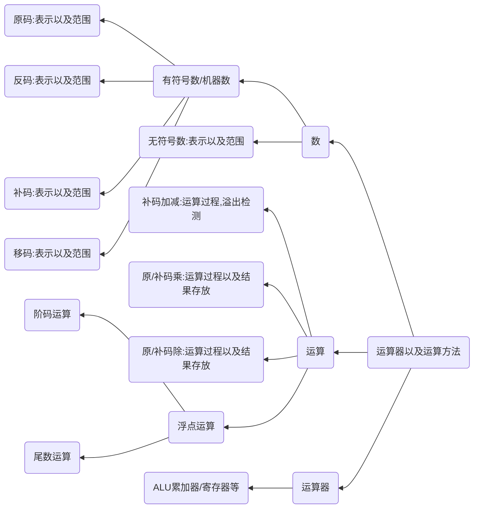

# 运算器

本章题型以选择题为主

本章以下知识点需要重点掌握与理解
1. 数的表示、运算原理以及处理结果，以选择题为主
2. 重点掌握数的表示以及转换、机器数概念、运算原理、溢出以及处理、运算器的结构

## 知识结构
:warning: BCD码以及校验码内容由于考纲调整已经删除

本章的知识结构图如下mermaid图所示

对十进制数转二进制数

整数部分直接转换

小数部分采用乘二取整法，乘二取整法流程如下
1. 将十进制数乘以2，所得乘积的整数部分即为**二进制小数部分最高位的值**
2. 对余数的小数部分，再乘以2，所得乘积的整数部分即为**次高位的值**
3. 重复上述步骤，直至乘积的小数部分为0为止，小数部分转二进制完成

溢出情况的判断
|溢出情况|符号位的进位$C_S$|最高数位的进位$C_1$
|:---:|:---:|:---:|
|上溢|1|0|
|下溢|0|1|

浮点数的构成

|阶码符号位1位:Ks|阶码为K位:E|数值符号位1位:Ms|数值位n位:M|

浮点数 
$$
    X = M\times R^E
$$

阶码常用补码或这移码表示，尾数常用原码或者补码表示。阶码E反映浮点数的表示范围以及小数点的实际位置；尾数M的数值部分的位数n表示浮点数的精度

浮点数表示范围
1. 当Ks=0,Ms=0,阶码和尾数的**数值位**全为1时，该浮点数达到最大值，为$X_{最大值}=(1-2^{-n})\times 2^{2^k-1})$
2. 当ks=1,Ms=0,尾数的最低位是1，其余位全为0时(阶码是绝对值最大的附属，尾数是最小整数)，该浮点数达到最小正数值，为$x_{最小正数}=2^{-n}\times 2^{-2^k}$
3. 当ks=0,Ms=1,阶码的数值位全为1，尾数的数值位全为0时(阶码是最大的正数，尾数为绝对值最大的附属)，则此时该浮点数达到最小负数$X_{最小负数}=-1\times 2^2{^{k-1}}$
4. 当ks=1,Ms=1,阶码的数值位全为1，尾数的数值位全为1时，该浮点数达到最大负值，为$X_{最大负数}=-2_{-n}\times 2{-2}^k$

特别的有，当数据大于最大值，或者小于最小值时，称之为上溢出，此时系统会发生报错；
当数据大于最大负值且小于最小正值时，称为下溢出。此时系统会把数据当做**机器零**处理，不会报错

左规格化：简称左规，当浮点数运算的结果为非规格化时要进行规格化处理，将尾数左移一位，阶码减一(基数为2时),左规可能要进行多次

右规格化：简称右规，当浮点数运算的结果导致尾数出现溢出（双符号位为 01（上溢）\10（下溢））时，需要将尾数右移一位，阶码+1（基数为2时）。右规**只需要进行一次**

阶码与尾数均以补码表示，则有
- 最大正数：阶码是01111.....111，尾数是0.11111.....1111 ,真值是  $1-2^{-n}\times 2^{2^k-1}$
- 最小负数: 阶码是01111....111,尾数是1.00000....00000 ,真值是  $-1\times 2^{2^k-1}$
- 最小正数：阶码是100000....000,尾数是0.10000...00000 ,真值是  $2^{-1}\times 2{-2^k}$
- 最大负数: 阶码是10000....000,尾数是1.011111...11111 ,真值是  $-2^{-n}\times 2{-2^k}$

浮点数运算操作步骤
1. 对阶
2. 实现尾数加减变换
3. 规格化处理
4. 舍入操作
5. 判断结果的正确性

IEEE浮点数

将一个浮点数转换为IEEE754标准的浮点数需要注意以下几点
1. 最高有效为（个位）为“1”，通常需要隐藏
2. 23位尾数书籍上可以表示24位尾数
3. 阶码用“移码”表示，这里的移码与之前的移码表示不同，有自己的定义形式
4. 移码是阶码的真值加上一个**偏移量**
5. 短实数，长实数，临时实数加的偏移量值为7FH,3FFH,3FFFH

