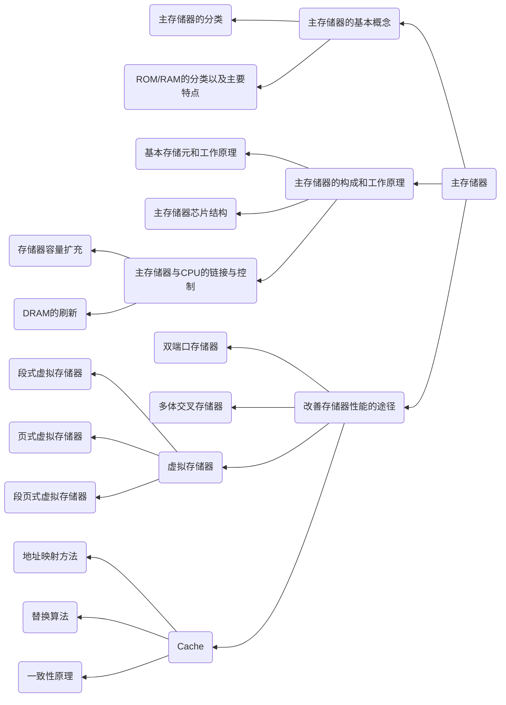

# Chapter3 主存储器

---

本章题型，客观题与主观题都有所涉及，以下分别从客观题与主观题进行概述

客观题，以下内容需要熟悉并应用
1. 存储器的分类以及工作原理
2. 存储系统结构层次、程序访问的局部性原理
3. Cache的工作原理、虚拟存储器的工作原理

综合主观题，以下内容需要熟悉与掌握
1. Cache的三种不同映射方式的相关计算
2. 主存芯片与CPU的链接
3. 虚拟存系统中虚拟地址和物理地址的转换

一些知识点需要熟记的部分
1. 存储器的分类以及各类半导体存储器(SRAM、DRAM、ROM)的特点、双端口RAM和多体模块存储器的主要特点、外存储器的特点作用
2. 针对主观题有以下几点
   1. 主存芯片与CPU的链接：重点掌握存储器芯片的外特性，理解位拓展和字拓展的思路一数据交换的过程
   2. Cache芯片的工作原理：这是重要知识之一，要掌握程序访问的局部性原理（时间局部性和空间局部性）、Cache的基本工作原理（命中率）、Cache与主存地址的映射方式、替换算法、一致性原理以及Cache写策略等基本原理，结合原理掌握Cache的不同映射方式下主存地址和Cache地址格式以及映射关系
   3. 虚拟存储系统：理解页式虚拟存储器、段式虚拟存储器、段页式虚拟存储器、TLB(快表)等基本概念。理解各类虚拟存储器的工作原理、实现方法和优缺点。掌握虚拟存储系统中虚拟地址和物理地址的转换过程
   4. 存储器层次结构：要掌握在CPU和内存之间增加一层Cache的目的是解决CPU和内存的速度匹配问题。而虚拟存储系统的设计就是为了解决内存容量不足的问题

---

## 知识结构

本章知识结构如下mermaid图所示

---

一些小要点

- 按照信息的存取方式，存储器可以分为RAM、ROM、SAM和DAM
- 按照存储介质，存储器可以分为半导体存储器、磁表面存储器、磁心存储器和光盘存储器
- 按信息的可保存性，存储器可以分为易失性存储器和非易失性存储器
  - 断电后存储信息**立即消失**的存储器称为易失性存储器；断点后信息依然保留的存储器称为非易失性存储器。典型的易失性存储器是半导体RAM；非易失性存储器则有ROM、磁表面存储器、磁心存储器、光盘存储器则属于非易失性存储器
- 按照用途来分类，可以分为Cache、主存储器和辅助存储器
- 特别需要注意一种读取方式，即破坏性读取和非破坏性读取。典型的破坏性读出存储器是DRAM（读取完毕后，原数据遭到破坏）。典型的非破坏性读出存储器是SRAM（读取完毕后，并不损害原数据的保存内容）。

---

现代计算机系统中，层次化的存储器主要有以下两个层次
1. 主存-Cache层次:通过硬件实现，对用户透明，旨在解决内存速度与CPU速度不匹配的问题
2. 主存-辅存层次：通过附加的硬件以及操作系统中的存储管理软件来控制实现，旨在解决内存容量不足的问题

现代计算机系统中几乎都具有这两个存储层次，构成了缓存（Cache）、主存、辅存的三级存储系统

---

构成主存的半导体存储器为RAM和ROM。RAM又可以分为SRAM和DRAM。ROM又分为MROM、PROM、EPROM、EEPROM和FLASH等

SRAM:6管记忆单体，其核心是双稳态触发器(用来做Cache)
DRAM:单管记忆单元，其存储核心是极间电容(用来做主存)

因为DRAM依靠电容电荷带电粒子数来判断所携带的信息，而电荷会自动溢散，因此需要定时进行刷新处理，常见的刷新处理办法有以下3中
1. 集中刷新
  - 集中刷新特点为：在允许的最大刷新间隔内刷新(每2ms，全部暂停读取，写入进行刷新操作)
2. 分散刷新
  - 分散刷新特点为：把刷新操作分散到各个存取周期内执行，即每次存取周期中应该包括两个过程，读、写操作过程与刷新过程
3. 异步刷新
  - 把刷新操作平均分配到整个最大刷新间隔时间内进行（即每次刷新时，只有一行元素停止工作，其余元素仍能进行读写操作）

---

ROM 

PROM:一次性可写入

EPROM：可重复次重写入（使用紫外线作为擦除工具）

EEPROM：可高达十万次重复写入（使用电擦除功能）

---

存储芯片包括存储体、地址译码电路和读写逻辑控制

存储芯片的外部引脚包括：地址线、数据线、读写控制线、电源线、地线和片选信号线

SRAM 与 DRAM 的比较

|对比项目|SRAM|DRAM|
|:---:|:---:|:---:|
|存储信息|双稳态触发器|电容|
|破坏性读出|否|是|
|需要刷新|否|是|
|行列地址|同时送|分两次|
|运行速度|快|慢|
|集成度|低|高|
|发热量|大|小|
|存储成本|高|低|

---

## 容量拓展

两种拓展方向
1. 字拓展
  - 拓展方式为增加系统地址线的位数，即增加一个译码器，使得不同片之间记载着同一组数据内容的不同部分，通过译码器完成对指定部分写入（读取）指定片的操作
2. 位拓展
  - 拓展方式为多片并联，如果写入则对不同片的同一位置都写入内容

联合字拓展与位拓展，可以发展出一种新的拓展方向，即字、位同时进行拓展组合，以满足实际要求
- 链接方式为如下：
  - 将进行**位拓展的芯片作为一组**，组内各个芯片地址线、读写控制线、片选信号线的连接线均相连，数据线分别与系统数据线的若干位相连，以实现位扩充。
  - 由高位地址线译码产生各个片选信号分别对应到各组芯片的片选信号，进行容量扩充（字扩展）

片选信号的产生

- 片选信号形成方案会影响主存的分配，存储芯片的片选信号一般由高位地址译码或直接连接产生，可以分为线选法和译码片选法两种选法

线选法原理
- 线选法，就是用除片内寻址外的**高位**地址线直接（或经反相器）连接至各个存储芯片的片选端，当某地址线信息为“0”时，就选中与之对应的存储芯片。这些片选地址线每次寻址时，只能有一位有效，不允许同时有**多位有效**，这样才能保证一次选择中只能选择到一个芯片（或者一个芯片组）

---

## 双端口RAM 和 多提模块存储器

采用双端口存储器、多体交叉存储器（多体并行存储器）以及高速缓冲存储器均可以提高主存储器的访问速度

---
## 主存-Cache系统

程序的局部性原理:star:

程序的局部性原理主要体现在两个方面
1. 时间局部性
2. 空间局部性

时间局部性
- 时间局部性主要是指如果程序的某条指令一旦执行，则**不久以后**该指令可能再次执行，如果某数据被访问过，则不久以后该数据可能**再次被访问**
- 产生时间局部性的典型原因是在程序中存在着大量的循环操作

空间局部性
- 空间局部性是指一旦程序访问了某个存储单元，在不久之后，其**附近的存储单元**也将被访问，即程序在一段时间内所访问的地址，可能集中在一定的范围之内。
- 产生空间局部性的典型情况就是程序的顺序执行

如果Cache命中，需要按照规定的写策略处理，常见的处理方法有**全写法**与**写回法**

地址变换：即是指当以主存地址访问主存时，将主存地址变换为Cache地址，以便从Cache访问该数据，这个变换过程也叫做地址变换

地址变换一般有以下三种方法
1. 全相联映射方式
2. 直接映射方式
3. 组相连映射方式

Cache中的替换策略

由于Cache的存储空间较小，主存的存储空间较大，因此Cache中的一个存储块要与主存中的若干个存储块相对应，若在调入主存中一个存储块时，Cache 中相应位置已被其他储存块所占有，则必须去掉一个旧的字块，让位于一个新的字块。这称之为替换策略或替换算法。常用的替换算法有以下几种
1. 随机算法
2. 先进先出算法
3. 近期最少使用算法
4. 最不经常使用算法

Cache命中时，有以下两种方法。
- 写直达法：把新的内容写入Cache存储器的同时也写入主存，使主存和Cache中的内容同时被修改，保证主存和副本内容**一致*
- 回写法（标志交换方法）：在Cache中设置一个更新位，当修改了Cache的内容时，使**更新位置置1**，但并不立即写入主存。当Cache中的内容要被新的主存块替换时，查看更新位，若更新位为1，则Cache控制器把该块的内容写入主存相应的位置，并把更新位清零，再做替换操作。

---

主存与Cache间存在三种映射方式，分别是直接相联映射，全相联映射和组相联映射。

直接相联映射的主存结构如下

|主存标记|Cache块号(行号)|Cache(主存)块内地址|

Cache块内地址位数的计算方式是
$$ 
  Cache块内地址位数 = log_2(Cache块大小)
$$

例如Cache块大小是64B，如果按照字节编址,Cache块内地址位数是$log_264=6位$

Cache块号位数的计算方式是：
$$
  Cache块号位数=log_2(Cache块数)
$$

例如Cache块数是32块，那么Cache块号位数是$log_232=5位$

主存标记位数的计算方式是

$$
  主存标记位数 = 主存总位数 - Cache块号位数 - Cache块内地址位数
$$

全相联映射的主存结构如下

|主存标记|Cache(主存)块内地址|
|:---:|:--:|

Cache块内地址位数的计算方式是

$$
  Cache块内地址位数=log_2(Cache块大小)
$$

主存标记位数的计算方式是：
$$
  主存标记位数 = 主存总位数 - Cache块内
$$

组相联映射的主存结构如下

|主存标记|Cache组号|Cache(主存)块内地址|
|:---:|:--:|:--:|

Cache块内地址位数的计算方式是

$$
  Cache块内地址位数=log_2(Cache块大小)
$$

默认按字节编址

Cache组号位数的计算方式是：

$$
  Cache组号位数 = log_2(Cache组数)
  Cache组数 = Cache块数 / Cache路数 (每组包含的Cache块数)
$$

例如Cache块数是32块，采用四路组相联的方式，那么Cache组号位数是$log_2(32/4)=3位$

主存标记位数的计算方式是：
$$
  主存标记位数 = 主存总位数 - Cache 组号位数 - Cache 块内地址位数
$$

其中主存总位数取决于主存大小与主存的编址方式，例如主存大小是128MB，按照字节编址，主存的总位数是$log_2{128M}=27位$，主存标记位数= 27 -3 -6 =18 位

Cache的地址结构与主存的地址结构并不一致，Cache的地址结构如下图所示

|Cache标识|Cache块内地址|
|:---:|:--:|

Cache的块内地址位数的计算与主存地址结构中Cache块内地址的计算相同

Cache的标记包括以下四个部分
1. 主存标记位
2. 有效位
3. 脏位（一致性保护位）
4. 替换算法位

一般的，计算Cache大小的公式为
$$
  Cache大小 = Cache块数(行数) \times (主存标记位+有效位数 + 脏位(一致性维护位)数 + 替换算法位数)
$$

---

三种映射方式的查找过程

直接映射方式
- 先根据主存与Cache的映射方式，把主存地址分解成为三个部分即主存标识、Cache块号、块内偏移(Cache块内地址)这三个部分，根据主存标识判断要访问的内存块是否在Cache内

组相联映射方式
- 组相联即要求主存与对应组内各个Cache都进行对比

全相连映射方式
- 即直接查找对应组号+偏移量（即可）---全相联特性，每一个信息块内容存进各个Cache中去

---

## 虚拟存储系统

几个重要概念：
1. 虚存空间:程序空间对应地址是虚地址(逻辑地址、程序地址)
2. 主存空间：对应地址为实地址（物理地址），其对应的存储容量为主存容量
3. 辅存空间：对应地址为辅存地址（磁盘机号+盘面号+磁道号+扇区号）

虚拟存储器的工作原理
- 虚拟存储器将**主存**和**辅存**地址空间统一编址，形成一个庞大的存储空间（往往会大于主存）。用户可以在这个空间内自由编程，不必考虑是否主存装的下以及程序实际上在主存中的位置，用户编程的地址称为虚地址或逻辑地址
- 实际的存储单元称为实地址或者物理地址。在虚拟存储器系统中，虚地址要比实地址大得多。

虚拟存储器的分类
- 页式存储器（计算机组成原理范畴中只介绍这类）
- 段式虚拟存储器
- 段页式存储器

TLB（快表）的实现方式（使用Cache来实现）

*特别注意快表与慢表查询是同步进行的，哪个先查找到，则立即暂停对另一个表的查找*

快表的**存在**对于所有的程序员都是透明的

TLB中的表项由两部分组成：标识和数据。标识中存放的是逻辑地址中的一部分，而数据部分中存放物理页号、存储保护信息以及其他一些辅助信息

逻辑地址与TLB中的表项的映射方式有三种：直接匹配模式、全匹配模式、组匹配模式一共三种