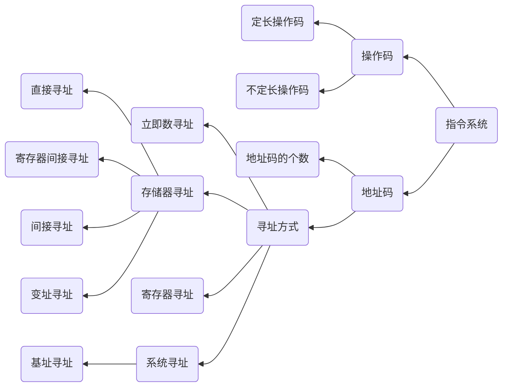

# 指令系统

以下知识点需要熟记
1. 重点掌握概念，深入理解指令格式中各部分的作用、位数和个数的关系，寻址方式的含义和作用三部分内容
2. 需要对各个寻址方式的过程熟练掌握

---

## 知识结构

本章的知识结构如下mermaid图所示

---

## 机器指令

机器内部的指令格式由两大字段组成，操作码(OP) 和 地址码(addr)组成。

指令格式可以分为以下几种

---

###  零地址指令

|操作码(OP)|
|:---:|

操作中只有操作码，没有操作数或没有操作数地址。这种指令有以下两种可能。
1. 无需任何操作数，如空操作指令、停机指令等
2. 所需的操作数是默认的，如堆栈结构计算机的运算指令所需要的操作数默认在堆栈中，由堆栈指针SP隐含之初，操作结果仍然放回到堆栈中

---

### 一地址指令

|操作码(OP)|地址码(A)|
|:---:|:---:

指令中包含操作码（OP）与地址码（A），操作码（OP）表示指令的操作，地址码(A)表示操作数的存储器地址或寄存器名

这种指令也有常见的两种形态，可以根据操作码含义确定到底属于哪一种形态
1. 只有目的操作数的单操作数指令，按A1地址读取操作数，进行OP操作后，结果放回原地址

指令含义:OP(A)->A

2. 隐含约定目的地址的双操作数指令，按指令地址A可读取源操作数，指令可隐含约定另一个操作数由累加器（ACC）提供，运行结果也将存放在累加器中

指令含义：(ACC)OP(A)->ACC

---

### 二地址指令

|操作码(OP)|地址码(A1)|地址码(A2)|
|:---:|:---:|:---:|

指令中包含有一个操作码(OP)，两个地址码（A1,A2）。其中，A1是第一个操作数的存储器地址或寄存器地址，A2是第二个源操作数和存放操作结果的存储器地址或寄存器地址

这是最常见的指令格式，两个地址指出两个源操作数地址，其中一个还是存放结果为目的的地址

---

### 三地址指令

|操作码(OP)|地址码(A1)|地址码(A2)|地址码(A3)|
|:---:|:---:|:---:|:---:|

指令中包含有一个操作码(OP),三个地址码(A1,A2,A3).其中，A1是第一个源操作数的存储器地址或寄存器地址，A2是第二个操作数的存储器地址或寄存器地址，A3是**操作结果**的存储器地址或寄存器地址。

其操作是对A1、A2指出的两个源操作数进行操作码(OP)所指定的操作，结果存入A3中

---

### 四地址指令

|操作码(OP)|地址码(A1)|地址码(A2)|地址码(A3)|地址码(A4)|
|:---:|:---:|:---:|:---:|:---:|

指令中包含一个操作码（OP），四个地址码（A1、A2、A3、A4），其中，A1是第一个源操作数的存储器地址或寄存器地址，A2是第二个操作数的存储器地址或寄存器地址，A3是**操作结果**的存储器地址或寄存器地址，A4是**下一条指令**的地址。

其操作是对A1、A2指出的两个源操作数进行操作码(OP)所指定的操作，结果存入A3中，并且A4指出下一条指令的地址

---
## 两种指令格式

定长指令格式
- 定长指令格式是指所有指令的**操作码**位数相同，并且由操作码来决定操作的类型

定长指令格式满足以下条件关系
1. n位操作码,指令系统最多含有$2^n$条指令
2. 若指令系统有n条指令，则至少有$log_2n$位操作码

拓展操作码指令格式（即变长指令格式->操作码变长）

需要实现变长指令格式操作码的原因，**指令系统中各条指令的使用频率并不相同**

定长操作码指令会给所有指令分配相同位数操作码，这样就会使得极少被使用的指令和经常使用的指令具有相同位数的操作码，这对译码效率会有影响

在设计变长指令时要注意以下几点
1. 不允许短码是长码的前缀，即短操作码不能与长操作码的前面部分的代码相同(类霍夫曼编码)
2. 各指令的操作码不能重复(指令唯一性)

---

一些名词解释

位(bit)：位是计算机内部**数据存储**的最小单位

字节(Byte):字节是计算机中**数据处理**的最小单位

字(word):字是计算机进行数据处理时，**一次存取**，加工和传送的数据长度。一个字通常会由一个或多个（一般是字节的整数倍）字节构成。计算机的字长决定了其CPU**一次操作处理的实际位数**，计算机的字长越大，其性能越优越（32位机与64位机）

字节的存储机构
1. 小端编址
   - 低位字节放在内存的低地址端，高位字节放在内存的高地址端 
2. 大端编址
   - 高位字节放在内存的低地址端，低位字节放在内存的高地址端

在按照大/小端方式存储地址时 需要注意以下几点
1. 在字节拆分时，不能乱序，如`0X1234`,只能拆成 `0x12`，`0x34`，数字乱序即为错误
2. 系统在存储数据时，往往采用对齐的方式，这是为了方便进行编制，例如当系统采用32位编址时，若数据只占用24位地址，这时仍然需要给这个数据分配32位的空间，那么此时就会有8位空间不存储任何数据（零填充）。

---

## 寻址方式

寻址方式主要分为两大类
1. 指令寻址
2. 数值寻址

整个寻址过程，其实就是将指令中的形式地址(即操作数字段提供的值称为形式地址)通过一定的寻址方式，转变为有效地址(EA)的过程

---

## 指令寻址

指令地址可以分为顺序寻址与跳跃寻址两种
1. 顺序寻址：通过程序计数器PC加1自动形成下一条指令的地址。
2. 跳跃寻址：跳跃寻址通过转移类指令实现
   - 计算方式为 PC+(A) 其中PC表示当前的指令地址，形式地址A则表示相对于当前指令跳转(A)条指令
   - A可以用补码表示，可以是**正值**，此时表示向**后**跳，也可以是负值，此时表示向**前**跳

---

## 数值寻址

十种数值寻址的方式
1. 立即数寻址
2. 直接寻址
3. 间接寻址
4. 寄存器寻址
5. 寄存器间接寻址
6. 隐含寻址
7. 变址寻址
8. 基址寻址
9. 相对寻址
10. 堆栈寻址

---

各种寻址方式在指令执行时的方寸次数总结如下表所示，注意，本表中的访存次数**不包括**获取本条指令的访存，也不包括写回运算结果的访存

|寻址方式|有效地址|访存次数|
|:---:|:---:|:---:|
|隐含寻址|程序指定|0|
|立即寻址|A即是操作数|0|
|直接寻址|EA=A|1|
|一次间接寻址|EA=(A)|2|
|N次间接寻址|EA=(((A)))|N+1|
|寄存器寻址|EA=$R_i$|0|
|寄存器间接一次寻址|$EA=(R_i)$|1|
|相对寻址|EA=(PC)+A|1|
|基址寻址|EA=(BR)+A|1|
|变址寻址|EA=(IX)+A|1|
|堆栈寻址|硬堆栈|0|
|堆栈寻址|软堆栈|1|

---

## 复杂指令系统（CISC）和 精简指令系统（RISC）

复杂指令集(RISC) 与精简指令集 （CISC）的区别,如下表所示

|对比项|CISC|RISC|
|:---:|:---:|:---:|
|指令系统|复杂、庞大|简单、精简|
|指令数|一般大于200|一般小于100|
|可访问指令(访问内存)|不加限制|只有LOAD/STORE指令|
|指令字长|不固定|定长|
|各种指令使用频率|相差很大|相差不大|
|各种指令执行时间|相差很大|相差不大|
|优化编译实现|很难|较容易|
|控制逻辑实现方式|绝大多数为微程序控制|绝大多数为硬连线控制|
|对CPU性能的发挥程度|很难有提升|提升潜力很大|

