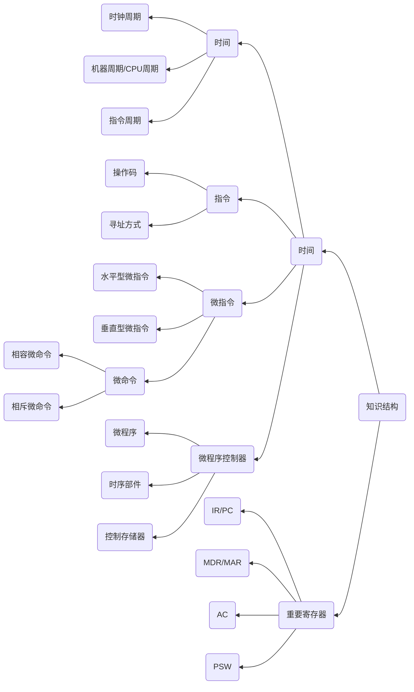

# Chapter5 中央处理器

---

本章为全书重点内容，以下知识点需要熟记
1. 深入理解指令、微指令、程序、微程序、指令周期等
2. 能够根据要求画出CPU模型图，又能根据给定的CPU模型按照要求分析微程序所含的所有微指令以及每条微指令所含有的微命令信号

---

## 知识结构

根据21年考纲调整，微指令部分作出以下变化 :warning:

1. 微指令的编码方式 --> 微命令的编码方式
2. 新增添微指令的格式

本章的知识结构如下mermaid图所示

---

## CPU的组成与结构

CPU包括算术逻辑单元（ALU）、控制单元（CU）、寄存器和中断系统四个部分组成

其中控制器由程序计数器（PC）、指令寄存器（IR）、指令译码器（ID）、时序产生器和操作控制器等组成主要负责协调和指挥整个计算机系统的工作，控制计算机的各个部件执行程序的指令序列

寄存器用途的分类
- 通用寄存器：包括数据寄存器、地址寄存器、通用寄存器
- 专用寄存器：包括程序计数器、指令寄存器、指令译码器、存储器数据寄存器、存储器地址寄存器

CPU的功能
1. 取指令
2. 指令译码
3. 控制指令执行
4. 控制程序和数据的输入与结果输出
5. 处理异常情况和请求
6. 完成算术运算和逻辑运算

CPU的功能可以简单概述为：指令控制(程序)、操作控制(微操作)、时间控制(时序)、数据加工(运算)和中断处理。

CPU的控制方式
1. 同步控制方式
   1. 同步控制方式即固定时序控制方式，系统有一个统一的时钟，所有的控制信号均来自这个统一的时钟信号
   2. 时钟信号往往选择系统时钟
   3. 一般选取部件中最长的操作时间作为统一的时间间隔标准
2. 异步控制方式
   1. 异步控制方式即可变时序控制方式，各项操作不采用统一的时序信号控制，根据指令或不见得具体情况来决定占用时间的多少，是一种按需求分诶时间的控制方式
   2. 各操作之间通过开始-结束信号来控制操作的运行情况
3. 联合控制方式
   1. 同步控制与异步控制相结合，也是现代计算机主流采用的控制方式。
   2. 作为一种折中的控制方法，对大多数需要节拍数相近的指令，用相同的节拍数来完成，即采用同步控制的方式；而对少数需要节拍数多的指令或节拍数不固定的指令，给予必要的延长，即采用异步控制

---

## 微程序控制器的原理和设计

微程序设计技术就是利用软件方法来设计CPU的一门技术，其基本思想就是把指令对应的操作控制信号编成微指令组成的微程序，并把所有指令对应的微程序全部存放到一个只读存储器里（ROM）。计算机运行时，依次轮流读出指令对应微程序的所有微指令，从而产生所需的各种操作控制信号，使相应部件执行规定的操作。

微程序和微指令
- 每一条机器指令对应一个微程序，而一个微程序由一系列微指令构成
- 一条机器指令的功能是由若干条微指令组成的序列来实现的，即一条机器指令所完成的操作可以划分为若干条微指令来完成，由微指令进行解释和执行

微指令和微地址(其中微指令的格式部分为今年考纲新增内容:star:)
- 一条机器指令的功能由若干条微指令组成的序列实现。微指令是指控制存储器中的单元中的内容。微指令存放在控制存储器中的单元地址称为微地址。
- 一条微指令通常会包括以下两个部分:star:
  1.  操作控制字段：用来产生操作所需要的控制信号，它表示微指令的功能
  2.  顺序控制字段：用来产生下一条要执行的微指令的地址，它是一种寻找下一条微指令的方法

微命令和微操作
- 一条机器指令的功能是由若干条微指令组成的序列实现的，在微程序控制的计算机中，控制部件向执行部件发出的各种控制命令称为微命令，它是构成控制序列的最小单元
- 微命令与微操作是一一对应的，微命令是微操作的控制信号，微操作是微命令的操作过程。

100条微指令，一共需要多少个微程序。答案有两个
1. N+1个微程序，N为指令数，1为取指令，所以2者之和为答案
2. N+3个微程序，N为指令书，3分别为取指令、间址指令、中断指令一共三条
3. 两个答案都有N+1条因为标准

微指令(微命令)的编码方式

微指令的编码方式也叫微指令的控制方式，它是指如何对微操作的控制字段进行编码，以形成控制信号。常见的编码方式有以下三种
1. 直接编码方式
2. 字段直接编码方式
3. 字段间接编码方式

微程序控制器的工作过程
1. 取机器指令
2. 转微程序入口
3. 执行首条微指令
4. 取后续微指令
5. 执行后续微指令
6. 返回

微指令的格式
1. 水平型微指令
   - 按照控制字段编码方法的不同，水平型微指令又分为三种
     - 全水平型(不译法)微指令
     - 字段译码法水平型微指令
     - 直接和译码相混合的水平型微指令 
   - 水平型指令一次能定义并执行多个并行操作微命令的微指令，其格式一般如下
|控制字段|判别测试字段|下地址字段|
|:---:|:---:|:---:| 
2. 垂直型微指令
   - 微指令中设置微操作码字段，采用微操作码编译法，由微操作码规定微指令的功能，称为垂直型指令
   - 垂直型微指令有操作码，在一条微指令中只有1-2个微操作命令，每条微指令的功能简单，因此，实现一条机器指令的微程序要比水平型微指令编写的微程序要长的多。

水平型微指令与垂直型微指令的比较如下
1. 水平型微指令并行操作能力强，效率高，灵活性强，而垂直型微指令则较差
2. 水平型微指令执行一条指令的时间短，而垂直型微指令执行时间长
3. 由水平型微指令解释指令的微程序，有微指令字较长而微程序短的特点，而垂直型微指令则相反
4. 水平型微指令用户难以掌握，而垂直型微指令与一般指令相似，比较容易掌握

硬布线控制器：逻辑电路是由门电路和触发器构成的复杂树状网络

---

## 指令流水线

一个指令周期通常包括几个时间段(执行步骤)，每个步骤完成指令的**一部分功能**，几个依次执行的步骤完成这条指令的**全部功能**。出于性能和硬件成本等考虑，可以选用3种不同的方案来安排指令的执行步骤
1. 串行执行方案
   - 各条机器指令按照顺序串行执行，即执行完一条指令后，才取出下一条指令来执行。
   - 一条机器指令执行过程中每个微操作也按顺序执行
2. 并行执行方案
   - 并行执行方案是指在计算机的一个指令周期内，可以执行多于一条指令
   - CPU每取出并执行一条指令，都要完成一系列的操作，这一系列操作所需的时间通常叫做一个指令周期 
3. 流水线方案:star:
   - 在每个时钟周期启动一条指令，尽量让多条指令同时运行，但各自处在不同的执行步骤中。
   - 各个指令在**宏观上**是**并行**的，但是在**微观上**依然是**串行**的，指令的不同阶段在时间上重叠 

指令流水线的基本概念
- 计算机的流水线是把一个重复的过程分解为若干个子过程，每个子过程与其他子过程并行执行，采用流水线技术只需要增加少量硬件就能把计算机的运行速度**提高几倍**

指令流水的定义
   - 一条指令的执行过程可以分成多个阶段（或过程）。根据计算机的不同，具体的分法也不同。如一般，一条指令的执行过程可以分为以下三个阶段

|取指|分析|运行|
|:---:|:---:|:---:|

取指:根据PC内容访问主存，取出一条指令送到指令寄存器中
分析：对指令操作码进行译码，按照给定的寻址方式和地址字段中的内容形成操作数的有效地址EA，并从有效地址EA中取出操作数
执行：根据操作码字段完成指令规定的功能，即把运算结果写到通用寄存器或者主存中

执行方式也分几种
- 顺序执行方式
- 一次重叠执行方式
- 二次重叠方式（流水线方式）

流水线的性能指标
1. 吞吐量：指在单位时间内流水线所完成的任务数量，或是输出结果的数量
2. 加速比：流水线的加速比是指m段流水线的速度与等功能的非流水线的速度之比(即效率提升比)
3. 效率：效率是指流水线中各功能段的利用率。在时空图上，流水线的效率定义为完成n个任务占用的时空区有效面积与n个任务所用的时间与k个流水段所围成的时空区**总面积之比**

---

### 影响流水线性能的因素

流水线中存在某些影响性能的因素，它使下一条指令无法在设计的时钟周期内执行。这些因素将降低流水线性能，其中主要有三种类型的因素
1. 结构相关(资源冲突/资源冒险)因素
   - 由于多条指令在同时刻征用同一资源而形成的冲突称为结构相关，有以下两种解决方法。
      1. 前指令访存时，使后一条相关指令（以及其后续指令）暂停一个时钟周期
      2. 单独设置数据存储器和指令存储器，使两项操作各自在不同的存储器中进行，这属于资源重复配置
2. 数据相关(数据相关/数据冒险)因素
   - 数据相关指在一个程序中，若存在必须等前一条指令执行完才能执行后一条指令的情况，则这两条指令为数据相关指令，当多条指令重叠处理时就会发生冲突，根据指令间对寄存器读或写的先后关系，可以分为
      1. RAW(写后读)
      2. WAR（读后写）
      3. WAW（写后写）
   - 解决方法
     1. 把遇到数据相关的指令及其后续指令都暂停一个或几个始终周期，直到数据相关问题消失后再继续执行，可使用硬件阻塞和软件插入指令两种方法
     2. 设置相关专用通路，既不等前一条指令把计算结果写回寄存器组，下一条指令也不再读寄存器组，而是直接把前条指令的ALU的计算结果作为输入数据开始计算过程，使原本需要暂停的操作变得可以继续执行，又称为数据旁路技术
     3. 通过编译器对数据相关的指令编译优化的方法，调整指令顺序来解决数据相关内容
3. 控制相关（控制冲突/控制冒险）因素
- 当流水线遇到转移指令或其他改变PC信号的指令而造成断流时，会引起控制相关。解决的办法有以下几种
   1. 对转移指令进行分支预测，尽早生成转移目标地址分支。预测分为简单（静态）预测和动态预测。静态预测总是预测在条件不满足时也继续执行分支指令的后序指令，动态预测根据程序执行的历史情况进行动态预测调整，有较高的预测准确率
   2. 预取转移成功和不成功两个控制流方向上的目标指令
   3. 加快和提前形成条件吗
   4. 提高转移方向的猜准率

---

几个超流水线技术

1. 超标量流水线技术
2. 超流水线技术
3. 超长指令字技术