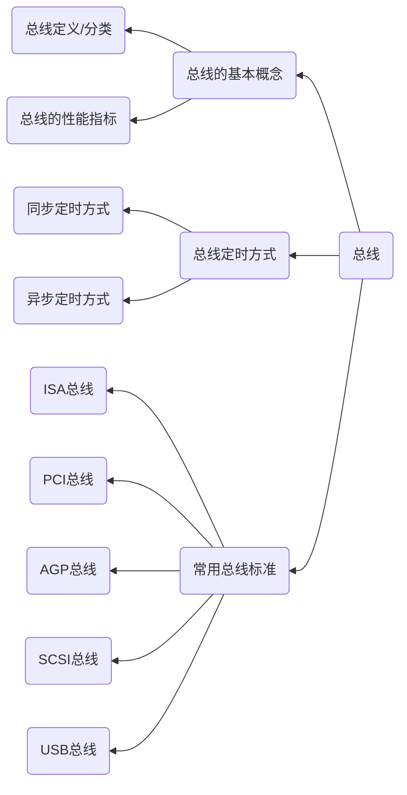

# Chapter6 总线

---

本章内容不属于考试的重点，主要是以理解内容为主，出题形式以客观题为主。:star: 特别注意总线的仲裁原理在21考纲中已经删除
- 一般在客观题中考察对概念的理解和记忆
- 如总线的含义分类、总线的定时问题

考点内容
1. 总线的定义和分类、总线通信控制原理、常用总线标准等
2. 总线的操作和定时(同步定时方式和异步定时方式)，理解不同的总线定时方式以及特点
3. 熟悉总线带宽的定义和计算
4. 需要对总线的标准（正式标准与工业标准）有所了解

---

## 知识结构

根据21年考纲调整，微指令部分作出以下变化 :warning:

总线的仲裁方式（集中仲裁与分布仲裁）删除 :x:

本章的知识结构如以下mermaid图所示

---

## 总线概述

总线(Bus)是计算机设备和设备之间传输信息的公共数据通道，是链接计算机硬件系统内多种设备的通信线路。

总线的一个重要特征就是，总线上的所有设备**共享**，可以将计算机系统内的多种设备连接到总线上。

一些概念：
- 共享：是指总线上可以挂接多个部件，各个部件之间相互交换的信息都可以通过这组公共线路传送；
- 分时：是指同一时刻总线上只能传送一个部件发送的信息

---

### 总线的分类

按照总线传输的内容，可以分为地址总线、数据总线和控制总线
1. 地址总线：用来传输CPU当前要存取的数据或指令的地址。地址总线的位数决定了CPU的寻址能力，是一条**单向**总线，只能从CPU发向外部设备（内存或者输入/输出设备）
2. 数据总线：CPU与内存或其他器件之间的数据传送的通道，是一条**双向**总线
3. 控制总线：主要用来传送控制信号和时序信号，也是一条双向总线，控制信号从CPU送往存储器和输入/输出设备的接口电路，如读/写信号，片选信号、中断响应信号等；也有其他部件反馈给CPU的信号，这类信号称为反馈信号

按数据传输方式，可以分为并行总线与串行总线两种方式
1. 并行总线：并行总线中包含多条双向的数据线，可以实现多位同时传输。
    - 并行总线具有数据传输率高等优点
    - 但是由于各条数据线的传输特性不完全一致，当数据线比较长时，数据各个位到达的时间可能存在不一致，造成传输错误或者性能降低，因此并行总线适合于**近距离数据传输**。大多数系统总线是**并行总线**
2. 串行总线：串行总线中包含**一条**双向总线或者两条单向总线，可以实现一个数据的各个位按照一定顺序依次进行传输。串行总线由于对数据传输性能要求不是太高，在长距离下仍可以进行数据传输，因此串行总线适合于长距离传输。大多数通信总线属于串行总线

按照总线所处的位置，可以分为CPU内部总线、系统总线和通信总线
1. CPU的内部总线：CPU芯片内部用于在寄存器、ALU以及控制部件之间传输信号的总线
2. 系统总线: 系统总线是计算机系统内部各功能部件(CPU、内存、输入/输出设备)之间相互连接的总线，也叫内总线
3. 通信总线: 用于计算机系统之间或计算机系统与其他系统（如控制仪表、移动通信等）之间的通信。比较典型的就是计算机网络中用到的各种串口通信。

---

### 总线的组成

总线由以下3部分组成
1. 传输线：包括地址线、数据线、控制/时序和中断信号线、电源线
2. 接口逻辑：总线与各部件常需要三态门和缓冲寄存器等作为它们之间的接口
3. 总线控制器：对总线的使用进行合理的分配和管理，以实现多个部件共享

---

### 总线的性能指标

总线的性能指标一共有以下六种
1. 总线宽度
    - 总线宽度通常指数据总线的**根数**，用位来表示，如8位、16位、32位、64位等（即8根、16根、32跟、64根）。总线宽度最直接影响的是地址线和数据线的数据量，地址线的宽度指明了能直接访问到的存储器的地址空间范围，数据线的宽度指明了访问一次内存或外存设备能够交换的数据量
2. 总线带宽
    - 总线带宽也叫总线的数据传输速率，即单位时间内总线上传输数据的位数，用每秒传输信息的字节数了来衡量，单位为MB/s
3. 总线复用
    - 总线复用是指地址线与数据线复用，可以用相同的总线分时传送地址或者**数据**
4. 猝发/突发通信
    - 正常的通信模式，是给定一个地址，然后把对应地址的数据返回
    - 突发通信可以在给定以地址的情况下，读取从这个地址开始的连续的多个地址（要求通信信息有序）
5. 总线负载
    - 总线负载，是指连接到总线上的最大的设备数
6. 信号线数
    - 信号线数是地址总线、数据总线和控制总线三种总线数的综合
7. 总线事务
    - 总线上一对设备之间的一次信息交换过程称为一次总线事务。发出总线事务请求的设备称为主设备，与主设备进行信息交换的设备称为从设备，例如CPU读取存储器中某单元的数据，则CPU是主设备，存储器是从设备。一次总线事务上通常包括两个阶段：寻址阶段和数据阶段
8. 总线使用权
    - 总线是由多个部件和设备共享的，为了正确地实现他们之间的通信，必须要有一个总线控制机构，对总线的使用进行合理的分配和管理
    - 各设备之间的主从关系不是固定不变的
    - 只有获得总线**使用权**的设备才是主设备，但主存总是从设备，因为主存不会主动提出要与谁交换信息的要求
    - 完成一次总线操作的时间称之为总线周期。总线使用权的转让发生在总线进行一次数据传输的结束时刻。在一个总线周期开始时对CPU或I/O设备的请求进行取样，并在这个总线周期进行数据传输的同时进行判优操作，以此来选择下一个总线周期谁来获得总线使用权，然后在本周期结束时，实现总线使用权的转移，开始新的总线周期。

---

### 总线的链接结构

总线的链接结构分为单总线结构、双总线结构和三宗线结构一共三种

单总线结构：只有一条总线，所有信息都在总线上传输，因此信息传输的吞吐率受到限制

双总线结构：新增一条总线，位于CPU与存储器之间(主存)的专门高速直接通道

三宗线结构：在双总线结构的基础上，拥有两套以上的总线来链接不同的模块(系统总线与I/O总线)

---

### 总线的特性

总线的特性包括机械特性、电气特性、功能特性和时间特性4个方面。

1. 机械特性
    - 机械特性又称为物理特性，指总线在机械上的链接方式，如插头与插座所使用的标准，包括集合尺寸、形状，引脚根数以及排列顺序等，以便能够正确无误地链接
2. 电气特性
    - 电气特性指总线的每一根线上信号的传递方向以及有效的电平范围
3. 功能特性
    - 功能特性用以描述总线中每一根线的功能。如读/写、中断信号、DMA控制信号等。一般指的是地址总线给出地址、数据总线传递数据、控制总线传递控制信号。

---

## 总线通信控制

总线信息传递过程
- 众多部件共享总线，在争夺总线的使用权时，应该按照各部件的优先等级来决定。在通信时间上，则应按照分时方式来处理，也就是获得总线使用权的先后顺序分时占用总线。
- 通常完成一次总线操作的时间称为总线周期，它包括以下四个阶段：
    1. 申请分配阶段：主模块申请，总线仲裁申请
    2. 寻址阶段：主模块向从模块给出地址和命令
    3. 传数阶段：主模块和从模块交换数据
    4. 结束阶段：主模块撤销有关消息

总线的定时方式，有以下四种
1. 同步定时方式
    - 通过固定时钟来确认每个信号出现在总线上的时刻
2. 异步定时方式
    - 全互锁
    - 半互锁
    - 不互锁
3. 半同步通信
    - 继承了同步与异步的优点
    - 增加了一条“等待”响应信号线
4. 分离式通信
    - 分离式通信的特点如下
        1. 各模块占用总线使用权都必须提出申请
        2. 在得到总线使用权后，主模块在限定的时间内向对方发送信息，采用同步方法传送，不再等待对方的回答信号
        3. 各模块在准备数据的过程中都不占用总线，使得总线可以接收其他模块的请求
        4. 总线被占用时都在做有效工作，或者在发送命令，或者在传送数据，不存在空闲等待时间，充分地利用总线的有效占用，从而实现在多个主、从模块进行交叉重叠并行式传送，这对大型计算机是尤为重要的

---

系统总线标准
1. ISA总线
2. MCA总线
3. VL总线(VESA局部总线)
4. PCI局部总线
5. AGP总线

---

设备总线标注
1. RS-232C串行接口标准
2. IDE接口与SCSI接口总线
3. USB总线
4. IEEE 1394总线
5. IEEE 488总线