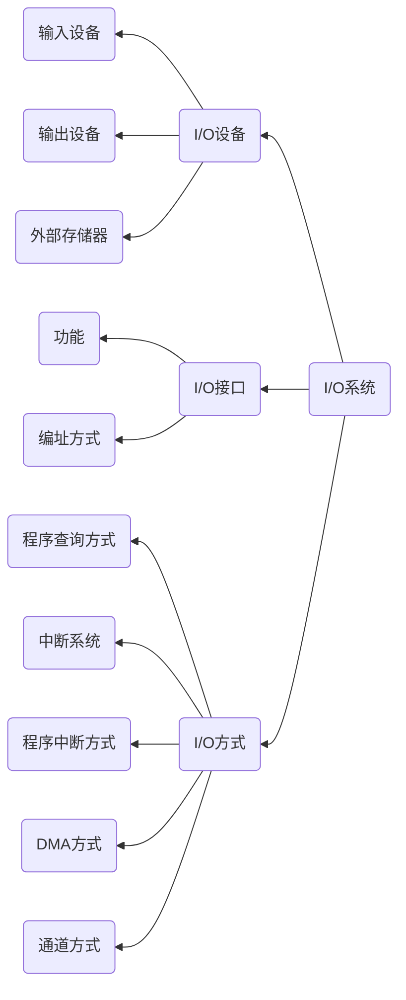

# Chapter7 输入/输出系统

---

输入/输出系统的特点是内容多，知识较为分散，但是热点知识集中。在客观题与分析题中常会出现本章的内容。一般在客观题中考察基本概念，如常见外设的性能指标（显示器的分辨率），磁盘的读/写过程，中断的基本概念，DMA的工作原理。在分析计算题中，常考查硬盘参数的计算、中断响应过程的分析等

本章的内容较多，有以下三个部分组成
1. 常见I/O设备
2. 外部存储器
3. I/O接口

:warning:21考纲调整中，删除了光盘存储器部分

以下知识需要牢记
- 首先要了解常见外部设备，如键盘、鼠标、扫描器、显示器、打印机等的工作原理和主要性能指标，例如显示器的分辨率、显示器的工作原理是重点内容
- 对外存储器，除了要理解硬盘存储器、磁盘阵列、~~光盘存储器~~(已于21考纲中删除)等设备的基本工作原理之外，应重点掌握磁盘的读/写过程和参数计算。应熟练掌握磁盘的格式化容量、非格式化容量、平均访问时间、数据传输率的计算方法
- 对于I/O接口，需要掌握I/O控制器的功能和基本结构、I/O端口以及其编织方式等概念。理解程序查询方式、程序中断方式、DMA方式、通道方式的工作原理，以及这些方式各自的优点、缺点以及应用场合
- 在这些方式中，以**程序中断**方式为考察重点，考生要掌握中断的基本概念(中断嵌套、中断向量、中断优先级、多重中断和中断屏蔽)，能够正确分析中断响应过程和中断处理过程

---

## 知识结构

本章的知识结构mermaid图如下所示

---

一些基本的基本概念
- 外围设备，也叫外部设备，指在计算机系统中除主机以外，而又围绕着主机而设置的各种硬件装置。
- I/O接口，I/O接口是链接主机和外部设备的桥梁
- I/O端口，是指I/O接口电路中可以进行读/写的寄存器。每个I/O端口都有一个端口地址与之对应
- 中断,CPU正在执行的当前程序被打断而转去执行中断服务，当中断服务程序执行完毕又自动返回被中断的程序的过程
- 中断源,引起中断的时间
- DMA，直接存储器访问
- 中断向量，中断服务程序的入口地址
- 中断向量表，由操作系统建立的存储区，存放中断服务程序的入口地址
- 中断优先级，当多个中断源同时发出中断请求时，CPU按照中断优先级进行排队，首先相应优先级最高的中断请求
- 中断嵌套，指在执行某个中断服务程序的过程中，CPU可以去响应级别更高的中断请求

---

关于硬件外设的一些知识

VRAM:显示缓冲存储器或者视频存储器，用来存储提供不断刷新画面的字符或图形信息信号

VRAM容量计算为，分辨率乘以颜色深度(即表示颜色数量的二进制串的位数)

CRT显示器的扫描方式
- CRT显示器的电子束在荧光屏上按某种轨迹运动称为扫描，扫描方式有以下两种
    1. 光栅扫描方式：图像充满整个屏幕，电子束扫过整个屏幕
    2. 随机扫描方式：电子束能在屏幕上作随机运动，其轨迹随显示内容的变化而变化，只在需要显示字符和图形的地方扫描，不必扫描全屏

外部存储器

---

## I/O接口

I/O系统包括外围设备、输入/输出接口和输入/输出软件。其主要作用是用来完成数据的输入、输出、成批存储等任务。输入/输出接口是主机和外设之间的交接界面，通过接口可以实现主机和外设间的信息交换

I/O接口的功能有以下六个方面
1. 实现主机和外设的通信联络控制
2. 进行地址译码和设备选择
3. 实现数据缓冲
4. 数据格式的变换
5. 传递控制命令和状态信息
6. 中断功能

---

### 接口的基本结构

接口电路由地址译码，数据寄存器、命令、状态寄存器和相应的控制逻辑电路组成，通过系统总线与主机相连，通过不同的接口电缆与设备相连。

---

### 接口的类型

I/O接口可以从下五个方面进行分类
1. 按数据传送方式分类
    - 串行接口
    - 并行接口
2. 按主机访问I/O设备的控制方式分类
    - 程序查询式接口
    - 程序中断接口
    - DMA接口
    - 一些更为复杂的通道控制器等
3. 按功能选择的灵活性分类
    - 可编程接口
    - 不可编程接口
4. 按通用性分类
    - 通用接口
    - 专用接口
5. 按输入/输出的信号分类
    - 数字接口
    - 模拟接口

---

### I/O端口的编址方式

I/O端口的编址方式有两种，独立编址和统一编址方式

独立编址
- 又称I/O映射方式，在这种编址方式中，外设端口与主存单元的地址分别单独编址，外设端口不占用主存空间。
- 当访问主存时，由主存读/写控制线控制
- 当访问外设时，有I/O读写控制线控制

统一编址
- 外设端口和主存单元的地址统一编址，即外设接口的寄存器就相当于主存单元
- 统一编址又称为存储器映射，在这种编址方式中，I/O端口地址和主存单元地址统一编址，CPU可以用访问主存单元的方法设问外设，不需要专门的I/O指令。

统一编址和独立编址方式的定义与特点

|编址方式|定义|特点|
|:---:|:---:|:---:|
|统一编址|把I/O端口当作存储器的单元进行分配,采用统一的访存指令访问I/O端口|缺点:不需要专门的I/O指令/缺点占用了存储器上的地址空间，执行速度慢|
|独立编址|I/O端口以存储器地址无关，独立编制的CPU需要专门的I/O指令坊问端口:缺点，:I/O指令减少，增加了控制复查性

---

### I/O控制方式

常用的I/O控制方式包括程序查询方式、程序中断方式、直接存储器存取(DMA方式)、I/O通道控制方式和I/O处理机方式

---

#### 程序查询方式

程序查询由CPU执行一段输入、输出程序来实现主存与外存之间的数据传送方式，又叫做程序直接控制方式，完全通过程序来控制主机和外围设备之间的信息传送。

为了完成这种传递，通常需要3条指令
1. 查询指令，用来查询设备的状态
2. 传送指令，当准备救济是，执行数据交换
3. 转移指令：当设备未就绪时，执行转移指令专项查询指令继续查询

程序查询方式的优缺点
- 优点是硬件简单，容易实现
- 缺点有以下三点
    1. 在查询过程中,CPU长期处于原地等待状态，系统系统效率大大降低
    2. CPU在一段时间内只能和一台外设交换信息，其他设备不能同时工作
    3. 不能发现和处理预先无法估计的错误和异常情况

- 接口中至少两个寄存器，一个是数据缓冲区，即数据端口，用来在做进行运送的数据信息，另一个是CPU查询的设备状态服务器，即端口

---

#### 程序中断方式

中断传送方式是当外设在做好输入/输出准备时，想主机发送中断请求，主机街道请求后就暂时中止执行原来执行的程序，转去执行中断服务程序，在中断服务程序中完成输入、输出操作，在中断处理完毕后，CPU将自动返回原来的程序继续执行

该方式可以提高输入/输出能力以及CPU的效率

中断分类
1. 软件中断
2. 硬件中断
3. 内中断
4. 外中断
5. 允许/禁止（开/关）中断
6. 可屏蔽中断
7. 不可屏蔽中断

中断优先级判断

当系统中同时出现多个中断源，CPU就要根据中断源的优先等级来确定中断的响应顺序，一般系统中提供两种判断优先级的方法
1. 硬件排队器来实现优先级判断，主要依靠电子电路的门电路来实现
2. 软件程序查询实现优先级判断，主要依靠设计不同的选择语句来实现

中断响应的条件  
CPU响应某个中断需要满足以下条件:
1. 中断源提出中断请求，这是最基本的条件，只有中断源提出了中断请求，才能去响应响应的中断。(执行中断服务程序的先决条件)
2. 中断源具有高的中断优先级并且没有更高级的中断服务程序正在执行
3. CPU允许中断。在CPU内部有一个中断允许触发器，这个触发器标识CPU是否能够响应中断，若触发器的值为1，则表示开中断，此时CPU允许响应中断；当触发器的值为0，则表示关中断，此时CPU将不允许响应中断
4. 一条指令执行完毕

中断响应周期和中断隐指令

CPU响应中断之后，执行某些固定的操作，这些操作由硬件直接实现，称为中断隐指令，主要完成以下操作
1. 关中断
2. 保存断点
3. 寻找中断服务
    - 硬件向量法
    - 软件查询法
这两种方法都需要借助向量地址表进行中断服务程序入口的查找，不同之处在于向量地址的生成方式，其中硬件向量法速度快，在实际中使用最多

中断服务程序流程
1. 保护现场
2. 中断处理
3. 恢复现场
4. 开中断
5. 中断返回

多重中断
- 当处理中断的过程中又出现了新的中断，CPU去响应这个新的中断的请求，暂停正在执行的中断处理过程，转去执行新中断的中断处理过程，叫做多重中断，也称为中断嵌套。

实现多重中断的条件

实现多重中断需要满足两个条件
1. 提前设置开中断指令
2. 优先级别高的中断源有权中断优先级别低的中断源

程序中断方式

在程序中断传送方式中，通常在程序中安排一条指令，发出START信号启动外围设备，然后机器继续执行程序。

程序中断方式具有如下特点
1. 数据传输的基本单位是字节或者字
2. 每传输一个字或者字节都需要一次中断
3. I/O设备的启动需要CPU参与，但是CPU处理其他事情和I/O设备准备数据可以同时并行，提高CPU利用率和系统效率
4. 整体而言,CPU是通过响应中断、执行中断处理程序完成I/O操作

---

### 直接存储器存取方式(DMA)

直接存储器存取(Direct Memory Access , DMA)方式是在外设和主存储器之间开辟一条“直接数据通道”，在不需要CPU干预也不需要软件介入的情况下，在两者之间进行的高速数据传送方式

在DMA传送方式中，对数据传送过程进行控制的硬件称为DMA控制器。当外设需要进行数据传输时，通过DMA控制器向CPU提出DMA传送请求，CPU响应之后将让出系统总线，由DMA控制器接管总线进行数据传送

DMA控制器由三部分构成：DMA控制逻辑、寄存器和中断机构。
- 中断机构的功能是一个数据块传送完毕后，中断机构向CPU提出中断请求，CPU将进行DMA传送的后处理。
- DMA控制方式的核心就是DMA控制器，它直接控制主机和块数据的直接交换

DMA控制器的功能包括
- 接收外设发出的DMA请求，并向CPU发出总线请求
- 当CPU响应此总线请求时，发出总线响应信号后，接管对总线的控制，进入DMA操作周期
- 确定传送数据的主存单元地址及传送长度，并能自动修改主存地址计数值和长度计数值
- 识别传送数据方向，发出读/写或其他控制信号，并执行数据传送的操作
- 向CPU报告DMA操作的结束

为了实现在主机与控制器之间成块数据的直接交换，在DMA控制器中设置了如下四类寄存器
1. 命令/状态寄存器CR
2. 内存地址寄存器MAR
3. 数据寄存器DR
4. 数据计数器DC

DMA的工作过程

DMA的工作工程分为3个阶段
1. 预处理阶段
2. 数据传输阶段
3. 后处理阶段

DMA的数据传送方式
1. CPU停止访问主存法
2. 存储器分时法
3. 周期挪用法

DMA方式的特点
1. 它使主存与CPU分开，主存即可以被CPU访问，又可以被外设访问
2. 在数据块传输时，贮存地址的确定、传送数据的技术等都用**硬件电路**直接实现
3. 主存中要开辟专用缓冲区，及时供给和接收外设的数据
4. DMA传送速度快，CPU和外设并行工作，提高了系统的效率
5. DMA在开始前和结束后都要通过程序和中断方式进行预处理和后处理

DMA和中断的区别
1. 中断方式是程序切换，需要保护和恢复现场；而DMA方式除了开始和结尾时，不占用任何CPU资源
2. 对中断请求的响应只能发生在每条指令执行完毕时；而对DMA请求的响应可以发生在每个机器周期结束时
3. 中断传送过程需要CPU的干预；而DMA传送过程不需要CPU的干预，故数据传输速率非常高，适合于高速外设的成组数据传送
4. DMA请求的优先级高于中断请求
5. 中断方式具有对异常事件的处理能力，而DMA方式仅局限于完成传送信息块的I/O操作

---

I/O通道控制方式

是DMA方式的更进一步发展 

通道的工作过程
1. 在用户程序中使用访管指令进入管理程序，由CPU通过管理程序组织一个通道程序，并启动通道
2. 通道执行CPU为它组织的通道程序，完成指定的数据输入/输出工作
3. 通道程序结束后向CPU发中断请求，CPU响应这个中断请求后，第二次调用管理程序对中断请求进行处理

每完成一次输入/输出工作，CPU只需要调用**两次**管理程序，大大减少了对用户程序的打扰

通道的类型
- 字节多路通道
- 数组多路通道
- 选择通道

I/O处理机

I/O处理机通常称作外围处理机。这种外围处理机的结构更接近一般处理机，甚至就是一般小型通用计算机或微机，它可以完成I/O通道所要完成的I/O控制，还可以完成码制变换、格式处理、数据块的检错、纠错等操作。它具有相应的运算处理部件、缓冲部件，还可以形成I/O程序锁必须的程序转移手段。