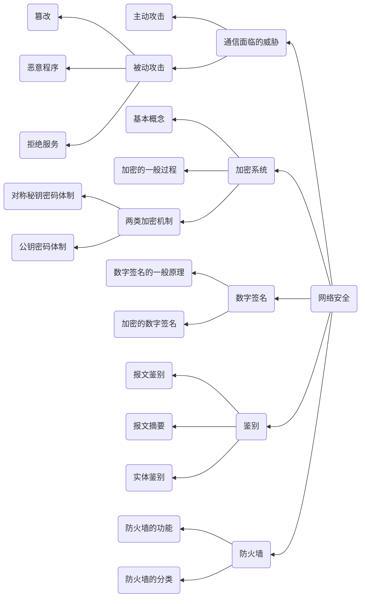

# Chapter7 网络安全

不考.......(复习完了才发现，绝了)

---

## 知识结构

本章的知识结构图如下mermaid图所示

```mermaid
graph RL
a(网络安全) --> b1(通信面临的威胁)
b1 --> c1(主动攻击)
b1 --> c2(被动攻击)
c2 --> d1(篡改)
c2 --> d2(恶意程序)
c2 --> d3(拒绝服务)
a --> b2(加密系统)
b2 --> c3(基本概念)
b2 --> c4(加密的一般过程)
b2 --> c5(两类加密机制)
c5 --> d4(对称秘钥密码体制)
c5 --> d5(公钥密码体制)
a --> b3(数字签名)
b3 --> c6(数字签名的一般原理)
b3 --> c7(加密的数字签名)
a --> b4(鉴别)
b4 --> c8(报文鉴别)
b4 --> c9(报文摘要)
b4 --> c10(实体鉴别)
a --> b5(防火墙)
b5 --> c11(防火墙的功能)
b5 --> c12(防火墙的分类)
```