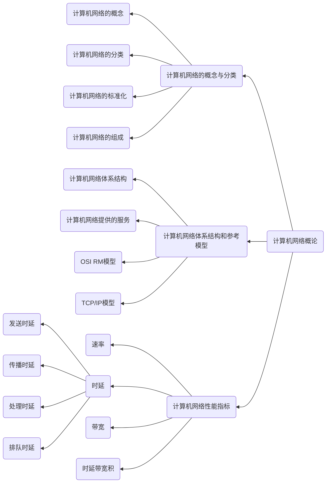

# Chapter1 计算机网络概论

---

考试内容：
- 本章内容的考题都是客观题，考察考生对于基本原理的理解与掌握情况
- 本章内容中考试中一般是网络的第一道题，除计算机网络性能指标会和数据链路层一起出计算题之外，一般只有一个选择题

:warning: 21年考纲中修改，将计算机网络的标准化及相关组织 --> 计算机网络主要性能指标

---

## 知识结构

本章的知识结构图如下mermaid图所示

---

Tips：

在计算机约定中，在表示存储器大小时，K表示的是1024（2进制10次方）

物理层的PDU-比特
链路层的PDU-帧
网络层的PDU-分组
传输层的PDU-报文

面向连接协议-TCP、PPP
无连接服务-除了TCP、PPP，几乎大多数的协议都是面向无连接的，例如IP、ICMP等

TCP协议有应答，是可靠服务

CSMA/CA协议是有应答，但既不是不可靠服务也不是可靠服务

PPP是面向连接的协议，但是PPP协议不需要应答

---

OSI 七层模型(自底向上) --> 理论模型
1. 物理层
2. 数据链路层
3. 网络层
4. 传输层
5. 会话层
6. 表示层
7. 应用层

上三层属于通信子网
下三曾属于资源子网

TCP/IP 四层模型(自底向上) --> 实际模型
1. 网络接口层
2. 网际层
3. 传输层
4. 应用层

五层教学模型(自底向上) ---> 教学模型
1. 物理层
2. 数据链路层
3. 网络层
4. 传输层
5. 应用层

下两层来自OSI/RM模型
上三层来自TCP/IP模型

计算机网络性能指标  :star: 21年调整为主要部分
1. 速率
2. 带宽
3. 时延

时延带宽积
$$
    时延带宽积 = 传播时延 \times 带宽
$$

单位为 m 或 b 等作为度量单位，如A和b两点之间的传播时延是100s，每秒可以发送一个比特(b)数据,那么A和B之间的长度就是100b，这就是时延带宽积

