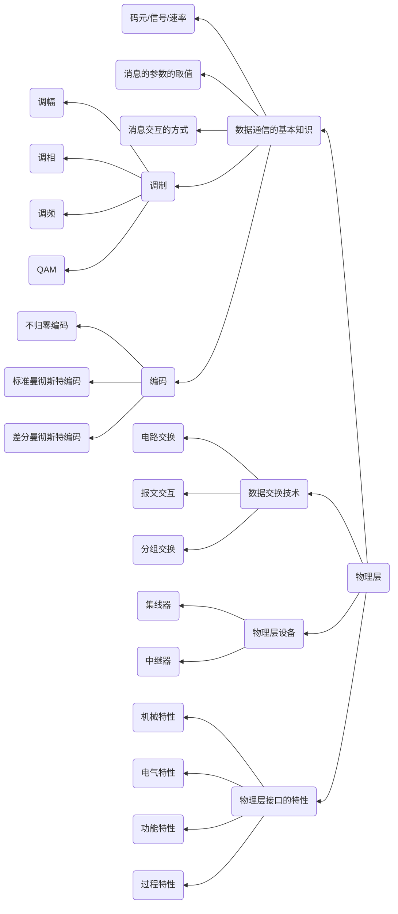

# Chapter2 物理层

---

考试内容
- 本章考察的内容都是客观题
- 考察编码和调制、香农定理和奈奎斯特定理

---

## 知识结构

本章的知识结构图如下mermaid图所示

---

一些Tips

编码：把数字信号或模拟信号变成数字信号就是编码
调制：把数字信号或模拟信号编程模拟信号就是调制

三种编码
1. NRZ编码（不归零编码）：正电平表示1，低电平表示0
2. 标准曼彻斯特编码：利用信号跳变来判断，在位中间，信号由高向低跳变表示数据0，由低向高跳变表示数据1
3. 差分曼彻斯特编码：0代表发送跳变，代表保持，数据方式与标准曼彻斯特类似

四种调制方法
1. 调幅
2. 调频
3. 调相
4. QAM（正交振幅调制）：多元制的振幅相位混合调制方法，这种方法的原理是振幅和相位混合成不同的状态，采用二进制信息对这些信息进行表示。假设某种信号含有M种振幅和N种频率，那么一个这种码元信号的信息量就是$log2{MN}$

两种速率表示
1. 波特率: 又称为码元传输速率，它表示单位时间内数字通信系统所传输的码元**个数**，也可以成为脉冲个数或者信号变化次数，波特率的单位是波特(baud)。1波特代表数字通信系统每秒传输1个码元
2. 比特率：又称为信息传输速率，他表示单位时间内数字通信系统所传输的**二进制**码元元个数，即比特率，单位为bps

如果信息传输速率是每秒钟传输M波特，而每个波特携带Nb数据，则数据传输率为
$$
    M \times N （b/s）
$$

---

奎耐斯特定理(无噪声的情况下)

提出了信道理论的极限数据传输速率

$$
    C=Blog_2N=2Wlog_2N
$$

其中B是波特率，W是信道带宽，每个码元的离散电平的数目是N

而且有$B=2W$

---

香农定理

香农用信息论的理论推导出了带宽受限且有**高斯白噪声干扰**的信道的极限、无差别的信息传输速率。

信道的极限信息传输速率 C 可以表示为
$$
    C = Wlog_2(1+S/N) (bps)
$$

其中W为信道的带宽(以Hz为单位)，S为信道内所所传信号的平均功率;N为信道内部的高斯噪声功率。

S/N并不是信噪比，如果给出信噪比，计算S/N公式如下

$$
  分贝/db = 10lg(S/N)
$$

其中 分贝/db 为信噪比的单位

---

物理层设备
1. 中继器
   - 处理信号衰减问题 
   - 中继器以太网是一个独立的碰撞域
2. 集线器
   -  多端口的中继器

---

电路交换是数据通信领域

电路交换的基本处理过程
1. 链接建立
2. 数据传送
3. 连接释放

---

物理层的接口特性

物理层的主要任务描述为确定与传输媒体的接口的一些特性，主要包括以下几点
1. 机械特性：指明接口所用的接线器的形状和尺寸、引线数目和排列、固定和锁定装置等
2. 电气特性：指明在接口电缆的各条线上出现的电压的范围
3. 功能特性：指明某条线上出现的某一电平的电压表示何种意义
4. 过程特性：也叫时间特性、规程特性，指明对于不同功能的各种可能时间的出现顺序