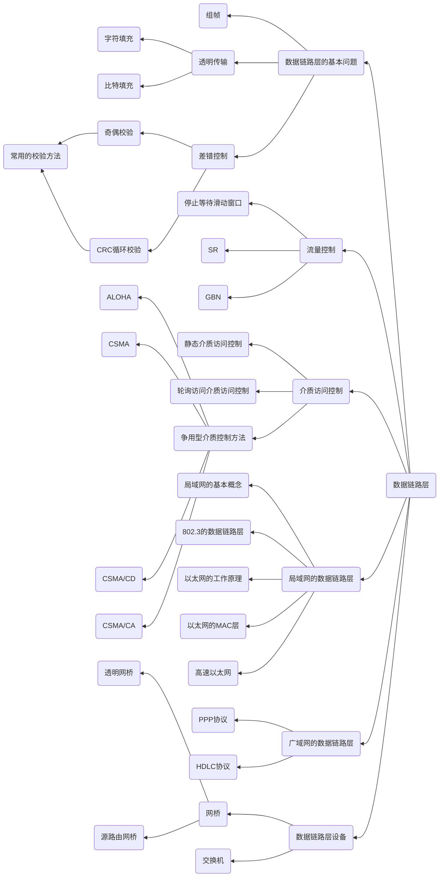

# Chapter3 数据链路层

---

考试内容
- 理解数据链路层的三个基本功能-组帧、透明传输和差错控制
- 理解介质访问控制协议，重点掌握CSMA、CSMA/CD、CSMA/CA的基本原理
- 掌握广域网协议中的HDLC协议和PP协议的特点与区别
- 理解网桥尤其是透明网桥的工作原理，注意网桥和中继器的对比

本章命题以客观题为主，重点考察基于滑动窗口的流量控制，随机访问介质访问控制协议，以太网帧格式往往会与其他章节联合命题

---

## 知识结构

本章的知识结构图如下mermaid图所示

