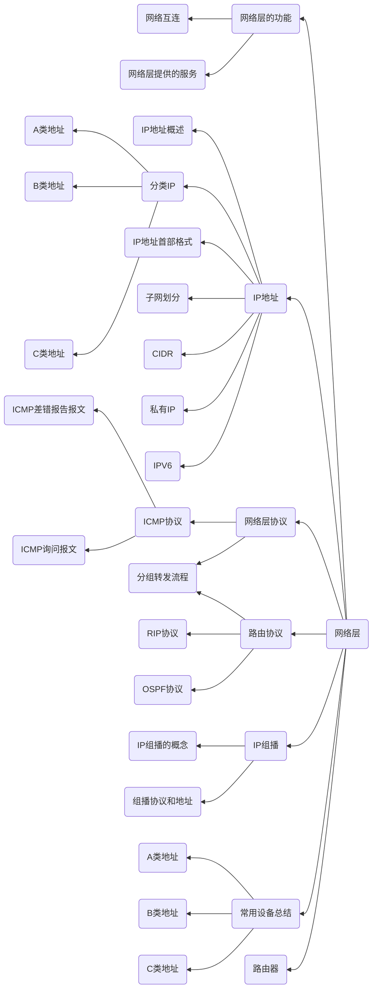

# Chapter4 网络层

---

考试说明
- 本章是计算机网络的重点内容
- 本章出题比重较大，客观题与应用题都有所涉及
- 主要以IPV4中的子网划分和路由选择协议作为综合题的形式出现
- 路由协议以客观题的形式出现

---

## 知识结构

本章的知识结构图如下mermaid图所示

---

一些Tips(待填坑)

:star:21考纲新增了一个概念，路由聚合

路由聚合是指，一个CIDR地址块可以表示很多地址，这种地址的聚合常被称为路由聚合，它使得路由表中的一个项目可以表示为很多个原来传统分类地址的路由。路由聚合也被称为**超网**

路由聚合的实现方式为CIDR块最长前缀匹配
