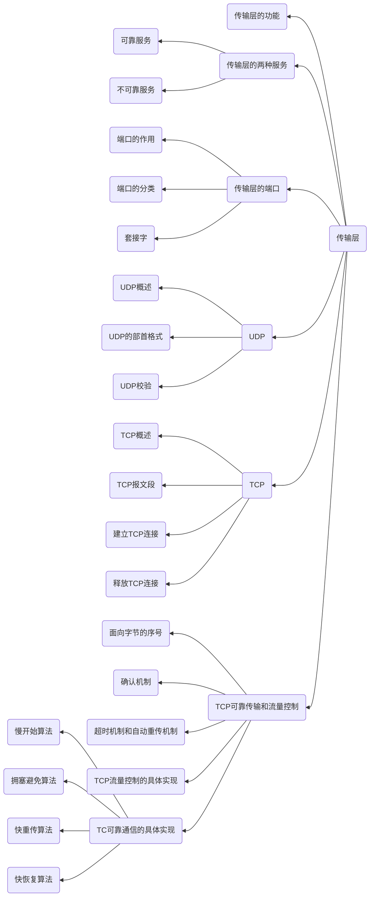

# Chapter5 传输层

---

考试说明
- TCP拥塞控制、TCP连接的建立与释放、TCP与UDP的对比、TCP数据段格式等是考试的重点
- TCP拥塞控制常考解答题
- 本章以客观题和解答题为主，但是题型相对固定，解题思路也明显

---

## 知识结构

本章的知识结构图如下mermaid图所示

```mermaid
graph RL
a(传输层) --> b1(传输层的功能)
a --> b2(传输层的两种服务)
b2 --> c1(可靠服务)
b2 --> c2(不可靠服务)
a --> b3(传输层的端口)
b3 --> c3(端口的作用)
b3 --> c4(端口的分类)
b3 --> c5(套接字)
a --> b4(UDP)
b4 --> c6(UDP概述)
b4 --> c7(UDP的部首格式)
b4 --> c8(UDP校验)
a --> b5(TCP)
b5 --> c9(TCP概述)
b5 --> c10(TCP报文段)
b5 --> c11(建立TCP连接)
b5 --> c12(释放TCP连接)
a --> b6(TCP可靠传输和流量控制)
b6 --> c13(面向字节的序号)
b6 --> c14(确认机制)
b6 --> c15(超时机制和自动重传机制)
b6 --> c16(TCP流量控制的具体实现)
b6 --> c17(TC可靠通信的具体实现)
c17 --> d1(慢开始算法)
c17 --> d2(拥塞避免算法)
c17 --> d3(快重传算法)
c17 --> d4(快恢复算法)
```