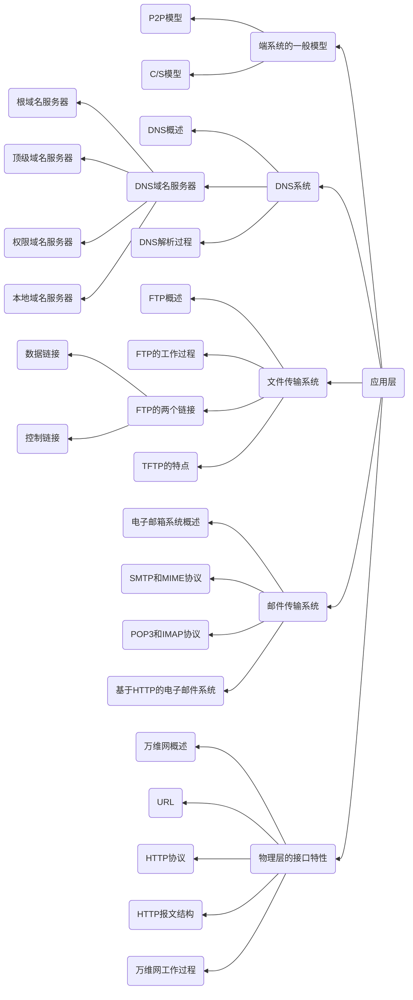

# Chapter6 应用层

---

本章考点
- 本章的知识点主要涉及几个典型的应用，主要考察各种应用特点，复习时应以应用的工作过程和特点为中心，进行理解性记忆
- 本章内容主要以客观题为主，HTTP的传输时间计算会和其他章节配合出解答题，题型相对固定

---

## 知识结构

本章的知识结构图如下mermaid图所示

```mermaid
graph RL
a(应用层) --> b1(端系统的一般模型)
b1 --> c1(P2P模型)
b1 --> c2(C/S模型)
a --> b2(DNS系统)
b2 --> c3(DNS概述)
b2 --> c4(DNS域名服务器)
c4 --> d1(根域名服务器)
c4 --> d2(顶级域名服务器)
c4 --> d3(权限域名服务器)
c4 --> d4(本地域名服务器)
b2 --> c5(DNS解析过程)
a --> b3(文件传输系统)
b3 --> c6(FTP概述)
b3 --> c7(FTP的工作过程)
b3 --> c8(FTP的两个链接)
c8 --> d5(数据链接)
c8 --> d6(控制链接)
b3 --> c9(TFTP的特点)
a --> b4(邮件传输系统)
b4 --> d7(电子邮箱系统概述)
b4 --> d8(SMTP和MIME协议)
b4 --> d9(POP3和IMAP协议)
b4 --> d10(基于HTTP的电子邮件系统)
a --> b5(物理层的接口特性)
b5 --> c10(万维网概述)
b5 --> c11(URL)
b5 --> c12(HTTP协议)
b5 --> c13(HTTP报文结构)
b5 --> c14(万维网工作过程)
```