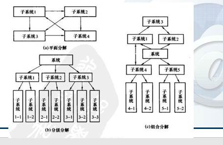

# 第三章 需求分析

---
需求的定义： 需求就是一种清晰、简介、一致且无二义性的方式，对一个待开发系统中各个有意义方面的陈述的一个集合  

1. 需求分析过程：通过第问题以及环境的理解与分析，将问题涉及的信息、功能以及系统行为建立模型，将用户需求精确化、完全化、最终形成需求规格说明，这一系列的活动，即称为需求分析
2. 需求的特点与要求
  - 特点 
  - 要求 
      1. 可验证性
      2. 有优化级
      3. 可量化
      4. 折中 
3. 需求分析的任务  
   1. 建立分析模型（准确地定义未来系统的目标，确立为了满足用户的需求系统必须做什么）
   2. 编写需求说明 （用<需求规格说明书>规范的形式准确地表达用户的需求）
4. 需求分析的步骤：
   1. 需求获取
   2. 需求分析
   3. 需求描述（需求规格书）
   4. 需求验证

**修正需求错误的代价随着工程的发展会越来越大**，因此需求分析十分重要。

**需求的类型**
1. 功能性需求：即描述系统应该作什么，即为用户和其他系统完成的功能、提供的服务
2. 非功能需求：即必须遵循的标准，外部界面的细节，实现的约束条件，质量属性等。  

非功能性需求的存在限制了开发人员选择解决问题方案的范围，例如运行平台、实现技术、编程语言与工具等。

---
## 第一步：获取需求

需求获取：指的是软件需求的来源以及软件工程师手机这些软件需求的方法  

需求获取技术
  - 向系统相关者进行**问卷调查**
  - 主持与用户的**面谈与讨论**
  - 需求**专题讨论会**
  - **复查**现有的报表、表格和过程描述
  - **观察**商业过程与工作流
  - 应用**用例**
  - 建立**原型**  

 需求获取面临的挑战
 - 客户**说不清楚**需求
 - 需求**易变性**
 - 问题的**复杂性**与对问题空间理解的**不完备性与不一致性**

---
## 第二步：分析需求  
需求分析的**核心**在于**建立分析模型**

需求分析采用**多种形式描述**需求  

需求分析还包括与客户的**交流以澄清某些易混淆的问题**

分析建模  
 - 结构化分析建模
 - 面向对象分析建模

分析建模的一些工具
- 数据流图、数据字典与加工规约
- CFD（仿真软件）、控制规约和状态变迁图
- E-R图
- 用例图 User-Case，对象-关系图，对象-行为图

结构化思维：软件工程中一种典型的分析系统、设计系统的思维方法，采用系统科学思想、依据层次分解、自顶向下分析与设计系统  

系统论基础  
- 作用性：有目标的
- 外特性：有边界的
- 内特性：有组成要素切相互关联的
- 复杂度：组成要素多、而且关系复杂

控制论基础  
- 物理系统
- 控制系统  
  - 通常为计算系统，接收来自物理系统的数据以及状态，进行决策并下达指令控制物理系统的运行

示意图

分解论基础  
- 化简复杂系统的简单方法是分解，将系统分解为各个不同的部分，直至清楚为止  

示意图  

功能分解
- 功能：将输入转换为输出的一种变换过程，宏观称为功能，围观称为活动
- 输入：从功能外传入功能内的消息
- 输出：从功能内传入到功能外的信息
- 目标与控制：功能应该达到的目标，即在“目标与控制”的控制下执行
- 支撑：执行功能或活动需要的必要支撑条件

示意图

需求分析的特点  
-  多样性需求
     - 功能与结构：功能分解、流程
     - 软件与结构性：不同结构具有不同性能
     - 产品需求与过程需求：产品需求为产品实际上的功能需求，过程需求为软件开发上的约束
     - 功能性与非功能性需求
     - 综合性/系统性需求
     - 定性需求/定量需求
     - 系统需求/软件需求 （软件需求通常为环境要求） 
-  解决多样性需求的方法：
   -  多视角层次分析理解 
-  需求分析的来源:
   -  主要来源于获取需求的各个途径

## 第三步 需求规格说明书    

需求分析工作完成的一个基本标志时形成了一分完整的、规范的需求规格说明书。 

需求规格说明的原则  
- 从现实中分离功能，即描述“做什么”，而不是“怎么去实现”
- 要求使用**面向处理**的规格说明语言。
- 如果被开发软件只是一个大系统中的一个元素，那么**整个大系统**也应该包括在规格说明的描述之中
- 规格说明必须包括系统**运行环境**
- 规格说明必须是一个**认识模型**
- 规格说明必须是**可操作的**
- 规格说明必须**容许不完备性并可以允许任意扩充**
- 规格说明必须**局部化以及松散耦合**

### 软件需求规格说明书的整体结构  
1. 引言
   1. 需求文档的目的
   2. 文档约定
   3. 预期的读者与阅读建议
   4. 产品范围
   5. 参考文献  
2. 综合描述  
   1. 产品前景
   2. 产品功能与优先级
   3. 用户特征
   4. 运行环境
   5. 设计与实现上的限制
   6. 假设和依赖性
3. 需求描述
   1. 功能描述
   2. 数据需求:与功能有关的数据定义和数据关系
   3. 性能需求：响应时间、容量要求、用户数等
   4. 外部接口：用户界面、软硬件接口、通信接口
   5. 设计约束：软件支持环境、报表、数据命名等
   6. 软件质量属性（可维护性、可靠性、可移植性、可用性、安全性等一系列需求）
   7. 其他需求
 4. 附录（词汇表、分析模型、待定问题列表）
 5. 索引

## 第四步 需求验证
  :star:需求验证的重要性：

  >如果在后续的开发或系统投入使用时才发现需求文档中的错误，就会导致更大代价的返工。由需求问题而对系统做变更的成本比修改设计或代码错误的城门要大得多

  样例图

  

对一个需求文档需执行以下类型的检查
1. **有效性**检查：检查不同用户使用不同功能的有效性。
2. **一致性**检查：检查在文档中，需求之间不应该有冲突。
3. **完备性**检查：检查在需求文档中，应该包含用户所有的需求
4. **现实性**检查：检查保证项目能利用现有技术实现需求

小结：
1. 软件需求贯穿于软件工程的整个生命周期
2. 软件需求：用户对目标系统软件在功能、行为、性能、设计约束等方面的期望
3. 需求分析的任务建立需求分析模型和编写需求说明。