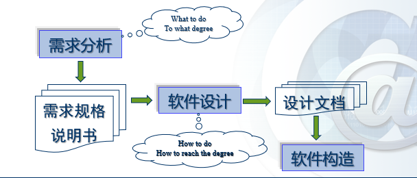
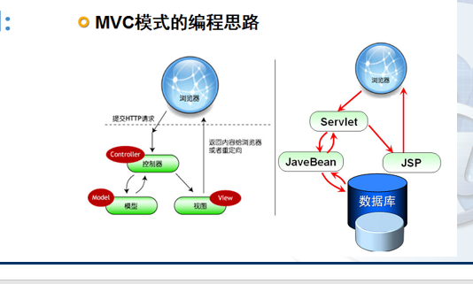
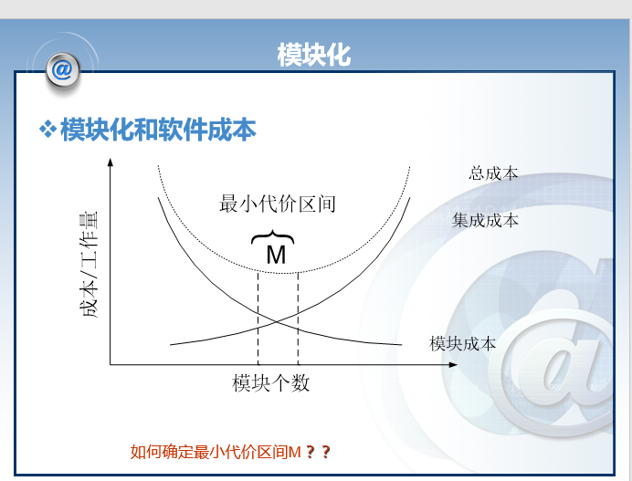
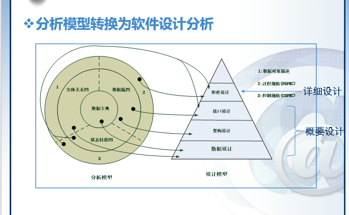
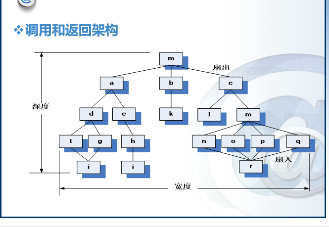
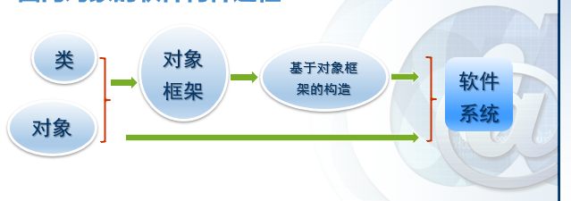
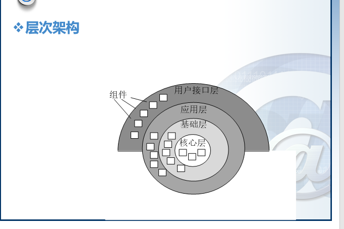
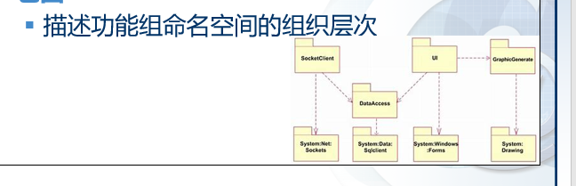

# 第四章 软件设计工程

---
设计的含义： 将人们头脑中想象的食物表达成模型或者文档的过程，这个过程的结果--模型或文档也被称为“设计”

设计 = 适用 + 艺术 + 质量

软件设计：
1.  软件工程生命周期中的一个活动
2.  进行软件编码的基础
3.  软件需求分析被转化为软件的内部结构
4.  是链接用户需求和软件技术的桥梁

图例4.1

软件设计处于软件工程的位置
图例4.2

名词解释：  

软件架构设计（又称为顶层设计）
- 描述软件的顶层架构和组织，划分不同的组织  
 
软件详细设计
- 详细描述各组件以便能够使用编码实现
---
好的软件设计应具有的特点：
1. 设计必须实现在分析模型中包含的**所有明确要求**，必须满足客户所期望的所有**隐含要求**。
2. 设计必须是对于任何编码人员、测试人员以及后续的运维人员都必须是**可读可理解**
3. 设计应该提供软件的**完整视图**，以从实现的角度解决数据、功能以及行为等各领域方面的问题

软件设计的指导原则
1. 设计应该是一种**架构**
   1. 其使用可识别的架构风格或方式
   2. 该架构采用具有良好设计特点的组件构成
   3. 该架构采用进化的方式构建，以促进实现与测试
2. 设计应该是**模块化**的
3. 社即应该包含**数据**、**体系结构**、**接口与组件**各个方面
4. 应该设计出系统所用的**数据结构**
5. 应该设计出展现独立功能特性的各**组件**
6. 应该设计出各组件与外部环境所连接的各**接口**
7. 设计由软件需求分析过程中获得信息驱动，采用可重复的方式**导出**
8. 设计应该采用**正确清楚**的方式表示

## 软件设计过程与设计质量

1. 设计质量应该具有以下属性
   1. 功能性
   2. 可用性
   3. 可靠性
   4. 性能
   5. 可维护性
      1. 包含多个属性（拓展性、兼容性、可测性、可配置性）

---
## 软件设计技术

软件设计的主要技术
   1. 抽象
      - 含义：是感性认识世界的手段，是“忽视具体的信息将不同事物看成相同事物的过程”，是发现实物本质特征与方法的过程
      - 抽象机制：参数化，规范化
      - 规范化抽象
        - 过程抽象
        - 数据抽象
        - 控制（迭代）抽象 
   2. 设计模式
      1. 通用：在给定上下文环境中一类共同问题的**共同解决方案**
      2. 具体： 一套被反复使用、多数人知晓的、经过分类编目的、代码设计经验的总结
      3. 目的：为了代码的可重用性、能够让代码更容易被他人所理解，保证代码的可靠性，程序的重用性
      4. 常用的设计模式与范围：范围即由面向对象的程序构造，到（可视化的）对象框架构建，常见的如MVC模式等
         - MVC 模式的编程思路  
      
   3. 模块化
      - 含义：软件被划分为命名和功能相对独立的多个组件（通常称之为模块），通过这些组件的集成来满足问题的需求
      - 软件的模块性：建立在程序可被智能管理的单一属性前提下
      - 模块化的理论依据：基于人类解决问题的观测数据方式
      - **模块化并不是越小越好**，需要找到最小代价区间
        代价曲线如下图所示  
        
       - 模块化设计标准
          1. 模块化分解性
          2. 模块化组合性
          3. 模块化可理解性
          4. 模块化连续性
          5. 模块化保护

---
模块化的额外几个补充点
  1. 信息隐藏（模块与模块之间）
       - 模块应该具有彼此之间**相互隐藏**的特性
       - 抽象有助于定义构成软件的过程（或信息）实体
       - 信息隐藏原则定义和隐藏了模块内的过程细节和模块内的本地数据结构
  2. 功能独立 （模块与模块之间）
       > 模块独立的标准：耦合、内聚
  3. 细化
       > 自顶向下，逐步求精，有助于揭示底层细节
  4. 重构
       > 不改变组件功能和行为条件下简化组件设计的一种重组技术（一般用于优化结构） 
---
## 设计模型

使用者角度：软件≈功能组织+功能
设计者角度：软件≈数据设计+结构设计+接口设计+组件设计

模型输入：软件需要的数据模型、功能模型与行为模型

分类：
  1. 数据设计
  2. 架构设计
  3. 接口设计
  4. 组件级设计
         
主要活动
   1. 软件架构设计（概要设计）
   2. 软件详细设计（详细设计）

分析模型转换为软件设计分析 详细设计与概要设计所对应的部分

--- 
## 数据设计  
含义: 数据设计（数据架构）构建高层抽象（客户/用户的数据视图）的数据模型、信息模型
相关概念： 
  - 数据建模
  - 数据结构
  - 数据库设计
  - 数据仓库

组件级（模块化）数据设计设计原则
  - 功能和行为系统分析原则也适用于数据设计
  - 确定所有的数据结构及其对应的操作
  - 建立数据字典并在数据定义和程序设计中应用
  - 低层次的数据设计应该推迟到设计的后期过程
  - 数据结构的表示应该只对直接使用数据结构中数据的模块可见
  - 开发有用的数据结构以及其对应操作的程序库
  - 软件设计和编程语言应该支持抽象数据类型的定义与实现
---
## 结构设计
含义以及内容:
  - 系统需要执行的函数功能组件集（如数据库、计算模块）
  - 组件之间通信、协同和合作的连接器
  - 组件集成构成系统的约束
  - 设计人员通过分析其组成部分的已知特性理解系统整体特性的语义模型分析
  
 结构体系的风格和模式简要分类：
 1. 数据中心架构
 
   
 
 2. 数据流体系架构
 
   
 
 3. 调用与返回架构
    1. 主程序/子程序结构  
    
    2. 远程过程调用架构
 
  

    
 4. 面向对象架构  
 
    
  
 5. 层次架构  
 
   
---
## 面向对象设计
面向对象是一种思维

实现步骤：
  1. 识别对象（类）
  2. 识别每一对象（类）的状态
  3. 识别每一对象（类）的状态转换
  4. 识别每一对象（类）的功能

各类图像(UML)：
  1. 类图  
  > 描述对象（类）及其关系
  
  
  
  
  2. 状态图  
  > 描述对象（类）状态变换关系
  
  
  
  
  3. 次序图  
   > 描述对象的函数调用关系
   
   
   
   
  4. 包图  
   > 描述功能组命名空间的组织层次
   
   
   

本章小结：
  1. 设计是软件工程技术核心
  2. 数据结构、体系结构、接口和软件组件的过程细节在设计中逐步细化、开发、评审和记录
  3. 模块化（包括程序和数据）和抽象概念能够是设计人员简化和重用软件组件
  4. 细化提供了详细表示各顺序功能层的机制
  5. 程序和数据结构有助于建立软件架构的整体师徒，而过程提供了算法实现必要的细节
  6. 信息隐藏和功能独立为实现有效模块化提供了启发