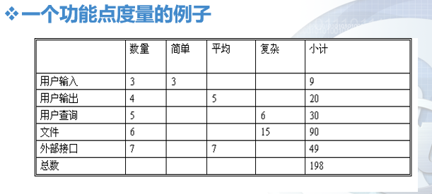
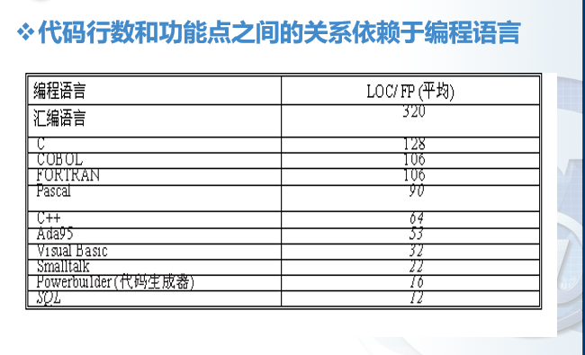

# 第五章 软件生产率与工作量度量 :star:

估计重要性
  - 是“软件项目在满足质量要求的条件下，**按时**与**在预算内**交付”的前提下

估计的复杂性
- 原因
  - 软件的复杂性与不可见性
  - 其他原因
    - 估计的主观特性
    - 不同角色的人有不同的估计偏好
    - 技术的变更
    - 项目缺乏经验，缺乏一致性


过高估计的危害
1. Parkinson法则
  - 给的时间越多，工作花费的时间也越多
2. Brook法则
  - 当人数增加后，项目所需的时间不成比例地减少（因为当团队规模扩大后，由于管理、协调和通信的增加，导致总工作量增加）

过低估计的危害
1. 质量下降
2. Weinberg可靠性零法则
  - 如果系统不要求可靠，那它可以满足任何目标

---
软件产品度量
含义：使得人们可以通过度量值的量化标准，理解和把我软件项目的（生产）效率（或者所需要的劳动量）
目的：
  - 描述（项目与过程）
  - 评估（状态与质量）
  - 预测（计划）
  - 改进（产品质量与过程性能）

软件生产率测量的两种方式
1. 直接测量：如在一个特定时间内产生的代码行数
   1. 一定时间产生的代码行数（LOC - Line of Code）
   2. 执行速度
   3. 文件页数
   4. 错误和缺陷数
2. 间接测量：如在一个给定时间内生产出的功能点和目标点
   1. 功能性
   2. 可靠性
   3. 可维护性
   4. 复杂性
   5. 效率
   6. 其他质量指标

基于代码行数的度量方式 LOC/KLOC （直接测量）

面向规模的度量标准
- 每KLOC(千行代码)的错误数：总错误数/总KLOC（总KLOC=LOC/1000，即为一共有几个千行代码）
- 每KLOC（千行代码）的缺陷数，总缺陷数/总KLOC
- 每KLOC(千行代码)的文档页数，总文档页数/总KLOC

优点：
  - LOC/KLOC和相关度量容易量化计算
  - 许多现有的软件估算模型都使用LOC/KLOC作为一项重要输入
  - 有大量的关于LOC的文件与数据参考

缺点：
  - LOC依赖于使用的语言，这对短小精悍的程序不利（嵌入式系统）
  - 不太适用于非过程化语言
  - LOC需要在设计完成时才能够进行量化计算，因此如果估算，则需要一定程度的细节，而这些细节很多时候可能很难获得

基于功能点的度量方法：代码行数和功能点之间的关系依赖于编程所用的语言  

---
基于功能点的度量方法 --- 间接度量

功能点：功能点即为直接从度量软件信息域和评估软件复杂性的经验量化关系中获得  

例如下图5-1所示  



五个信息域值（功能点）
- 用户输入的数量
- 用户输出的数量
- 用户查询的数目
- 文件数量
- 外部接口的数量

计算功能点（FP）
$$
  FP=(totalCounts)\times(0.65+0.01\times\sum{F_i}))
$$

以图 5-1 为例，其中，totalCounters 为小计总数/或者小计 
$F_i$即为下列十四个问题选项中的权值累加(权值范围`0-5`，`0`表示不重要或不适用，`5`表示必须的)

 $MAX = 14\times5 = 70 $

复杂性调整值$F_i$问题表
```
1. 系统需要可靠的备份和恢复么
2. 需要进行数据通信么
3. 有分布式处理功能么
4. 性能重要么
5. 将该系统运行在一个现有的操作系统中么
6. 系统要求在线输入数据么
7. 在线输入数据要求在多个屏幕和操作之间建立输入事务么？
8. 主文件是否在线更新？
9. 输入、输出、文件或查询系统是否复杂？
10. 内部处理是否复杂？
11. 代码是可重用的么？
12. 设计中包括数据（流程）转换或安装么？
13. 系统腰围不同的机构设计不同的安装方法么？
14. 应用程序便于变更么？易于用户使用么？
```
功能点计算：
  - 每FP的错误数
    - 总的错误数除以总的FP数
  - 每FP的缺陷数
    - 总的缺陷数除以总的FP数
  - 每FP的文档页数
    - 总的文档页数除以总的FP数
  - 每人/月的FP数
    - 总的FP数除以总的人/月数

代码行数与功能点之间的关系十分依赖于编程语言 如下图5-2所示



比值越高的说明，每实现一个功能需要的代码行数越多（越低级的语言比值越高）

本章小结
1. 介绍了软件生产率和工作量度量的背景知识
2. 介绍了几种度量方法的优缺点
3. 介绍了项目计划的度量方式
