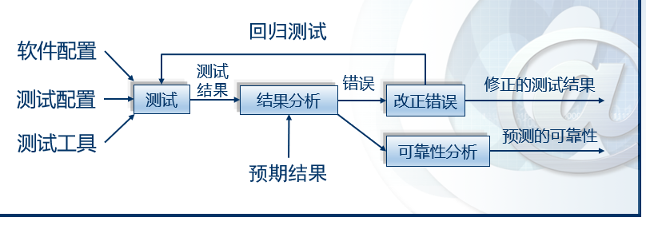
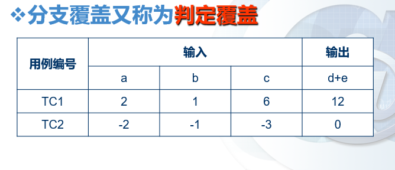
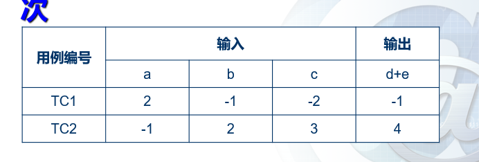
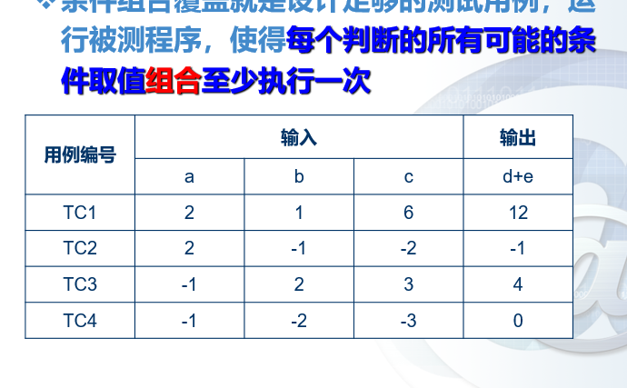
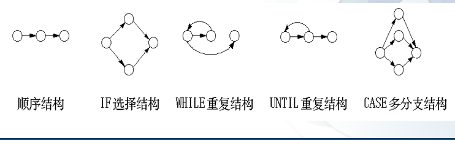

# 第七章 测试技术 :star:

---
软件测试的定义：
  1. 在某种指定的条件下对操作系统或组件，观察或记录结果，对系统或组件的某些方面进行评估的过程。
  2. 分析软件各项目以检测现有的结果与应有的结果之间的差异（即*软件缺陷*），并通过此来评估软件各项目的特征的过程
  测试流程如下图7-1 所示
  

软件缺陷产生的条件（以下至少要有一个满足则能称为发生软件缺陷）
1. 未完成:软件未实现产品说明书要求的功能
2. 有错误：软件出现了产品说明书指明不能出现的错误
3. **画蛇添足**：**软件实现了产品说明书中未提到的功能**（最容易犯的错误）
4. 隐含需求未实现：软件未实现产品说明书（客户）虽未明确提及，但是应该实现的目标
5. **不好用**：软件使用难以理解、不易使用且优化较差运行缓慢

软件缺陷的特征
1. 看不到（难以发现缺陷）
2. 看到但是抓不到（发现了缺陷，但是找不到引起缺陷的原因）

软件缺陷特征曲线图 7-2

软件质量的范畴包含以下内容：
1. 功能性
2. 可靠性
3. 可用性
4. 效率
5. 可维护性
6. 可移植性

质量与可靠性的区别：
- 可靠性只是质量的一个方面，甚至不一定是最决定性的一个方面

测试用例：是指测试输入、执行条件，以及预期结果的集合，是为特定的目的开发的，例如执行指定的程序路径或验证与指定的需求相符合

软件调试与测试
相同点：
  - 都包含有处理软件缺陷与查看代码的过程
不同点：
  - 测试的目标是发现软件缺陷的存在
  - 调试的目标是定位于修复缺陷

软件测试的目标
  1. 确认系统满足**其预期**的使用和用户的需要
  2. 确认**解决**了所需要的**问题**（如实现商业规则和使用合适的系统）
  3. 为测试的过程**建立责任**和**可解释性**
  4. 便于**及早发现**软件和系统**异常**
  5. 能够急躁提供软件和系统的**性能评估**
  6. 为**管理者提供真实信息**，从而帮助管理者决定在当前状态下发布产品在商业上的风险
  7. 鉴别出程序在功能等方面的**异常集聚之处**
   
软件测试的基本原则
  1. 穷尽测试是不可能的
     - 决定测试哪些部分更为重要 
  2. 测试无法显示潜在的软件缺陷
     - 不能保证测试后就没有错误
  3. 测试活动应尽早进行
     - 越早发现修改成本越低
  4. 软件缺陷具有聚群性
     - 一个问题出错导致多个错误现象出现
  5. 注意杀虫剂现象
     - 用一样的测试样例是不可取的
  6. 应该尽量由**独立的**测试团队来进行测试
     - 自己自行测试自己不可取
---
软件测试的主要方法

黑盒测试
- 黑盒测试指忽略系统或组件的内部机制，仅关注于那些特定输入相应以及相应执行条件的输出测试，因此也被称为**功能性测试**

白盒测试
- 白盒测试是指考虑系统或组件内部机制的测试（如适用分支测试、路径测试、语句测试等），因此也被称为**结构性测试**

灰盒测试
- 黑盒测试与白盒测试混合进行的方法

软件测试的评估标准
- $覆盖率=测试集合T\div 测试需求集合TR$
- 故障插入
    - 在测试前被有意地插入一些故障到程序中
    - $发现率 = 发现的插入错误数\div插入的总错误数$
- 变异分值
    - 闯红灯徐进行两个或更多个编译，然后利用同样的测试用例进行测试，可以评估这些测试用例探测程序变异间差异的能力，如错误的标识符或者运算符等
  ---
  ## 白盒测试
  白盒测试，即把**测试对象看做一个透明的盒子**，它允许测试人员利用程序内部的逻辑结构以及有关信息，设计或选择测试用例，对程序所有逻辑路径进行测试。

  1. 基于逻辑结构的测试
    >逻辑覆盖是以**程序内部的逻辑结构为基础**的设计测试用例的技术。它属于白盒测试的一种  

    逻辑结构测试一共有以下四种
    1. 语句覆盖
    2. 分支覆盖
    3. 条件覆盖
    4. 条件组合覆盖

  根据 图7-3，利用逻辑结构测试分别设计4种测试样例对代码进行测试。

    
  
  
  **语句覆盖**：语句覆盖测试即设计若干个测试样例，运行被测试程序，使得**每一个可执行的语句至少执行一次**
  
  针对图7-3，可依据语句覆盖逻辑结构测试，设计如图7-4样例  
  
  
  

---
   **分支覆盖**：分支覆盖测试即设计若干个测试样例，运行被测试程序，使得**程序中每个判断的取真分支与取假分支至少经历一次**（因此分支覆盖又被称为判断覆盖）

  设计的测试样例如下图7-5所示 
  
     

---
   **条件覆盖**就是设计若干个测试用例，运行被测试程序，使得程序中**每个判断的每个条件的可能取值至少执行一次**

   设计的测试样例如下图7-6所示
   
   
   

---
   **条件组合覆盖**就是设计足够的测试用例，运行被测程序，使得**每个判断的所有可能的条件取值组合至少执行一次**

   设计的测试样例如下图7-7所示  
  
   
   
---
  2. 控制流图覆盖测试
  含义：将代码转变为控制流图基于其进行测试的技术，因此也属于白盒测试
  
  另外符号:white_circle:为控制流图的一个结点，表示一个或多个无分支的PDL语句或源程序语句。箭头为指向边，表示控制流的方向
  可能出现的控制流图如下图7.8所示  
  
  

  一个控制流图覆盖测试图例7.9如下图所示  
  
  

  节点覆盖和语句覆盖是等价的  
   - 方法: 即对于图7.9中每个语法上可达的节点，测试用例所执行的测试路径的集合中至少存在一条测试路径访问该节点

  边覆盖 
   - 方法：即对于图7.9中每一个可达的长度小于等于1的路径（即一条边），测试用例所执行的测试路径集合中至少存在一条测试路径经过该路径（该边）
   - 显然，边覆盖会包含节点覆盖，切边覆盖也可以实现分支覆盖（因为要求覆盖每一条可达边）

  路径覆盖  
   - 方法:即对于图7.9.设计足够多的测试样例，覆盖程序中所有可能的路径
   - 但是因为工作量太大，且不适合有循环路径的地方，因此不常适用。所以一般上都是适用**基本路径测试**来选择性测试一些重要路径

  基本路径测试覆盖
   -  基本路径测试方法就是把覆盖的路径数目压缩到一定限度内，即**程序中的循环体最多只执行一次**
   -  设计出的测试样例要保证在测试中，程序的每一个**可执行语句**至少要执行一次
   -  程序的环路的复杂性给出了**程序基本路径集中的独立路径条数**，这是确保程序中每个可执行语句至少执行一次所必须的测试用例数目的上界。
  
  完成基本路径测试覆盖的方法步骤
  1. 计算环形复杂度
  $V(G)=e-n+2$
    其中，e为图中边的数目，n为节点数目  
  2. 确立线性独立路径的基本集合
  - 方法：从源节点（控制流图的入口点）开始，一直走到控制流图的汇入节点（控制流图的出口点）。这样就构成了一条基本路径，注意基本路径**不唯一**，走完一条基本路径后开始回溯，特别的，遇见出度**大于等于2**时，这时需要选择不同的边，重复上述过程，知道得到的路径数等于环形复杂度$V(G)$
  3. 为基本集合中每条路径生成测试样例  
---

 ## 黑盒测试

 含义：把测试对象看做一个黑盒子，测试人员完全不考虑程序内部的逻辑结构与内部特性，只依据程序的需求规格说明书，检查程序的功能是否符合它的功能说明（因此又称为**功能测试**或**数据驱动测试**） 

 目的：
  - 是否有不正确或遗漏的功能
  - 在接口上，输入能否正确地接收？能否输出正确的结果
  - 是否有数据结构错误或外部信息（例如数据文件）访问错误
  - 性能上能否满足用户要求
  - 是否有初始化或终止性错误

:star: 特别的，**不可能**在**所有可能的输入条件与输出条件中**确定测试数据

黑盒测试的方式：
  1. 等价类划分
  2. 边界值分析
  3. 状态测试

等价类划分
  - 含义：指某个输入域的子集合。在该个子集合中，**各个输入数据对于揭露程序中的错误都是等效的**。测试某个等价类的代表值就等价于对这一类其他值的测试
  - 两种划分
    1. 有效等价类：是指对于程序的规格说明来说，是合理的，有意义的输入数据构成的集合
    2. 无效等价类:是指对于程序的规格说明来说，是不合理的，无意义的输入数据构成的集合 

边界值划分
  - 原因：人们从长期的测试工作经验中发现，**大量的错误往往是发生在输入或输出范围的边界上，而不是输入范围的内部**。因此针对各种边界情况，可以设计边界值测试样例
  - 一般选择6种边界值（+1种通常值）进行测试
    1.  略小于最小值（min-）
    2.  最小值（min）
    3.  略大于最小值（min+）
    4.  略小于最大值（Max-）
    5.  最大值（Max）
    6.  略大于最大值（Max+）
    7.  通常值（normal）
  
即倘若有`n`个变量，则一共要考虑`6n+1`个样例

状态测试
  - 这是一种基于逻辑的模型测试，要求测试每一个状态分支
  - 实现步骤
    1. 建立状态转换图
    2. 根据状态转换图设计测试用例

静态分析
  - 含义：指不实际运行程序，通过代码审计来进行评估代码质量
  - 评审的六个步骤
    1. 计划
    2. 概述
    3. 准备
    4. 评审会议
    5. 返工
    6. 跟踪

本章小结：
  1. 软件测试含义
  2. 测试分为白盒测试与黑盒测试两大类。白盒测试中包括逻辑覆盖测试和控制流图覆盖测试，语句覆盖、分支覆盖、条件覆盖、条件组合覆盖，后者如节点覆盖、边覆盖、基本路径测试。黑盒测试中最常见的方法是等价类划分方法与边界值分析方法，此外还需要针对软件进行状态测试。
  3. 静态分析要遵循一定的评审过程，主要形式有同事审查、走查和审查。