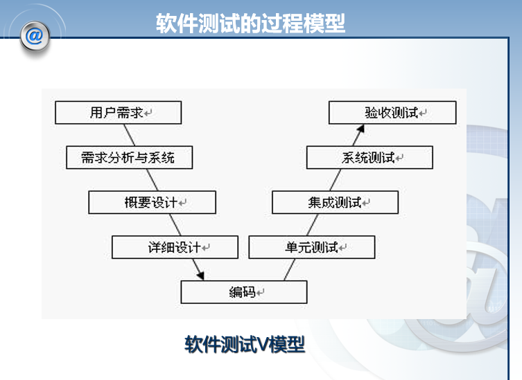

# 第八章 软件测试技术策略 :star:

软件测试 V 模型 如下图8-1 所示

对应测试关系

单元测试检查 - > 详细设计
集成测试  - > 概要设计
系统测试  -> 需求规格说明
验收测试 -> 用户需求（合同中定义的需求） 

桩模块 - > 底层被测模块正常运行时需要用的依赖模块
---
回归测试
  - 定义：指有选择地重新测试系统或其组件，以验证对软件的修改没有导致不希望出现的影响，以及系统或组件中仍然符合其指定的需求
  - 回归测试可以在所有的测试级别执行，并应用于功能与非功能测试中
  - 回归测试应该尽量采用自动化测试
  - 回归测试的范围
    1. 缺陷再测试：重新运行所有发现故障的测试
    2. 功能改变的测试：只测试改变过的部分
    3. 新功能测试：只测试新集成的程序
    4. 完全回归测试：测试整个系统

单元测试、集成测试与系统测试的步骤
1. 计划与准备阶段
2. 执行阶段
3. 返工与回归测试阶段

单元测试
  - 概念介绍：针对软件的设计的最小单位-程序模块，进行正确性检验的测试工作
  - 在单元测试开始时，应对**通过被测模块的数据流**进行测试。测试包括：
    1. 调用本模块的输入参数是否正确
    2. 本模块调用子模块时输入给子模块的参数是否正确
    3. 全局变量的定义在各模块中是否一致
  - 主要内容：  
      1. 模块接口测试
      2. 局部数据结构测试
      3. 路径测试
      4. 出错处理测试
      5. 边界条件测试

集成测试
  - 概念介绍：集成测试即为将软件集成起来后进行测试。因此又被称为子系统测试、组装测试、部件测试
  - 集成模块向下细化时，就成为了单元测试
  - 三种集成测试方法
    1. 自顶向下集成方法
    2. 自底向上集成方法
    3. SMOKE方法（迭代方法，小部件局部完全回归测试）  

系统测试
  - 概念介绍：系统测试是从用户使用的角度来进行的测试，主要工作是将完成了集成测试打的系统放在真实的
   - 系统测试主要采用黑盒测试的方法
   - 运行环境下来进行测试，用于功能确认和验证
     - 主要内容：
       1. 功能性测试
       2. 性能测试
       3. 压力测试 
       4. 恢复测试
       5. 安全测试

验收测试
- 概念介绍：是将软件测试部门对经过项目组内部单元测试、集成测试和系统测试后的软件所进行的测试
- 主要内容：根据合同所约定的进行验收测试、用户验收测试、现场测试
- 确认测试应该**交付的文档有**
  - 确认测试分析报告
  - 最终的用户手册和操作手册
  - 项目开发总结报告

在软件交付适用之后，用户将如何实际使用程序，对于开发者来说是无法预测了，因此衍生了 α测试 与 β测试

α测试
- 由一个用户在**实际开发环境下**进行的测试，也可以是公司内部的用户在**模拟实际操作环境**下进行的测试

β测试
- 由**多个用户**在**实际开发适用环境下**进行的测试。
- 只有α测试达到一定可靠程度时，才能开始β测试。

本章小结：
1. 测试的通用 V 模型定义二测试的基本级别：单元测试、集成测试、系统测试和验证测试
2. 单元测试检查单一的软件组件。集成测试检查这些组件的协调。系统测试从用户角度检查整个系统。在验收测试时，客户采用根据合同进行的验收测试、操作验收测试和用户验收测试来检查产品
3. 在测试的各个级别中，在修改程序后，都要执行回归测试
4. 测试有多重类型：功能测试、性能测试、压力测试、恢复测试和安全测试等
5. 由于软件测试不可能发现所有的软件缺陷，因此可以用对数泊松执行时间模型估计测试终止的时间
6. 要保证测试工作的顺利进行，需要对测试进行有效组织，要尽量避免由开发人员测试自己的代码。