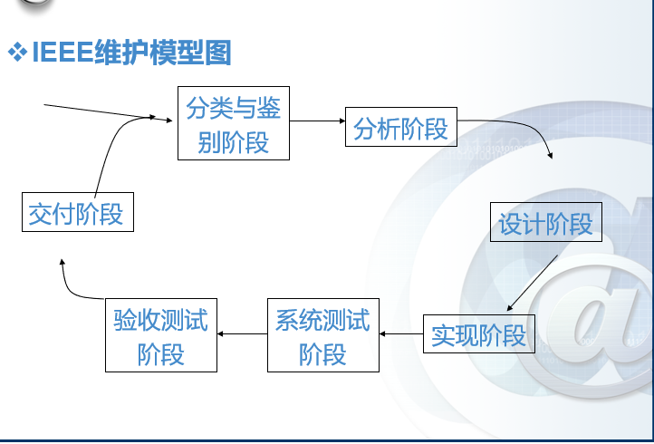
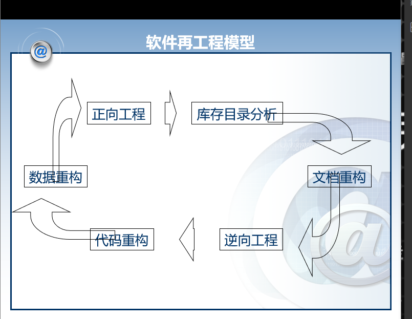

# 第九章 软件维护

---
软件维护
- 概念介绍：软件维护是指由于软件产品出现问题或需要改进对代码以及相关文档的修改，其目的是对现有软件产品进行修改的同时保持其完整性

软件维护的必要性
- 改正错误
- 改善设计
- 实现软件的改进
- 优化算法
- 与其他系统进行交互
- 为使用不同的硬件、软件、系统的新性能以及通讯设备等而对软件进行改进
- 完成遗留程序的移植
- 软件退出使用

软件维护阶段一般要消耗软件生命周期中经费开支的大部分

维护的四种类型
1. 纠错性维护
2. 适应性维护
3. 完善性维护
4. 预防性维护

其中完善性维护占据了整个软件维护阶段几乎一半以上的工作总量

决定软件维护的性的主要因素
1. 可理解性
2. 可测试性
3. 可修改性
4. 可移植性
5. 可重用性

维护费用估算：
参数模型 
$M=P+K\times\exp(C-D)$

其中 M 是维护用的总工作量，P是生产性工作量，K是经验常数，C是复杂程度，d是维护人员对软件的熟悉程度

IEEE 软件维护模型图如下图 9-1 所示

软件再工程：指对现有软件进行仔细审查和改造，对其进行重新构造，使之成为一个新的形式，同时包括随之产生的对新新式的实现

软件再工程模型如下图 9-2 所示

本章小结：
1. 软件维护可以分为纠错性维护、适应性维护、完善性维护、预防性维护
2. 软件维护实践中经常会遇到各种困难，需要在技术、管理方面进行考虑，并对维护费用进行估算
3. 软件维护按IEEE 维护过程模型可以分为七个阶段。
4. 程序的理解对软件维护具有重要意义，程序理解的任务就是要解释程序的功能与实现机制
5. 软件的再工程是对现有软件进行仔细审核与改造，进行重新构造，最终成为一个新的形式。六中活动构成了在工程的循环模型
6. 软件逆向工程包括数据逆向工程、处理逆向工程与用户界面逆向工程