# 考点分析


---


## 第一部分

---


## 第二部分
---


两道应用题
两道设计题 每题10分

计算题：  
1.关于测试 等价划分 划分的方式 设计一个测试方案 什么样的输入输出  
2.关于评估 会计算各种数值（KLOC千行代码量 千行代码成本 文档页数 千行缺陷数）

设计题：  
1.UML 类图 如何画 以及对应的代码能写出来 各种图标属性元素(public private等)   
2.时序图 两个课上的例子 简单的和购票的 随机考一个  

简答题：4道 每道5分（读程序/Java x 2道、软工的基本概念 x 2道）  
1.读程序题：根据代码写结果  
2.基本概念题：  
(1) 需求分析的概念及其特点、软件开发有哪些方式例如瀑布螺旋等以及优缺点  
(2) 评估：有哪些评估模型  
(3) 测试：有哪些测试方案 什么是桩模块 什么是驱动模块 树是自下而上还是自上而下 宽度优先 深度优先该怎么设置桩的驱动  
(4) 维护：软件维护 维护的类型
（这些基本概念出题的可能：简答、填空、选择题）  

送分题：  
1.需求规格说明书 应该有什么内容 不应该有什么内容（有可能简答  ）
2.软件工程最重要的是项目管理 项目管理有几个要素 最重要的是——人（协作能力）  
3.几种开发方式（最著名——瀑布模式）瀑布模式的优缺点  
4.后期软件维护的类型  
5.白盒测试的覆盖标准（4种）哪个是最弱的  
6.Java部分：  
① Java有哪两类软件 一类直接在虚拟机上运行、一类嵌入在浏览器中运行  
② JSP本质上属于哪种类型（直接在虚拟机上运行）  
③ Java内存模型是什么 对象都是引用（读程序题的基础知识）  
④ 构造函数同名的情况、继承时方法同名或方法同名的情况，继承后创建对象时会怎么调用构造函数  


```
考试范围 1 2 3 4 5 7 8 9章
考试分数比例 平时成绩50% 考试成绩50% 
```

## 考点分析

---

### 第一章 软件工程概述
---

*软件定义*

- 软件=数据+文档+程序
  - 程序：是按照事先设计的功能和性能需求执行的指令序列
  - 数据：是程序能够正常操纵信息
  - 文档：与程序开发、维护和使用有关的图文材料

#### 软件的特征与分类  
- 软件是逻辑的，而不是物理的
- 软件是开发的，或这是工程化的，并不是制造的
- 软件开发环境对铲平影响较大
- 软件开发时间和工作量难以估计
- 软件会多次修改
- 软件的开发进度几乎没有客观衡量标准
- 软件测试困难
- 软件不会磨损和老化
- 软件维护易产生新的问题
- 软件生产是简单的拷贝

#### 软件的分类
- 系统软件（操作系统）
- 应用软件（办公软件）
- 工程/科学软件（MATLAB,Maple）
- 嵌入式产品（Ipod，Iphone）
- Web应用（Web，Applications）
- 普适计算（无线网络等）
- 网络资源-（网络作为一个）计算引擎，云计算技术
- 开放源码（github，gitlab）

### 产生软件危机的原因  
`软件危机`:在计算机软件的开发和维护过程中所遇到的一系列严重问题  
产生危机的原因：  
- 客观：
  - 软件本身的特点（太复杂了）
  - 逻辑部件，规模庞大
- 主观：  
  - 不正确的开发方法（人类不重视）忽视需求分析
  - 错误的认为：软件开发==程序编写，以至于忽视软件后期维护

`软件危机的表现`：
- 开发**成本**与**进度**估计不准，开发**进度难以控制**
- 用户对“已经开发完成的”软件系统**不满意**
- 软件**质量和可靠性**差强人意
- 软件的**可维护性**很差
- 软件通常没有适当的**文档**资料
- 软件**成本**逐年上升
- 软件开发**生产率**落后于硬件和计算机应用普及

`软件工程原则` :
- 使用阶段性爱生命周期计划的管理
- 进行连续的验证
- 保证严格的产品控制
- 使用现代编程工具和工程实践
- 保持清晰的责任分配
- 用更好更少的人
- 保持过程改进
- 开发过程中注意保存于实时更新开发文档

### 第二章 软件过程模型
---

软件工程是以质量为中心，过程、方法和工具作为三要素  

过程定义了谁在做什么，何时以及如何达到一定的目标。  

软件过程决定了软件产品的质量，不同的项目需要不同的过程模型或者过程模型的组合实现。


软件过程：开发和维护软件以及其相关产品所涉及的一系列活动，软件过程包括以下活动
  1. 沟通：该活动包括软件设计者与客户沟通，客户提出要求，软件设计者收集材料
  2. 计划：软件开发小组讨论使用何种方法以及何种工具来实现客户需求
  3. 建摸：在这一部分，软件开发小组讨论选择何种模型来满足需求。不同的需求需要不同的模型
  4. 构造：编码和测试
  5. 部署：软件交付给客户。客户给出建议和反馈，软件实施小组改进软件，最终结果经由客户审核通过后可以部署

过程模型： 软件过程模型是软件开发全部过程、活动和任务的结构框架  

#### 模型介绍

##### 瀑布模型  
- 特点
  - 阶段间具有**顺序性**、**依赖性**的特点
  - **推迟实现**的观点。
  - 每个阶段必须完成规定的文档，并且每个阶段结束前都必须挖按成文档审查工作，及早改正错误  
- 优点  
   - 简单，过程**透明度高**、**可管理性高**
   - **推迟实现**，软件实现前必须进行系统分析和设计工作  
   - 以**阶段评审和文档控制**为手段进行质量控制，能够及时发现并纠正软件缺陷，使得软件能够符合预期设计的质量要求  
- 缺点
  - 模型**灵活性差**，不适合需求不明或者不准确的场合
  - 模型**风险控制能力弱**
  - 过多的文档**极大的增加了工作量**
  - 太过于理想化

瀑布模型的适用场景：  
>适用于系统需求明确、技术成熟、工程管理较为严格的场合

---
##### 演化模型-原型模型  
- 优点
   - 强调了**用户参与和决策**，强化了用户与开发人员的沟通
   - 可**加快需求的确定**，能够处理需求的不确定性以及风险  
   - **简化**了项目管理、**缩短**了开发时间、**降低**了风险与开发成本  

- 缺点
  - 不适用于开发大型系统
  - 软件**可维护性差**
  - **用户合作要求高**，如果合作不好，反而会拖延开发进度。
  
演化模型-原型模型的使用场景：
>客户自己定一个总体目标集，但是他们并**不清楚系统的具体输入输出情况**；或者开发者**不确定算法的效率**、软件与操作系统是否兼容以及客户与计算机交互的方式


---
##### 增量过程模型

---
1. 增量模型  
   特点
    - 在前面增量的基础上开发后面的增量
    - 每个增量的开发可用瀑布或快速原型模型
    - 使用了迭代开发的思路

   优点
    - 引入增量包概念，不需要提供完整的需求
    - 在项目的初始阶段不需要投入太多的人力资源
    - 确定增量可以有效地管理技术风险，降低系统失败风险
    - 有利于增加客户信心，提高系统可靠性。可维护性以及稳定性  
  
   缺点  
    - 增量粒度难以选择
    - 确定所有的基本业务比较困难


2. RAD模型（快速应用开发模型）  
  优点：
    - 能够使开发团队在很短的时间内（如60-90天内）完成一个“全功能系统”
    - 强调短暂的开发周期，是瀑布模型的“高速变体”  

   缺点：  
    - 对于大型项目而言，RAD需要足够的开发人员
    - 由于时间约束，开发者和客户都要事先承诺，任何一方沟通配合不当都会导致最终项目失败  
   
   RAD模型不适用的场景范围：
   >不能合理模块化的系统、高性能需求并且要调整构件接口的、技术风险很高的系统均不适合

   适用的场景范围
   >管理类信息软件系统的开发

3. 螺旋模型  
   优点：
    - 支持用户需求的**动态变化**
    - **原型可以看做可执行的需求规格说明书**，易于用户和开发人员共同理解，可以作为持续开发的构建基础，为用户参与关键决策提供了方便
    - 螺旋模型特别**强调原型的可扩展性与可修改性**，原型的进化贯穿了整个软件的生存周期，这将有助于目标软件的自适应能力
    - 螺旋模型为项目管理人员计时调整管理决策提供了方便，进而**可以一定程度上降低开发风险**  
    - 软件工程师可以提前开始项目工作
   
   缺点：
   - 如果每次迭代的效率不高，致使迭代次数过多，则会**增加成本并且推迟提交项目的时间**
   - 使用该模型需要有相当丰富的风险评估经验与专门的知识，**对开发人员的综合水平要求较高**
   - 是一个以风险驱动的模型
   - 仅适用于内部（一个公司内部）项目，因为开发过程中要进行风险评估，该模型不能用于合同性的软件开发 


### 第三章 需求分析

---
需求的定义： 需求就是一种清晰、简介、一致且无二义性的方式，对一个待开发系统中各个有意义方面的陈述的一个集合  

1. 需求分析过程：通过第问题以及环境的理解与分析，将问题涉及的信息、功能以及系统行为建立模型，将用户需求精确化、完全化、最终形成需求规格说明，这一系列的活动，即称为需求分析
2. 需求的特点与要求
  - 特点 
  - 要求 
      1. 可验证性
      2. 有优化级
      3. 可量化
      4. 折中 
3. 需求分析的任务  
   1. 建立分析模型（准确地定义未来系统的目标，确立为了满足用户的需求系统必须做什么）
   2. 编写需求说明 （用<需求规格说明书>规范的形式准确地表达用户的需求）
4. 需求分析的步骤：
   1. 需求获取
   2. 需求分析
   3. 需求描述（需求规格书）
   4. 需求验证

**修正需求错误的代价随着工程的发展会越来越大**，因此需求分析十分重要。

#### 需求的类型
1. 功能性需求：即描述系统应该作什么，即为用户和其他系统完成的功能、提供的服务
2. 非功能需求：即必须遵循的标准，外部界面的细节，实现的约束条件，质量属性等。  

非功能性需求的存在限制了开发人员选择解决问题方案的范围，例如运行平台、实现技术、编程语言与工具等。


---
#### 第一步：获取需求

需求获取：指的是软件需求的来源以及软件工程师手机这些软件需求的方法  

需求获取技术
  - 向系统相关者进行**问卷调查**
  - 主持与用户的**面谈与讨论**
  - 需求**专题讨论会**
  - **复查**现有的报表、表格和过程描述
  - **观察**商业过程与工作流
  - 应用**用例**
  - 建立**原型**  

 需求获取面临的挑战
 - 客户**说不清楚**需求
 - 需求**易变性**
 - 问题的**复杂性**与对问题空间理解的**不完备性与不一致性**

---
#### 第二步：分析需求  
需求分析的**核心**在于**建立分析模型**

需求分析采用**多种形式描述**需求  

需求分析还包括与客户的**交流以澄清某些易混淆的问题**

分析建模  
 - 结构化分析建模
 - 面向对象分析建模

分析建模的一些工具
- 数据流图、数据字典与加工规约
- CFD（仿真软件）、控制规约和状态变迁图
- E-R图
- 用例图 User-Case，对象-关系图，对象-行为图

结构化思维：软件工程中一种典型的分析系统、设计系统的思维方法，采用系统科学思想、依据层次分解、自顶向下分析与设计系统  

系统论基础  
- 作用性：有目标的
- 外特性：有边界的
- 内特性：有组成要素切相互关联的
- 复杂度：组成要素多、而且关系复杂

控制论基础  
- 物理系统
- 控制系统  
  - 通常为计算系统，接收来自物理系统的数据以及状态，进行决策并下达指令控制物理系统的运行

示意图

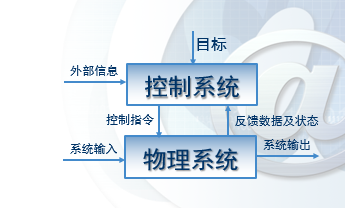

分解论基础  
- 化简复杂系统的简单方法是分解，将系统分解为各个不同的部分，直至清楚为止  

示意图  

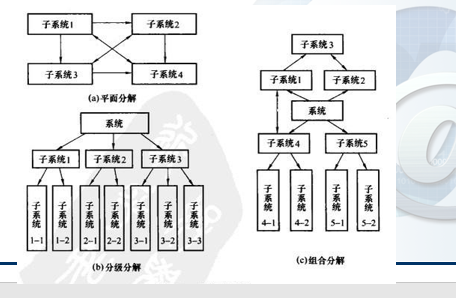

功能分解
- 功能：将输入转换为输出的一种变换过程，宏观称为功能，围观称为活动
- 输入：从功能外传入功能内的消息
- 输出：从功能内传入到功能外的信息
- 目标与控制：功能应该达到的目标，即在“目标与控制”的控制下执行
- 支撑：执行功能或活动需要的必要支撑条件

示意图

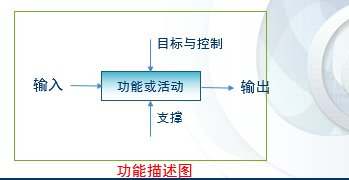

需求分析的特点  
-  多样性需求
     - 功能与结构：功能分解、流程
     - 软件与结构性：不同结构具有不同性能
     - 产品需求与过程需求：产品需求为产品实际上的功能需求，过程需求为软件开发上的约束
     - 功能性与非功能性需求
     - 综合性/系统性需求
     - 定性需求/定量需求
     - 系统需求/软件需求 （软件需求通常为环境要求） 
-  解决多样性需求的方法：
   -  多视角层次分析理解 
-  需求分析的来源:
   -  主要来源于获取需求的各个途径


#### 第三步 需求规格说明书    

需求分析工作完成的一个基本标志时形成了一分完整的、规范的需求规格说明书。 

需求规格说明的原则  
- 从现实中分离功能，即描述“做什么”，而不是“怎么去实现”
- 要求使用**面向处理**的规格说明语言。
- 如果被开发软件只是一个大系统中的一个元素，那么**整个大系统**也应该包括在规格说明的描述之中
- 规格说明必须包括系统**运行环境**
- 规格说明必须是一个**认识模型**
- 规格说明必须是**可操作的**
- 规格说明必须**容许不完备性并可以允许任意扩充**
- 规格说明必须**局部化以及松散耦合**

##### 软件需求规格说明书的整体结构  
1. 引言
   1. 需求文档的目的
   2. 文档约定
   3. 预期的读者与阅读建议
   4. 产品范围
   5. 参考文献  
2. 综合描述  
   1. 产品前景
   2. 产品功能与优先级
   3. 用户特征
   4. 运行环境
   5. 设计与实现上的限制
   6. 假设和依赖性
3. 需求描述
   1. 功能描述
   2. 数据需求:与功能有关的数据定义和数据关系
   3. 性能需求：响应时间、容量要求、用户数等
   4. 外部接口：用户界面、软硬件接口、通信接口
   5. 设计约束：软件支持环境、报表、数据命名等
   6. 软件质量属性（可维护性、可靠性、可移植性、可用性、安全性等一系列需求）
   7. 其他需求
 4. 附录（词汇表、分析模型、待定问题列表）
 5. 索引

### 第四步 需求验证
  :star:需求验证的重要性：

  >如果在后续的开发或系统投入使用时才发现需求文档中的错误，就会导致更大代价的返工。由需求问题而对系统做变更的成本比修改设计或代码错误的城门要大得多

  样例图

  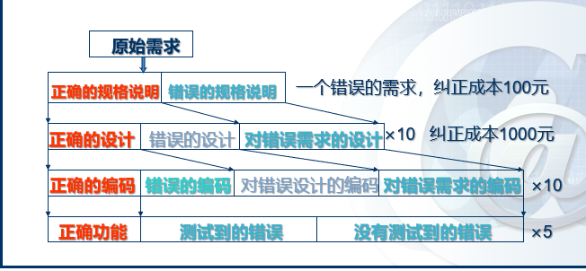

对一个需求文档需执行以下类型的检查
1. **有效性**检查：检查不同用户使用不同功能的有效性。
2. **一致性**检查：检查在文档中，需求之间不应该有冲突。
3. **完备性**检查：检查在需求文档中，应该包含用户所有的需求
4. **现实性**检查：检查保证项目能利用现有技术实现需求

小结：
1. 软件需求贯穿于软件工程的整个生命周期
2. 软件需求：用户对目标系统软件在功能、行为、性能、设计约束等方面的期望
3. 需求分析的任务建立需求分析模型和编写需求说明。


### 第四章 软件设计工程

---
设计的含义： 将人们头脑中想象的食物表达成模型或者文档的过程，这个过程的结果--模型或文档也被称为“设计”

设计 = 适用 + 艺术 + 质量


软件设计：
1.  软件工程生命周期中的一个活动
2.  进行软件编码的基础
3.  软件需求分析被转化为软件的内部结构
4.  是链接用户需求和软件技术的桥梁

图例4.1
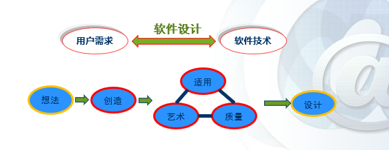


软件设计处于软件工程的位置
图例4.2

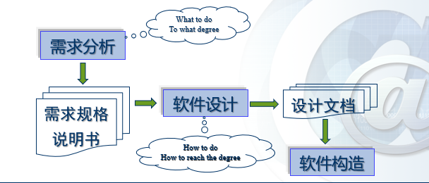

名词解释：  

软件架构设计（又称为顶层设计）
- 描述软件的顶层架构和组织，划分不同的组织  
 
软件详细设计
- 详细描述各组件以便能够使用编码实现
---
好的软件设计应具有的特点：
1. 设计必须实现在分析模型中包含的**所有明确要求**，必须满足客户所期望的所有**隐含要求**。
2. 设计必须是对于任何编码人员、测试人员以及后续的运维人员都必须是**可读可理解**
3. 设计应该提供软件的**完整视图**，以从实现的角度解决数据、功能以及行为等各领域方面的问题

软件设计的指导原则
1. 设计应该是一种**架构**
   1. 其使用可识别的架构风格或方式
   2. 该架构采用具有良好设计特点的组件构成
   3. 该架构采用进化的方式构建，以促进实现与测试
2. 设计应该是**模块化**的
3. 社即应该包含**数据**、**体系结构**、**接口与组件**各个方面
4. 应该设计出系统所用的**数据结构**
5. 应该设计出展现独立功能特性的各**组件**
6. 应该设计出各组件与外部环境所连接的各**接口**
7. 设计由软件需求分析过程中获得信息驱动，采用可重复的方式**导出**
8. 设计应该采用**正确清楚**的方式表示

#### 软件设计过程与设计质量

1. 设计质量应该具有以下属性
   1. 功能性
   2. 可用性
   3. 可靠性
   4. 性能
   5. 可维护性
      1. 包含多个属性（拓展性、兼容性、可测性、可配置性）

---
#### 软件设计技术

软件设计的主要技术
   1. 抽象
      - 含义：是感性认识世界的手段，是“忽视具体的信息将不同事物看成相同事物的过程”，是发现实物本质特征与方法的过程
      - 抽象机制：参数化，规范化
      - 规范化抽象
        - 过程抽象
        - 数据抽象
        - 控制（迭代）抽象 
   2. 设计模式
      1. 通用：在给定上下文环境中一类共同问题的**共同解决方案**
      2. 具体： 一套被反复使用、多数人知晓的、经过分类编目的、代码设计经验的总结
      3. 目的：为了代码的可重用性、能够让代码更容易被他人所理解，保证代码的可靠性，程序的重用性
      4. 常用的设计模式与范围：范围即由面向对象的程序构造，到（可视化的）对象框架构建，常见的如MVC模式等
         - MVC 模式的编程思路  
      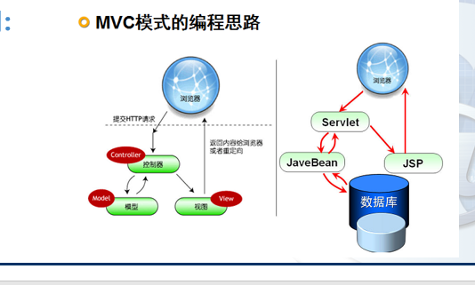
   3. 模块化
      - 含义：软件被划分为命名和功能相对独立的多个组件（通常称之为模块），通过这些组件的集成来满足问题的需求
      - 软件的模块性：建立在程序可被智能管理的单一属性前提下
      - 模块化的理论依据：基于人类解决问题的观测数据方式
      - **模块化并不是越小越好**，需要找到最小代价区间
        代价曲线如下图所示  
        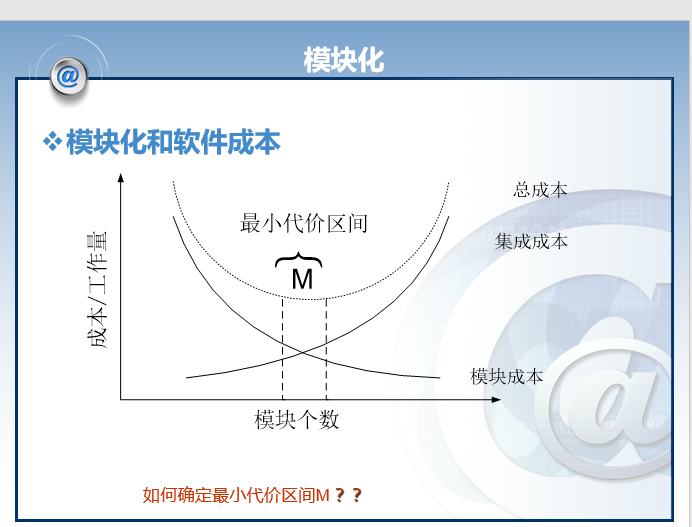
       - 模块化设计标准
          1. 模块化分解性
          2. 模块化组合性
          3. 模块化可理解性
          4. 模块化连续性
          5. 模块化保护

---
模块化的额外几个补充点
  1. 信息隐藏（模块与模块之间）
       - 模块应该具有彼此之间**相互隐藏**的特性
       - 抽象有助于定义构成软件的过程（或信息）实体
       - 信息隐藏原则定义和隐藏了模块内的过程细节和模块内的本地数据结构
  2. 功能独立 （模块与模块之间）
       > 模块独立的标准：耦合、内聚
  3. 细化
       > 自顶向下，逐步求精，有助于揭示底层细节
  4. 重构
       > 不改变组件功能和行为条件下简化组件设计的一种重组技术（一般用于优化结构） 
---
#### 设计模型

使用者角度：软件≈功能组织+功能
设计者角度：软件≈数据设计+结构设计+接口设计+组件设计

模型输入：软件需要的数据模型、功能模型与行为模型

分类：
  1. 数据设计
  2. 架构设计
  3. 接口设计
  4. 组件级设计
         
主要活动
   1. 软件架构设计（概要设计）
   2. 软件详细设计（详细设计）

分析模型转换为软件设计分析 详细设计与概要设计所对应的部分

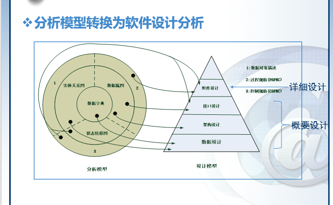

--- 
#### 数据设计  
含义: 数据设计（数据架构）构建高层抽象（客户/用户的数据视图）的数据模型、信息模型
相关概念： 
  - 数据建模
  - 数据结构
  - 数据库设计
  - 数据仓库

组件级（模块化）数据设计设计原则
  - 功能和行为系统分析原则也适用于数据设计
  - 确定所有的数据结构及其对应的操作
  - 建立数据字典并在数据定义和程序设计中应用
  - 低层次的数据设计应该推迟到设计的后期过程
  - 数据结构的表示应该只对直接使用数据结构中数据的模块可见
  - 开发有用的数据结构以及其对应操作的程序库
  - 软件设计和编程语言应该支持抽象数据类型的定义与实现
---
#### 结构设计
含义以及内容:
  - 系统需要执行的函数功能组件集（如数据库、计算模块）
  - 组件之间通信、协同和合作的连接器
  - 组件集成构成系统的约束
  - 设计人员通过分析其组成部分的已知特性理解系统整体特性的语义模型分析
  
 结构体系的风格和模式简要分类：
 1. 数据中心架构
 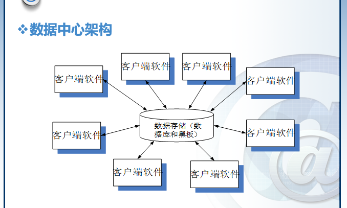
 2. 数据流体系架构
 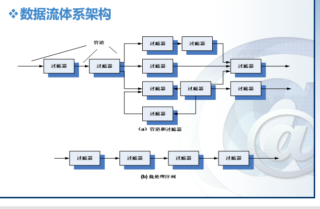
 3. 调用与返回架构
  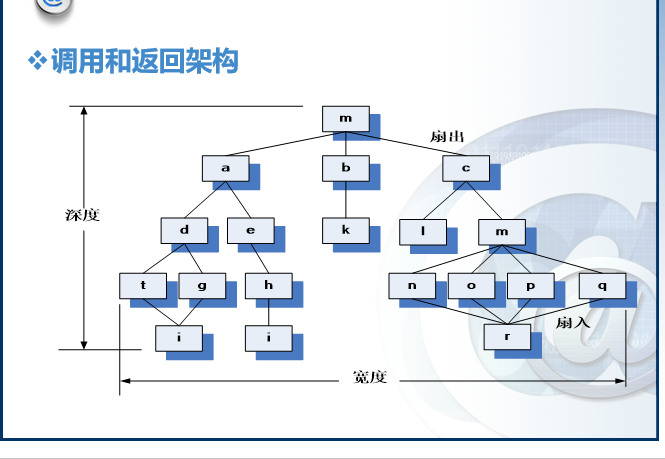
    1. 主程序/子程序结构
    2. 远程过程调用架构
 4. 面向对象架构
  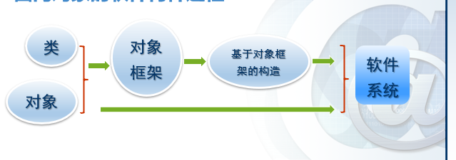
 5. 层次架构
   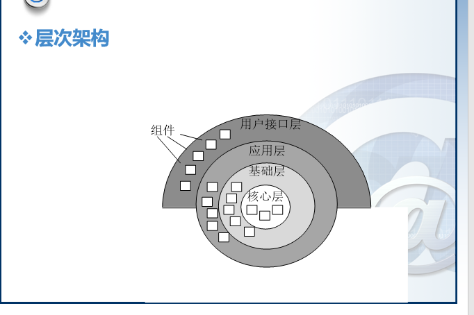
---
#### 面向对象设计
面向对象是一种思维

实现步骤：
  1. 识别对象（类）
  2. 识别每一对象（类）的状态
  3. 识别每一对象（类）的状态转换
  4. 识别每一对象（类）的功能

各类图像(UML)：
  1. 类图
  > 描述对象（类）及其关系
  
  2. 状态图
  > 描述对象（类）状态变换关系
  
  3. 次序图
   > 描述对象的函数调用关系
   
  4. 包图
   > 描述功能组命名空间的组织层次
   

本章小结：
  1. 设计是软件工程技术核心
  2. 数据结构、体系结构、接口和软件组件的过程细节在设计中逐步细化、开发、评审和记录
  3. 模块化（包括程序和数据）和抽象概念能够是设计人员简化和重用软件组件
  4. 细化提供了详细表示各顺序功能层的机制
  5. 程序和数据结构有助于建立软件架构的整体师徒，而过程提供了算法实现必要的细节
  6. 信息隐藏和功能独立为实现有效模块化提供了启发

### 第五章 软件生产率与工作量度量 :star:

估计重要性
  - 是“软件项目在满足质量要求的条件下，**按时**与**在预算内**交付”的前提下

估计的复杂性
- 原因
  - 软件的复杂性与不可见性
  - 其他原因
    - 估计的主观特性
    - 不同角色的人有不同的估计偏好
    - 技术的变更
    - 项目缺乏经验，缺乏一致性


过高估计的危害
1. Parkinson法则
  - 给的时间越多，工作花费的时间也越多
2. Brook法则
  - 当人数增加后，项目所需的时间不成比例地减少（因为当团队规模扩大后，由于管理、协调和通信的增加，导致总工作量增加）

过低估计的危害
1. 质量下降
2. Weinberg可靠性零法则
  - 如果系统不要求可靠，那它可以满足任何目标

---
软件产品度量
含义：使得人们可以通过度量值的量化标准，理解和把我软件项目的（生产）效率（或者所需要的劳动量）
目的：
  - 描述（项目与过程）
  - 评估（状态与质量）
  - 预测（计划）
  - 改进（产品质量与过程性能）

软件生产率测量的两种方式
1. 直接测量：如在一个特定时间内产生的代码行数
   1. 一定时间产生的代码行数（LOC - Line of Code）
   2. 执行速度
   3. 文件页数
   4. 错误和缺陷数
2. 间接测量：如在一个给定时间内生产出的功能点和目标点
   1. 功能性
   2. 可靠性
   3. 可维护性
   4. 复杂性
   5. 效率
   6. 其他质量指标

基于代码行数的度量方式 LOC/KLOC （直接测量）

面向规模的度量标准
- 每KLOC(千行代码)的错误数：总错误数/总KLOC（总KLOC=LOC/1000，即为一共有几个千行代码）
- 每KLOC（千行代码）的缺陷数，总缺陷数/总KLOC
- 每KLOC(千行代码)的文档页数，总文档页数/总KLOC

优点：
  - LOC/KLOC和相关度量容易量化计算
  - 许多现有的软件估算模型都使用LOC/KLOC作为一项重要输入
  - 有大量的关于LOC的文件与数据参考

缺点：
  - LOC依赖于使用的语言，这对短小精悍的程序不利（嵌入式系统）
  - 不太适用于非过程化语言
  - LOC需要在设计完成时才能够进行量化计算，因此如果估算，则需要一定程度的细节，而这些细节很多时候可能很难获得

基于功能点的度量方法：代码行数和功能点之间的关系依赖于编程所用的语言  

---
基于功能点的度量方法 --- 间接度量

功能点：功能点即为直接从度量软件信息域和评估软件复杂性的经验量化关系中获得  

例如下图5-1所示
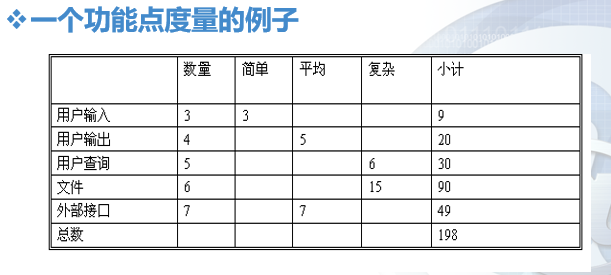

五个信息域值（功能点）
- 用户输入的数量
- 用户输出的数量
- 用户查询的数目
- 文件数量
- 外部接口的数量

计算功能点（FP）
$$
  FP=(totalCounts)\times(0.65+0.01\times\sum{F_i}))
$$

以图 5-1 为例，其中，totalCounters 为小计总数/或者小计 
$F_i$即为下列十四个问题选项中的权值累加(权值范围`0-5`，`0`表示不重要或不适用，`5`表示必须的)

 $MAX = 14\times5 = 70 $

复杂性调整值$F_i$问题表
```
1. 系统需要可靠的备份和恢复么
2. 需要进行数据通信么
3. 有分布式处理功能么
4. 性能重要么
5. 将该系统运行在一个现有的操作系统中么
6. 系统要求在线输入数据么
7. 在线输入数据要求在多个屏幕和操作之间建立输入事务么？
8. 主文件是否在线更新？
9. 输入、输出、文件或查询系统是否复杂？
10. 内部处理是否复杂？
11. 代码是可重用的么？
12. 设计中包括数据（流程）转换或安装么？
13. 系统腰围不同的机构设计不同的安装方法么？
14. 应用程序便于变更么？易于用户使用么？
```
功能点计算：
  - 每FP的错误数
    - 总的错误数除以总的FP数
  - 每FP的缺陷数
    - 总的缺陷数除以总的FP数
  - 每FP的文档页数
    - 总的文档页数除以总的FP数
  - 每人/月的FP数
    - 总的FP数除以总的人/月数

代码行数与功能点之间的关系十分依赖于编程语言 如下图5-2所示

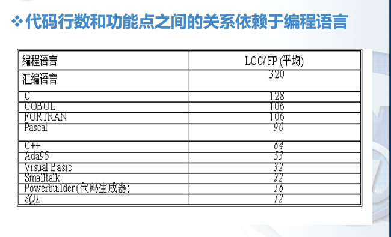

比值越高的说明，每实现一个功能需要的代码行数越多（越低级的语言比值越高）


### 第七章 测试技术 :star:

---
软件测试的定义：
  1. 在某种指定的条件下对操作系统或组件，观察或记录结果，对系统或组件的某些方面进行评估的过程。
  2. 分析软件各项目以检测现有的结果与应有的结果之间的差异（即*软件缺陷*），并通过此来评估软件各项目的特征的过程
  测试流程如下图7-1 所示

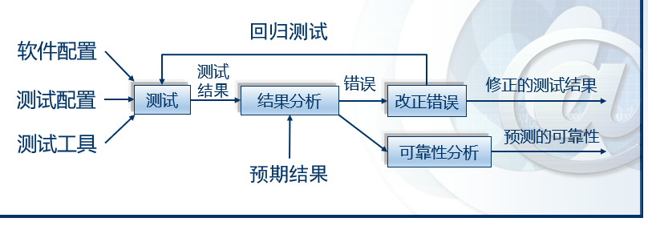

软件缺陷产生的条件（以下至少要有一个满足则能称为发生软件缺陷）
1. 未完成:软件未实现产品说明书要求的功能
2. 有错误：软件出现了产品说明书指明不能出现的错误
3. **画蛇添足**：**软件实现了产品说明书中未提到的功能**（最容易犯的错误）
4. 隐含需求未实现：软件未实现产品说明书（客户）虽未明确提及，但是应该实现的目标
5. **不好用**：软件使用难以理解、不易使用且优化较差运行缓慢

软件缺陷的特征
1. 看不到（难以发现缺陷）
2. 看到但是抓不到（发现了缺陷，但是找不到引起缺陷的原因）

软件缺陷特征曲线图 7-2
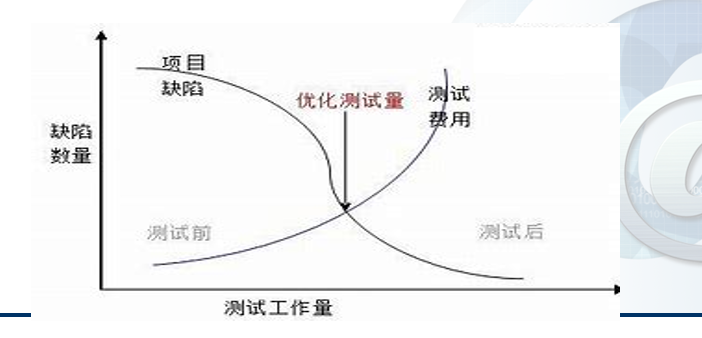

软件质量的范畴包含以下内容：
1. 功能性
2. 可靠性
3. 可用性
4. 效率
5. 可维护性
6. 可移植性

质量与可靠性的区别：
- 可靠性只是质量的一个方面，甚至不一定是最决定性的一个方面

测试用例：是指测试输入、执行条件，以及预期结果的集合，是为特定的目的开发的，例如执行指定的程序路径或验证与指定的需求相符合

软件调试与测试
相同点：
  - 都包含有处理软件缺陷与查看代码的过程
不同点：
  - 测试的目标是发现软件缺陷的存在
  - 调试的目标是定位于修复缺陷

软件测试的目标
  1. 确认系统满足**其预期**的使用和用户的需要
  2. 确认**解决**了所需要的**问题**（如实现商业规则和使用合适的系统）
  3. 为测试的过程**建立责任**和**可解释性**
  4. 便于**及早发现**软件和系统**异常**
  5. 能够急躁提供软件和系统的**性能评估**
  6. 为**管理者提供真实信息**，从而帮助管理者决定在当前状态下发布产品在商业上的风险
  7. 鉴别出程序在功能等方面的**异常集聚之处**
   
软件测试的基本原则
  1. 穷尽测试是不可能的
     - 决定测试哪些部分更为重要 
  2. 测试无法显示潜在的软件缺陷
     - 不能保证测试后就没有错误
  3. 测试活动应尽早进行
     - 越早发现修改成本越低
  4. 软件缺陷具有聚群性
     - 一个问题出错导致多个错误现象出现
  5. 注意杀虫剂现象
     - 用一样的测试样例是不可取的
  6. 应该尽量由**独立的**测试团队来进行测试
     - 自己自行测试自己不可取
---
软件测试的主要方法

黑盒测试
- 黑盒测试指忽略系统或组件的内部机制，仅关注于那些特定输入相应以及相应执行条件的输出测试，因此也被称为**功能性测试**

白盒测试
- 白盒测试是指考虑系统或组件内部机制的测试（如适用分支测试、路径测试、语句测试等），因此也被称为**结构性测试**

灰盒测试
- 黑盒测试与白盒测试混合进行的方法

软件测试的评估标准
- $覆盖率=测试集合T\div 测试需求集合TR$
- 故障插入
    - 在测试前被有意地插入一些故障到程序中
    - $发现率 = 发现的插入错误数\div插入的总错误数$
- 变异分值
    - 闯红灯徐进行两个或更多个编译，然后利用同样的测试用例进行测试，可以评估这些测试用例探测程序变异间差异的能力，如错误的标识符或者运算符等
  ---
  #### 白盒测试
  白盒测试，即把**测试对象看做一个透明的盒子**，它允许测试人员利用程序内部的逻辑结构以及有关信息，设计或选择测试用例，对程序所有逻辑路径进行测试。

  1. 基于逻辑结构的测试
    >逻辑覆盖是以**程序内部的逻辑结构为基础**的设计测试用例的技术。它属于白盒测试的一种  

    逻辑结构测试一共有以下四种
    1. 语句覆盖
    2. 分支覆盖
    3. 条件覆盖
    4. 条件组合覆盖


  根据 图7-3，利用逻辑结构测试分别设计4种测试样例对代码进行测试。


  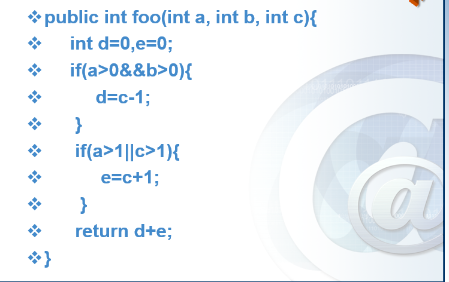
  **语句覆盖**：语句覆盖测试即设计若干个测试样例，运行被测试程序，使得**每一个可执行的语句至少执行一次**
  针对图7-3，可依据语句覆盖逻辑结构测试，设计如图7-4样例
  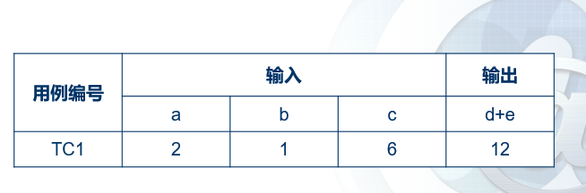


---
   **分支覆盖**：分支覆盖测试即设计若干个测试样例，运行被测试程序，使得**程序中每个判断的取真分支与取假分支至少经历一次**（因此分支覆盖又被称为判断覆盖）

  设计的测试样例如下图7-5所示
   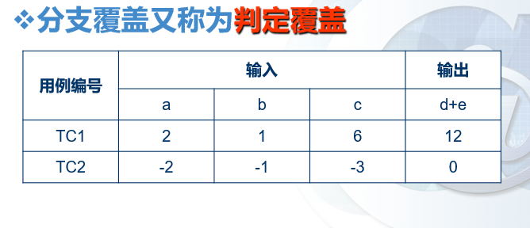  


---
   **条件覆盖**就是设计若干个测试用例，运行被测试程序，使得程序中**每个判断的每个条件的可能取值至少执行一次**

   设计的测试样例如下图7-6所示
   


---
   **条件组合覆盖**就是设计足够的测试用例，运行被测程序，使得**每个判断的所有可能的条件取值组合至少执行一次**

   设计的测试样例如下图7-7所示
   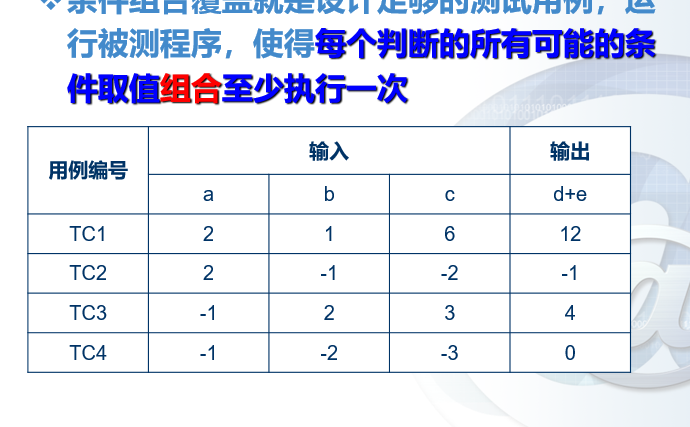
---
  2. 控制流图覆盖测试
  含义：将代码转变为控制流图基于其进行测试的技术，因此也属于白盒测试
  
  另外符号:white_circle:为控制流图的一个结点，表示一个或多个无分支的PDL语句或源程序语句。箭头为指向边，表示控制流的方向
  可能出现的控制流图如下图7.8所示
  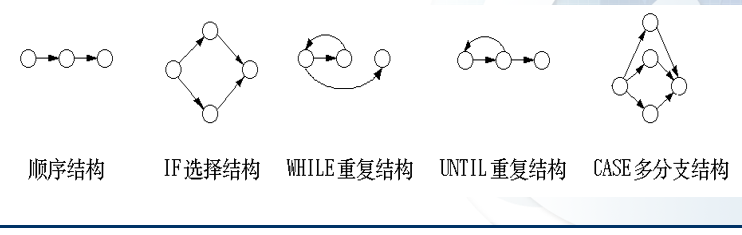

  一个控制流图覆盖测试图例7.9如下图所示
  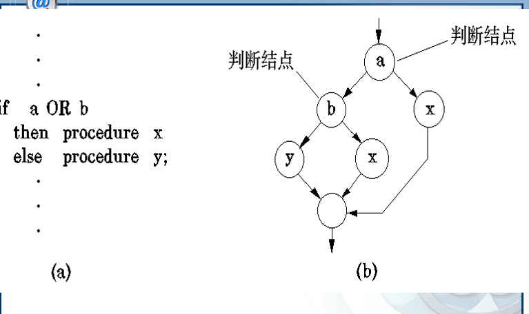

  节点覆盖和语句覆盖是等价的
    - 方法：即对于图7.9中每个语法上可达的节点，测试用例所执行的测试路径的集合中至少存在一条测试路径访问该节点

  边覆盖 
    - 方法：即对于图7.9中每一个可达的长度小于等于1的路径（即一条边），测试用例所执行的测试路径集合中至少存在一条测试路径经过该路径（该边）
    - 显然，边覆盖会包含节点覆盖，切边覆盖也可以实现分支覆盖（因为要求覆盖每一条可达边）

  路径覆盖
    - 方法:即对于图7.9.设计足够多的测试样例，覆盖程序中所有可能的路径
    - 但是因为工作量太大，且不适合有循环路径的地方，因此不常适用。所以一般上都是适用**基本路径测试**来选择性测试一些重要路径

  基本路径测试覆盖
   -  基本路径测试方法就是把覆盖的路径数目压缩到一定限度内，即**程序中的循环体最多只执行一次**
   -  设计出的测试样例要保证在测试中，程序的每一个**可执行语句**至少要执行一次
   -  程序的环路的复杂性给出了**程序基本路径集中的独立路径条数**，这是确保程序中每个可执行语句至少执行一次所必须的测试用例数目的上界。
  
  完成基本路径测试覆盖的方法步骤
  1. 计算环形复杂度
  $V(G)=e-n+2$
    其中，e为图中边的数目，n为节点数目
### 第八章 软件测试技术策略 :star:

---
单元测试
  - 概念介绍：针对软件的设计的最小单位-程序模块，进行正确性检验的测试工作
  - 主要内容：  
      1. 模块接口测试
      2. 局部数据结构测试
      3. 路径测试
      4. 出错处理测试
      5. 边界条件测试

集成测试
  - 概念介绍：集成测试即为将软件集成起来后进行测试。因此又被称为子系统测试、组装测试、部件测试

系统测试
  - 概念介绍：系统测试是从用户使用的角度来进行的测试，主要工作是将完成了集成测试打的系统放在真实的运行环境下来进行测试，用于功能确认和验证
  - 主要内容：
    1. 功能性测试
    2. 性能测试
    3. 压力测试 
    4. 恢复测试
    5. 安全测试

验收测试
- 概念介绍：是将软件测试部门对经过项目组内部单元测试、集成测试和系统测试后的软件所进行的测试
- 主要内容：根据合同所约定的进行验收测试、用户验收测试、现场测试

### 第九章 软件维护

---
软件维护
- 概念介绍：软件维护是指由于软件产品出现问题或需要改进二队代码以及相关文档的修改，其目的是对现有软件产品进行修改的同时保持其完整性

软件维护的必要性
- 改正错误
- 改善设计
- 实现软件的改进
- 优化算法
- 与其他系统进行交互
- 为使用不同的硬件、软件、系统的新性能以及通讯设备等而对软件进行改进
- 完成遗留程序的移植
- 软件退出使用
